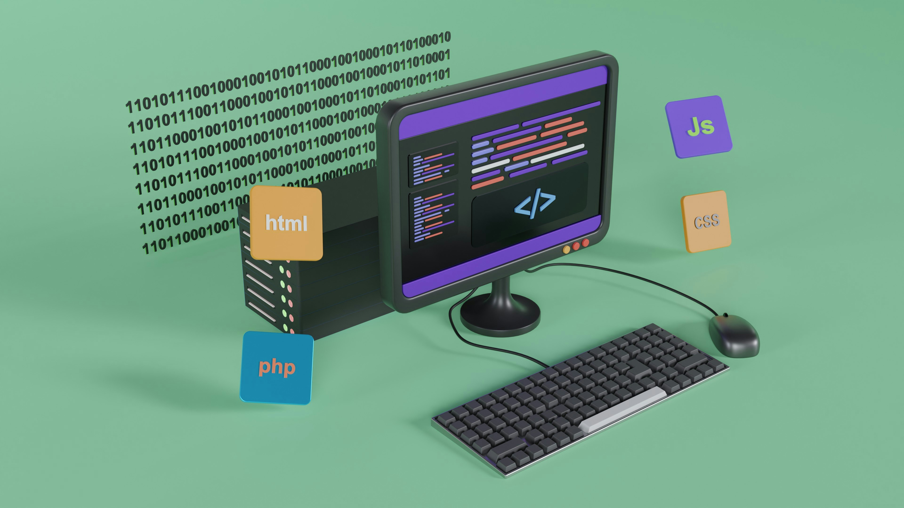

# The Shape of Where We Write

2026-05-03

A few days ago, I put together a small website. Nothing elaborate. A folder of Markdown files on my Mac, a static site generator called Astro to turn them into HTML, a GitHub repository to store everything, and Vercel to serve the result to the open web. You can see it [here](https://tomyonashiro-blog.vercel.app). It is deliberately plain. No content management system, no admin login, no database humming somewhere in the background. Just text files and a build process.

The site went live in a few hours, which was satisfying, but the moment it did, a question started tugging at me. Why did I do this? Medium would have taken ten minutes and given me a built-in audience. Note, the platform most of my Japanese friends write on, would have done the same. WordPress.com, where I already pay for another site at tomyonashiro.com, was sitting right there. So why this stranger path of files and folders and build commands?

Pulling on that thread unraveled something useful: a clearer picture of how digital publishing actually works underneath the names. This is the map I drew for myself.

## Every Website Is the Same Pipeline

Strip away the branding and every publishing tool turns out to be a variation on one architecture. Content gets created somewhere, stored somewhere, transformed into a webpage somewhere, and served to readers somewhere. Local files, version control, a builder, a host, a URL. That is the pipeline. Whether you are publishing a Medium post or running a corporate site on Adobe Experience Manager, the shape is the same. What differs is who owns which arrow.

That single reframing changed how I think about the whole landscape. The choice of "where should I publish?" is not really a choice between brands. It is a choice about how much of the pipeline you want to hand over to someone else, and what you accept in return. Each layer of that handover comes with its own bargain, and the bargains are worth understanding before you sign one.

## Renting a Megaphone

The most managed end of the spectrum is the hosted publishing platform. You sign up, you write in their editor, you click publish, your post appears on their network. The pipeline is entirely theirs. You bring the words.

The names cluster into a few groups:

- **Western general platforms:** Medium, Substack, WordPress.com, Ghost (Pro hosted), Tumblr, Blogger
- **Japanese platform:** Note (note.com)
- **Newer entrants:** Mirror, Bear Blog, Posthaven

What these services really sell is not a publishing tool. It is an audience network with a publishing tool attached. Substack has email subscribers and a recommendation system. Medium has a readership browsing for the next interesting essay. Note has Japanese readers already inside the app. When you publish to one of these, you are not just putting words online. You are publishing into a stream where readers might find you without you having to chase them. That is genuinely valuable, and for many writers it is the right choice.

The cost is portability. Your content lives in their database in their format, often inside a proprietary block editor. You can usually export, but the exports are messy, and the relationship with your readers (especially on Medium) belongs partly to the platform. If Medium or Substack changes its algorithm or shuts down, the words are still yours, but the audience and the experience around them are harder to take with you. The lock-in is real, even when it is wrapped in a friendly interface.

## Owning the Building, Renting the Land

One step toward independence sits the self-hosted CMS. You install the publishing software yourself, on a server you rent, and you own the result. WordPress.org is by far the most common example, but the category is wider than that.

The major options:

- **Open source self-hosted CMS:** WordPress.org, Ghost (self-hosted), Drupal, Joomla
- **Enterprise CMS:** Adobe Experience Manager (AEM), Sitecore, Optimizely
- **Headless CMS:** Sanity, Contentful, Strapi, Storyblok, Prismic, Hygraph

Traditional self-hosted CMS gives you a familiar shape. WordPress.org, for instance, is the same WordPress experience as the hosted version, except you run it on a host like SiteGround, Bluehost, or DigitalOcean, and you control everything: themes, plugins, the database, the backups. Enterprise CMS like AEM is the same idea at corporate scale, with licensing fees in the six figures and teams of developers behind it.

Headless CMS is the modern evolution. The "head" (the website) and the "body" (the content store) are decoupled. Sanity or Contentful holds your content and exposes it through an API. You build the front end separately, often with a static site generator or a framework like Next.js, and pull content in. The advantage is flexibility: one content source can feed a website, a mobile app, and a newsletter all at once.

The lock-in here is medium. WordPress content sits in a MySQL database in WordPress's particular schema, exportable but tied to that structure. Headless CMSs are cleaner, but the content still lives in the vendor's cloud. If Sanity has an outage, your site can still serve cached content, but editing is paused. You own more than you would on Medium or Substack, and less than you would with files on your laptop.

## Files You Can Actually Hold

The most independent end of the spectrum is what I built for my small site, and it has a name: static site generation, often shortened to SSG. The idea is that your content lives as plain files in folders, a generator program reads those files and produces a complete static website (just HTML, CSS, and images), and a host serves the result.

The toolkit is wide and mostly open source:

- **Static site generators:** Astro, Hugo, Eleventy (11ty), Jekyll, Gatsby, Next.js (in static mode), Zola, Hexo, Nuxt (static)
- **Hosting:** Vercel, Netlify, Cloudflare Pages, GitHub Pages, AWS Amplify
- **Version control:** Git, hosted on GitHub, GitLab, Bitbucket, Codeberg, or your own server

What I actually have on my Mac is a folder of `.md` files, one per essay. Astro reads them and produces the site. Git tracks every change with full history. GitHub stores the repository. Vercel watches for updates and rebuilds the site automatically when I push new content.

Here is where the lock-in question gets interesting. Markdown is a twenty-year-old open standard that any text editor can read. Git is open source, and the entire history of my site lives in a `.git` folder on my laptop. Astro could be swapped for Hugo or Eleventy with some template work, and the same Markdown files would still produce the same site. Vercel could be swapped for Netlify or Cloudflare Pages in an afternoon. GitHub could be swapped for GitLab with one command. None of the layers are permanent. The Markdown files are the permanent asset, and everything else is replaceable machinery around them.

The trade is that you give up the audience network. Nobody on Vercel is going to recommend my site to other readers the way Medium or Substack might. You also give up the editor convenience: writing in a Markdown file is friendly to people who already work with text and code, and less friendly to people who do not.

## Why This Fits the Moment I Am Writing In

There is one more reason this approach has started to feel especially right, and it has to do with how AI tools have changed the writing process for me.

The AI assistants I work with (Claude, ChatGPT, Gemini, and others) all speak Markdown natively. When I ask one of them to provide a set of information, it comes back as Markdown. When I ask for edits, the edits arrive as Markdown. The format that AI tools produce by default happens to be the exact format my site already uses. There is no translation layer. I can drop a draft into my `essays/` folder and it just works.

It goes deeper than the format. AI coding and writing tools like VS Code, Antigravity, Claude Code, Cursor, and GitHub Copilot operate directly on files through Git. They can read a folder of Markdown, propose changes as diffs, and commit those changes back. The whole loop of human-and-AI collaboration assumes plain text in version control, because that is the substrate AI was trained on and the substrate it works against most fluently. Plain text is also the format that every AI capability handles best: embeddings for search, summarization, translation, retrieval. The closer your content is to "just text in a file," the more leverage AI gives you over it.

Git itself turns out to fit the rhythm of AI-assisted writing better than I expected. Drafting with AI is iterative, branching, comparing alternatives, keeping some versions and discarding others. Version control was designed for exactly that pattern, decades before anyone was using it for writing.

I am not arguing that everyone should publish this way. If your goal is to grow a readership quickly, Medium, Substack, or Note will serve you better. If you want a polished editor and zero infrastructure, WordPress.com is honest value for the price. The map has many useful corners, and the right one depends on what you are trying to do.

But for someone who writes to think, who wants the words to outlive whatever software made them, and who is already collaborating with AI in the drafting process, the Markdown plus Git plus SSG corner of the map is unusually well-positioned right now. The content is durable in a format that has lasted decades. The pipeline is replaceable at every stage. The collaboration with AI tools is native rather than translated. And the work itself stays where it should: in files I can hold, in folders I can open, on a laptop I own.

The audience question remains, of course. The honest answer is that nothing stops you from cross-publishing: write the canonical version in your Markdown repository, and syndicate to Medium or Note when reach matters. The files stay the source of truth. The platforms become megaphones, used on your terms.

That is the map I drew, and the corner I have decided to stand in for now.

Photo by [Growtika](https://unsplash.com/@growtika?utm_source=unsplash&utm_medium=referral&utm_content=creditCopyText) on [Unsplash](https://unsplash.com/photos/a-computer-on-a-desk-58K6WZiwd0g?utm_source=unsplash&utm_medium=referral&utm_content=creditCopyText)
