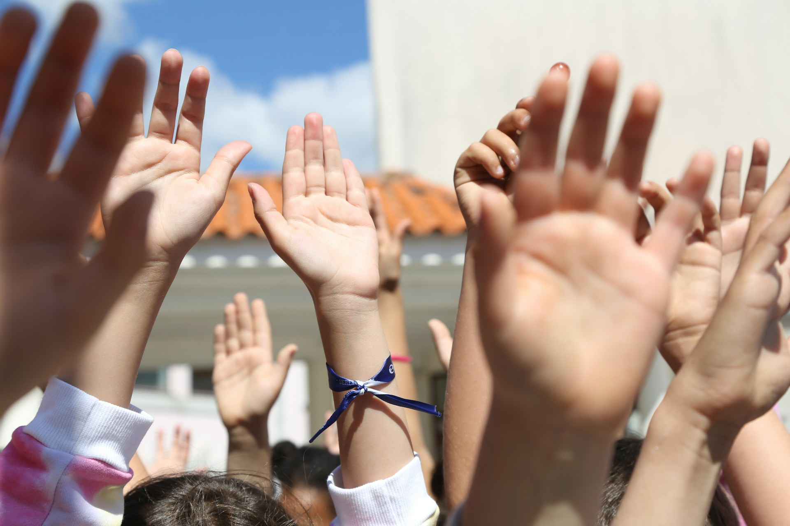

# What We Mean When We Say "Experience"

2026-05-05

## The Term That Sounds Like Justice

A new vocabulary has entered conversations about education and child welfare. The "experience gap" or "experience disparity" describes how children from wealthy families accumulate experiences that children from poor families do not (music lessons, overseas travel, exposure to multiple languages, encounters with what gets called high culture). The argument follows a familiar shape: these experiences shape cognitive development, communication skills, and confidence in ways that compound over time, and so the gap between the rich child and the poor child widens long before either of them sits for an exam.

NGOs, NPOs, and public sector programs have begun to organize around this framing. Universities, particularly the high-standard ones, have shifted toward holistic admissions that try to evaluate the texture of a young person's life rather than just their test scores. The intentions are good. The diagnosis is partly correct. And yet something about the whole apparatus produces a specific kind of unease, the kind that arrives when a movement claiming to address inequality turns out to be reinforcing it through different machinery.

The unease is worth taking seriously. When we examine what the experience gap framing actually does in the world, we find something that looks less like the dismantling of a hierarchy and more like its rebranding. The vocabulary of fairness can do the opposite work of fairness, and the people most affected are usually the least positioned to notice the substitution.

## Whose Experiences Count

The first thing to ask about any "experience gap" program is who decides what counts as an experience. The answer, when you look at the actual criteria, is that experiences which resemble upper-middle-class childhoods are the ones being measured.

Learning violin counts. Helping run the family's small shop from age twelve does not, or registers only as hardship. A two-week trip to study French in Provence counts. Being multilingual because your family migrated for work, switching between a heritage language at home, a regional language with neighbors, and English at school, rarely gets framed the same way. A summer of NGO work in Cambodia counts. Staying home to translate medical paperwork for grandparents does not appear in admissions essays unless someone has coached the student to package it correctly, which is itself a learned skill of the educated classes.

The pattern is consistent. Experiences that involve the consumption of culture, the acquisition of credentialed skills, or proximity to other people's hardship through structured programs are recognized as enriching. Experiences that involve real responsibility within a family, exposure to the working world, or the kind of multilingualism that develops naturally in immigrant or working-class communities are either invisible or treated as deficits to be remediated. The selection is not random. It tracks a specific class position.

Pierre Bourdieu's work on cultural capital is essentially about this dynamic. He argued that elite institutions do not simply reward intelligence or effort, they reward familiarity with elite culture, while presenting that familiarity as if it were intelligence or merit. The experience gap discourse, in its current form, is Bourdieu's argument arriving in real time. Admissions committees claim to look past test scores to find well-rounded applicants, but the rounding is done on a lathe calibrated to one particular kind of life.

## The Exam and Its Discontents

It would be dishonest to defend the entrance exam as if it were a neutral instrument. Exams are coachable. The cram school industry, the test prep economy, the entire infrastructure that converts parental income into exam scores means the so-called neutral test was never neutral. Statistics consistently show that children from wealthy families dominate admissions to high-standard universities, and a significant portion of that advantage is purchased through review classes, private tutoring, and the cognitive shaping that intensive preparation provides. Even cognitive capacity itself, except in the rare gifted case, is influenced by years of structured preparation that money makes possible. The exam is implicitly part of the existing experience gap.

So neither the old system nor the new one is fair. The real question is which kind of unfairness is more honest about itself.

The exam, for all its corruption by money, has one democratic property that holistic admissions lack: the criterion is legible and uniform. A poor student in a rural town and a wealthy student in Tokyo answer the same questions. The rich student arrives better prepared, but the poor student who studies obsessively and cracks the test still gets through. The imperial examination system in China, despite its many flaws, was historically a genuine channel of mobility precisely because it refused to look at where you came from.

When we shift to evaluating quality of experience, we move into a domain where wealthy advantages compound invisibly and get dressed up as the student's own virtue. The student whose parents funded their NGO trip presents the trip as evidence of personal initiative. The student whose parents enrolled them in a youth orchestra presents the orchestra as evidence of dedication. The mechanisms by which these experiences were made possible disappear from view, and what remains is a story about character.

The honest comparison, then, is not between a fair system and an unfair one. It is between two unfair systems, one of which leaves slightly more room for the kid who shouldn't have made it through but did. My intuition is that exams leave more room for that kid than holistic admissions do, because exams can be cracked by sheer obsessive effort in a way that having had the right kind of childhood cannot. This is a question of degree, not a clean answer, but the degree matters.

## Accumulation Is Not Wisdom

There is a confusion at the heart of the high culture argument that deserves attention. The confusion is between knowing many things and understanding deeply.

Someone who can recite poetry in three languages, name the major composers of the Romantic period, and discuss Renaissance painting at dinner has built impressive intellectual surface area. The accumulation is real. But that capacity is uncorrelated with the actual operation of wisdom, which is something else entirely: the ability to sit with a difficult situation, see it from multiple angles, recognize what you do not know, act under uncertainty, take responsibility for consequences. History is full of cultivated people who were morally and practically obtuse. It is also full of wise figures who came from circumstances that would never have produced a respectable admissions essay.

The Latin phrase, the Bach concerto, the familiarity with the canon. These are real human achievements, and there is nothing wrong with valuing them. The problem is the slippage that happens in three steps. First, this is valuable. Second, this is what valuable looks like. Third, people who have this are valuable people. By the third step, culture has stopped being culture and has become habitus in Bourdieu's sense, a set of bodily and verbal markers that signal class membership and gatekeep access. The signals get confused with the substance they were originally meant to indicate.

You can see this slippage at work in how cultivation gets read in social settings. Someone who quotes Horace at dinner is performing membership in a class, and the performance succeeds whether or not the person actually understands anything about justice or human nature. The capacity for the performance and the capacity for genuine reflection are different things, and the first capacity is much easier to acquire if your parents had the means to acquire it for you.

The point is not that high culture is fraudulent. The point is that high culture becomes a gate pass for maintaining social norms, and we should be careful about overrating it as a marker of intelligence or wisdom. Some of the most cultured people you will meet are shallow. Some of the wisest people you will meet have never read a famous book. Both observations are common enough that any honest account of human development has to take them seriously.

## The Two Failure Modes

This is the place where careful thinking matters most, because the territory contains two errors that are symmetrical and both bad.

The first error treats only cultivated experiences as preparation for serious life. It writes off most of humanity, dismisses the vast majority of childhoods across history and across the world as deprived, and dresses up class privilege as merit. This is the error of the experience gap discourse in its current institutional form.

The second error reverses the polarity. It treats hardship as its own school, romanticizes suffering, and slides into a position where the kid who survived neglect is presumed to have wisdom that the conservatory student lacks. This error is tempting because it pushes back against the first error, but it does so by making a claim that ends up excusing the adults and institutions that allowed the hardship in the first place. If suffering is a curriculum, then perhaps we do not need to prevent it.

Both errors fail. The right position is harder to hold because it refuses to collapse into either pole. Honor the wisdom people extract from difficult experience without treating the difficult experience itself as a gift. A child who cared for an addicted parent may have developed real moral seriousness, real competence, real capacity to read people, and these capacities deserve recognition. But the addiction was not good for the child. The exploitation, abuse, or neglect that some children endure cannot be excused as character-building. That a person made something of it speaks to the person, not to what was done to them. Society's task is to prevent the harm where possible, and to respect the wisdom that emerges when prevention failed.

This balance is what gets lost in both the experience gap discourse and the populist reaction against it. The discourse pathologizes ordinary working-class and poor childhoods as deprivations to be fixed. The reaction can romanticize those same childhoods as authentic schools of life. The truth is more difficult: hardship is genuinely hard, ordinary life contains genuine wisdom, cultivated life contains genuine value, and none of these observations gives us permission to rank lives against each other on a single scale.

## The Brainwashing of Good Intentions

This brings us to the deepest part of what is wrong with current efforts.

Children are perceptive. They are more perceptive than program designers usually credit, and they pick up on implicit messages faster than they pick up on explicit ones. When a child from a poor neighborhood is taken on a sponsored cultural enrichment trip and told, with the best of intentions, *this is what you have been missing*, the child registers two messages simultaneously. The explicit message is about opportunity and access. The implicit message is about their family's failure to provide. The second message is the one that lasts.

You can see the long-term effects in adults years later. There is a slight defensiveness about their upbringing. A careful management of what they reveal about where they came from. A sense that their real life and their respectable life are different things, and that admission to respectable life required a kind of internal renovation that the respectable people never had to undertake. This is the long yield of well-meaning intervention that did not examine its own premises.

The cruelty of the system, if we are willing to be honest about it, is that the same ideology produces opposite effects in children depending on their starting position. A child from a privileged background absorbs the values of the experience gap discourse as confirmation. The world makes sense, my life is good, I deserve what I have. A child from a poor background absorbs the same values as judgment. My life is the wrong kind of life, my parents failed to give me what mattered, I am being rescued. We call the whole arrangement fairness.

The most effective hierarchies are not the ones enforced through obvious coercion. They are the ones that get the people on the bottom to internalize the values that put them there. The entrance exam, for all its corruption by money, at least announced itself honestly as a hurdle. The we-are-giving-you-the-experiences-you-have-been-missing model does something subtler and worse. It teaches the child to look at their own life and see it as deficient by a measure they did not choose, then teaches them to feel grateful to the adults correcting the deficiency. That is not opportunity. That is induction into a value system, with the gratitude built in to make the induction stick.

## The Dignity of Ordinary Life

What is needed instead is harder than program design. It requires trusting children to evaluate their own lives. Not telling them whether their experiences were rich or impoverished, good or bad, but giving them the tools to think clearly and letting them work out what their lives have meant. This requires adults to tolerate the possibility that a child might reach conclusions the adults disagree with. The child might decide that what their grandmother taught them about patience matters more than what a famous novelist had to say. The child might find that the neighborhood they grew up in was a real place with real wisdom, rather than a deprivation to escape. Adults find this hard. We want to be useful, and being useful usually means having something to give. The discipline of giving children space to evaluate their own experience without our thumb on the scale is closer to restraint than to action, and restraint does not generate program funding or annual reports.

There is a deeper point underneath all of this, which is about the dignity of ordinary life. A great deal of human existence across history and across the world has been lived without violin lessons or trips abroad, and a great deal of it has been good. Full of love, work, meaning, knowledge worth having. To treat that life as the absence of something is a strange historical provincialism. The people running the experience gap programs are, in effect, telling most of the human past that it was deprived. The children of the poor are being taught to see their parents and grandparents through the eyes of strangers who would have found those ancestors lacking. That is a heavy thing to put on a child, and it does not get lighter because it comes wrapped in good intentions.

A society that cannot leave room for kinds of life it does not already approve of is not actually pluralistic, however many diverse experiences it celebrates. Real respect for difference would include respect for lives that do not fit the template, including lives that the template-makers might find limited or unenviable. The experience gap discourse, in its present form, does not contain that respect. It contains tolerance for difference as a temporary condition to be remediated. Children pick up on that distinction faster than the adults running the programs do, and they carry it with them.

Photo by [Sonhador Trindade](https://unsplash.com/@sonhador18?utm_source=unsplash&utm_medium=referral&utm_content=creditCopyText) on [Unsplash](https://unsplash.com/photos/a-group-of-children-raising-their-hands-in-the-air-Tz3_ZCe_je0?utm_source=unsplash&utm_medium=referral&utm_content=creditCopyText)
