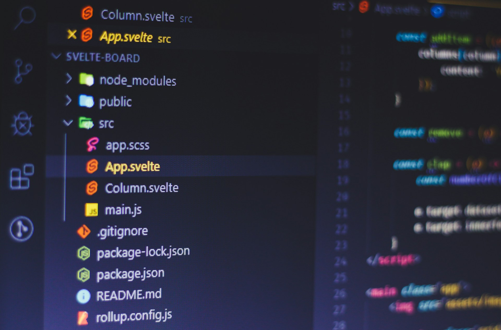

# Pseudo Knowledge Mysticism

2026-05-07



## The Markdown Editor That Isn't There

There is a strange gap in the modern software landscape that becomes obvious the moment you start working seriously with AI. Markdown has become the lingua franca of AI workflows. Large language models read it and write it natively. Retrieval systems prefer it. Knowledge bases for AI agents are built on it. A Japanese ISP recently [converted](https://www.interlink.or.jp/company/philosophy.md?view) its entire website to Markdown specifically because AI agents are now first-class consumers of web content. The format has crossed over from a writer's preference into something closer to infrastructure.

And yet, if you want to edit a Markdown file in your browser, your options are surprisingly thin. Typora, VS Code, and Obsidian all assume your files live on a local machine. OneDrive [shipped](https://techcommunity.microsoft.com/blog/onedriveblog/introducing-markdown-support-in-sharepoint-and-onedrive/4512174) a browser-based Markdown editor recently, but it remains rough. Google Drive offers nothing. Dropbox, despite being structurally well-suited to plain text workflows, has built nothing. GitHub stands alone as the only major platform where Markdown editing in the browser feels native, and that is because GitHub's users are developers who would not tolerate anything less.

The reasons for this gap are partly historical, partly strategic. Cloud providers built their web editors around proprietary formats first because that is where the money was, and because Markdown was a niche concern until about three years ago. There is also a reason that gets less attention: Markdown threatens vendor lock-in. Plain text is portable by design. Building a great Markdown editor means making it trivial for users to leave your ecosystem, which is not a feature any cloud provider eagerly ships.

But I want to use this gap as a way into a larger question, because it points at something more interesting than missing features. The way we organize information, the tools we choose to do it with, and the assumptions we no longer question about both, are being rearranged by the rise of AI. The folderless philosophy that dominated the last decade of note-taking is starting to look less like wisdom and more like a bet that did not age well. The graph views and second-brain metaphors that came with it are starting to look less like insight and more like theater. And the boring, unfashionable folder hierarchy is having an unexpected return to relevance, for reasons that no one really predicted.

## The Old Bargain of Folderless Thinking

The folderless philosophy did not arrive arbitrarily. It came out of a real frustration with how filing systems collapse under their own weight. Anyone who has used a desktop computer for more than a decade knows the feeling of a "Documents" folder that has become an archaeological site, full of nested directories whose original logic has been lost. David Allen's GTD culture in the early 2000s, Gmail's launch in 2004 with its radical "archive and search" model, and the rise of tagging as an alternative to hierarchical sorting all pushed in the same direction: stop organizing, start retrieving.

Notion absorbed this lesson and built its entire interface around it. Bear did the same. Roam Research turned the rejection of folders into an ideology, with bidirectional links replacing hierarchy as the primary organizing principle. Obsidian inherited this culture, and even though it technically supports folders, the dominant teaching in the Obsidian community is that folders are training wheels you eventually outgrow in favor of links and Maps of Content.

The bet underneath all of this was that organization is overhead, that human attention is better spent on creation and connection than on filing, and that retrieval, whether through search or links or tags, would always be good enough. The Gmail analogy was the founding myth: Google had proven that you do not need to organize email if search is fast enough, so why would you organize anything else?

The appeal is real, and I want to give it full credit before complicating it. Maintaining a taxonomy is genuinely tiring. Folders do collapse. The cognitive load of deciding where something goes can become a barrier to capturing it at all. A blank document and a search bar will, for many use cases, beat an elaborate filing system that you no longer trust. The folderless camp identified a real problem and offered a real solution to it.

The trouble is that they overcorrected, and they did so by conflating two different functions of organization that turn out to be quite distinct.

## What Folders Actually Do

When you put a note in a folder, you are doing two things at once, and the folderless philosophy noticed only the first one. The first thing is making the note findable later, which is the function that search can substitute for. The second thing is making a claim about what the note *is* and how it *relates* to other things, which is the function that nothing else can substitute for cleanly.

A note titled "ransomware analysis" carries a different meaning depending on where it lives:

```
/threats/ransomware/2024/charon-analysis.md
/translations/cybersecurity/q3/charon-analysis.md
/clients/enterprise-jp/incident-response/charon-analysis.md
```

The content of the note has not changed. The meaning has. The folder hierarchy is encoding context, scope, and relationship in a way that no tag and no link quite reproduces, because hierarchy expresses *containment*, which is itself a semantic claim. A folder inside another folder is not just adjacent to it, it is subordinate to it. That subordination carries information.

This is why software development never let go of folders, even as note-taking culture moved away from them. A codebase is not a pile of files made findable by search; the directory structure *is* the architecture. Consider the difference between these two arrangements:

```
src/auth/providers/oauth.js
src/auth/providers/saml.js
src/auth/middleware/session.js
```

versus a flat directory of files tagged "auth", "providers", "middleware". The first arrangement tells you something the second never quite can. New contributors orient themselves by reading the folder tree before they read a single line of code. The hierarchy is documentation. It encodes the priorities and ontology of the people who built the system. GitHub's entire collaborative model assumes this, and it works because the assumption is sound.

The folderless camp, in retrospect, was solving for the moment of retrieval and forgetting about the moment of orientation. For email, that was fine, because each email is roughly atomic and arrives with metadata baked in. For knowledge work, it was a bigger sacrifice than they realized.

## Why AI Made Folders Matter Again

The genuinely surprising development is that AI did not vindicate the folderless camp. It vindicated the folder camp, for reasons no one was predicting five years ago.

When an AI agent like Cowork or Claude Code looks at a knowledge base, the folder structure is free signal. Consider a path like:

```
/projects/research/translations/2026-q1/draft-v2.md
```

That single path tells the AI, without reading the file, what kind of work this is, who it is for, what stage it is in, and how it relates to its siblings. The AI can prioritize, scope, and reason about the work before a single character of content has been parsed. A folderless vault, by contrast, forces the AI to read the content of every file to infer the same context, which is slower, less reliable, and burns through tokens unnecessarily.

This is the inversion that took everyone by surprise. The "AI will search on your behalf" argument used to be the strongest case for abandoning organization. The actual lived experience of working with AI on real knowledge bases is teaching the opposite lesson. AI does not eliminate the need for structure, it raises the value of *legible* structure. The directory tree is the cheapest, most durable form of metadata you can give an AI agent, and it works whether the agent is reading, writing, or reasoning across files.

There is a deeper point hiding here. Search and AI both solve the retrieval problem, but neither solves the orientation problem. When you sit down to think about a domain, you need to know its shape before you can do anything useful with it. A folder hierarchy gives you that shape at a glance. A folderless vault, no matter how powerful its search, never quite does. The Cowork experience clarifies this in a way that pure note-taking never did, because the AI's effectiveness becomes the visible measure of how well your knowledge is structured.

## The Graph View as Theater

This brings me to a feature I want to criticize directly: the Obsidian graph view, and the broader "second brain" mysticism it represents.

The graph view is the most-screenshotted, most-marketed feature of Obsidian. It produces a visual that genuinely impresses on first encounter: each note becomes a node, each link an edge, and the whole thing pulses and grows as your vault expands. It is supposed to be your second brain made visible, the neural network of your thinking taking shape in real time.

Ask power users what they actually *do* with the graph view, and the answers get vague. "I look at it sometimes." "It helps me find orphans." "It is nice to see connections." None of this is real knowledge work. The graph view stops being analytically useful past a few hundred nodes, at which point it becomes a hairball, a phenomenon that information visualization research has documented for decades. The visualization fails at exactly the scale where you would actually need it, and yet it remains the signature feature of the tool.

The reason it persists is that it performs intelligence rather than producing it. It tells you that your notes are connected, that your thinking is dense, that your second brain is growing. It rewards accumulation. What it does not do is help you think.

Compare this to a well-organized folder hierarchy, which looks boring and produces no spectacle. Open the directory tree of someone who has thought carefully about their domain, and you can read their priorities, their lifecycle of work, the seams in their taxonomy where the structure strains. A folder structure is a document about how someone thinks. The graph view is a screensaver.

The Luhmann correction matters here. Niklas Luhmann's Zettelkasten, the supposed ancestor of all modern second-brain systems, was hierarchical. His notes had addresses like 21/3d7a2 that placed them in a branching tree structure. The modern reinterpretation of Zettelkasten as a non-hierarchical neural network is, frankly, a misreading. Luhmann was an engineer-minded operator who organized aggressively and produced staggering output: dozens of books, hundreds of articles, all powered by a filing system, not a graph view. He did not look at his card boxes admiringly and feel his second brain growing. He used them.

## The Mysticism of Disorder

There is a broader cultural pattern here that the graph view is just one expression of. We have inherited a romanticization of chaos as depth that runs through creative and intellectual life, and it deserves much more skepticism than it gets.

The mad genius archetype, the cluttered studio, the writer drinking himself into insight, the cult of the messy desk as proof of a brilliant mind, all of it suggests that order is the enemy of creativity and that disorganization is a sign of profundity. Some of this came from real observations about how divergent thinking benefits from loose associations. Most of it got generalized into something much lazier: that mess itself is generative, that the appearance of chaos signals depth, and that to be too organized is to be too tame.

The useful distinction is between genuine generative chaos and what I will call shadow chaos. Genuine generative chaos is what happens when someone has internalized so much structure that they can let it dissolve and recombine. The jazz musician improvising over chord changes they could play in their sleep. The mathematician seeing connections between fields they have each mastered. The chaos is real, but it is load-bearing, resting on a foundation of organized knowledge so thorough it has become invisible.

Shadow chaos is just disorganization wearing a costume. It is the half-read books, the unfiled notes, the projects in various states of abandonment, the thoughts that never got pinned down. From the outside, it can resemble the productive kind, because both involve loose ends. But the loose ends in shadow chaos are not generative tensions, they are incomplete work. The mistake is reading the surface texture and assuming the underlying process must be the same.

This is why drunk creativity is mostly an illusion. Alcohol does not unlock hidden depths; it lowers self-criticism, which can occasionally help someone with rich internal material get out of their own way, but mostly just makes mediocre ideas feel profound. The famous examples survive in cultural memory because of survivorship bias. We do not remember the thousands of drunk writers who produced nothing. And the famous examples often did their actual writing sober, with brutal editing.

The mysticism persists because it offers permission. If chaos is depth, then my disorganization is a sign of my profundity. If structure is sterile, then my failure to build structure is creative integrity. It is a flattering frame for what is, most of the time, just unfinished work.

## Fluency, Not Chaos

The honest creative ideal is not chaos. It is fluency.

Fluency looks effortless from the outside but is built on accumulated structure that the practitioner has so thoroughly internalized that they can move freely within it. The structure does not disappear, it becomes invisible. That is the thing the mysticism gets backwards. Real creative freedom is not the absence of structure, it is structure that has been so deeply absorbed that it no longer feels like constraint.

There is an asymmetry worth noticing. Organized people can choose to be chaotic, but chaotic people cannot choose to be organized at will. Someone with a rigorous knowledge structure can deliberately set it aside to brainstorm or play, and return to integrate what they found. Someone without structure has nothing to return to. The freedom to be disorganized is a privilege that requires having been organized first.

The folder hierarchy that looks boring is doing real work. The graph view that looks impressive is performing depth without producing it. The Markdown file in a clean directory tree, named clearly and placed where it belongs, is the unromantic atom of serious knowledge work. AI workflows are not creating this distinction; they are making it visible in a way it was not before. When the measure of your knowledge structure becomes how well an AI agent can navigate it, the theater stops being rewarded and the substance starts to.

Luhmann already knew this. He was not building a second brain. He was building a filing system, with the patience of someone who understood that discipline is not the enemy of creativity but the soil it grows in. The cards in the boxes were not impressive to look at. They were impressive in what they let him produce. That is the lesson the next decade of knowledge work is going to relearn, slowly, often reluctantly, as the tools we use force us to confront the difference between the appearance of thinking and the practice of it.

Photo by [Ferenc Almasi](https://unsplash.com/@flowforfrank?utm_source=unsplash&utm_medium=referral&utm_content=creditCopyText) on [Unsplash](https://unsplash.com/photos/computer-screen-displaying-files-fhAfLtHToCs?utm_source=unsplash&utm_medium=referral&utm_content=creditCopyText)