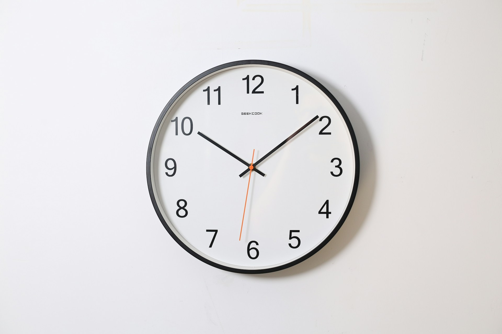

# The Sabbath Is Not a Day Off

2026-05-19

## The Clock Was an Installation

The feeling that time controls our lives is recent. It is not part of some eternal human condition. As a felt experience, it is roughly two and a half centuries old, which is barely anything on the scale of human history.

Before the Industrial Revolution, most people lived agricultural lives. The day began when the sun came up and ended when it went down. Work was not measured in hours because there was no reason to measure it that way. You sowed when it was time to sow, harvested when it was time to harvest, and the rest was waiting. The waiting was not idleness. It was the time required for something to mature, and that time belonged to the wheat or the rain or the season, not to the worker.

The Industrial Revolution changed this completely. The factory required workers to be in one place at the same moment, doing coordinated tasks against the rhythm of a machine. A bell or a whistle announced the start. Another announced the end. In between, the worker belonged to the clock. Eight hours eventually became the standard, but only after a long and brutal period during which twelve-hour days, including for children, were normal. The eight-hour day was not a gift; it was a concession wrung out of a system that would have preferred more.

Lewis Mumford argued that the defining machine of the modern age was not the steam engine but the clock. The steam engine made factories possible. The clock made factory workers possible. It trained people, generation by generation, to synchronize themselves to an abstract rhythm that had nothing to do with the work in front of them. The monastery bell had been doing this for centuries already, but the factory whistle made it universal. By the time pocket watches and then wristwatches became common, the training was complete. People carried the clock with them. They no longer needed to be told what time it was. They felt it.

This is the part worth pausing on. Clock-time is the first temporal regime in human history that floats free of any actual task. A farmer waiting for the wheat to ripen is doing nothing, but the doing-nothing is shaped by the wheat. A factory worker waiting for the bell is doing nothing in a way that is shaped only by the schedule. You can waste an hour without wasting any particular thing. The hour itself becomes the substance, and you become accountable to it. This is new. This is the installation.

## The Factory You Carry Inside

The factory whistle is mostly gone now. The factory logic is not.

Anyone who has worked in a modern office for a while will recognize a set of behaviors that only make sense if you assume the conveyor belt is still running somewhere behind them. A knowledge worker finishes their assigned work by four in the afternoon and sits in front of the screen for two more hours because the workday ends at six. Another worker, with a doctor's appointment in the middle of the day, asks permission to be offline for two hours, as though the two hours were a substance they were stealing rather than time during which their results would or would not get produced regardless. A third stays late, accomplishing nothing of note, and is qualified to charge overtime for the hours of presence. The output is the same in all three cases. The treatment of time is completely different.

These are not quirks. They are the residue of a regime that was supposed to have ended but never actually did. The factory got dismantled, or at least the buildings did, and the work moved into offices and then into laptops and then into homes, but the underlying assumption traveled with it. Time is the thing being purchased. Presence is the proof of purchase. Output is incidental.

The clearest sign of this is a scene that plays out in offices everywhere. A worker, in good faith and with real anxiety, asks a manager what they are supposed to be doing. There is no immediate task on their desk. The quarter's goals are known. The direction is clear. But the absence of a specific instruction in the current hour produces something close to panic. The honest answer, if anyone bothered to give it, would be something like: you are not a factory worker, you have to think about what is worth doing based on where the team is trying to go, and you have to stop waiting for the conveyor belt to send you the next piece.

The worker in this scene is not confused or lazy. They have correctly inferred the rules of the previous era, which are the rules they were trained in, and nobody has told them the rules have changed. The factory has moved from the floor to the inside of their head. They are waiting for a whistle that is not going to come, because they have not yet learned to be the one who decides when work begins.

## Output Is Not Freedom

The standard answer to all of this is that knowledge work should be measured by outcomes, not by hours. Results-oriented. Deliverable-based. Pay people for what they produce, not for how long they sit there. This sounds like liberation, and for a while I believed it was.

I have changed my mind, mostly by listening to people who already live entirely inside that regime.

Researchers and academics are the clearest example. Their hours are not measured in any meaningful way. Nobody clocks them in or out. They can work from anywhere, at any time, for as long or as briefly as they want. And yet, when you read interviews with them or talk to them honestly, what comes back is not a story of freedom. It is a story of being haunted. The work follows them everywhere. Sundays are not really Sundays. Vacations are not really vacations. There is always a paper that could be further along, always a grant that could be written, always reading that could be done. Many describe years, even decades, without a single day free of low-grade guilt. The clock has been removed, and what replaced it is worse.

This is the problem with the output frame. Outputs are uncapped. There is always more output that could exist. Hours at least have a ceiling at twenty-four, and a human body forces you to honor most of that ceiling whether you want to or not. Outcomes have no such ceiling. They expand to fill whatever capacity is available, and then they expand a little further, into the time that was supposed to be yours.

So the move from hours to outcomes is not the escape it looks like. It keeps the underlying assumption, which is that human time should be made legible through some metric, and just swaps the metric for one that bites harder. The conveyor belt has moved from the factory floor to the inside of the skull. The bell has been replaced by a low, continuous hum that never stops.

Knowledge work was supposed to be the post-industrial answer. In an important sense, it was not. It kept the industrial habit of measuring people and just changed the unit of measurement. The real problem was never hours specifically. The real problem is measurement as the medium through which human activity is made visible at all.

## What AI Accelerates

It is now common to hear that artificial intelligence will free us from time pressure. The argument is intuitive. If a task that took five hours can now be completed in five minutes, the saved four hours and fifty-five minutes belong to us. We will work less. We will rest more. The machine will absorb the drudgery and return our lives.

I do not believe this, and I think the historical pattern does not support it either.

When productivity rises, expected output rises with it. The economist William Stanley Jevons noticed this in the nineteenth century, in the context of coal. More efficient steam engines did not reduce coal consumption, they increased it, because efficiency made coal more useful and so more coal got used. This became known as the Jevons paradox, and it has held up remarkably well across very different domains. Email did not reduce the volume of communication; it raised the expected volume. Word processors did not reduce the time spent on documents; they raised the expected polish of every document. Spreadsheets did not free accountants; they expanded what an accountant was expected to track. The general rule is that efficiency gains in production get absorbed as higher throughput, not as more leisure.

There is no obvious reason to exempt cognitive labor from this pattern. If anything, knowledge work is more vulnerable to it than physical production was, because the ceiling on cognitive output is harder to see. A coal mine eventually runs out of coal. A worker's capacity to think, write, analyze, and decide has no comparable hard limit, which means there is no natural point at which the productivity gain stops translating into more expected work.

There is no obvious reason to think AI will be the exception. If a knowledge worker can now produce in an hour what used to take a day, the felt expectation will reset to whatever the new ceiling is. The worker who finishes early will not go home. They will be asked, by their manager or by themselves, what else they could be doing with that newfound time. And the cost of pausing, in opportunity terms, will keep rising, because more and more could have been produced in any given pause.

This is the deeper trap. In the industrial era, the factory wanted to keep running, and the worker had to resist it externally. In the knowledge era, the worker internalized the factory and the resistance had to move inward. In the AI era, the felt asymmetry between what one is producing and what one could be producing becomes so large that personhood itself starts to register as a bottleneck. You are the slow part. You are the thing in the way of the output. The pressure does not come from a boss or from a clock. It comes from the gap between your finite self and an effectively infinite production capacity sitting in your browser.

This is not a future scenario. The professors and researchers were already living in a version of it, decades before the current AI tools existed. They were the canary. They show what happens when measurement becomes total and continuous and the only thing left to measure is you.

## Stepping Out

The response to a regime of total measurement is not a better metric. There is no third unit, after hours and outcomes, that will rescue us. Any metric will become a new conveyor belt, given enough time, because the problem is not the metric. The problem is the assumption that human activity needs to be made legible through measurement at all.

The response, if there is one, has to come from outside the frame. It has to be a practice of stepping out.

Every durable culture has built some version of this. The Sabbath is the oldest and most refined example, which is why the word is useful even outside its religious context. The Sabbath is not a day off in the modern sense. A day off is recovery time, scheduled in service of more work. The Sabbath is the opposite. It is the part of the week that the rest of the week is for. Production stops, and the stopping is not justified by what it makes possible afterward. It is the point.

Josef Pieper, in *Leisure: The Basis of Culture*, argued that modernity inverted this entirely. We now justify leisure as preparation for more work, when the older view was that work was justified by the leisure it made possible. The festival, the contemplative pause, the Sabbath itself, were not the residue of a productive life. They were what a productive life was supposed to clear room for. Lose them and the productive life has nothing to point at. It just produces, and then produces more, and the producing has no shape because there is nothing outside it that the producing is for.

Abraham Joshua Heschel called the Sabbath an architecture in time. Not in space. Most of what humans build, we build in space, and the building is visible. The Sabbath is something we build in time, and it is invisible except to the people inside it. Once a week, the construction goes up, and a small interior appears in which the ordinary rules do not apply. You step into it, and for a day, the metric stops.

I want to be careful here. I am not making a religious argument. I am using the word *Sabbath* in its structural sense, as the most refined version of a practice that shows up across cultures: the sabbatical year, the festival, the day of rest, the silent retreat, the contemplative pause built into a monastic schedule. The specific theology is not the point. The point is the shape. A ritualized interval during which production stops, not for recovery, not for optimization, not as preparation for more production, but as an end in itself.

The reason this matters is that you cannot see the shape of time from inside time. You cannot evaluate a life from within the metric the life is being measured by. You need a vantage point that the metric does not reach, even if that vantage point is small and recurring and temporary. The Sabbath is that vantage point. The sabbatical is that vantage point. A Sunday with the phone off is, in a smaller way, that vantage point. A walk without a destination is sometimes that vantage point. What these have in common is not what is done during them but what is not. Nothing is being produced. Nothing is being measured. For a bounded interval, you are not legible as a unit of output, and the not-being-legible is the thing.

The Jewish tradition has a phrase for this: *me'ein olam ha-ba*, a taste of the world to come. I want to use it carefully. The phrase can be read metaphysically, as a claim about another world, and that is not what I mean by it. I mean it the way the tradition often means it: that the taste is *inside* the week. The Sabbath does not point at a better world somewhere else. It is a small portion of something larger, made available weekly, inside ordinary time, so that ordinary time has something to be measured against other than itself.

## The Center and the Periphery

The Sabbath is not a day off. A day off is what modern life calls the residue, the time left over after the real work is done. The Sabbath is the opposite. It is what the rest of the week is for.

Modern life treats doing-something as the center of existence and doing-nothing as the periphery. We work, and the working is the substance, and the pauses are recovery so that we can return to the substance. This is the assumption built into the eight-hour day, into the weekend as "off-time," into the vacation as a withdrawal from the real account of life. Doing-nothing is what we apologize for. It is the thing we feel guilty about, the thing we hide, the thing we justify by pointing to the productive consequences it will have once we return.

I want to suggest the inversion. Doing-nothing, in the specific sense of stepping outside the metric, is the center. The work is the periphery. The work is justified by what it makes possible, including the capacity to stop. The week is justified by the Sabbath inside it. The productive life is justified by the moments when production is not what is happening.

This does not devalue ordinary life. It does the opposite. The brief interval of being here, finite and bounded, becomes more vivid against the background of stepping-out, not less. You notice the week because the Sabbath frames it. You notice the years because something inside them is not being counted. The metric stops, briefly, and what remains is the bare fact of existence, which turns out to have been what was being measured the whole time, and which measurement could not have captured.

The professors and researchers I mentioned earlier are the leading edge of a problem the rest of us are about to inherit. They lost the clock and gained nothing in its place, and the result has not been freedom. It has been a diffuse, unbounded obligation that follows them into Sundays and vacations and the inside of their own heads. AI will deliver this condition to the rest of us, faster than we expect. The felt cost of pausing will keep rising, because more and more could be produced in any pause, and at some point the pressure will become unbearable for anyone who has not built a practice of stepping out.

The question is not whether AI will give us time back. It will not. The question is whether we still remember how to step outside time at all, and whether we will protect that practice before the felt cost of doing so becomes too high to pay.

The Sabbath is not a day off. It never was. It is the part of the week that lets the rest of the week mean anything.

Photo by [Ocean Ng](https://unsplash.com/@oceanng?utm_source=unsplash&utm_medium=referral&utm_content=creditCopyText) on [Unsplash](https://unsplash.com/photos/round-analog-wall-clock-pointing-at-1009-L0xOtAnv94Y?utm_source=unsplash&utm_medium=referral&utm_content=creditCopyText)
