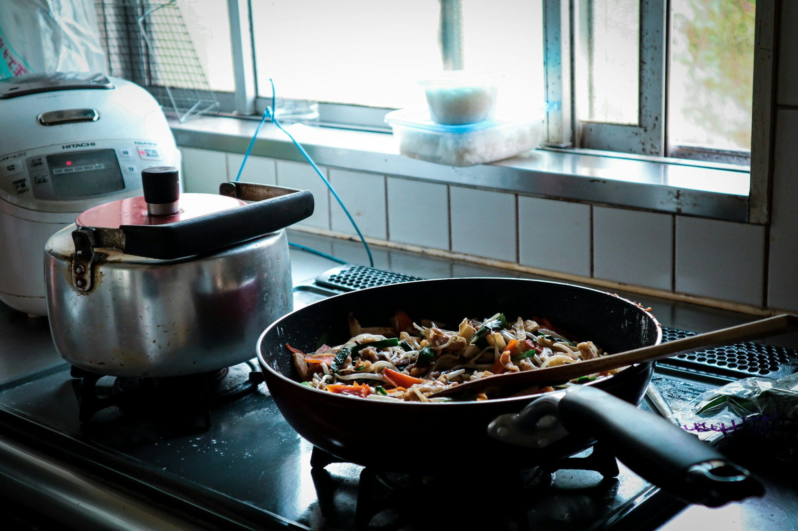

# The Taste of Being Cared For

2026-05-20

## The Meals We Never Noticed

As children, we rarely think deeply about food because meals simply appear as part of everyday life. Dinner waits on the table after school, lunch boxes are already prepared before the morning rush, and someone worries whether we ate enough vegetables or finished our soup. Parents ask simple questions that feel almost repetitive at the time: “Did you eat already?” “Do you want more rice?” “Was the lunch enough?” These interactions seem ordinary because children naturally assume that such care will continue forever. Only much later do we realize that these daily meals were not merely about nutrition but about affection repeated so consistently that it became invisible.

That is probably why people across cultures remember “mother’s cooking” with such emotional intensity. Often, the food itself was not luxurious or technically sophisticated. Sometimes it was incredibly simple: miso soup, fried fish, curry rice, adobo, scrambled eggs, sandwiches, or leftovers reheated the next morning. Yet decades later, people still recall those meals with surprising clarity. What remains in memory is not only the flavor but the atmosphere surrounding it. The sound of dishes in the kitchen, the smell of soup filling the house near evening, or the sight of a lunch box carefully prepared early in the morning becomes emotionally inseparable from the taste itself.

Food prepared by someone close carries an invisible emotional layer. The meal silently communicates that someone spent time, effort, and attention thinking about your well-being before you even sat down at the table. Children usually cannot recognize this because care feels permanent when we are young. We assume someone will always prepare meals, maintain routines, and organize daily life around our existence. Only adulthood reveals how fragile and precious these ordinary acts truly are.

Many people do not fully understand this until they begin living alone for the first time. The transition is subtle at first. Independence feels exciting, even liberating. But eventually, people discover that something emotional disappears when eating becomes entirely self-managed. That realization often arrives much later than expected.

## When Eating Becomes Transactional

In early adulthood, many people spend years eating alone without questioning it very deeply. You move away from home, begin working, rent a small apartment, and gradually establish routines centered around efficiency. After work, you buy dinner from a convenience store, prepare a quick meal for yourself, or eat at restaurants designed for speed and convenience. At first, this lifestyle can even feel empowering because it represents freedom and self-sufficiency. Nobody tells you what time to eat, what to cook, or whether your diet is balanced.

Modern cities are remarkably good at providing food quickly and efficiently. Convenience stores remain open twenty-four hours a day, food delivery arrives within minutes, and restaurants offer almost unlimited variety. From a practical perspective, urban life has solved many historical difficulties associated with food preparation. Yet despite this abundance, many solitary meals feel emotionally neutral. The food may be delicious, carefully prepared, or even expensive, but it often lacks the emotional atmosphere that surrounds food prepared by someone close to you.

Part of the reason is that modern eating has increasingly become transactional. You pay for food, consume it, and continue with your day. Even cooking for yourself carries a different emotional structure from being cooked for by another person. Self-prepared meals are necessary and sometimes enjoyable, but they still exist within the logic of maintenance and survival. You prepare food because your body requires it. The emotional dimension becomes smaller when eating is reduced primarily to individual management.

This emotional neutrality is now extremely common in urban societies. Many people eat while looking at phones, watching videos, or continuing work tasks. Meals become compressed between obligations, deadlines, and exhaustion. In crowded cities, millions of people eat alone every night while surrounded by countless others doing the same thing. Outwardly, this appears normal and efficient. Yet beneath that efficiency, there is often a subtle loneliness that modern culture rarely addresses directly.

Human beings did not historically evolve around isolated eating. For most of history, meals were deeply communal experiences tied to family, religion, village life, and social belonging. The human nervous system still remembers this older structure even when contemporary lifestyles normalize solitary eating. That is why the emotional impact of a homemade meal prepared by someone close can feel unexpectedly powerful after many years of living alone.

## The Shock of a Homemade Meal

When a person begins living with a partner or gets married, something emotionally surprising often happens. Suddenly, someone prepares food specifically for you again, not as a transaction, not as part of a service industry, but simply because they care about your well-being. The meal itself may be very simple, yet the emotional impact can feel disproportionately large. A bowl of soup after a tiring day, coffee already prepared in the morning, or a packed lunch placed near the door can produce emotions that are difficult to explain logically.

What becomes overwhelming is not the culinary complexity of the food but the realization that another person has incorporated your existence into their daily rhythm. Someone remembers your preferences, notices your fatigue, or prepares something comforting because they thought about you while shopping or cooking. Many people suddenly realize, sometimes with surprising intensity, how long they spent eating meals that were emotionally disconnected from this kind of care.

The phrase “Dinner is ready” can unexpectedly awaken memories that stretch back to childhood. Without consciously intending it, adult life reconnects to an older emotional experience in which food was inseparable from affection and safety. That is why even ordinary homemade meals often feel profoundly comforting. The emotional meaning changes the experience of taste itself. Food becomes relational rather than merely functional.

Modern psychology and neuroscience often discuss how communal eating and affectionate relationships influence stress levels, emotional stability, and hormones associated with bonding such as oxytocin. Yet long before scientific explanations existed, human beings already understood these realities intuitively. Families gather around meals during celebrations, mourning, reconciliation, and religious holidays because eating together creates emotional connection in ways that are difficult to reproduce elsewhere. Sometimes a simple bowl of soup communicates concern more effectively than long conversations ever could.

There is also something deeply human about realizing that another person voluntarily spent time and energy preparing something for your well-being. In modern societies where many interactions are governed by economic exchange, this kind of care carries unusual emotional weight. It reminds people that not every meaningful act must pass through the logic of efficiency, productivity, or transaction.

## What People Miss After Loss

As people grow older, the emotional dimension of food often becomes even clearer. Widows and widowers frequently speak about missing the meals prepared by their late spouse, and outsiders sometimes misunderstand this as mere nostalgia about cooking. In reality, what they often miss is the repeated experience of being cared for through ordinary daily routines. A spouse remembering how you like your tea, preparing your favorite dish without being asked, or waiting to eat dinner together after a long day shapes emotional life over decades.

These routines appear small while they are happening. Because they are repeated daily, they easily disappear into the background of ordinary life. Yet after loss enters the picture, these ordinary moments suddenly become enormous. Many people eventually realize that emotional security was not built primarily through dramatic milestones or extraordinary experiences but through countless repeated acts of care that seemed almost invisible at the time.

This becomes especially important in aging societies where loneliness increasingly affects elderly populations. Many older people suddenly find themselves eating alone after decades of shared domestic life. Even when family members visit occasionally, the emotional atmosphere changes profoundly. The kitchen feels different. The dining table feels different. Silence itself acquires a different texture when meals are no longer shared with someone familiar.

Taste and smell are also deeply tied to memory. A familiar recipe can instantly return someone emotionally to another stage of life with astonishing intensity. The smell of soup, grilled fish, coffee, or rice can suddenly revive memories of childhood kitchens, family gatherings, or evenings spent with a spouse who is no longer present. Food becomes a form of emotional continuity that survives even when people themselves disappear.

Modern culture often focuses heavily on achievement, visibility, and personal success, yet many people discover later in life that some of the deepest forms of happiness emerged through these ordinary domestic rhythms. Shared meals, repeated daily over years and decades, become part of the emotional structure that allows people to feel rooted in the world.

## Happiness Before Self-Help

Contemporary society constantly offers advice about how to become happier, healthier, and more fulfilled. There are endless systems promising optimization through productivity routines, supplements, workout schedules, mindfulness techniques, morning habits, and self-improvement strategies. Some of these practices are genuinely useful and can improve people’s lives. Yet many people eventually realize that the foundations of emotional well-being are often surprisingly ancient and simple.

A shared meal matters more than many people expect. Someone asking whether you already ate matters. Cooking for another person matters. These acts may appear small from the perspective of modern achievement-oriented culture, yet they directly address one of the deepest human needs: the need to feel emotionally connected to others through repeated ordinary care.

Loneliness has increasingly become one of the central health issues of modern societies, particularly in dense urban environments where people can spend entire days surrounded by others while remaining emotionally isolated. Researchers repeatedly connect chronic loneliness to poorer physical and psychological outcomes. Human beings are relational creatures regardless of how strongly modern culture emphasizes individual independence and self-sufficiency.

One of the saddest aspects of contemporary adulthood is that emotional deprivation gradually becomes normalized. Eating alone every day becomes routine. Convenience replaces connection. Efficiency replaces warmth. People adapt outwardly while inwardly carrying a subtle exhaustion that is difficult to articulate clearly. That is why even very simple homemade meals can suddenly feel emotionally healing. Not because the food itself magically solves life’s difficulties, but because the meal restores a forgotten emotional condition in which someone genuinely thought about your well-being.

No life hack can fully replace that experience. A carefully prepared dinner from someone who loves you often carries more emotional comfort than countless optimization systems designed around personal performance. Modern societies sometimes search for happiness in increasingly complicated ways while overlooking some of the oldest forms of human fulfillment.

## Cooking for Someone Else

There is also another side to this experience that is equally important. Cooking for someone else changes the person cooking as well. Preparing food only for oneself can sometimes feel procedural, but preparing food for another person introduces anticipation, attention, and emotional meaning into the act itself. You begin thinking about whether they will enjoy the meal, whether it will comfort them after a difficult day, or whether it matches their preferences and memories.

This is probably why many people feel unexpectedly fulfilled while cooking for family members, partners, children, or close friends. Even when cooking becomes physically tiring, the effort often produces emotional satisfaction because it directly connects to another person’s well-being. Care becomes tangible and visible through food. A meal communicates concern, affection, and presence in ways that words alone sometimes cannot.

Perhaps this reveals something fundamental about human happiness. Many forms of fulfillment are not hidden behind extraordinary success, luxury, or optimization. They exist inside ordinary repeated acts of mutual care that slowly shape emotional life over time. A simple dinner prepared in a small kitchen may contain more emotional richness than many forms of modern excess precisely because it expresses something deeply human and relational.

Someone waiting for another person to come home. The sound of cooking in the evening. Familiar dishes placed on the table. A simple question such as “Did you eat yet?” These moments may appear ordinary from the outside, yet they form part of the emotional foundation that allows people to feel less alone in the world.

Civilization has become technologically sophisticated, but perhaps human beings remain emotionally nourished by remarkably ancient things: warm food, shared tables, and the feeling that someone prepared something with you in mind.

Photo by [Yuya Yoshioka](https://unsplash.com/@superyuyakun?utm_source=unsplash&utm_medium=referral&utm_content=creditCopyText) on [Unsplash](https://unsplash.com/photos/black-cooking-pan-with-food-unteFHaWL2Q?utm_source=unsplash&utm_medium=referral&utm_content=creditCopyText)