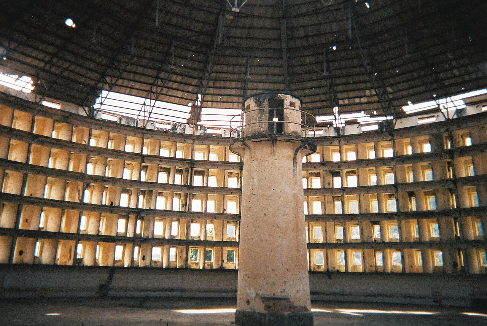

# The Digital Architecture of Freedom

2026-05-21

## The Architecture of the Digital Cage

The transition from physical assets to digital services was sold as a liberation narrative. In the early days of computing, expanding your creative toolkit meant buying a physical box containing a compact disc or a series of floppy disks. When Adobe launched Creative Suite 6, a user could pay a one-time fee, install the applications locally, and run them indefinitely without an internet connection, a monthly invoice, or a corporate permission slip. You owned the tool. Your files remained entirely under your custody on your physical drive, safely stored in local directories like "/Users/Shared/Projects".

Then the trap closed. By terminating the traditional perpetual license and forcing users into the Creative Cloud subscription model, software providers fundamentally transformed the nature of digital property. The true mechanism of this capture was not the monthly fee itself, but the deliberate manipulation of proprietary file formats. When a creator saves a decade of professional work in highly complex, layered formats such as ".psd" or ".ai", those files become digital lockboxes that can only be fully read by the matching proprietary software.

If you decide to stop paying the monthly rent, the vendor does not just stop updating the software. They effectively revoke your ability to open, read, or export your own intellectual property. In practice, this aggressive vendor lock-in functions as a corporate variant of software as ransomware. Your historical creative work is held hostage behind a continuous payment wall, forcing you to pay a recurring fee simply to prevent the encryption and functional destruction of your own past labor. This predatory architecture laid the groundwork for severe institutional blowback, culminating in a landmark federal lawsuit where Adobe ultimately agreed to a $150 million settlement with the Department of Justice to resolve allegations surrounding deceptive subscription cancellation practices and hidden fees.

## The Great Trade-Off of the Algorithmic Age

Surrendering to this ecosystem is part of a broader, systemic bargain that defines the modern internet. Consumers constantly participate in a structural trade-off, balancing absolute data privacy against the immediate convenience offered by Big Tech ecosystems. When you sync your life across mainstream cloud servers, you are giving up a slice of personal sovereignty. Your data becomes fuel for recommendation engines, ad-targeting vectors, and machine learning models.

Yet, this observation is precisely what makes the services feel so indispensable. The algorithms that anticipate your preferences, organize your messy photo libraries, and streamline your search queries require constant visibility into your digital habits. If a system cannot observe you, it cannot serve you with predictive efficiency. For the vast majority of day-to-day operations, standard consumer cloud services function as a necessary utility. Sending a quick calendar invite, sharing a casual vacation photo, or drafting a grocery list on a standard mobile device does not require maximum operational security.

The mistake lies in treating all data as if it shares the same level of sensitivity. Living pragmatically in a highly connected society means accepting a tiered existence. It means recognizing that your streaming preferences or public social media feeds can safely exist in the corporate sphere, while your core intellectual assets require an entirely different architectural blueprint.

## The Swiss Vaults of the Decentralized Web

To protect highly sensitive intellectual property, a growing counter-movement has emerged around local-first development and zero-knowledge cloud architectures. The philosophy of local-first software completely decouples your data from the application vendor. Popular personal knowledge management tools use plain-text Markdown (".md") files stored directly on your machine's local drive. Because Markdown is an open, universally human-readable format, your notes can be opened by any basic text editor on earth, ensuring your work remains entirely future-proof regardless of whether the software company goes bankrupt or alters its terms of service.

However, keeping data strictly local introduces a severe physical vulnerability. A single spilled cup of coffee, a house fire, or a sudden mechanical hard drive failure can instantly obliterate an entire lifetime of work. True digital sovereignty therefore requires a hybrid approach: local ownership supported by a blind, encrypted cloud backup.

This environment functions almost identically to traditional physical asset management. In the financial world, you do not place your daily grocery money in a high-security offshore account. For routine, day-to-day transactions, you rely on a local retail bank with a convenient smartphone application and an accessible network of machines. You accept a baseline level of systemic exposure and corporate tracking because the fluid utility is worth the trade-off. However, for the core of your assets, you look for a secure, independent financial banking institution, historically epitomized by a private vault in Switzerland.

The modern digital equivalent of this model has materialized through sovereign privacy ecosystems. Services like Proton Mail and Proton Drive have built a rapidly expanding alternative to Big Tech by rooting their infrastructure under strict Swiss privacy laws and zero-knowledge architecture. When you upload a document to this type of environment, the files are encrypted directly on your local hardware using keys that only you control. The data stored on the remote servers becomes scrambled digital noise. The platform itself cannot read your messages or scan your files, providing a blind digital vault that shields your most valuable intellectual property from corporate exploitation or data breaches.

## Orchestrating the Layered Defense

Managing this necessary friction introduces a profound dilemma between the absolute safety of the local drive and the convenient resilience of the cloud. Relying entirely on a closed vendor ecosystem can feel safer on the surface because it automates your backups, but it is never free, and it leaves your entire digital life vulnerable to systemic exploitation. Navigating this landscape is not a black-and-white choice between complete isolation or complete corporate exposure. Instead, the solution requires a layered approach, carefully tiering information based on its specific security and utility requirements.

This level of architectural complexity is often beyond what an individual user can easily manage on a daily basis. Manually sorting files, choosing encryption protocols, and auditing file formats across multiple platforms creates an immense cognitive burden. This operational bottleneck is precisely where AI transforms from a corporate monitoring tool into a deeply empowering user asset.

An intelligent assistant can act as the automated coordinator of your personal digital sovereignty. Rather than forcing you to manually balance the trade-offs of a tiered infrastructure, an AI agent can analyze your data workflows, automatically flag proprietary file extensions, and route sensitive documents to zero-knowledge vaults while keeping casual information in easily shareable mainstream clouds. By automating the backend complexity of a tiered security model, technology allows the individual to maintain strict data boundaries without sacrificing the fluid convenience of modern computing.

## Foucault in the Age of the Prompt

This ongoing struggle over digital custody perfectly mirrors the philosophical frameworks of Michel Foucault, particularly his analysis of knowledge-power dynamics. Foucault observed that power is not a centralized physical object held by a single dictator, but a diffuse, capillary force that flows through institutions, language, and architectural designs. He highlighted the Panopticon—a prison design where inmates are visible to an invisible guard at all times—as the ultimate mechanism of modern discipline, forcing individuals to internalize surveillance and police their own behavior.

The modern corporate cloud is the digital realization of the Panopticon. Algorithms track your clicks, measure your engagement pauses, and subtly steer your consumption habits behind the black box of proprietary code. You never see the machine watching you, yet you continuously alter your creative and professional behaviors to align with its invisible parameters.

However, Foucault also maintained that where there is power, there is always resistance. He pointed toward "counter-conduct" as the intentional practice of individuals reclaiming their own autonomy against institutional control. Leveraging conversational AI to outmaneuver a corporate monopoly is a modern manifestation of counter-conduct. When an individual uses a sophisticated AI model to analyze a predatory terms-of-service contract, extract hidden clauses, and draft a high-level corporate negotiation script, the historical asymmetry of information collapses. The consumer uses the very technology designed to categorize them to instead enforce their own personal sovereignty.

## The Practical Mechanics of Resistance

The power of this mindset becomes clear when applied to concrete economic friction. When Adobe recently implemented a sudden price increase for its Creative Cloud services, the immediate corporate expectation was compliance. The cancellation pathways were intentionally engineered with dark patterns, designed to induce fatigue and force users to capitulate to the new rates. Instead of accepting the financial penalty, a strategic user consulted an AI chat to serve as an advisor, analyzing the platform's retention mechanics and mapping out a step-by-step counter-strategy.

By utilizing the AI to draft specific scripts, anticipate the automated retention offers, and navigate the hidden contractual hurdles, the user successfully forced a downgrade to a fair service tier on their own terms. Counter-intuitively, this interaction dismantles the popular narrative that conversational technology makes humans lazy or dependent. When approached with a mindset of active resistance, the tool does not replace human thought; it sharpens human agency.

Using conversational models in this manner transforms the individual into an empowered coordinator. It allows you to learn the hidden levers of corporate systems at your own pace, equipping you with the specialized knowledge required to defend your financial and digital boundaries. The technology becomes a shield against corporate exploitation, demonstrating that intellectual empowerment is completely achievable when you treat the machine as a tactical partner rather than an automated crutch.

## The Infinite Equalizer and the Demolition of the Gatekeeper

This shift marks a massive democratization of specialized expertise. For generations, professional guilds, elite legal circles, and expensive academic institutions maintained a tight monopoly on authoritative knowledge. If an individual needed to decode complex contractual law, learn an advanced technical skill, or navigate a convoluted bureaucratic system, they were forced to pay a massive premium to certified gatekeepers. High-level education became an exclusive luxury good, trapping students behind immense financial barriers.

The widespread accessibility of intelligent tools dismantles these gatekeepers entirely. AI acts as an infinite, hyper-personalized mentor available to anyone with a browser and an inquiring mind. If you are struggling with a dense conceptual barrier, you can instruct the system to break it down using a specific analogy, generate tailored exercises, or critique your logic from a defensive perspective. It is a complete inversion of traditional, rigid educational models.

The institutional anxiety surrounding these tools, which often manifests as a desire to restrict or ban AI in classrooms, stems from a deep-rooted fear of losing systemic authority. When knowledge is no longer a scarce commodity locked inside physical university walls, the traditional gatekeepers lose their leverage. Embracing a modern mindset means realizing that these systems do not induce human laziness; they serve as a cognitive bicycle that vastly amplifies our capacity for critical execution. True literacy in the modern era is no longer about memorizing facts that can be retrieved in a millisecond, but about cultivating the critical thinking required to direct, audit, and synthesize information to maintain absolute control over your own intellectual path.

Image: the Panopticon, from [Wikipedia](https://commons.wikimedia.org/wiki/File:Presidio-modelo2.JPG)