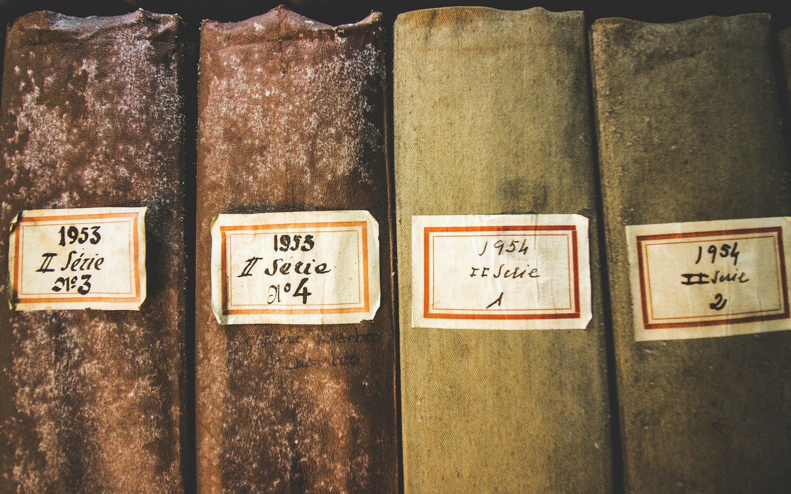

# The Ghost of Paper

2026-05-26

## When a Software Migration Reveals a Deeper Confusion

I recently heard that some Japanese government sectors are trying to move their documents from Ichitaro to Microsoft Word. On the surface, this sounds like a practical modernization effort. Ichitaro is deeply rooted in the Japanese language ecosystem, and it served many offices well for decades. But in a world where Microsoft Word has become the common language of business documentation, remaining dependent on a locally specific word processor can create friction.

So I understand the practical reason. If public offices need to exchange files with private companies, universities, other agencies, and international partners, Word feels safer. It is familiar to more people. It is supported by more systems. It is easier to explain to younger workers who have never used Ichitaro. From the viewpoint of daily operations, a move to Word may look like a reasonable step toward standardization.

Yet something about this change feels unsatisfying. It may solve a surface problem while leaving the deeper confusion untouched. If the real issue is that public documents are trapped inside proprietary software, then moving from one vendor’s ecosystem to another does not truly solve the problem. It only changes the name of the dependency. This is why the migration becomes more interesting than it first appears. It is not merely a story about Japanese government offices changing office software. It is a small window into a larger problem: we still do not know what a digital document is supposed to be.

The difficulties people are facing during the transition reveal this hidden problem. Legacy files do not convert cleanly. Tables shift. Layouts break. Margins move. Spacing changes. The visual balance of old documents collapses. Staff members then have to spend many hours manually fixing what software conversion could not preserve. At first, this looks like a technical inconvenience. But perhaps it is more than that. The failure of conversion shows that those old files were never just containers of information. They were mixtures of text, layout, local software behavior, printer assumptions, fonts, institutional habits, and visual expectations.

A document that appears stable inside one application may become fragile the moment it leaves that environment. The content may survive, but the document as people understood it does not. Its meaning was partly stored in the layout. Its authority was partly expressed through formatting. Its official character depended on how it looked on a page. This is why changing software can become so painful. The organization is not simply converting files. It is trying to transfer decades of administrative culture from one visual system to another.

If the shift from Ichitaro to Word is presented as a digital transformation effort, then we should ask what is actually being transformed. Is it the structure of public knowledge? Is it the long term durability of records? Is it the ability of citizens and future institutions to access public memory? Or is it only a replacement of one familiar tool with another more globally accepted tool? The answer matters because public documents are not ordinary workplace files. They are part of institutional memory. They carry decisions, obligations, laws, budgets, rights, procedures, and responsibilities. If we change the software without changing our understanding of the document, we may simply reproduce the old paper culture inside a new vendor ecosystem.

## The Page as the Ghost of Paper

The deeper issue is that digital documents still carry the ghost of paper. For centuries, the official document was a physical object. It could be printed, signed, stamped, filed, retrieved, and presented as evidence. The page was not just a display format. It was the document itself. Its appearance mattered because its appearance was tied to trust.

A contract had to look like a contract. A government notice had to look official. A financial record had to fit a recognized form. A court document had to follow a layout. In this world, content and form were not easily separated. The physical page carried both meaning and authority. This habit did not disappear when documents became digital. It simply entered the computer. The screen became a preview of the printed page. The word processor became a machine for arranging digital paper. The file became valuable because it could reproduce a familiar page. Even now, many people judge whether a document is “correct” by asking whether it looks right when printed.

This is one reason PDF became so powerful. PDF gives institutions a sense of stability. It freezes the page. It preserves layout. It reassures the reader that what appears on one screen will look similar on another. It feels official because it behaves like paper. For many purposes, this is genuinely useful. A published law, an academic paper, a signed contract, an official certificate, or a final report may need a fixed visual form. People need to know what version was issued, what it looked like, and how it was presented at the time.

But this usefulness can become a trap. Because PDF preserves the page so well, we begin to mistake the page for the whole document. We assume that if the document looks preserved, then the knowledge inside it is preserved. This is not always true. A PDF may be visually stable while being structurally weak. It may be hard to search accurately. It may not preserve clean semantic structure. Tables may look readable to the eye but remain difficult for machines to understand. Headings may appear visually clear but not be encoded as headings. Footnotes, citations, paragraph relationships, and metadata may be flattened into a visual surface.

The page survives, but the deeper structure may be lost. This matters because the digital world does not only read documents with human eyes. It searches, compares, transforms, translates, summarizes, audits, and links them. A future archive may need to know not only what a document looked like, but how it changed, who approved it, what earlier version it replaced, which law it refers to, and how its terms relate to other records. A paper based imagination cannot fully support this. It treats the printed image as the final truth. But in a digital society, the printed image should be only one expression of a deeper record.

The ghost of paper still tells us that the page is the document. It tells us that archiving means preserving appearance. It tells us that officialness lives in layout. It tells us that if the page can be printed and filed, then the record is safe. This ghost is understandable because it comes from centuries of administrative practice. But if we allow it to dominate digital transformation, we may build systems that look modern while remaining conceptually old.

## Vendor Lock In as a Failure of Public Memory

The issue of vendor lock in is not only a technical concern. In the public sector, it is also a matter of democratic responsibility. A private company may choose a proprietary format because it is convenient, efficient, or aligned with its business needs. That decision may still create problems, but the scope is limited to the organization and its stakeholders. A government, however, carries public memory. Its records belong not only to present employees, but also to citizens, future institutions, historians, auditors, courts, and generations not yet born.

This is why public documents should not depend too deeply on the survival or goodwill of a single vendor. Ichitaro represents one form of dependency. It is local, culturally specific, and historically tied to Japanese document practices. Its strength was also its weakness. It understood Japanese administrative formatting well, but this made it less portable in a world moving toward global office standards. Microsoft Word represents another form of dependency. It is global, dominant, and practical. Many people can open Word files. Many organizations already use Microsoft 365. The ecosystem is broad and mature. But dominance does not equal neutrality. A document culture built around Word still depends heavily on Microsoft’s software behavior, licensing, cloud systems, templates, fonts, and institutional workflows.

Google Docs represents an even subtler form of dependency. It feels open because it works in the browser. It feels universal because people can share a link. It feels light because there is no visible file to manage. Collaboration becomes easy, and the document seems to live everywhere at once. But this convenience hides a serious archival question. A Google Doc is not experienced by the user as a durable file in the traditional sense. It is a cloud object inside Google’s system. What the user sees is a rendered interface connected to a database and a service. The document becomes portable only when exported into another format.

This may be fine for current collaboration. It may even be better than sending attachments back and forth. But for long term preservation, the question remains: what exactly is being preserved? The link? The cloud object? The exported file? The revision history? The comments? The permissions? The formatting? The metadata? If a society wants to preserve documents for fifty or one hundred years, it cannot rely only on the fact that a platform is convenient today. Google, Microsoft, Adobe, JustSystems, and other vendors may remain powerful for many years. But public archives cannot be built on faith in corporate continuity.

The deeper principle is simple: public memory should not be hostage to private software. This does not mean governments should never use commercial tools. That would be unrealistic. Public offices need practical software. Civil servants need interfaces that support daily work. Procurement, training, security, compatibility, and support all matter. But there should be a difference between the tool used to create a document and the structure used to preserve it. The editing environment may be commercial. The public record itself should be durable beyond that environment.

This distinction is often missing. People think that because a document can be opened today, it is preserved. They think that because a format is common today, it is safe. They think that because a platform feels universal today, it will remain accessible tomorrow. But convenience is not sovereignty. Popularity is not permanence. A familiar interface is not an archival strategy. For public documents, the central question should not be, “Which application do most people use now?” It should be, “Can this record survive the disappearance, transformation, or decline of the application that created it?”

When seen from that perspective, the move from Ichitaro to Word may be reasonable, but it remains incomplete. It may reduce immediate compatibility problems, but it does not fully address the future of public memory.

## What Software Developers Already Know About Documents

Software development offers a useful way to think about this problem. Developers are accustomed to separating source from output. The source code is the canonical material. It is readable, editable, versioned, and preserved. The application, web page, compiled file, or rendered output is generated from that source. If the output breaks, the source can be rebuilt. If the design changes, the source can be transformed. If a new environment appears, the source can be adapted.

This way of thinking is not limited to programming. It contains a general lesson about digital durability. A durable digital record should have a clean source. It should not depend entirely on one visual rendering. It should be readable without a specialized application whenever possible. It should allow differences between versions to be compared. It should support metadata. It should be easy to migrate into future systems. This is why plain text, Markdown, XML, JSON, Git, and open formats are so attractive to people who think in software terms. They are not beautiful because they are minimal. They are powerful because they separate meaning from presentation.

Plain text is humble. It does not try to preserve every visual detail. But because of that, it can survive. It can be opened by almost any system. It can be searched easily. It can be compared line by line. It can be versioned. It can be transformed into HTML, PDF, Word, or other formats when needed. Markdown adds light structure without making the document dependent on a heavy application. A heading is a heading. A list is a list. A link is a link. The format remains readable even without special software. It is not perfect for every kind of public document, but it teaches an important principle: the source should remain intelligible.

Of course, it would be unreasonable to expect every government worker, legal officer, or policy analyst to write documents directly in Markdown or manage Git repositories. That would create a different kind of failure. Digital transformation should not replace one burden with another. The lesson is not that everyone must become a developer. The lesson is that public documentation systems should adopt the architecture of durability that developers already understand.

Staff members can still work through familiar interfaces. They can use forms, editors, templates, natural language assistants, or controlled authoring tools. But underneath those interfaces, the system should preserve structured, open, versioned records. This is where generative AI may become important. AI can act as a bridge between human habits and machine readable structure. A civil servant may write in ordinary language. A policy officer may revise a paragraph through a conversational interface. A manager may approve changes in a familiar dashboard. Behind the scenes, the system can maintain clean structured text, metadata, change history, and publication outputs.

In this model, AI does not simply make writing faster. It helps separate the human experience of writing from the archival structure of the document. It allows the surface to remain friendly while the foundation becomes more durable. This would be a more meaningful form of digital transformation than forcing everyone from Ichitaro into Word. The point is not to make people work like programmers. The point is to let institutions preserve knowledge with the discipline that software development has already learned.

## From Document Files to Institutional Memory

A document is not merely a file. This is especially true in government. A public document is an act of memory. It records what was decided, what was promised, what was prohibited, what was funded, what was recognized, and what was required. It carries relationships between citizens and institutions. It gives shape to rights, duties, procedures, and accountability. When a government document disappears, becomes unreadable, or loses its context, something more than a file is lost. A piece of public memory becomes weaker.

In the paper era, preservation meant protecting the artifact. A record was placed in a folder, stored in a cabinet, registered in an archive, and retrieved when needed. The challenge was physical survival. Fire, water, insects, war, neglect, and decay were the enemies of memory. In the digital era, the enemies are different. A file may exist but no longer open correctly. A document may open but lose its formatting. A format may be readable but stripped of metadata. A cloud object may remain accessible but only inside an account structure that future archivists cannot reproduce. A page may be preserved but disconnected from its revision history.

Digital memory can fail silently. Nothing burns. Nothing visibly decays. The file remains there, but its meaning becomes harder to recover. This is why preservation in the digital age must include more than storage. It must include structure, metadata, version history, access rules, open formats, and future interpretability. The question is not only whether the file exists. The question is whether future people and future systems can understand it.

Future readers may not approach public documents the way we do now. They may not open one file at a time and read it from top to bottom. They may search across decades of policy. They may compare thousands of revisions. They may trace how one regulation changed after a disaster. They may analyze budget language across administrations. They may reconstruct how a public health decision moved through different offices. Machines will also read these records, not as replacements for human judgment, but as tools for discovery, audit, translation, accessibility, and historical research. A society that preserves only visual pages may limit what future generations can know.

This does not make visual preservation unimportant. The official page still has value. The visual form of a document may reveal historical practice, legal meaning, institutional style, and public presentation. But it should not be the only preserved layer. The deeper record should be capable of living beyond the page. This shift requires a change in imagination. We must stop thinking of documents as finished objects and begin thinking of them as structured records with histories. A document is not only what appears on the page. It is also where it came from, how it changed, who touched it, what it replaced, what it refers to, and how it can be used in the future.

When seen this way, the real question is not whether Ichitaro or Word is better. The real question is what kind of memory a public institution wants to create.

## A Layered Future for Public Documentation

The answer is probably not a single format. It would be too simple to say that all public documents should be Markdown. It would also be too simple to say that Word should remain the standard because everyone knows it. Different document types have different needs. A legal notice, a policy draft, a budget table, a public form, an academic report, a signed certificate, and a web announcement do not all require the same structure.

A mature digital document system should be layered. At the surface, people need readable and usable interfaces. Public servants should not be punished with technical complexity. They need tools that help them write, edit, review, approve, and publish without unnecessary friction. For many users, this may still look like a word processor or a web based editor. Below that, the document should have a structured source. This source may be plain text, Markdown, XML, JSON, ODF, or another open format depending on the document type. The important point is not the fashionable name of the format. The important point is that the source should be open, inspectable, portable, and independent of one vendor’s application.

Beside that source, the system should preserve metadata. A public document needs more than words. It needs authorship, dates, approval status, classification, retention rules, links to related documents, version numbers, and legal or administrative context. Without metadata, documents become isolated fragments. Then there should be publication layers. HTML may serve public access on the web. PDF or PDF/A may serve fixed visual reference. Printed copies may still be necessary in some legal or administrative settings. These are not enemies of digital transformation. They are outputs serving particular purposes.

Finally, there should be a version history. This is where the influence of Git like thinking becomes valuable. Public documents should not simply be overwritten. Their changes should be traceable. Revisions should be understandable. Approvals should be recorded. The history of a document should not depend on someone remembering which attachment was the final version. In such a system, Word, LibreOffice, HTML, PDF, Markdown, and database records could all have roles. The mistake is not using any of them. The mistake is confusing one layer with the whole document.

Word may be a convenient editing interface. PDF may be a useful final visual output. HTML may be the best public reading format. Plain text or structured markup may be the best archival source. Metadata may carry institutional context. Version control may preserve accountability. Each layer answers a different need. The problem begins when one layer is forced to carry every responsibility. The page cannot do everything. The word processor cannot do everything. The cloud platform cannot do everything. The archive cannot be reduced to a folder of files whose future readability depends on today’s software market.

Some governments and civic technology groups are already exploring parts of this direction. Open document formats, open source office suites, version controlled legislation, structured legal text, and public repositories all point toward a broader change. Not all of these efforts are complete, and some remain experimental. But they show that the old model is no longer the only possible one. The future of public documentation should not be a battle between Word and Ichitaro, or between PDF and Markdown. It should be an architecture where different formats serve different layers, and where the public record remains free enough to survive beyond any single tool.

## The Document Beneath the Page

The move from Ichitaro to Microsoft Word may be practical. It may reduce compatibility issues. It may make collaboration with external organizations easier. It may simplify training and support. For many daily administrative tasks, it may be a reasonable short term decision. But it should not be mistaken for a complete digital transformation. True transformation requires more than adopting a globally dominant office tool. It requires a new understanding of what a document is.

The page is not the deepest form of the record. The application is not the archive. The printed appearance is not the whole memory. The ghost of paper still lives inside our digital systems. It tells us that a document is real when it looks printable. It tells us that preservation means freezing the page. It tells us that officialness depends on visual form. It tells us that the old filing cabinet has simply become a cloud folder.

There is truth in this ghost. Paper taught institutions how to trust records. It gave society visible forms of authority. It created habits of signing, stamping, filing, and preserving. We should not dismiss that history too quickly. But we should not remain trapped by it either. A digital document can be more than a simulated sheet of paper. It can be readable by humans and machines. It can preserve its source and generate many outputs. It can carry metadata, history, relationships, and accountability. It can remain open to future systems that do not yet exist.

This is the deeper promise of digital transformation. Not faster typing. Not smoother conversion. Not replacing one word processor with another. The promise is the creation of public memory that is durable, accessible, structured, and free from unnecessary dependency. A mature digital society should allow documents to look human at the surface, remain structured underneath, and survive beyond the companies that helped create them.

That is the document beneath the page.

Photo by [Catarina Carvalho](https://unsplash.com/@catvcarvalho?utm_source=unsplash&utm_medium=referral&utm_content=creditCopyText) on [Unsplash](https://unsplash.com/photos/four-hardbound-books-wC46c3IL3O0?utm_source=unsplash&utm_medium=referral&utm_content=creditCopyText)