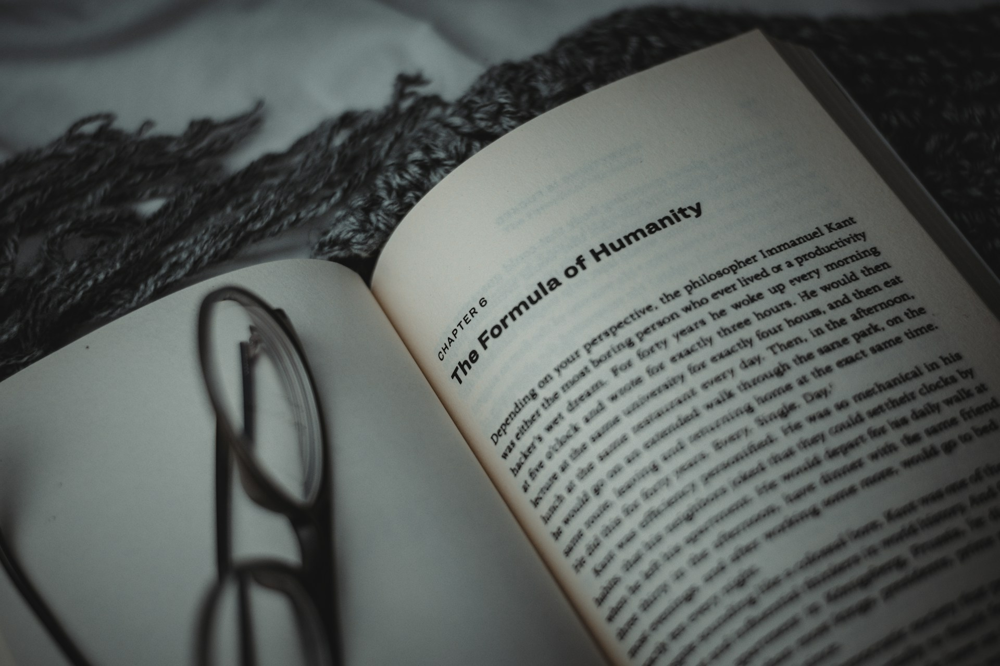

# Ten Times More Human

2026-05-27

## The Library That No One Can Finish

When I was younger, I sometimes stood in a library or bookstore and felt a strange mixture of wonder and defeat. The shelves seemed generous, almost sacred, but they also carried a quiet accusation. One life would never be enough. I could read one book, then another, then another, but the rows would remain. The more I learned, the more the unread world expanded around me.

This feeling was not limited to physical books. The internet intensified it. Wikipedia alone could make a person feel both blessed and overwhelmed. One article led to another, then to another, then to an entire field of history, science, religion, politics, language, philosophy, and biography. It was possible to begin with one simple question and end up facing the totality of human knowledge, or at least the illusion of it.

Languages created another form of this pressure. To know another language is to enter another world. It is not merely a matter of vocabulary and grammar. A language carries emotional habits, cultural memories, social expectations, humor, shame, beauty, and forms of silence. Yet most of us can master only a few languages at best. Behind every language we do not know, there are books we cannot read, jokes we cannot feel, prayers we cannot hear, and histories we can only approach from a distance.

For a person who cares about knowledge, this can become painful. Intellectual curiosity is a gift, but it can also become a source of restlessness. The world is too large. The archive is too deep. The library keeps growing. The books continue to arrive faster than we can read them. The articles, lectures, papers, videos, newsletters, and podcasts multiply without mercy.

The modern knowledge worker has often lived under this silent pressure. Have I read enough? Have I understood enough? Have I kept up with my field? Have I learned the new tools? Have I followed the latest debate? Have I written enough to prove that I am still thinking? Have I produced something worthy of the knowledge I have received?

This pressure is not entirely unhealthy. It can push us to remain awake. It can prevent arrogance. It can remind us that the world is wider than our own small habits of thought. But when it becomes purely quantitative, it begins to damage the soul of learning. Knowledge becomes a race. Reading becomes a scoreboard. Writing becomes proof of output. Even curiosity becomes another form of work.

For much of modern intellectual life, we have confused abundance with obligation. Because more information is available, we feel we must absorb more. Because more platforms exist, we feel we must publish more. Because more people are speaking, we feel we must respond more quickly. The result is not always wisdom. Often, it is fatigue disguised as sophistication.

This is the old anxiety of the library. It is the fear that one life is too small for the world.

## The False Promise of Ten Times More Output

In the age of artificial intelligence, a new promise has entered public conversation: productivity can increase dramatically. Some say ten times. The phrase is attractive because it captures the scale of change. AI can draft, summarize, translate, compare, classify, search, code, analyze, and organize at speeds that would have seemed impossible only a short time ago.

This promise is already entering politics, government, business, research, education, and administration. In Japan, Takahiro Anno, an AI engineer and young political figure associated with Team Mirai, has spoken about how AI could make the work of politics and lawmaking much faster. The basic idea is not hard to understand. Legislative work involves enormous amounts of reading, comparison, drafting, negotiation, and revision. Bureaucratic systems involve even more layers of procedure. If AI can reduce the time needed for these tasks, then institutions should not continue hiding behind the old excuse of slowness.

There is truth in this. Government offices, public institutions, universities, corporations, and large organizations have often become trapped in procedural heaviness. A document waits for review. A report waits for formatting. A policy waits for comparison. A meeting waits for minutes. A translation waits for availability. A decision waits for a summary that someone is too busy to prepare. Over time, the institution begins to confuse delay with seriousness.

AI can challenge that culture. It can make certain forms of slowness harder to defend. If a tool can summarize a hundred pages in minutes, then people can no longer claim that the first stage of comprehension must take weeks. If a system can compare policy language across countries, then early research should not remain trapped in manual copying. If an assistant can create a draft structure, then the blank page should not paralyze an entire team.

In this sense, ten times productivity has real force. It is not only a slogan. It points toward a genuine transformation of institutional work. Many processes that once required heavy coordination can be shortened. Many tasks that once consumed human attention can be handled by machines. Many people who were buried under repetitive work can finally look up and think.

But there is a danger in the phrase. If ten times productivity is understood only as ten times more output, AI will not liberate us. It will deepen the sickness. We will have ten times more reports that nobody reads, ten times more posts that nobody remembers, ten times more policies that nobody understands, and ten times more corporate language that says almost nothing.

The problem is not speed itself. The problem is speed without judgment.

A faster bureaucracy can still be a foolish bureaucracy. A faster company can still produce shallow strategy. A faster writer can still generate empty words. A faster executive can still avoid real thought. A faster researcher can still confuse synthesis with understanding. Speed is powerful only when it serves a higher human purpose.

This is why the meaning of productivity must be redefined. In the AI era, productivity should not mean merely increasing visible output. It should mean increasing our capacity to convert experience, reading, conversation, data, and reflection into meaningful thought and responsible action.

If AI only helps us produce more, it may become another engine of noise. If it helps us think better, choose better, and spend attention more wisely, then it becomes something far more valuable.

## The Two Labors AI Can Change

AI can change human work in at least two ways. The first is obvious. It can handle repetitive, administrative, and dehumanized activities. These are the tasks that consume time without requiring the full presence of the human person.

Much of modern knowledge work is filled with such tasks. We reformat documents. We summarize meetings. We extract action items. We compare versions. We prepare slides. We draft emails. We classify information. We search across old records. We translate routine text. We clean tables. We create summaries for people who may or may not read them carefully.

These tasks are not meaningless. Many are necessary. Institutions cannot function without them. But they often consume a disproportionate amount of energy. They fragment attention. They turn skilled people into processors of administrative residue. They create the feeling of being busy without the satisfaction of having thought deeply.

AI can reduce this burden. It can become a tireless assistant for the first pass. It can collect, arrange, compare, and prepare. It can take the scattered materials of a working day and organize them into a shape that human beings can then judge. It can remove some of the friction that has made work slow, not because the work required wisdom, but because the system required too much handling.

This is the first labor AI can change: the labor of maintenance.

But there is a second labor, and it is more important. AI can also change the quality of our spare time. It can help us use recovered time not merely for rest, but for richer forms of attention.

This point is often misunderstood. Some people imagine that AI is about laziness. If machines can do more, perhaps humans can do less. There is some truth in this if we are speaking about tedious work. It is good if people do less of what drains them unnecessarily. It is good if human beings are freed from mechanical burdens that do not require their full humanity.

But the deeper purpose is not laziness. The deeper purpose is responsible attention.

When AI saves time, the question becomes: what will we do with that time? Will we fill it with more shallow tasks? Will we accept more meetings because the old work has become faster? Will we produce more content because production has become easier? Will we allow every saved hour to be colonized by another demand?

Or will we protect some of that time for thought?

This is where AI becomes more than a productivity tool. It becomes a partner in qualitative time. A person can bring an unclear idea into conversation with AI and slowly shape it. A writer can test a metaphor. A researcher can ask for comparisons across fields. A manager can examine the ethical consequences of a decision. A teacher can prepare questions. A reader can ask for historical context. A person in midlife can bring a half-formed reflection and see it mirrored back with structure.

This does not mean the machine has wisdom. It means the machine can support the conditions under which human wisdom may grow. It can act as a mirror, a companion, a patient respondent, and sometimes a gentle resistance. It can help us hear our own thoughts more clearly.

The saved time, then, should not become empty time. It should become quality time. It should become time for reading slowly, writing carefully, speaking honestly, and thinking with more range. AI can help us cross the ocean of quantity so that we can return to the shore of meaning.

## The Difference Between Assistance and Slop

The danger is that the same tools that support thought can also simulate it. AI makes writing easier, but that does not mean every AI-assisted text contains real thinking. We are already seeing the rise of synthetic wisdom, automated commentary, generic opinion pieces, and endless professional posts that appear intelligent but feel strangely weightless.

This is what many people call AI slop. It is not merely low-quality content. It is content without inner necessity. It is language produced because output is expected, not because thought has ripened. It is the appearance of reflection without the discipline of reflection.

The danger is especially strong for executives, evangelists, consultants, public speakers, researchers, professors, and company leaders. These people are often expected to have opinions. They are asked to publish statements, provide comments, appear thoughtful, maintain visibility, and represent institutional intelligence. In the past, many relied on PR teams, ghostwriters, or communication staff. That was understandable to some degree, especially when schedules were full and writing required significant time.

But the AI era changes the excuse. If a leader is surrounded by intelligent tools, if drafts can be prepared quickly, if notes can be converted into essays, if conversations can become outlines, and if rough thoughts can be refined into readable form, then the claim of having no time becomes less convincing. The issue is no longer only time. It is whether the person is actually thinking.

This does not mean every leader must write everything alone. Collaboration still matters. Editors still matter. Skilled communicators still matter. A good editor can clarify, challenge, and improve a text. But there is a difference between editorial support and the outsourcing of thought. There is a difference between polishing a person’s real idea and manufacturing an idea on their behalf.

AI makes this distinction more urgent.

A person can now generate a polished article in minutes. A resume can be rewritten beautifully. A professional profile can be inflated. A public comment can be made smooth and confident. But polish is no longer rare. Fluency is no longer proof. The question is whether there is continuity behind the words.

This is why personal archives will become more important. A single article can be artificial. A resume can be dressed up. A profile can be staged. But a body of work across three years, five years, or ten years is much harder to fake overnight. It shows what someone has returned to repeatedly. It reveals recurring questions, changing views, intellectual courage, taste, discipline, and care.

For knowledge workers, this is a serious matter. If a person claims to live by ideas, there should be some durable trace of that life. It may be a public blog, a private notebook, a research archive, a collection of essays, a repository, a newsletter, teaching materials, or carefully written internal memos. Not everyone needs to become a public intellectual. Not everyone needs to publish constantly. But a life of thought should leave some evidence of attention.

AI-assisted authorship is not the same as AI-generated slop. In genuine AI-assisted writing, the human remains responsible for the question, the direction, the lived experience, the judgment, the tone, the final meaning, and the moral weight of the text. AI may help organize and refine, but the person must still bring the life behind the words.

The future will not reward mere content. It will reward credible continuity. It will reward people whose writing shows that they have been living with questions, not merely producing answers.

## The Recovery of Slowness

Here we reach the paradox. AI is often presented as a technology of speed, but its deepest gift may be the recovery of slowness.

This may sound strange at first. The public language around AI is full of acceleration. Faster work. Faster coding. Faster research. Faster documents. Faster decisions. Faster organizations. Faster lawmaking. Faster everything. The promise of ten times productivity seems to belong entirely to the world of speed.

But speed is not the whole story. If AI can absorb part of the quantitative burden, then human beings may finally regain the freedom to be slow where slowness matters.

This is especially meaningful at midlife and beyond. When one is young, it is natural to chase breadth. One wants to read widely, learn languages, master skills, explore disciplines, and gather experiences. There is beauty in that hunger. It belongs to the season of expansion. But as life continues, another question begins to appear. If a human life is limited, and if perhaps half of it has already passed, what deserves the remaining attention?

This question is not sad. It can be clarifying. It releases us from the fantasy of total coverage. We do not need to read every book. We do not need to master every language. We do not need to follow every debate. We do not need to publish on every topic. We do not need to defeat the library.

The question becomes more intimate: what is mine to understand?

AI can help us approach knowledge without being crushed by its scale. It can summarize books we may not be able to read fully. It can introduce us to languages we may never master. It can compare traditions, explain contexts, and help us find paths through overwhelming material. It can act as a bridge toward worlds that once felt unreachable.

But crossing a bridge is not the same as inhabiting a place. AI can help us enter, but it cannot decide what deserves our devotion. That decision belongs to the human person.

Slowness, in this sense, is not laziness. It is not disengagement. It is not anti-intellectual. It is a mature form of attention. It is the slowness of a reader who returns to a paragraph because it matters. It is the slowness of a writer who lets an idea sit before forcing it into words. It is the slowness of prayer, craft, gardening, conversation, and care. It is the slowness of someone who has stopped confusing movement with growth.

Modern knowledge culture often treats slowness as failure. If you are slow, perhaps you are inefficient. If you are quiet, perhaps you are not contributing. If you do not post often, perhaps you have no ideas. If you take time to think, perhaps you are falling behind.

AI gives us a chance to reject this misunderstanding. It can be fast on our behalf so that we do not have to be fast in every part of ourselves. It can carry some of the mechanical speed, while we preserve the human rhythm of reflection.

The old question was, how much can I absorb before I die?

The better question is, what deserves my slow attention now?

This is not a retreat from productivity. It is a higher form of productivity. A slow mind is not an inactive mind. It may be the only mind capable of turning information into wisdom.

## The Personal Archive as a Form of Faithfulness

If AI allows us to recover slowness, then writing becomes more important, not less. But the purpose of writing changes. It is no longer mainly about proving that one is busy, visible, informed, or clever. It becomes a way of preserving attention.

A personal archive is not merely a collection of outputs. It is a record of what a person has cared about over time. It shows the movement of thought. It shows the questions that would not leave. It shows the books that mattered, the events that disturbed, the memories that returned, the contradictions that demanded patience, and the beliefs that slowly changed.

This is why a blog, essay collection, or personal knowledge system can become deeply meaningful. It is not only a platform. It is not only a professional signal. It is a place where thought becomes durable. It allows the self to leave traces, not for vanity, but for continuity.

In the AI era, this kind of continuity will matter more than ever. When language can be generated easily, the value of a single polished text declines. But the value of a long record increases. A person who has written thoughtfully over many years shows something that cannot be produced instantly. The archive becomes evidence of commitment.

For job seekers, this may become more important than the traditional resume. A resume can still be useful, but it is no longer enough. AI can help anyone create a clean, impressive, well-phrased profile. It can strengthen weak descriptions and make ordinary experience sound strategic. But it cannot instantly create years of lived intellectual effort.

A personal body of work reveals what a resume cannot. It shows how a person thinks when no one has assigned the task. It shows what they notice without being instructed. It shows whether curiosity is a habit or a performance. It shows whether they can sustain attention beyond short-term incentives.

For executives and thought leaders, the same principle applies. A title is not thought. Visibility is not thought. A ghostwritten article is not necessarily thought. A conference appearance is not necessarily thought. The true question is whether there is a living mind behind the role.

This does not require everyone to write in the same way. Some people write short reflections. Some write long essays. Some maintain research notes. Some publish technical explanations. Some keep private journals. Some teach. Some create diagrams, code, or field reports. The form can vary. What matters is the presence of a serious relationship with thought.

A personal archive is a form of faithfulness. It says: I have been paying attention. I have been trying to understand. I have allowed my life to converse with the world. I have not merely consumed information. I have responded to it.

AI can support this practice beautifully. It can help organize scattered notes, refine rough drafts, translate ideas across languages, suggest structure, and hold a conversation long enough for a thought to become clear. But the archive must still be human. It must carry memory, judgment, vulnerability, and care.

The point is not to become a content machine. The point is to become someone whose thinking leaves a trace.

## Ten Times More Human

The phrase “ten times more productive” will continue to attract attention. It is dramatic, simple, and useful. It captures something real about the AI era. Institutions can become faster. Bureaucracies can become lighter. Knowledge workers can produce more clearly and more frequently. Writers can overcome friction. Researchers can cross boundaries. Leaders can no longer hide so easily behind busyness.

But the phrase is incomplete unless we ask what productivity is for.

If productivity only means more output, then AI may intensify some of the worst habits of modern life. It may produce more noise, more shallow commentary, more automated authority, more synthetic wisdom, and more exhausted people pretending to be efficient. It may allow institutions to move faster without becoming wiser. It may allow individuals to publish more without becoming more thoughtful.

The better promise is different. AI can help us become ten times more human.

This does not mean more emotional, more expressive, or more sentimental. It means more capable of spending human attention where it belongs. It means letting machines handle what is repetitive, mechanical, and draining, while human beings return to judgment, meaning, care, responsibility, and reflection.

It means that the knowledge worker no longer needs to live under the constant panic of quantity. The library remains infinite, but it is no longer an enemy. The languages remain many, but they are no longer sealed worlds. The archive remains vast, but AI can help us approach it. We can stop asking whether we can consume everything and begin asking what we are called to understand.

It also means that writing becomes a more honest practice. Not faster posting for its own sake. Not AI slop. Not synthetic thought leadership. Not polished emptiness. Writing becomes a way of letting one’s life meet knowledge slowly and responsibly. It becomes evidence not of performance, but of attention.

A person who writes with AI is not necessarily less authentic. That depends on how the tool is used. If AI replaces the inner life, the result is hollow. If AI supports the inner life, the result may become more honest, more structured, and more generous. The human being still has to choose the question. The human being still has to recognize what is true. The human being still has to decide what should be said and what should remain unsaid.

Perhaps this is one of the most fortunate aspects of our time. AI does not free us from thought. It frees us from some of the panic around thought. It helps carry the weight of quantity so that we may return to quality. It allows us to stop believing that intellectual life is a race against the shelf, the database, the news feed, or the calendar.

We do not need to master everything. We do not need to read the whole library. We do not need to publish endlessly to prove that we are alive. We need to remain faithful to the questions that have been given to us. We need to cultivate the courage to think slowly in a fast age. We need to leave behind traces of attention that are honest enough to outlast the noise.

That may be the real meaning of becoming ten times more productive.

Not ten times more content.

Not ten times more speed.

Not ten times more visible busyness.

Ten times more capacity to turn knowledge into wisdom.

Ten times more freedom to choose what matters.

Ten times more responsibility for the words we place into the world.

Ten times more human.

Photo by [Mostafa (Mfnctn)](https://unsplash.com/@bymostafasaeed?utm_source=unsplash&utm_medium=referral&utm_content=creditCopyText) on [Unsplash](https://unsplash.com/photos/an-open-book-with-a-pair-of-glasses-on-top-of-it-C5bfW8KQprM?utm_source=unsplash&utm_medium=referral&utm_content=creditCopyText)