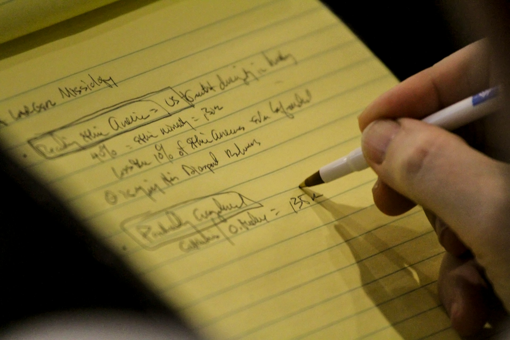

# The Two Stages of Writing

026-06-09

## Before the Document

Long before I owned a computer, writing began on paper. Not good paper, either. More often it was a yellow pad, a loose sheet, the back of a printed document, or whatever happened to be nearby when an idea appeared. The purpose was never beauty. It was capture. Those pages were messy, but their messiness was part of their value. Sentences crossed each other. Arrows pointed in every direction. Entire sections were scratched out and replaced. Half-formed thoughts sat beside complete paragraphs. The page functioned less as a document and more as a workspace for the mind.

There was a freedom in that process because a blank sheet of paper made almost no demands. It did not care about margins, fonts, citation styles, or page numbers. It asked only one thing: write down what you are thinking before it disappears. In that sense, paper gave the mind permission to move before it was judged. It allowed thought to arrive in its unfinished state, without requiring it to appear respectable too soon.

Once the draft felt complete, a different phase began. The handwritten pages would be copied into a typewriter. In those days, that was simply how writing worked. The rough draft and the finished manuscript were not the same thing. One existed to generate ideas. The other existed to communicate them. As technology evolved, manual typewriters gave way to electric typewriters. Electric typewriters gave way to word processors. Word processors gave way to personal computers. Eventually, applications such as Microsoft Word became the standard environment for professional writing.

Looking back, it is easy to focus on the changing tools, but the deeper pattern remained remarkably stable. Writing always seemed to unfold in two stages. First came the creation of ideas. Then came their presentation. The technologies changed, but the rhythm remained.

## The Sanctuary of the Rough Draft

Many people assume that writing is a single activity. In practice, it often consists of two very different mental states. The first state is exploratory. This is the stage where thoughts emerge before they are fully understood. Questions appear before answers. Connections form between ideas that initially seem unrelated. Fragments accumulate until a larger pattern begins to reveal itself. The writer is not yet trying to impress anyone. The writer is trying to listen.

The second state is evaluative. Now the writer becomes an editor. Sentences are refined. Arguments are reorganized. Weak passages are strengthened. Structure becomes important. Presentation becomes important. Both states are necessary, but they do not always coexist peacefully. When the editorial mind arrives too early, it can interrupt the creative process. A writer begins worrying about correctness before discovering what needs to be said. Attention shifts from exploration to judgment, and the flow of thought slows.

This is one reason why rough drafting environments have remained valuable across generations. Some people use notebooks. Some use index cards. Some use journals. Others use simple text editors. The specific medium matters less than the psychological function it serves. A rough draft creates a temporary space where ideas can exist without immediately being evaluated. That space is surprisingly precious because many of the most important insights emerge not from polished documents but from informal notes. The notebook often knows things before the manuscript does.

## When Formatting Became Part of the Job

Computers transformed writing in profound ways. Editing became easier. Revisions became faster. Documents became more portable. Collaboration became more efficient. These changes were genuine improvements, and it would be difficult to imagine modern professional life without them. Yet at the same time, something else happened. Writers gradually inherited responsibilities that had previously belonged to other people.

In earlier generations, there was often a clearer separation between writing and production. Secretaries, typists, editors, and publishing staff handled many aspects of presentation. The author focused primarily on content. Modern software placed many of those responsibilities directly into the writer’s hands. This brought obvious advantages because it gave individuals greater control over their work. Yet it also introduced new forms of labor.

Writers became responsible for formatting styles, page layouts, heading structures, image placement, references, tables, captions, and countless other details. Many professionals now spend substantial amounts of time managing documents rather than developing ideas. Anyone who has struggled with a stubborn page break in a report or a formatting issue in a collaborative document understands this experience. The irony is that computers were supposed to make writing easier. In many respects they did, but they also expanded the amount of attention devoted to presentation.

The result was a subtle shift. The document itself began to dominate the writing process. People often found themselves thinking about formatting while they were still trying to think. The space of creation and the space of presentation, once relatively separate, became fused inside the same application. This fusion made many things more convenient, but it also made writing feel heavier than it needed to be.

## The Return of Simplicity

This helps explain the enduring appeal of plain text. Over the past decade, many writers, researchers, programmers, and knowledge workers have returned to simpler environments. Markdown, text editors, note-taking applications, and lightweight writing tools have gained devoted followings. At first glance, this seems counterintuitive. Why move backward when modern software offers so many features? The answer becomes clearer after spending time in both worlds.

Simple tools reduce cognitive noise. When writing in plain text, there are fewer decisions competing for attention. The screen contains words rather than formatting controls. The writer interacts primarily with ideas rather than presentation. In this sense, Markdown resembles the yellow pads of earlier decades. Neither exists to impress. Neither exists to publish. Both exist to think.

The attraction is not nostalgia. It is efficiency of attention. A lightweight document can be created instantly. Hundreds or thousands of notes can be managed with minimal overhead. Ideas remain portable across platforms and applications. Most importantly, the writer remains close to the content itself. The focus returns to language, structure, and meaning. What initially appears technologically primitive often turns out to be cognitively sophisticated.

Simple tools survive because they protect attention. They remind us that writing does not begin as a finished object. It begins as movement, inquiry, and discovery. Before writing becomes something to submit, publish, archive, or send, it is a way of finding out what one actually thinks.

## AI and the New Typist

The emergence of generative AI introduces an unexpected development. Many discussions about AI focus on replacement. People ask whether AI will replace writers, researchers, teachers, or other knowledge workers. The more interesting question may be different. What if AI primarily changes the relationship between drafting and publishing?

Historically, many writers moved from handwritten notes to typed manuscripts through the assistance of another person. A typist transformed rough material into a cleaner form. An editor improved clarity. A secretary prepared correspondence for distribution. These roles occupied the space between thought and publication. They did not necessarily originate the ideas, but they helped those ideas travel into the world.

AI increasingly operates within that same space. A writer can draft ideas in plain text, Markdown, a notebook, or a note-taking application. Once the content is complete, AI can help refine language, organize structure, standardize formatting, generate summaries, create tables, and prepare professional documents. The writer remains responsible for the ideas. The machine assists with transformation.

This distinction is important. The most valuable contribution of AI may not be generating content from nothing. It may be reducing the friction between rough thought and polished presentation. For many people, this changes the economics of writing. Previously, creating a professional report required both intellectual effort and significant formatting effort. Now much of the latter can be automated. The final deliverable may still be a Word document or a PDF, but the path toward that deliverable becomes lighter.

This is why AI can feel less like a replacement for the writer and more like the return of the typist, the assistant, or the production layer. It occupies the middle space between the living draft and the formal artifact. It allows the writer to remain closer to the work of thinking while still meeting the expectations of institutions, readers, clients, journals, or colleagues.

## Recovering an Older Pattern

Seen from this perspective, AI appears less revolutionary than many assume. In some ways, it restores an older pattern that modern software had obscured. For centuries, thinkers separated invention from publication. Philosophers filled notebooks. Scientists maintained journals. Authors drafted manuscripts by hand. Ideas matured through multiple stages before reaching the public.

The rise of powerful desktop software encouraged people to merge these stages into a single environment. Thinking, editing, formatting, and publishing increasingly occurred inside the same application. AI allows those stages to separate again. The writer can return to a simpler workspace focused on thought, while presentation becomes a later concern. This is not a rejection of professional documents. Institutions still depend on them. Universities still require them. Businesses still archive them. Journals still publish them.

The difference lies in where attention is directed. The document becomes the destination rather than the workspace. The polished report remains important, but it no longer needs to dominate the entire creative process. This may be one of the quiet gifts of AI. It gives us permission to think first and format later.

## The Shape Beneath the Tools

Word processors will continue to exist. PDFs will continue to circulate. Organizations will continue to depend upon standardized formats that preserve continuity across years and decades. Those requirements are unlikely to disappear because institutions need stable artifacts. A company, university, government office, or journal cannot operate only through fragments of thought. It needs documents that can be submitted, stored, reviewed, signed, cited, and retrieved.

Yet beneath those familiar artifacts, something subtle is changing. Many people are discovering that the most productive writing environment is not necessarily the most feature-rich one. It is often the one that allows ideas to emerge with the least resistance. A yellow pad served that purpose. A notebook served that purpose. A plain text file serves that purpose. The forms differ, but the function remains remarkably consistent.

Looking back, I realize that my current workflow is not as modern as it first appears. I draft in simple formats. I let ideas develop before worrying about presentation. When the content is ready, I use AI to help transform it into the form required by readers, colleagues, institutions, or publications. The tools are different from those I used decades ago, but the process is not.

Writing still unfolds in two stages. First we discover what we want to say. Then we prepare it for the world.

Photo by [Mick Haupt](https://unsplash.com/@rocinante_11?utm_source=unsplash&utm_medium=referral&utm_content=creditCopyText) on [Unsplash](https://unsplash.com/photos/person-holding-white-and-black-pen-writing-on-yellow-paper-dtTu8Ec_uAU?utm_source=unsplash&utm_medium=referral&utm_content=creditCopyText)