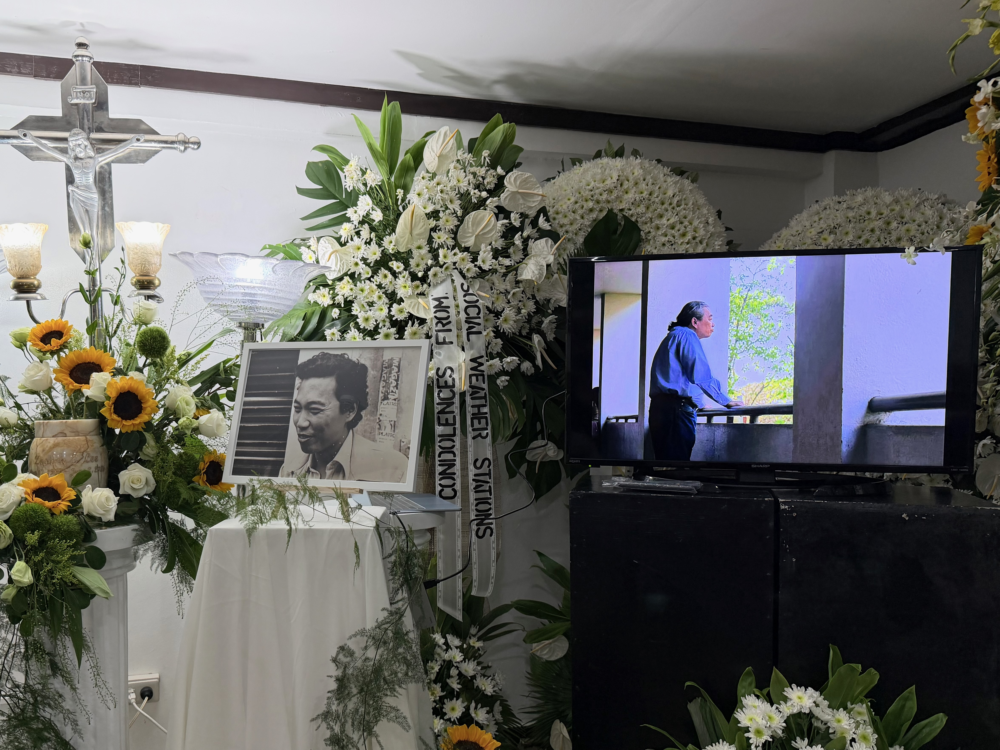

# The Question Behind the Question

2026-06-11

Remembering Dr. Lee, Kant, and the Attitude of Philosophizing

## A Teacher Who Remains in the Question

The passing of a teacher often makes us return not only to what we learned, but to how we learned to think. In my case, the recent passing of [Dr. Zosimo Lee](https://upd.edu.ph/zosimo-e-lee-1952-2026/), my PhD dissertation advisor and lifelong mentor, has led me back to the philosophical questions that shaped my intellectual formation. Among those questions, one has become especially present: what does it mean to philosophize?

Dr. Lee taught many thinkers, but what I remember most is not merely the content of those thinkers. It is the attitude with which he approached them. In his classes, philosophy was not treated as a museum of theories or a sequence of famous names. It was a living discipline of inquiry. A philosopher was not simply someone who knew what Kant, Russell, Wittgenstein, Dōgen, Nishida, Derrida, or Foucault had said. A philosopher was someone who had learned how to examine the act of questioning itself.

This point may sound simple, but it is not. Much of ordinary thinking moves too quickly toward answers. We ask whether a belief is true, whether a doctrine is useful, whether a moral position is right, or whether a worldview is defensible. These are important questions. Yet philosophy often begins one step earlier. It asks what kind of question is being asked. It asks what assumptions are already contained within the question. It asks whether the question has been framed in a way that allows truth to appear, or whether it has already narrowed the field before thinking has begun.

This is what I understand by the attitude of philosophizing. It is not a posture of doubt for its own sake. It is not intellectual performance. It is the disciplined habit of returning to the condition of inquiry itself. Before we claim to know, we ask how knowing is possible. Before we defend belief, we ask what kind of truth belief seeks. Before we argue about morality, God, freedom, history, or human meaning, we ask what kind of question each of these truly is.

In this sense, philosophy is self-referential by nature. It is an inquiry into inquiry. It does not merely examine objects in the world. It examines the human act of seeking, judging, interpreting, and understanding. This is why philosophy can never be reduced to information. Information gives us something to know. Philosophy asks what it means to know at all.

This attitude has deep roots in the ancient Socratic tradition. The command to “know thyself” is not a call to self-absorption. It is a demand for intellectual and moral honesty. Socrates did not simply ask people what they believed. He asked whether they understood what they meant by their own words. What is justice? What is virtue? What is courage? What is the good? These questions were not abstract games. They were ways of exposing the hidden confusion beneath confident speech.

Yet in modern philosophy, this Socratic demand takes on a new form through Immanuel Kant. If Socrates teaches us to examine ourselves, Kant teaches us to examine the conditions under which anything can appear to us as knowledge, experience, or moral obligation. He does not merely ask what reality is. He asks how reality becomes available to a finite human knower. He does not merely ask what reason can conclude. He asks what reason is entitled to claim.

This is why I find myself returning to Kant as I remember Dr. Lee. The connection is not merely historical or academic. Kant represents one of the great expansions of the attitude of philosophizing. He shows that philosophy must not only ask questions about the world, God, morality, or freedom. It must also ask about the limits, structures, and responsibilities of the questioning mind itself.

The loss of a teacher can easily become only an occasion for personal memory. But it can also become an invitation to return to the discipline that teacher embodied. In remembering Dr. Lee, I am reminded that philosophy begins not with the possession of answers, but with the purification of questions. A teacher remains present when the student continues to ask more carefully, more honestly, and more deeply than before.

## The Discipline of Asking Better Questions

To philosophize is not simply to ask many questions. Anyone can ask questions. Children ask questions with freshness. Skeptics ask questions with suspicion. Critics ask questions with sharpness. Philosophy includes all of these energies, but it also requires something more disciplined. It asks us to examine the quality of the question itself.

A poor question can trap thought before it begins. It can force reality into a narrow frame. It can demand the wrong kind of answer from the wrong kind of subject. When someone asks whether love can be measured in kilograms, the problem is not that we lack sufficient instruments. The problem is that the question misunderstands what love is. When someone asks whether God can be proven in the same way that we prove the existence of a chemical compound, the question may already have reduced God to an object within the world. When someone asks whether morality is merely a matter of preference or an absolute command imposed from outside, the alternatives may already be too crude.

This is why the question behind the question matters. Philosophy asks what has already been assumed before the discussion begins. It asks whether the terms have been clarified, whether the object of inquiry has been properly understood, and whether the method being used is appropriate to the matter being examined. In this sense, philosophy is not a slower version of ordinary debate. It is a transformation of the debate itself.

Socrates remains the great ancient image of this transformation. He did not begin by offering a system. He began by interrupting confidence. In the dialogues, people believe they know what justice, virtue, courage, piety, or wisdom mean. Socrates does not immediately deny them. He asks them to explain themselves. The movement is simple, but the effect is profound. The person who begins with confidence often discovers confusion. The question has not been understood as well as the answer has been defended.

The Socratic command to know oneself is often misunderstood as a psychological invitation. It can sound like a call to introspection, as if the self were an inner room to be explored. There is some truth in that, but the philosophical meaning is stronger. To know oneself is to recognize the limits, motives, assumptions, and contradictions that shape one’s own thinking. It is to become responsible for one’s own claims. It is to discover that ignorance is not merely the absence of information. Ignorance can also take the form of false certainty.

This Socratic inheritance is not opposed to faith, morality, or tradition. In fact, it may be necessary for them. A faith that refuses questioning easily becomes defensive. A morality that refuses examination can become self-righteous. A tradition that cannot distinguish between its living truth and its historical habits may become rigid. Philosophy does not destroy these things by questioning them. It helps purify them by asking what they truly mean.

This is one reason I have never felt that philosophy and Christian faith must be enemies. Philosophy does not require faith to become less serious. It asks faith to become more honest. It asks what kind of truth faith seeks, what kind of knowledge it claims, and what kind of life it forms. If faith is reduced to an argument that tries to compete with scientific explanation, it may lose its own depth. If faith refuses reason entirely, it risks becoming sentiment or authority without reflection. The philosophical attitude helps faith avoid both reductions.

Here, the connection to Kant begins to appear. Kant inherits the Socratic impulse, but he redirects it toward the structure of human reason itself. Socrates asks the speaker to examine the meaning of his claims. Kant asks reason to examine the conditions and limits of its own authority. The question is no longer only, “Do you know what you mean?” It becomes, “What makes knowledge possible, and what are the boundaries beyond which reason loses its proper ground?”

This shift is one of the great changes in modern philosophy. The question is no longer only about the objects we seek to know. It is also about the subject who seeks to know them. We do not encounter reality from a neutral position outside all conditions. We encounter it as finite beings, through perception, understanding, language, history, embodiment, and moral responsibility. To ignore this is not to become more objective. It is to mistake our own standpoint for no standpoint at all.

The attitude of philosophizing therefore requires humility, but not weakness. It does not say that truth is impossible. It does not say that every view is equal. It says that truth must be sought with an awareness of the conditions under which we seek it. This is a more demanding position than either dogmatism or relativism. Dogmatism claims too much too quickly. Relativism gives up too easily. Philosophy asks us to remain in the harder space between possession and surrender.

This harder space is where serious thought begins. It is also where a teacher’s influence becomes most visible. A teacher does not merely hand down conclusions. A true teacher trains the student to become uncomfortable with shallow questions, careless assumptions, and easy victories. The student learns to pause before answering, not out of hesitation, but out of respect for the matter being asked.

That pause is not empty. It is the beginning of philosophical responsibility. It is the moment when one asks whether the question is worthy of the answer it seeks. It is the moment when inherited beliefs, modern doubts, religious commitments, moral intuitions, and intellectual ambitions are brought under examination. It is also the moment when Kant becomes unavoidable, because Kant made this pause into a central task of modern thought.

## Kant and the Limits That Make Thought Possible

Kant becomes unavoidable because he changed the direction of philosophical questioning. He did not merely ask what reality is, what the soul is, what God is, or what morality is. He asked what must already be true of the human mind for anything to appear to us as reality, experience, knowledge, or moral obligation. This was not a small adjustment within philosophy. It was a change in the position from which philosophy speaks.

Before Kant, many philosophical debates assumed that the mind could look outward and describe reality as it is. The task was to determine which description was correct. Rationalists trusted the power of reason to reach necessary truths. Empiricists emphasized experience, sensation, and observation. Kant did not simply choose one side over the other. He asked how experience itself is possible, and how reason can have legitimate authority without pretending to possess what lies beyond its reach.

This is why Kant’s project remains so important. He teaches us that knowing is not passive reception. The mind does not merely receive the world as wax receives an impression. Human experience is structured. What appears to us as a world already appears within certain forms and conditions. Space and time are not simply objects we find among other objects. They are forms through which objects can appear to us at all. Causality is not merely one repeated pattern among many. It is one of the ways the understanding organizes experience into intelligible order.

This does not mean that each individual invents reality according to private preference. Kant is not saying that the world is whatever we imagine it to be. His point is more subtle and more powerful. The world we know is objective for us because it is structured according to conditions that make shared human experience possible. We do not live in isolated fantasies. We inhabit a common world of phenomena, a world that can be investigated, tested, communicated, and debated. Yet this objectivity remains human objectivity. It is not the view from nowhere.

Here Kant gives us a way to understand both the dignity and the limitation of human knowledge. We are not trapped in shallow subjectivity. Science, common experience, and rational inquiry are real and valid. At the same time, we do not possess absolute access to things as they are in themselves. We know the world as it appears within the conditions of possible experience. We do not know reality from the standpoint of God.

This distinction between phenomena and things-in-themselves is often misunderstood. It does not mean that the world of experience is unreal. It means that experience is always experience as it is available to finite human beings. There is reality, but our access to it is mediated by the structures through which we perceive, understand, and judge. To forget this is to mistake the human standpoint for an unlimited standpoint.

This point becomes easier to grasp when we consider other forms of life. The world as it appears to a bat, a dog, an octopus, or an insect is not the same as the world as it appears to us. Their sensory structures open different worlds of relevance. Their forms of perception do not merely add details to our world. They disclose reality according to different capacities. If there were intelligent beings elsewhere in the universe, their experience of time, space, matter, life, or relation might be different from ours in ways we cannot easily imagine.

Such examples do not prove Kant’s system, but they help us feel the force of his question. The world that appears is always correlated with the kind of being to whom it appears. To be human is not simply to stand before reality. It is to receive reality through human forms of sensibility, understanding, language, memory, imagination, and judgment. We do not need to deny reality in order to recognize the conditions of our access to it.

Kant’s idea of antinomy shows what happens when reason forgets these limits. Human reason naturally seeks completeness. It does not want partial explanations. It wants the final ground, the totality, the whole. This desire is understandable. It may even be inseparable from reason itself. Yet when reason tries to grasp the totality of the world as if it were one more object of experience, it falls into contradiction.

The question of whether the world has a beginning in time is a classic example. If we say the world had a beginning, reason immediately asks what came before that beginning. If we say the world had no beginning, reason struggles to comprehend an infinite past already completed. Both positions seem thinkable. Both also lead us into difficulty. The problem is not simply that we lack enough information. The problem is that reason is trying to treat time and the totality of the world as if they could be surveyed from outside.

A similar difficulty appears when we think about space. If the world has a spatial limit, what lies beyond the boundary? If it has no limit, how can the totality of space be grasped? Reason moves toward extremes, and at those extremes it exposes its own instability. Antinomy is not a failure of intelligence. It is a revelation of the boundary between legitimate knowledge and speculative overreach.

This is why Kant’s critical philosophy is not an attack on reason. It is reason’s self-discipline. Kant does not tell us to stop thinking. He tells us to think more carefully about what kind of claim we are making. Are we speaking within the bounds of possible experience? Are we extending a concept beyond the field in which it has proper use? Are we mistaking a necessary idea of reason for an object we can know?

This self-discipline is especially important when we discuss God, freedom, the soul, morality, or the meaning of history. These are not trivial questions. They are among the most important questions human beings ask. Yet their importance does not allow us to treat them carelessly. If anything, their importance requires greater precision. Kant helps us see that the deepest questions may not be answerable in the same way empirical questions are answerable. They may require another mode of reflection.

This is where Kant’s importance for modern philosophy becomes clear. He does not simply draw a boundary and leave us in silence. He shows that the boundary itself is meaningful. To know the limits of knowledge is already to know something profound about the human condition. We are beings who seek the unconditioned while living within conditions. We desire totality while experiencing only from within. We ask questions that exceed the world of objects, yet we cannot answer them by pretending to stand outside our finitude.

This tension is not a defect to be eliminated. It is part of the structure of human thought. We are finite, but we are not merely finite. We are limited, yet we can recognize our limitation. We cannot know everything, yet we can ask why knowledge has limits. We cannot possess reality absolutely, yet we can pursue truth responsibly. This is the space Kant opened for modern philosophy.

It is also the space in which the attitude of philosophizing becomes more than intellectual curiosity. To philosophize after Kant is to ask questions with an awareness of the conditions that make questioning possible. It is to refuse both naive certainty and careless skepticism. It is to honor the power of reason without turning reason into an idol. It is to accept limitation without surrendering to meaninglessness.

For this reason, Kant remains one of the great teachers of philosophical humility. His humility is not anti-intellectual. It is demanding. It requires us to examine our claims, refine our concepts, and resist the temptation to confuse mystery with ignorance or speculation with knowledge. He reminds us that a boundary is not merely a wall. Sometimes it is the very form that allows thought to become responsible.

## Faith, Zen, and the Discipline of Mystery

The importance of Kant becomes clearer when philosophy moves from general knowledge to the questions that shape human existence most deeply. God, freedom, moral responsibility, suffering, death, and the meaning of life are not minor topics added to philosophy from the outside. They are among the reasons philosophy exists. Yet they are also the questions most easily distorted when they are forced into the wrong intellectual frame.

The question of God is a clear example. Many contemporary discussions still proceed as if the only meaningful question were whether God can be proven in the same way an empirical object can be proven. If God can be detected, measured, observed, or explained as one cause among other causes, then God is allowed into the discussion. If not, the question is dismissed as meaningless, subjective, or merely emotional.

From a Kantian perspective, this way of framing the issue is already problematic. God, in the classical theological sense, is not one object inside the world. God is not a hidden item within the universe, waiting to be found by better instruments. If God is God, then God is not a phenomenon among phenomena. To ask for empirical proof of God as if God were comparable to a physical object may already be to misunderstand the kind of question being asked.

This does not mean that the question of God becomes easy. Kant does not simply defend religion by placing God beyond criticism. He also prevents religious thought from claiming more than it can justify. We cannot possess God as an object of theoretical knowledge. We cannot stand outside human finitude and describe divine reality as if we were observing it from a neutral position. Kant limits both reductionist disbelief and careless religious certainty.

This double limitation is valuable. It helps faith avoid two opposite errors. On one side, faith can become a weak imitation of science, trying to prove God as though God were a fact among facts. On the other side, faith can become intellectually irresponsible, refusing all questioning and hiding behind authority or emotion. Kant offers another path. He allows faith to remain serious without becoming empirical possession. He allows reason to remain critical without pretending that empirical knowledge exhausts reality.

For Christianity, this is not a foreign discipline. Christian faith has always contained a sense that God cannot be reduced to an object mastered by the human mind. To believe in God is not the same as to explain God. To pray is not to control. To worship is not to possess. Even the language of revelation does not eliminate mystery. It deepens it, because what is revealed is not a concept we can contain, but a divine presence that calls for trust, humility, and transformation.

This is why philosophy can serve faith rather than weaken it. Philosophy asks faith to become more precise about its own claims. What kind of truth does faith seek? What kind of knowledge does it claim? What is the difference between belief, proof, trust, obedience, hope, and understanding? These questions do not necessarily diminish faith. They can purify it. They prevent faith from becoming a slogan, an argument, or a form of possession.

I think this is one reason I can continue to hold Christian faith while also taking philosophy seriously. Kant does not force me to choose between belief and reason as though they were enemies. Instead, he helps clarify their proper relation. Reason has its domain, dignity, and limits. Faith has its depth, risk, and responsibility. The two become confused when either one tries to occupy the whole field of human life.

Here I also think of Dr. Lee’s own practice of Zen meditation. I do not want to collapse Christianity and Zen into the same thing. They arise from different traditions, languages, disciplines, and spiritual intuitions. Yet both can be deepened by the attitude of philosophizing. Both can resist the temptation to reduce ultimate reality to an object of conceptual control.

Zen often asks us to examine the mind that grasps. Who is the self that seeks enlightenment? What is the nature of the thought that tries to possess awakening as an object? What remains when conceptual attachment loosens? These questions are not merely theoretical. They are existential and practical. They require a transformation in the way one stands before reality.

Christianity, in its own way, asks similar but distinct questions. What does it mean to stand before God? What does it mean to receive life as grace rather than possession? What does it mean to confess one’s limits, not as despair, but as openness to divine mercy? What does it mean to love, forgive, suffer, and hope under the gaze of eternity?

Kant’s contribution is not to replace these traditions. His contribution is to clarify the space in which such questions can be taken seriously. He teaches us that not all meaningful questions are empirical questions. He also teaches us that the inability to prove something empirically does not give us permission to speak about it carelessly. Mystery is not an excuse for confusion. It is an invitation to disciplined humility.

This distinction matters because modern people often confuse mystery with ignorance. If something cannot be scientifically demonstrated, it is treated as if it were merely unknown, irrational, or subjective. Yet mystery, properly understood, is not simply a gap in knowledge. A mystery may be something that exceeds the mode of knowing we are trying to apply to it. The problem is not always that we do not yet have the answer. Sometimes the problem is that we have not understood the question.

This is why the attitude of philosophizing is so important for religious life. It does not allow faith to become lazy. It does not allow skepticism to become lazy either. It asks both belief and doubt to examine themselves. What does belief believe? What does doubt doubt? What kind of certainty is being demanded? What kind of evidence is being assumed? What kind of reality is being considered?

When these prior questions are ignored, debates about God become repetitive. One side demands empirical proof. The other side offers metaphysical claims without sufficient self-examination. Both sides may become trapped in the same mistaken assumption, that the question of God must be settled in the same way we settle questions about objects in the world. Kant helps us step back from that assumption.

This does not solve the question of God. It refines it. It makes the discussion more honest. It reminds us that the deepest matters in human life require different forms of attention. A scientific question requires empirical method. A moral question requires practical reason. A religious question requires humility before transcendence, disciplined reflection, and a life capable of responding to what it claims to believe.

In this sense, Kant’s philosophy does not close the door to faith. It closes the door to bad arguments about faith. It does not make mystery vague. It protects mystery from being reduced to either superstition or measurement. It does not tell us to stop asking about God, freedom, and the soul. It teaches us to ask with greater care.

This care is perhaps where philosophy, faith, and contemplative practice meet. Each, at its best, resists the arrogance of immediate possession. Each asks the human being to undergo a conversion of attention. To think, to believe, and to meditate are different acts, but they can share a common discipline: the refusal to treat reality as something exhausted by our first concepts.

That is why remembering a teacher of philosophy can lead naturally to reflections on faith and mystery. A true teacher does not merely supply information about doctrines. A true teacher awakens the student to the seriousness of questions that cannot be answered cheaply. Dr. Lee’s philosophical attitude, his openness to traditions both Eastern and Western, and his life of reflection remind me that the deepest questions are not weakened by being difficult. They become more worthy of attention.

## The Philosophers After Kant

Kant did not end philosophy. He changed its atmosphere. After him, philosophers could still disagree with him, reject parts of his system, or move in directions he would not have accepted. Yet they could no longer think as if the human standpoint were transparent. They had to face the question he made unavoidable: from what conditions, limits, and forms of life does human understanding arise?

This is why many later philosophers can be described as post-Kantian in a broad sense, even when they are not Kantians in any strict doctrinal way. They are not simply repeating Kant. They are responding to the space he opened. Some deepen his critical discipline. Some rebel against it. Some inherit one part of it while neglecting another. Yet the shadow of Kant remains, because he relocated philosophy from the simple description of reality to the examination of the conditions under which reality can be known, interpreted, judged, or valued.

Karl Popper offers one example from the philosophy of science. Popper is not a Kantian in the full systematic sense, but his work shares a Kantian humility about knowledge. Science, for Popper, does not advance by reaching final certainty. It moves through conjectures and refutations. A scientific theory is never proven once and for all. It remains open to testing, correction, and possible falsification. This does not weaken science. It gives science its discipline.

In this sense, Popper helps modern thought avoid two opposite errors. One error is to treat science as absolute possession, as if it could deliver final and unquestionable truth about reality as a whole. The other error is to treat the absence of final certainty as a failure. Popper’s view shows that fallibility is not the enemy of rational inquiry. It is part of its strength. This is close in spirit to Kant’s critical project: reason becomes more trustworthy when it understands the limits of its own authority.

Wittgenstein moves in another direction. Kant asked about the conditions of possible experience. Wittgenstein, especially in his later philosophy, asks about the conditions of meaningful language. Meaning does not float above life as a pure abstraction. It lives in use, in practice, in forms of life. Words do not function simply by pointing to private inner objects or fixed essences. They belong to human activities, shared contexts, and learned forms of participation.

This shift from cognition to language is not identical to Kant, but it continues the critical movement. Wittgenstein teaches us to ask whether philosophical problems arise because we have misunderstood the grammar of our own language. Many confusions are not solved by adding more information. They are dissolved by seeing how our words have gone on holiday, detached from the ordinary practices that give them sense. This again returns us to the question behind the question. What are we really asking when we ask this? What kind of language are we using, and has that language misled us?

Kierkegaard brings the post-Kantian problem into the realm of existence and faith. If Kant limits the power of theoretical reason to prove God, Kierkegaard intensifies the personal and existential meaning of that limit. Faith is not the conclusion of a detached proof. It is not an item of knowledge added to the mind from the outside. Faith involves inwardness, risk, decision, anxiety, and the self’s relation to God.

For Kierkegaard, the most important truths are not always those that can be observed from a distance. Some truths must be lived. This does not mean that truth becomes arbitrary. It means that certain truths demand the whole person. In this sense, Kierkegaard helps us see why the question of God cannot be reduced to a theoretical puzzle. To ask about God is also to ask about the self who asks, the life that must respond, and the responsibility that comes with faith.

Nietzsche responds to the same modern condition with a very different energy. He sees what happens when older metaphysical certainties lose their authority. If the traditional structures of God, morality, truth, and meaning no longer command belief in the same way, what follows? Nietzsche’s answer is severe and unsettling. He exposes the hidden motives behind moral systems. He asks whether values express life or resentment, strength or weakness, honesty or self-deception.

Nietzsche is not simply a continuation of Kant. He is often a rebellion against the moral world Kant tried to defend. Yet Nietzsche’s questions become possible within the post-Kantian landscape. Once reason can no longer claim effortless access to ultimate metaphysical order, the question of value becomes urgent. Are values discovered, created, inherited, imposed, or overcome? Nietzsche presses this question with an intensity that still disturbs modern thought.

Marx and Engels must be approached through a different line. Their most direct philosophical ancestor is Hegel, and Hegel himself is one of the great responses to Kant. Kant exposed the limits and antinomies of reason. Hegel sought to overcome those oppositions through dialectical development. Marx then transformed dialectic by placing it within material conditions, labor, class, production, and historical struggle.

There is something important in this contribution. Ideas are not born in empty space. Human beings think, believe, worship, work, and organize society within concrete historical conditions. Economic structures, institutions, class relations, and material needs shape consciousness more deeply than purely abstract philosophy sometimes admits. Any serious account of human life must recognize this. Marx’s critique of ideology remains powerful because it asks whose interests are being served by a given social order and which forms of suffering are being hidden by respectable language.

Yet the danger appears when historical analysis becomes historical dogma. If one claims to know the single necessary direction of history, then philosophy can become prophecy without humility. The future becomes an idol. Human beings in the present are treated as material to be reorganized for the sake of a promised historical outcome. A theory that began as critique can harden into orthodoxy. A method meant to expose domination can become a new instrument of domination.

Here Kant’s moral philosophy offers a serious warning. Human beings must never be treated merely as means. A person is not raw material for history, ideology, nation, class, market, or revolution. Any system that sacrifices actual persons for an imagined necessity violates the dignity that Kant tried to protect. This is why Kant remains important not only for epistemology, but also for politics and ethics. He reminds us that no theory, however grand, has the right to erase the moral standing of the person.

This is also where some forms of postmodern thought become relevant. In its stronger forms, postmodernism continues the critical discipline of questioning hidden assumptions. It asks who speaks, from what position, under what structures of power, and through what inherited language. These are necessary questions, especially when societies confuse dominant perspectives with universal truth. In this sense, postmodern thought can extend the Kantian spirit by exposing the conditions under which knowledge claims are formed.

But in its weaker forms, postmodernism forgets Kant’s moral seriousness. It inherits the idea that knowledge is conditioned, but loses the idea that reason remains responsible. It recognizes that perspectives differ, but too easily concludes that truth is only perspective. It criticizes universal claims, but sometimes loses the capacity to defend universal human dignity. When this happens, the critical project collapses into relativism.

That collapse is not Kantian. Kant does not say that because knowledge has limits, truth disappears. He does not say that because the human standpoint is finite, morality becomes a matter of preference. His philosophy moves in the opposite direction. By limiting speculative reason, he tries to secure the proper dignity of practical reason. By denying our ability to know ultimate reality as an object, he does not deny moral obligation. He strengthens it.

This is why the philosophers after Kant remain so important to read together rather than separately. Popper reminds us of the fallibility of scientific knowledge. Wittgenstein reminds us of the conditions of language. Kierkegaard reminds us of inwardness and faith. Nietzsche forces us to confront the crisis of value. Marx reminds us of material conditions and social power. Postmodern thinkers remind us that knowledge claims are often entangled with institutions and domination.

Yet Kant remains a necessary reference point because he gives us a way to hold limitation and responsibility together. Without limitation, thought becomes arrogant. Without responsibility, thought becomes empty. The history of modern philosophy can be read as a series of attempts to preserve one without losing the other.

This is also why the attitude of philosophizing cannot be reduced to one school. It is larger than any single doctrine. It is a way of remaining awake to the conditions of thought, the fragility of knowledge, the danger of ideology, and the dignity of the human person. Dr. Lee’s teaching, as I remember it, belonged to this wider discipline. He opened a path across traditions, not so that one could collect philosophers as names, but so that one could learn how thinking itself becomes responsible.

## Forgetting Kant and Reinventing the Wheel

One of the strange features of modern intellectual life is that we often live after Kant without really thinking after Kant. Many of our debates inherit the world he helped create, yet they proceed as if his central questions had never been asked. We speak of science, faith, morality, freedom, subjectivity, and truth with great confidence, but often without pausing to examine the kind of claims we are making.

This is why so many discussions become repetitive. The same arguments return with different vocabulary. The same false choices are presented as if they were new discoveries. We are asked to choose between science and faith, objectivity and subjectivity, morality and relativism, reason and mystery, tradition and freedom. These oppositions can sound clear, but clarity is not always the same as depth. Sometimes an opposition feels clear only because the terms have been made too simple.

The question of God is one example. Many people still ask whether God can be proven scientifically, as if this were the only serious form of proof available. If God cannot be detected as an object within the world, then God is dismissed as unreal or meaningless. Others respond by offering arguments that treat God too much like an object within the chain of ordinary causes. Both sides may disagree strongly, but they often share the same hidden assumption: that the question of God must be settled in the same way we settle questions about empirical things.

Kant helps us see why this assumption is insufficient. The inability to prove God as an empirical object does not automatically make faith irrational. At the same time, the seriousness of faith does not justify careless metaphysical certainty. The deeper issue is not simply whether God can be proven or disproven. It is what kind of question the question of God is. Without that prior clarification, debate can continue endlessly while missing the level at which the real difficulty lies.

The same problem appears in discussions of morality. When people recognize that cultures differ, values change, and human beings see the world from different standpoints, they sometimes conclude that morality is nothing more than preference or convention. Since there is no simple access to absolute truth, they assume there can be no universal obligation. The result is a slide toward relativism, where every moral claim is treated as one perspective among others.

But this conclusion does not follow from Kant. Kant knew that human knowledge is finite. He did not therefore conclude that moral responsibility disappears. On the contrary, he tried to show that moral obligation arises from rational freedom itself. To be free is not simply to do whatever one wants. It is to act according to a law that reason can will universally. It is to recognize that other persons are not instruments for our desires, systems, ideologies, or ambitions. They are ends in themselves.

This is why Kant offers such a strong response to both nihilism and dogmatism. Against nihilism, he insists that morality cannot be reduced to preference, power, or social habit. Against dogmatism, he reminds us that human beings do not possess absolute theoretical access to reality as a whole. We are morally responsible, but intellectually finite. We are bound by obligation, but we are not gods.

When this balance is forgotten, thought becomes unstable. If we remember only the limits of knowledge, we may fall into relativism. If we remember only moral certainty, we may fall into fanaticism. If we remember only historical analysis, we may fall into ideology. If we remember only scientific success, we may fall into reductionism. Kant’s importance lies partly in his refusal to let one dimension of human reason swallow the others.

This is also why some modern and postmodern discussions become confused. At their best, postmodern thinkers remind us that knowledge is never produced from nowhere. Every claim comes from a history, a language, an institution, a body, a social location, and a structure of power. These reminders are valuable. They continue the critical spirit by asking what conditions make a claim possible and whose interests are hidden beneath claims of neutrality.

Yet when this critical insight is detached from moral responsibility, it can deteriorate. The statement “knowledge is conditioned” becomes “truth is only constructed.” The statement “perspectives differ” becomes “all perspectives are equal.” The statement “universal claims can conceal power” becomes “there can be no universal moral claim at all.” What began as a critique of arrogance becomes an excuse for emptiness.

This is not the best version of postmodern thought, but it is one of its cultural consequences. Once people learn to distrust grand claims without also learning how to preserve moral seriousness, the result can be a weary relativism. Nothing is true, everything is perspective, morality is a mask, and conviction is merely power pretending to be virtue. Such conclusions can sound sophisticated, but they are often only another form of intellectual laziness.

Kant helps us resist that laziness. He teaches that limitation does not abolish responsibility. The fact that human knowledge is conditioned does not mean that truth is meaningless. The fact that human beings interpret the world from finite standpoints does not mean that every interpretation is equally valid. The fact that reason cannot know everything does not mean that reason has no authority.

The opposite danger is equally serious. When people become tired of relativism, they may seek refuge in dogmatism. They want certainty, order, identity, and a final explanation. This desire is understandable, especially in times of confusion. But the hunger for certainty can make people vulnerable to ideologies that promise a total view of history, society, religion, or human destiny.

This is where the lessons of Kant remain urgent. Any system that claims to understand the whole of reality from a single standpoint should be treated with caution. Any political theory, religious movement, scientific worldview, or historical doctrine that claims total authority over human life risks forgetting the limits of reason. When such a system also claims the right to sacrifice persons for its vision, it becomes morally dangerous.

The modern world has seen how destructive this can become. Ideologies that claim to know the necessary direction of history can justify cruelty in the name of liberation. National myths can justify exclusion in the name of destiny. Economic systems can treat persons as units of production or consumption. Technological systems can reduce human life to data, efficiency, and prediction. Even religious communities can forget humility and treat faith as possession rather than surrender.

Against all of these tendencies, Kant’s moral insight remains simple and demanding: the human person must never be treated merely as a means. This principle is not sentimental. It is a severe test of every system. If a theory requires us to ignore the dignity of actual persons for the sake of an abstract future, it has already failed morally. If a movement claims to save humanity while crushing particular human beings, it has betrayed the very humanity it claims to serve.

This is why forgetting Kant is not only an academic problem. It affects how societies argue, how institutions justify themselves, and how people understand freedom. Without the discipline of limits, reason becomes arrogant. Without the seriousness of moral obligation, critique becomes empty. Without the dignity of the person, politics becomes machinery. Without humility before mystery, faith becomes ideology or superstition.

To remember Kant is not to agree with every part of his system. No great philosopher should be treated as an untouchable monument. Kant himself would not want thought to stop with him. To remember Kant is to remember a discipline: ask what kind of claim is being made, what conditions make it possible, what limits define its proper use, and what moral responsibility accompanies it.

This discipline can spare us from reinventing the wheel. It can prevent us from returning again and again to shallow versions of old debates. It can help us see that some arguments continue not because they are profound, but because they have been badly framed. The solution is not always to provide another answer. Sometimes the first task is to recover the question behind the question.

In this sense, Kant remains alive wherever thought resists simplification. He remains alive when science recognizes its power without claiming totality. He remains alive when faith accepts mystery without abandoning reason. He remains alive when morality resists relativism without becoming authoritarian. He remains alive when politics remembers that no historical project has the right to use persons as disposable material.

This is also why the attitude of philosophizing remains necessary. Human beings are always tempted by shortcuts. We want answers before questions have matured. We want certainty without self-examination. We want critique without responsibility. We want belief without humility. Philosophy slows this impulse down. It asks us to become worthy of the questions we ask.

Perhaps this is what makes the repeated forgetting so sad. The work has already been done, but each generation must learn it again. Kant opened a path, but the path does not walk itself. Teachers are needed. Students are needed. Memory is needed. Without them, even the greatest insights become background noise, admired in name but ignored in practice.

## The Teacher’s Gift

A teacher’s influence is often difficult to measure because it does not remain only in what was explicitly taught. It enters the student’s habits of attention. It changes the rhythm of thought. It appears years later in the way one pauses before answering, the way one becomes uneasy with a poorly framed question, or the way one refuses a conclusion that arrives too quickly.

This is how I think of Dr. Lee’s gift. He taught philosophy, but more than that, he modeled the attitude of philosophizing. He showed that thinking is not only a technical activity. It is also an ethical discipline. To think well is to become responsible for one’s questions, one’s assumptions, one’s words, and one’s judgments. It is to resist the vanity of easy certainty and the exhaustion of careless relativism.

This kind of teaching does not end when a class ends. It does not even end when a teacher is gone. If anything, the absence of the teacher can make the deeper lesson more visible. What remains is not merely the memory of lectures or conversations. What remains is a way of approaching the world. The student continues to think with the teacher, not by repeating the teacher’s opinions, but by carrying forward the discipline the teacher awakened.

In remembering Dr. Lee, I find myself returning to Kant not because Kant alone contains the whole truth, but because Kant represents one of the great forms of the philosophical attitude he taught us to value. Kant asks us to examine reason without despising reason. He asks us to recognize limits without surrendering to emptiness. He asks us to honor moral obligation without confusing it with dogmatic possession. His philosophy reminds us that the human being is finite, but not meaningless, limited, but still responsible.

This is a difficult balance to preserve. Much of modern life pushes us toward extremes. We are tempted either to reduce everything to what can be measured or to abandon reason in favor of feeling and identity. We are tempted either to claim total certainty or to accept that everything is merely perspective. We are tempted either to treat faith as proof or to dismiss faith as illusion. We are tempted either to worship history, science, politics, and technology or to mistrust every claim until nothing remains.

The attitude of philosophizing resists these temptations. It keeps thought open, but not empty. It keeps faith humble, but not weak. It keeps morality serious, but not authoritarian. It keeps reason disciplined, but not diminished. It teaches us that the deepest questions require more than intelligence. They require patience, self-knowledge, and the willingness to examine the standpoint from which we speak.

This is why philosophy, at its best, remains close to life. It is not detached speculation floating above human experience. It is a way of living more carefully in the presence of mystery, responsibility, suffering, and hope. The question of God is not only a theoretical puzzle. The question of morality is not only an abstract exercise. The question of freedom is not only a problem in metaphysics. These questions shape how we live, how we suffer, how we love, how we forgive, and how we prepare ourselves for death.

A teacher who introduces students to this seriousness gives them more than knowledge. He gives them a form of interior discipline. He helps them develop the ability to stand before difficult questions without panic, arrogance, or despair. He teaches them that confusion is not always failure. Sometimes confusion is the beginning of a more honest relation to truth.

This may be why the phrase “the question behind the question” continues to stay with me. It captures the movement of philosophy as I learned it from Dr. Lee. Whenever we ask about God, the world, the self, history, morality, or meaning, another question quietly waits beneath the surface. What are we really asking? What kind of answer are we seeking? What assumptions have already shaped the road we are walking? What do our questions reveal about ourselves?

Socrates gave this discipline its ancient form through the call to know oneself. Kant gave it one of its great modern forms by asking reason to examine its own limits and conditions. The philosophers who came after Kant continued to struggle with the consequences. Some turned toward language, some toward science, some toward existence, some toward history, some toward power, and some toward the crisis of value. Yet the deeper task remained: to think responsibly from within the limits of being human.

Dr. Lee’s life as a philosopher stood within this long discipline. His openness to Western and Eastern traditions, his attention to Kant and modern philosophy, his practice of Zen meditation, and his way of teaching all pointed toward a life shaped by inquiry. He did not teach philosophy as a set of closed answers. He taught it as a way of remaining awake.

That is the gift I now recognize with greater gratitude. A true teacher does not merely explain difficult thinkers. A true teacher changes the student’s relation to difficulty itself. He shows that difficulty is not something to avoid. It is where thought becomes more honest. It is where faith becomes more humble. It is where moral responsibility becomes more serious. It is where the human person begins to understand that the most important questions cannot be answered cheaply.

The passing of such a teacher is a loss, but it is not only a loss. It is also a summons. It asks the student to continue the work, not by imitating the teacher, but by allowing the teacher’s discipline to become one’s own. It asks us to remember that philosophy is not finished when a book is closed, a degree is completed, or a life comes to an end. Philosophy continues wherever someone asks with sincerity, listens with humility, and thinks with responsibility.

In this sense, Dr. Lee remains present in the question. He remains present whenever I resist the temptation to answer too quickly. He remains present whenever I return to Kant, not as an academic exercise, but as a reminder of the limits and dignity of human thought. He remains present whenever faith, reason, and mystery are held together without forcing one to erase the others.

To remember him, then, is not only to look back. It is to continue asking. It is to let gratitude become inquiry, and inquiry become a form of fidelity. The teacher’s voice does not need to be repeated word for word. It continues when the student learns to ask more truthfully.

That may be one of the quiet ways a teacher remains with us. He remains not as an answer we possess, but as a question that keeps deepening.

*Image: Photos captured by the author*

