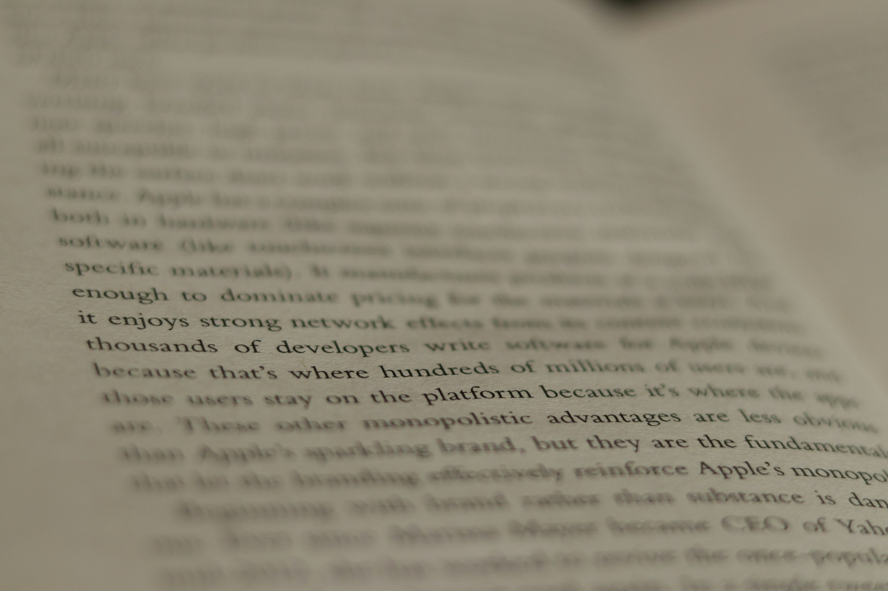

# The Text and the World
2026-06-16

## When Conversion Became Conversation

Not long ago, converting a Markdown file into a Word document was primarily a technical task. People recommended Pandoc, command-line instructions, reference templates, and carefully prepared style files. These tools remain useful, especially when a publishing process must be automated or repeated at scale. Still, they assumed that the user understood something about how one format corresponded to another. A heading in Markdown had to become a particular Word style. An image reference had to point to the correct location. Footnotes, tables, quotations, and bibliographies required their own rules.

Artificial intelligence has changed the character of this work. Instead of learning the mechanics of conversion, we can describe the result we want. We can ask an AI agent to turn a Markdown manuscript into a professionally designed Word document, with an appropriate title page, consistent headings, balanced spacing, page numbers, quotations, captions, and a table of contents. We can also ask it to consider the audience. A philosophical essay may require a different appearance from a security report, an academic paper, or a magazine article.

The reverse process has also become easier. A Word document can be converted into Markdown without requiring the user to understand the internal structure of the file. An AI can identify the headings, remove unnecessary styling, recover the paragraphs, extract the images, and restore a readable hierarchy. Even a PDF or PowerPoint presentation can be interpreted and reconstructed as a simpler textual document.

This is more than a convenient improvement in file conversion. It changes the relationship between the content and the application that contains it. When movement between formats was difficult, the format often became the document itself. Now that conversion can happen through ordinary language, the format begins to look less permanent. It becomes one possible expression of the document rather than the document’s final identity.

The task is no longer simply to convert one file into another. It is to decide what the enduring form of the knowledge should be.

## The Document Behind the File

For many years, modern knowledge work has been organized around proprietary files. A Word document seems to belong to Microsoft Word. A PowerPoint presentation appears inseparable from PowerPoint. An Excel workbook depends on formulas, worksheets, references, and behaviors that are easiest to understand inside Excel. A PDF is more independent, but it usually preserves the visible page more effectively than the editable structure beneath it.

These formats have become so familiar that it is easy to mistake them for the content itself. We say that we are sending “the document,” but what we are often sending is a package created by a particular application. It may contain the text, images, fonts, layout instructions, comments, revision histories, metadata, and internal relationships that make the file appear complete. The convenience is real, but so is the dependency.

When software changes, access may become difficult. Features may be removed, subscriptions may expire, and older files may behave differently in newer versions. Even when a format remains supported, the content can become trapped inside layers of presentation. A report written ten years ago may still open, yet recovering its structure for reuse can require more effort than reading it.

AI reduces this dependency because it makes representation more flexible. The same underlying material can be expressed as a Word report, a PDF, a set of presentation slides, a web page, an email, or a spoken script. Each format may still be useful, but none needs to be treated as the permanent source.

This suggests a different hierarchy. The plain-text manuscript can become the canonical version, while binary files become exports prepared for particular circumstances. A PDF may be appropriate for distribution. A Word document may be necessary for review and comments. A PowerPoint deck may be required for a meeting. These are not inferior forms, but they are contextual forms. They serve a moment, an audience, or a workflow.

The deeper document remains behind them. It consists of the argument, the sequence of ideas, the references, and the relationships among the parts. Once that structure can be preserved in a simple and open form, the user becomes less dependent on any single application.

## The Folder Returns

Plain text does not create the same illusion of completeness as a binary file. A Word document can contain its images, charts, and formatting within one package. Markdown usually refers to files stored elsewhere. The text may include a line pointing to an image, but the image itself remains separate.

At first, this can appear inconvenient. Sharing one Markdown file may not be enough because the images will be missing. Links may break if the surrounding files are moved. The user must pay attention to paths, names, and organization.

Yet this apparent weakness encourages a more useful way of thinking. The true unit of the document does not have to be a single file. It can be a folder.

The folder can be named after the work it contains. At its center is a README file that serves as the canonical text. An assets folder contains photographs, diagrams, audio recordings, videos, scanned materials, and other media. A drafts folder preserves earlier versions and unfinished passages. An exports folder contains generated Word, PDF, or PowerPoint files. Research notes, sources, and supporting data can be placed in clearly named locations.

This structure makes the composition of the work visible. Instead of hiding everything inside one binary container, the folder shows how the pieces relate to one another. The text remains readable on its own, while the assets retain their distinct identities. Nothing prevents the folder from being compressed into a single archive when it must be shared, but the internal organization remains understandable.

The README then becomes more than a manuscript. It serves as an intellectual map of the folder. It can explain what the assets are, where they came from, how they relate to the main argument, and which exports represent the latest published version. A person opening the folder years later does not have to guess what each item means.

This approach also suits AI well. An agent can inspect the folder, read the central text, identify the supporting materials, and generate new outputs without altering the canonical source. The same collection can produce an article, a presentation, a summary, or a document designed for a specific audience. The folder preserves the knowledge, while the outputs remain replaceable.

In this sense, AI brings back something that graphical applications often encouraged us to forget. A folder is not merely a place where files happen to accumulate. It can be a coherent unit of meaning.

## The Discipline of Plain Text

The value of Markdown is not limited to portability or storage. Its limitations can also improve the way we think.

Modern applications provide an enormous range of formatting options. We can insert decorative fonts, nested tables, colored shapes, text boxes, diagrams, backgrounds, icons, transitions, and visual effects. These features can help when the content genuinely requires them. A financial report may need tables. A scientific paper may need charts. A presentation may benefit from a carefully chosen image.

The problem begins when the availability of a feature becomes a reason to use it. A user may create a table because the application makes tables easy, not because the information is best understood in rows and columns. A diagram may be added because it looks persuasive, even when a clear paragraph would explain the relationship more accurately. Hours may be spent adjusting colors, spacing, and alignment before the argument itself has become coherent.

The application begins to direct the thought.

Markdown resists this tendency. It offers a modest set of structures: headings, paragraphs, quotations, lists, links, images, and a few forms of emphasis. Because the visual possibilities are limited, the writer must depend more heavily on sequence, wording, proportion, and clarity. The structure cannot be rescued by decoration.

This limitation can feel restrictive, but it also creates discipline. A heading must reflect a real change in perspective. A paragraph must carry a complete movement of thought. A quotation must justify its presence. An image must contribute something the prose cannot provide by itself.

The simplicity of the format also exposes unnecessary complexity. When a document is converted from Word to Markdown, much of its visual apparatus disappears. What remains can be revealing. Sometimes the argument survives intact and becomes easier to follow. At other times, the conversion exposes how much the original document depended on layout to create an impression of substance.

Plain text asks an elementary question: what is this document actually saying?

This does not mean that appearance is unimportant. Typography and layout affect attention, readability, and dignity. A beautifully designed book can invite a form of engagement that a raw text file cannot. The point is not to reject presentation, but to place it after meaning rather than before it.

The canonical text should remain strong even when the decoration falls away.

## The Word and Its Forms

This return to text carries an unexpected religious resemblance. It recalls, at least in a limited sense, the Protestant principle of *Sola Scriptura*, the emphasis on scripture as the primary authority of Christian faith.

The analogy should not be pushed too far. Religious reform, theology, and digital document management belong to very different histories. Yet both contain a movement from accumulated layers of mediation toward a central text. They ask what remains essential when institutions, customs, images, and material forms are placed to one side.

A Bible can appear in many forms. It may be bound in leather, printed on thin paper, decorated with illustrations, displayed on a smartphone, heard through an audio application, or copied into a simple text file. These forms influence the experience of reading. A family Bible passed through generations carries a significance that cannot be replaced by an application. A beautifully illuminated manuscript can express devotion through craftsmanship. A printed book offers a physical rhythm of pages, weight, and place.

Yet the words remain transferable across these forms. A believer can read a passage on a phone, remember it during the day, meditate on it, and allow it to shape prayer. The page does not need to be expensive. The font does not need to be decorative. The spiritual encounter can begin with a series of characters displayed on an ordinary screen.

This is especially striking when we think of the words attributed to Jesus. His teachings were spoken in particular places, to particular people, within a living historical world. What has crossed centuries and languages is largely a textual witness to those words. The typography has changed. The manuscripts, printed books, and digital editions have changed. The message has traveled through all of them.

The form matters, but it is not the source of the message.

The digital Bible makes this distinction unusually clear. A person can carry many translations, commentaries, dictionaries, and reading plans in a small device. The physical library has not become meaningless, but its textual content can now travel without its shelves. What once required rooms, bindings, and paper can be represented through sequences of characters stored in a space too small to see.

The comparison with Markdown is not theological equivalence. It is a reminder that text can retain its identity while moving through very different material forms. A Word file, a PDF, a printed book, and a smartphone screen may all present the same passage. The container changes, but the words continue to address the reader.

## The Assets Beyond the Text

A return to text can become misleading if it implies that everything important can be reduced to words. Music, visual art, ritual, physical presence, and lived experience are not merely incomplete forms of writing.

A musical performance cannot be replaced by its transcript because music does not operate as a transcript. Its timing, tone, harmony, repetition, silence, and physical resonance create an experience that description can approach but never reproduce. A painting is not simply a set of propositions waiting to be translated into sentences. Its color, surface, scale, and visual relationships are part of its meaning.

Human experience also exceeds textual preservation. A description of grief is not grief. A theological explanation of prayer is not the act of praying. A record of a friendship cannot contain the friendship itself. Words can preserve traces, interpretations, and memories, but not the full presence of what occurred.

In the folder analogy, these realities belong among the assets. They should not be treated as decorative attachments to the main text. The recording, photograph, painting, diagram, or testimony may carry something that the README cannot hold.

Recognizing this limit does not weaken the case for text. It clarifies what text does especially well.

A critic can write about music, not to replace the performance, but to help us hear it differently. An art historian can interpret the symbols of a painting, not to substitute an essay for the visual work, but to reveal relationships that may otherwise remain unnoticed. A person can write about an experience, knowing that the words will never fully contain it, yet trusting that they may allow another person to approach its meaning.

Text occupies a distinctive place because it can refer beyond itself. It can describe music, discuss painting, remember an encounter, compare traditions, preserve an argument, and connect experiences separated by centuries. It cannot become all those things, but it can bring them into relation.

This separation makes both sides richer. The artwork is freed from the demand to explain itself entirely in verbal terms. The text is freed from the claim that it can contain the whole world. Each form can perform its own work.

The assets preserve aspects of the encounter. The text preserves the effort to understand.

## The Text and the World

A vast library appears to be a triumph of material civilization. It contains buildings, shelves, paper, bindings, catalogues, reading rooms, and carefully controlled environments. Its physical presence matters. Libraries create spaces for attention, discovery, and shared memory.

Still, much of what a library preserves can be represented as arrangements of letters and symbols. Centuries of philosophy, theology, history, law, poetry, and science can be stored as text. Entire intellectual traditions can be copied, searched, transmitted, compared, and translated because their ideas survive in sequences of characters.

There is something astonishing in this. A small alphabet, combined in countless ways, can carry the memory of civilizations. Words spoken by people long dead can address readers who inhabit worlds those writers could not have imagined. A manuscript can be copied into a book, a book can be digitized into plain text, and the text can be read on the other side of the earth without losing the basic structure of its thought.

Artificial intelligence adds another stage to this history. It can recover text from complex formats, interpret its structure, translate it, summarize it, and regenerate it in new forms. It can turn a plain manuscript into a polished report or presentation, then return the result to a simpler source. The advanced technology does not necessarily lead toward greater complexity. It can remove complexity that no longer serves us.

This may offer a path away from some forms of vendor lock-in. The goal is not to abandon Word, PowerPoint, PDF, or Excel. These applications remain useful, and some kinds of work depend on them. The more reasonable aim is to avoid allowing any one of them to become the only place where knowledge can exist.

A plain-text source, supported by an organized folder of assets, gives the user a degree of independence. The text can outlive a subscription, an application, or a device. New formats can be generated as needs change. The durable center remains open, lightweight, searchable, and intelligible.

The simplicity also protects the writer from another kind of lock-in: attachment to presentation. When every idea must first prove itself in language, decoration loses some of its authority. The writer is reminded that a document is not impressive because it contains many features. It matters because it communicates something worth preserving.

Text is not the world. It cannot contain music, color, presence, suffering, love, worship, or the full reality of experience. Yet it can point toward them. It can interpret them, remember them, and carry their meanings from one person to another.

Perhaps this is why the movement back to plain text feels both modern and ancient. AI allows us to escape some of the technical burdens that once made proprietary formats seem unavoidable. At the same time, it returns us to one of humanity’s oldest discoveries: that a series of marks can preserve a voice, that a sentence can cross centuries, and that words can gather fragments of the world without pretending to replace it.

The README does not contain every asset in the folder. It tells us how they belong together.

The text does not contain the whole world. It helps us understand how the world can be shared.

Photo by [Finn Mund](https://unsplash.com/@finnmund?utm_source=unsplash&utm_medium=referral&utm_content=creditCopyText) on [Unsplash](https://unsplash.com/photos/a-close-up-of-an-open-book-with-text-CiUs9eCvNb8?utm_source=unsplash&utm_medium=referral&utm_content=creditCopyText)