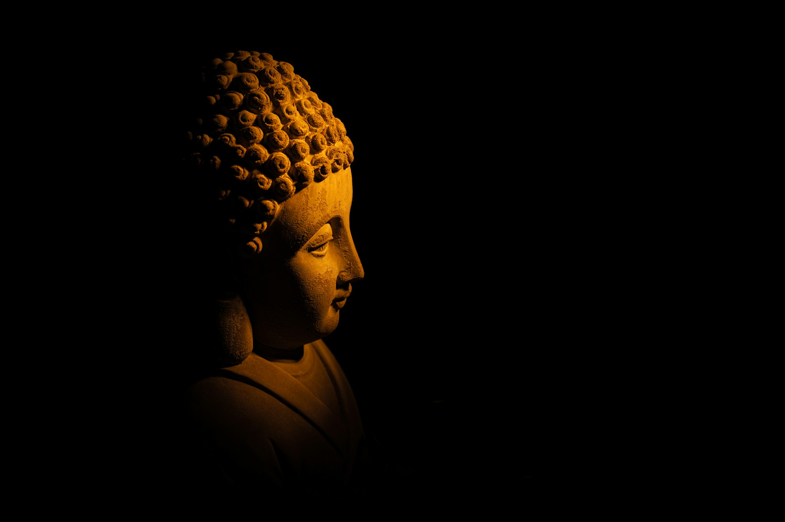

# From Self-Help to Selfless Help
2026-06-20

## The Ancient Attraction of Numbered Wisdom

Modern readers are surrounded by numbered advice. Five habits for happiness, six principles for success, seven ways to become more productive, ten lessons for a better life. The format is so familiar that we rarely stop to ask why it remains effective. A numbered list gives visible form to confusion. It reduces a difficult subject into something that appears manageable, memorable, and ready to be practiced.

This tendency is often associated with online media, where attention is limited and information must be presented quickly. Yet the basic form is much older than the internet, the magazine, or even the printed book. More than two thousand years ago, Buddhist teachings were already being transmitted through carefully organized groups of ideas. The tradition offered practitioners clear structures that could be remembered, recited, discussed, and carried into everyday life.

Among the best-known examples are:

- the Four Noble Truths
- the Noble Eightfold Path
- the Three Poisons
- the Five Precepts
- the Five Aggregates
- the Seven Factors of Awakening
- the Six Perfections
- the Twelve Links of Dependent Origination

The resemblance to the modern listicle is difficult to ignore. Both forms take a broad problem and divide it into distinct elements. Both promise clarity through organization. Both suggest that human beings may live differently if they remember and follow certain principles. In this limited sense, Buddhist teachings could playfully be described as one of the earliest and most enduring forms of the listicle.

The analogy is not entirely shallow. A teaching must enter human memory before it can guide human life. Numbered structures help people retain ideas that might otherwise dissolve into abstraction. They allow a community to say, “These are the things we must remember,” and to pass those things from one generation to another without losing their basic form.

The Four Noble Truths, for example, present a complete diagnosis of the human condition in a compact structure:

- suffering exists
- suffering has causes
- suffering can cease
- there is a path leading to its cessation

The Noble Eightfold Path then gives the fourth truth a practical form:

- right view
- right intention
- right speech
- right action
- right livelihood
- right effort
- right mindfulness
- right concentration

These are not eight separate paths from which a person chooses. They are eight connected dimensions of one path. They address understanding, intention, speech, conduct, livelihood, effort, attention, and concentration. Together, they show that liberation is not achieved through belief alone. It requires a reorientation of how one sees, speaks, acts, works, attends, and trains the mind.

The Buddhist list is therefore more than an ancient method of presentation. It reflects a conviction that wisdom must become practicable. Human beings need forms that can be remembered and brought into ordinary situations. A teaching that cannot be remembered cannot easily be practiced, and a teaching that remains purely theoretical cannot transform conduct.

Still, a deeper question appears once the resemblance has been recognized. If Buddhism and modern self-help both use numbered instructions, are they offering the same kind of guidance? Or does the similarity disappear when we examine what each tradition assumes about the person who is trying to improve?

## A Teaching Made to Be Remembered

The itemized form of Buddhist teaching is closely connected to oral transmission. Before Buddhist scriptures were committed to writing, teachings were preserved through memory, communal recitation, and disciplined repetition. The words had to survive through human voices, shared practices, and communities capable of correcting one another.

In such a setting, structure was not merely decorative. It was necessary. A numbered teaching could be recalled more reliably than an unstructured lecture. Repetition, rhythm, parallel phrasing, and classification helped communities preserve long bodies of material. A missing item could be noticed, a misplaced idea could be corrected, and the overall form could remain stable across generations.

This helps explain why Buddhist literature often classifies experience with such care. The tradition repeatedly asks practitioners to distinguish one mental state from another, one cause from another, and one practice from another. The mind is observed through categories that can be named, remembered, and recognized when they arise.

The Three Poisons, for example, identify three fundamental roots of suffering:

- greed
- aversion
- delusion

The Five Hindrances identify tendencies that obstruct concentration and clarity:

- sensual desire
- ill will
- dullness and drowsiness
- restlessness and remorse
- doubt

The Five Precepts offer a basic structure for ethical life:

- refraining from killing
- refraining from taking what has not been given
- refraining from sexual misconduct
- refraining from false speech
- refraining from intoxicants that lead to heedlessness

Each list gives the practitioner a way to recognize what is happening. Instead of experiencing the mind as a vague mixture of attraction, fear, irritation, confusion, and discomfort, one learns to identify specific patterns. Naming a pattern does not automatically free us from it, but it creates the possibility of observing it more honestly.

The same principle applies to the qualities that should be developed. Buddhism does not only classify what must be abandoned. It also names what must be cultivated. In Mahayana Buddhism, the Six Perfections describe the bodhisattva’s practice:

- generosity
- ethical discipline
- patience
- energetic perseverance
- meditation
- wisdom

These qualities are not isolated achievements. Generosity without wisdom can become careless. Wisdom without compassion can become cold. Patience without courage can become passivity. Meditation without ethical discipline can become another private refuge. The list distinguishes the practices, but actual experience shows that they support and correct one another.

Reading and chanting sutras continue this oral dimension of the tradition. A sutra is not encountered only as information printed on a page. Its words may be heard, spoken, memorized, repeated, and absorbed through the body. Sound, breath, rhythm, and collective recitation become part of the way the teaching is received.

Yet Buddhism does not reduce realization to memorization. A person may recite the Noble Eightfold Path while continuing to speak harshly. Someone may chant the Heart Sutra while remaining attached to status, possessions, resentment, or intellectual superiority. One may study the Six Perfections while using that knowledge to judge other people.

A list provides orientation, but it cannot walk on our behalf. The ability to repeat the structure of a teaching is not the same as allowing the teaching to reshape our habits, reactions, and relationships. The map is useful only when the traveler begins to move.

This distinction matters because the mind enjoys the feeling of having organized something. Once we know the names of the categories, stages, or principles, we may feel that we possess the subject. Buddhist teaching itself warns against that confidence. Knowledge of the path can become another substitute for walking it.

## When Advice Becomes an Industry

Modern self-help begins from a recognizable human condition. People feel tired, uncertain, distracted, unsuccessful, lonely, or dissatisfied. They seek guidance because they want relief, direction, and some sense that change is possible. There is nothing foolish about this desire. Human beings have always searched for ways to live better.

The problem is not that advice exists. The deeper problem lies in the form of selfhood that much of the advice quietly assumes. Modern self-help often presents the individual as an unfinished project. There is always another improvement to make, another weakness to correct, another habit to acquire, and another version of oneself waiting to be constructed.

The reader is encouraged to become more productive, confident, focused, attractive, efficient, resilient, or emotionally controlled. Beneath these promises is a recurring message: I am not enough as I am. Something is missing. A method, product, course, book, routine, or mindset may finally provide it.

This creates an endless market. Satisfaction is promised, but the self must remain dissatisfied enough to seek the next solution. Once one method loses its force, another appears. Five habits replace seven principles. A morning routine replaces a productivity system. A new philosophy replaces the previous philosophy. The self remains a permanent project because the feeling of incompleteness is continually renewed.

Even happiness becomes another task. It is measured, optimized, and displayed. Peace becomes an achievement. Mindfulness becomes a performance. Rest becomes valuable because it improves productivity. Compassion becomes useful because it strengthens leadership. Meditation becomes attractive because it helps the individual function more efficiently within the same conditions that produced exhaustion.

Some of these practices may still produce real benefits. A breathing exercise can calm the nervous system. A schedule can reduce confusion. A book can help someone recognize a harmful pattern. Practical advice should not be rejected merely because it belongs to modern culture or because someone earns money from it.

The deeper concern is that the structure of desire often remains untouched. The self is taught how to obtain more of what it wants, but it is rarely asked why its wanting continues without rest. The individual learns to manage dissatisfaction without examining the identity built around it.

The self-help industry can continue indefinitely because it rarely threatens the consumer who sustains it. It may change the consumer’s habits, language, schedule, or appearance, but it usually preserves the central assumption that there is an independent self whose needs must be satisfied and whose story must be improved.

This is where the resemblance between Buddhist teaching and modern self-help begins to break down. Buddhism also begins with dissatisfaction. It also offers practices and tells us that another way of living is possible. Yet Buddhism does not merely help the self become more successful at satisfying itself. It gradually investigates the self that wants to be satisfied.

The question changes from “How can I improve myself?” to “What is this self that I am trying to improve?” Once that question becomes central, the path moves beyond ordinary self-help.

## From Improving the Self to Examining It

The phrase “selfless help” expresses the reversal that takes place within Buddhist practice. It sounds paradoxical because help usually assumes someone who gives it and someone who receives it. Buddhism does not immediately eliminate those practical distinctions, but it gradually loosens the belief that giver and receiver exist as absolutely separate and independent beings.

A person may initially approach Buddhism for personal reasons. One may be suffering from anxiety, grief, fear, frustration, or a sense of meaninglessness. One may want peace, clarity, healing, or freedom from emotional pain. Buddhism does not need to condemn such motivations. The path begins where the person actually stands.

As practice develops, however, the nature of that person becomes part of the inquiry. The practitioner begins to examine what is meant by “I.” Is there a permanent and independent owner behind the body, feelings, perceptions, thoughts, memories, choices, and states of consciousness? Is there an unchanging center that remains untouched by all conditions?

Buddhist analysis does not find such a center.

This does not mean that the person is completely nonexistent. People speak, remember, decide, suffer, love, and accept responsibility. Names, identities, promises, and obligations continue to function. Ethical consequences remain real. The teaching of non-self is not the claim that nothing matters or that human life is a meaningless illusion.

Rather, Buddhism denies that the self exists as a permanent, isolated, and self-sufficient essence. What we call the self depends upon innumerable conditions. It depends on the body, language, memory, family, society, food, education, history, relationships, and changing states of mind. Remove these conditions one by one, and no independent owner can be located behind them.

The self is not nothing. It is conditional.

This distinction protects Buddhist teaching from nihilism. Buddhism does not replace belief in a fixed self with belief in absolute nothingness. It replaces independent existence with dependent existence. The person remains present as a living process, but not as an unchanging substance.

The Five Aggregates offer one traditional way of examining this process:

- form
- feeling
- perception
- mental formations
- consciousness

What we call a person is analyzed through these changing dimensions of experience. None is permanent. None can be completely controlled. None provides an independent essence that can be identified as the true owner of the others.

The purpose of this analysis is not to destroy the person. It is to loosen the tyranny of the imagined owner. When the self is treated as absolute, every criticism threatens identity, every loss diminishes what we believe ourselves to be, and every success must be defended. Desire becomes part of a continuing effort to secure the story of oneself.

When the self is seen as conditional, experience does not disappear. Pain still hurts. Loss still matters. Responsibility remains. Yet experience is no longer organized entirely around the defense of an isolated center.

This is where selfless help becomes possible. It does not mean neglecting oneself, suppressing personal needs, or glorifying sacrifice. It means that the distinction between my suffering and the suffering of others is no longer regarded as absolute.

A person exists through relationships. The food we eat, the language we speak, the knowledge we carry, and the care that sustained us all come from beyond the narrow boundary of the individual. What we call “my life” has always included other lives. The individual is not erased, but the illusion of complete isolation begins to weaken.

Compassion follows from this recognition. It is not an external command added to wisdom after the fact. It is the lived consequence of seeing interdependence clearly. Wisdom recognizes that no being exists alone, while compassion responds to the suffering arising within this shared field of conditions.

The bodhisattva ideal gives this insight a distinctive Mahayana expression. The bodhisattva does not seek awakening as a private possession. Liberation is inseparable from the welfare of other beings. The aspiration to awaken includes the aspiration to assist others in becoming free from suffering.

This does not create a heroic self who saves everyone else. Such an image would simply restore the ego at a spiritual level. The bodhisattva path weakens the boundary between self and other while preserving responsibility, care, and action. Selfless help is therefore not the disappearance of practical persons. It is help released from the belief that the helper and the helped are completely separate.

## The Trap Hidden Inside the Teaching

Buddhism can also be consumed. A person can collect Buddhist books, meditation techniques, retreats, teachers, rituals, and quotations in the same way another person collects productivity systems. The language becomes spiritual, but the underlying structure may remain unchanged.

Meditation may be used to increase professional performance. Mindfulness may become a way to tolerate unhealthy conditions without questioning them. Compassion may become part of a desirable public identity. Detachment may be used to avoid emotional responsibility. Enlightenment may become the most ambitious achievement imagined by the ego.

The self may say that it will become calm, wise, awakened, pure, or free from attachment. In this way, the desire to overcome the ego becomes another project of the ego. Spiritual life is absorbed into the same system of acquisition that governs consumer culture.

This is why Buddhism cannot be reduced to a correct collection of items. The Five Precepts, the Noble Eightfold Path, the Six Perfections, and other teachings remain necessary, but they can be misused when they become objects of possession. A person may become proud of knowing the lists, strict about applying them to others, or confident that belonging to a tradition guarantees wisdom.

The itemized teaching then becomes another identity. One may speak about impermanence while refusing to accept change, discuss compassion while dismissing difficult people, or explain non-self while defending every personal opinion. Spiritual knowledge can create a persuasive feeling of superiority precisely because it appears to have transcended ordinary ambition.

The problem is not the teaching. The problem is clinging to the teaching.

The traditional image of the raft expresses this clearly. A raft is valuable when crossing a river. It provides support where there is no bridge. After reaching the opposite shore, however, the traveler does not need to carry the raft forever.

This does not justify abandoning discipline prematurely. Someone who has not crossed the river should not throw away the raft in the name of freedom. Ethical conduct matters. Meditation matters. Wisdom matters. The path must be practiced rather than dismissed as merely conceptual.

The warning is subtler. The teaching should be used completely, but it should not be converted into a permanent possession. Buddhist concepts exist to expose attachment, not to provide the ego with a more sophisticated identity.

The Buddhist list begins by organizing experience. Eventually, Buddhism turns the same critical attention toward its own lists. This is where the Heart Sutra becomes central.

## The Heart Sutra as the Anti-Listicle

The Heart Sutra is one of the most frequently recited texts in Mahayana Buddhism. It is remarkably short, yet it gathers many of the established categories of Buddhist thought. It refers to the Five Aggregates, the senses and their objects, the elements of consciousness, the Twelve Links of Dependent Origination, the Four Noble Truths, knowledge, attainment, and non-attainment.

A reader familiar with Buddhist teachings recognizes these categories immediately. They belong to the tradition’s intellectual and practical architecture. Yet the Heart Sutra does something unexpected. It does not simply repeat or summarize the lists. It empties them.

Form is emptiness, and emptiness is form. The other aggregates are treated in the same manner. The senses, their objects, ignorance, the end of ignorance, suffering, the origin of suffering, cessation, the path, wisdom, and attainment are all denied independent and permanent essence.

This does not mean that the teachings are false or useless. The Four Noble Truths still guide practice. The Five Aggregates still help analyze experience. Dependent origination still explains how suffering arises. Ethical and meditative disciplines remain essential.

What the sutra denies is that these categories exist independently, outside conditions, as permanent structures that can be possessed by the mind. They function as teachings, but they do not stand outside emptiness.

The Heart Sutra can therefore be understood as an anti-listicle built from lists. First, experience is divided into categories so that it can be examined. Practice then reveals that each category arises through causes and conditions. Wisdom finally sees that none has a fixed essence, including the practitioner, the path, and the attainment being sought.

The list releases us from confusion. Emptiness releases us from attachment to the list.

This is why the sutra’s teaching of non-attainment is so important. If enlightenment were an object that a permanent self could acquire, it would become the highest form of possession. Spiritual practice would remain within the same logic as consumption: I lack something, I must obtain it, and once I possess it, I will finally be complete.

The Heart Sutra interrupts this logic. There is no permanent owner who can possess awakening as property. There is no isolated self standing outside the path and collecting realization. This does not eliminate practice, but it changes the relationship between practice and possession.

The practitioner walks the path, but cannot claim absolute ownership of it. Wisdom arises, but no permanent possessor of wisdom can be found. Compassion acts, but no isolated hero stands behind the action.

## A Perspective Without a Permanent Observer

The teaching of emptiness also changes how we understand perspective itself. In ordinary reflection, a person steps back from experience and observes it. The observer seems to occupy a higher position from which thoughts, emotions, and actions can be examined. Such awareness is valuable, but Buddhism asks us to continue the inquiry by observing the observer.

The one who watches is also conditioned. Awareness occurs, but no unchanging owner of awareness can be located outside experience. What might be called an ultimate meta-perspective is therefore not the highest viewpoint occupied by a perfected self. It is a perspective in which the imagined permanence of the observer has also been released.

This is why the relationship between the seer and the seen must be expressed carefully. It may be tempting to say that they merge into one, yet that language can suggest that two independent substances combine into a larger substance. A more precise formulation is that the separation between seer and seen is recognized as conditional rather than absolute.

Seeing occurs, objects appear, and thoughts arise, but no fixed seer stands outside experience as its permanent owner. The subject is empty, the object is empty, and the act of knowing is empty. Emptiness here does not mean absence. It means that none of these exists through itself alone.

The Heart Sutra’s apparent negations therefore lead not toward despair but toward freedom. When the self is no longer treated as an independent center, the need to defend and complete it begins to weaken. When teachings are no longer treated as possessions, wisdom becomes less rigid. When the boundary between self and other is no longer absolute, compassion becomes more natural.

Modern listicles often tell us what the self should acquire next: another habit, another method, another improvement, another identity. The Heart Sutra asks us to search for the one who is trying to acquire these things. When no permanent owner can be found, the endless project of self-completion begins to lose its force.

Buddhist teachings continue to use lists because human beings need forms that can be remembered. We need guidance that can enter speech, memory, and action. The Four Noble Truths, the Noble Eightfold Path, the Five Precepts, and the Six Perfections remain valuable because they give structure to practice.

Their deepest purpose, however, is not to construct a more impressive self. They help us see how suffering arises, how attachment is sustained, how the mind can be trained, and how compassion becomes possible. When their work has been understood, they also teach us not to cling even to them.

This is the movement from self-help to selfless help. It begins with instructions that can be counted and continues through practices that can be remembered. It deepens through the recognition that the self being improved cannot be found as an independent essence. It opens into a life in which wisdom and compassion are no longer organized around the defense of an isolated individual.

The Buddhist list does not finally teach us how to possess a better life. It teaches us how to loosen the need to possess life at all.

Photo by [Jan Kopřiva](https://unsplash.com/@jxk?utm_source=unsplash&utm_medium=referral&utm_content=creditCopyText) on [Unsplash](https://unsplash.com/photos/brown-and-black-leopard-print-head-bust-7BootnN3-0I?utm_source=unsplash&utm_medium=referral&utm_content=creditCopyText)