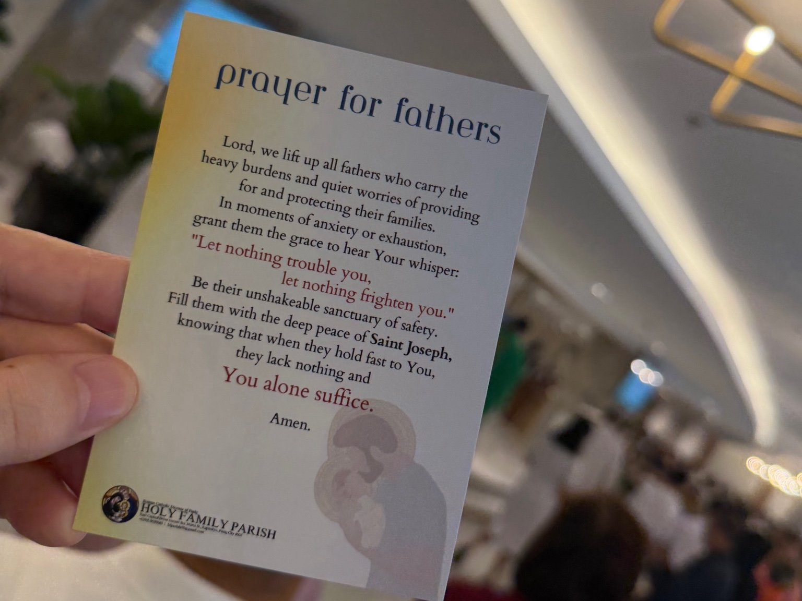

# The Courage That Comes from Above
2026-06-21

## The Fathers Who Came Forward

My wife and I attended Sunday Mass on Father’s Day. Near the conclusion of the celebration, all the fathers were invited to come forward for a special prayer and blessing. They gathered near the altar and received a card bearing the image of Saint Joseph, together with words of encouragement for those carrying the responsibility of protecting and providing for their families.

It was a warm and familiar scene, but it seemed to contain more than a simple Father’s Day greeting. Each father standing there must have been carrying a different life. Some may have been thinking about their children, work, money, health, aging parents, or difficulties within the family that could not easily be shared. Some may have felt grateful for the family they had received. Others may have wondered whether they had become the kind of father they once hoped to be.

The prayer card recognized this hidden weight. It asked God to become a sanctuary for fathers amid their worries, and it included the words, “Let nothing trouble you, let nothing frighten you.” These words echoed the Gospel for the day, in which Jesus repeatedly told his disciples, “Do not be afraid.”

At first, this can sound like ordinary encouragement. Fathers face many responsibilities, so perhaps they simply need to be reminded to remain strong and hopeful. Yet Jesus was not promising his disciples an easier life. He was preparing them for rejection, suffering, and danger. His words must therefore point toward a courage deeper than confidence or emotional stability.

A father cannot guarantee that his family will always be healthy, financially secure, peaceful, or protected from loss. He may work faithfully and still face unemployment. He may love his children deeply and remain unable to prevent every mistake or disappointment. He may pray sincerely and still encounter illness, conflict, or death.

If “Do not be afraid” meant that nothing painful would happen, the words would not correspond to human experience. If they meant that a faithful person should never feel fear, they would also be difficult to reconcile with Jesus himself, who experienced anguish in Gethsemane and suffering on the cross.

The words come from another depth. They do not promise that danger will disappear. They reveal that danger does not possess the final meaning of our existence. They do not remove vulnerability. They invite us to live from a foundation deeper than what we can control.

This is the courage that comes from above.

## The Burden of Being Qualified

Fathers often feel that they must continually prove that they are qualified for their role. They must be responsible, capable, stable, and strong enough to deserve the trust placed in them. Fatherhood can become a demanding judgment upon the self.

This concern is not meaningless. A father has real duties. Families need material support, guidance, patience, protection, and dependable presence. Love does not cancel responsibility. In many cases, it makes responsibility feel heavier because the well-being of other people matters so deeply.

A father may therefore measure himself by what he can provide. He may judge his worth by his income, his position, the home he maintains, or the future he can prepare for his children. He may also believe that he must always know what to do. He should remain composed, make the right decisions, and give the family a sense of security.

These expectations can become overwhelming. Every family problem begins to feel like evidence of personal failure. If a child struggles, the father wonders what he did wrong. If the family faces financial pressure, he may feel that his own value has decreased. If he becomes frightened or uncertain, he may hide it because he believes vulnerability makes him less capable of leading.

Even the desire to become a good father can become entangled with the ego. A father may not only want what is best for his children. He may also need their success to confirm that he has fulfilled his role. Their achievements become evidence of his worth, while their difficulties feel like accusations against him.

The ego does not always appear as arrogance. It can appear as anxiety, shame, comparison, and relentless self-judgment. A father may sacrifice greatly for his family while still believing that everything depends upon his own strength.

Responsibility then becomes isolation. He begins to imagine himself as the foundation of the whole family. He must provide every answer, absorb every fear, and prevent every failure.

No human being can sustain such a position. A father can guide, protect, and provide, but he cannot control the full course of another person’s life. Children grow into their own freedom. Illness enters without permission. Economic conditions change. Relationships develop in unexpected ways. Mortality remains present even within the most loving home.

The deeper question is therefore not only whether a father is qualified. It is whether he understands the source of his fatherhood. Does he believe that he must create his strength and value entirely from within himself, or can he receive his life, family, and responsibility as gifts entrusted to him?

The father who believes that everything originates from himself will experience every limitation as a threat to his identity. The father who receives his role from God can remain responsible without imagining that he is the family’s ultimate savior.

He still works, decides, protects, and provides. Yet he does so as someone who is also held, guided, forgiven, and sustained.

## Courage Without Invulnerability

The world often defines courage through invulnerability. A courageous person is expected to remain unaffected by pressure, suppress fear, and overcome obstacles through determination. Strength becomes the ability to maintain control.

This expectation can be especially powerful for fathers. A father may believe that his family needs him to be emotionally impenetrable. He does not want his children to see his uncertainty. He may fear that admitting weakness will make the family feel less secure.

Christian courage follows another pattern. Jesus did not tell his disciples that they would become untouchable. He prepared them for opposition and suffering. His command not to fear was spoken precisely because there were real reasons to feel afraid.

The courage of faith does not arise from the removal of vulnerability. It comes from discovering that vulnerability is not the deepest truth about us. The body can be injured. Plans can fail. Reputation can be damaged. Relationships can be lost. Life itself can end. Yet none of these realities fully defines a person whose existence is received from God.

This does not mean that the soul should be imagined as a separate object hidden inside the body and untouched by the physical world. Christianity values the whole person. The body, history, relationships, and lived experience all matter. Christian hope is not escape from embodiment but resurrection.

The deeper point is relational. Our existence is not grounded only in what we can preserve through our own power. Our final security rests in the faithfulness of God. We remain vulnerable in the world, but the world is not the ultimate owner or judge of who we are.

This is why pain and peace may coexist. Peace does not always replace fear, sadness, or physical suffering. It may exist at another depth. A person can be anxious about a medical diagnosis and still know that he is not abandoned. A father can feel helpless before his child’s suffering and still remain present in love. A family can grieve deeply while also experiencing gratitude and trust.

Gethsemane gives us an important image. Jesus did not avoid anguish. He asked that the cup might pass from him. His trust in the Father did not erase his distress. Yet within that distress, he remained in relationship: “Not my will, but yours be done.”

This surrender was not emotional numbness. It did not make the suffering unreal. It revealed a trust that remained present within the suffering.

Faith therefore cannot be measured by how little pain a person feels. A father who becomes afraid is not necessarily lacking faith. A mother who grieves is not spiritually weak. A person facing death may move between trust, anger, sadness, and fear.

The deeper freedom is not freedom from every painful emotion. It is freedom within vulnerability. Fear may remain, but it does not need to become the ruling authority of our lives. It does not have to determine whether we continue to love, forgive, speak truth, or remain beside another person.

A father may not be able to remove the danger facing his family. He may still be courageous if he refuses to abandon them. He may not know the answer, but he can continue listening. He may feel afraid, but he can resist allowing fear to become anger, control, or withdrawal.

This is not the courage of an invulnerable man. It is the courage of a vulnerable person who knows that vulnerability is not the whole truth.

## The Self That Cannot Surrender Itself

The command to deny oneself is central to Christianity, but it can easily be misunderstood. It does not require the destruction of personality, dignity, or individuality. The person is not an error that must be erased.

The problem lies in the way the self imagines itself to be independent, self-created, and self-sufficient. The ego treats life as a possession. It says, “My identity, achievements, reputation, relationships, and future must confirm who I believe myself to be.”

From this perspective, almost everything can become a threat. Criticism threatens identity. Illness threatens control. Aging threatens the image we have built. Death threatens the entire structure through which we have tried to secure ourselves.

Even surrender can be absorbed into this structure. The self may become proud of its humility, sacrifice, discipline, or religious devotion. It may say, “I have denied myself,” while constructing another identity around being spiritually advanced.

This is why self-denial cannot simply become another project of self-improvement. The ego can turn even its own disappearance into an accomplishment.

The Christian shift happens through relationship. The self discovers that it does not originate from itself. Life has been received. Identity is not a private object but something formed through relationship with God, other people, the body, history, and the world.

In relationship with Christ, self-denial becomes less like self-destruction and more like release. What is surrendered is the claim to be the absolute foundation of one’s own existence. The person does not disappear. The person becomes less imprisoned by the need to defend a fixed image of who he must be.

This has a meaningful connection with the Buddhist teaching of non-self. Buddhism does not simply declare that nothing exists. It questions the assumption that there is a permanent, independent, and self-sufficient self that can be grasped as “mine.”

Christianity and Buddhism do not make identical claims. Christianity understands the person through relationship with a personal God and the hope of communion. Buddhism follows another path in explaining suffering and liberation. Yet both traditions challenge the isolated ego as the final ground of existence.

Both recognize that attachment to the self creates suffering. We cling to identities, possessions, expectations, and outcomes. When reality changes, as it always does, we experience not only pain but also the suffering created by resistance. We demand that life confirm the structure we have built around ourselves.

This does not mean that every form of suffering is caused by the ego. Illness, bereavement, violence, injustice, and poverty are real. A person with cancer does not suffer only because of attachment to the self.

However, the ego can add another layer to pain. It can turn pain into humiliation, isolation, resentment, or the belief that life has lost all meaning because it no longer follows the expected form.

The ontological shift changes this relationship. Pain remains real, but it no longer becomes the complete interpreter of existence. The self remains finite, but it no longer has to secure itself through permanence.

For fathers, this shift is especially important. A father does not need to deny his responsibilities. He needs to surrender the illusion that his worth depends upon controlling every outcome.

Then he can admit that he needs others. He can listen to his spouse, learn from his children, apologize, and receive help without feeling that his identity has collapsed.

He remains a father, but he is no longer trapped inside the image of the self-sufficient father.

## When the Word Becomes Real

There are moments when familiar words from Scripture suddenly carry a different weight. A verse that once seemed generally comforting becomes immediate and personal. It no longer feels like information about faith. It feels like an address.

This sometimes happens to people facing terminal illness. A diagnosis can change the whole horizon of the future. Treatment may still be possible and hope may remain, yet mortality can no longer be postponed as an abstract possibility.

There is no single emotional path through this experience. Some people may feel denial, anger, fear, sadness, hope, acceptance, and peace at different times. A person may feel calm one day and terrified the next. Peace, when it appears, does not necessarily erase suffering.

It would be wrong to romanticize terminal illness or assume that suffering automatically produces spiritual wisdom. Illness can be painful, exhausting, and isolating. Some people may never experience the peace that others hope to see in them.

Yet proximity to death can strip away many of the assumptions around which ordinary life is organized. The future can no longer be treated as unlimited. Possessions, achievements, and social identities lose some of their power to define the person.

In this condition, the words “Do not be afraid” may become profoundly real. They no longer mean, “Do not worry because everything will improve.” They do not promise that illness will disappear or that death will be postponed.

They say something more radical: even here, you have not fallen outside the love of God. Even when worldly possibilities are closing, your existence remains known. Even when circumstances can no longer be repaired, you are not abandoned.

Scripture then moves from teaching into encounter. The question is no longer only, “How can these words help me solve my problem?” A deeper question appears: “Who holds me when the problem can no longer be solved?”

This is where mercy becomes more than the removal of suffering. Mercy becomes presence within what cannot be removed. Grace does not always change the external condition. It changes the ground from which the person lives through that condition.

The strange peace sometimes seen in terminal situations may arise from this release. The person no longer needs life to meet certain conditions before it can be accepted as a gift. The remaining time can still be received, shared, reconciled, and entrusted.

The terminally ill person does not belong to a different category of humanity. The diagnosis simply makes visible what is structurally true for everyone. Every life is finite. Every body is vulnerable. Every relationship will eventually be changed by death.

Most of us do not live with this awareness constantly before us. We make plans, work, build homes, and raise families. There is nothing wrong with this. The problem begins when we mistake continuation for possession and behave as though life were guaranteed by our effort.

We do not need to become terminally ill before this realization becomes possible. The Christian life invites us to awaken within ordinary days. We can love more freely because those we love are not permanent possessions. We can forgive because time is limited. We can become present because the future cannot replace the life before us.

Death remains real, but it no longer becomes the final interpreter of life. The conditions of existence remain finite, yet the center from which we receive existence has changed.

## Fatherhood as Love Received and Given

When we return to fatherhood from this perspective, the meaning of a good father begins to change. A father is no longer defined primarily by his ability to construct a flawless and powerful self. He is defined by his willingness to receive love and allow that love to pass through him toward others.

This does not remove the need for practical responsibility. A father must still work, provide what he can, guide his children, make decisions, and face problems honestly. Faith should never become an excuse for neglect.

Yet responsibility receives a different foundation. The father acts not because he believes he is the ultimate source of the family’s security, but because he has been entrusted with a role within a reality larger than himself.

His authority becomes service. He does not treat his family as an extension of his ego. He helps each person grow into the life God has given them.

His strength becomes presence. He may not solve every problem, but he can remain. He can listen when there is no immediate answer. He can stay beside a family member whose pain he cannot remove.

His humility becomes freedom. He no longer needs to appear flawless. He can admit a mistake, ask forgiveness, and seek guidance without treating these actions as evidence of failure.

His courage becomes faithfulness within uncertainty. He continues to love even when he cannot control what love will produce. He accepts that his children have freedom and that their lives will not always follow the path he would choose.

Saint Joseph represents this kind of fatherhood. His strength does not appear through domination or self-display. It appears through listening, obedience, work, protection, and presence. He acts within circumstances he did not create and could not fully understand.

Joseph receives a family rather than constructing one according to his own expectations. He protects Mary and Jesus, but he also allows himself to be guided. His strength comes from his willingness to place himself within God’s purpose.

Fathers are often expected to become the sanctuary of the family. They are expected to create safety, absorb uncertainty, and stand firm when others are afraid.

But fathers also need a sanctuary.

They need somewhere to bring the fears they cannot resolve. They need to know that their identity does not collapse when their strength reaches its limits. They need to receive the mercy they are expected to extend to others.

A father can become a place of safety because he first receives safety from God. He can forgive because he has been forgiven. He can remain present because he knows that he is not alone.

This truth extends beyond fathers. Mothers, spouses, children, caregivers, relatives, and friends all bear responsibility for one another. Human life is sustained through relationships of receiving and giving.

“Love your neighbor as yourself” expresses this relational structure. The neighbor is not simply an external person toward whom the isolated self must behave morally. Self and neighbor are already connected within the life given by God.

Christian love does not require the self to disappear. It releases the self from being its own absolute center so that love can become available to another person.

A good father, a good mother, and a good human being are not flawless products of moral achievement. They are persons who gradually become available to love because they no longer need to protect the ego at every moment.

## The Sanctuary Fathers Also Need

The fathers who gathered near the altar were not being celebrated because they had achieved perfection. They came forward as human beings carrying responsibilities, hopes, failures, and fears. The blessing did not certify that they had become fully qualified. It placed them again within the care of God.

This may be one of the deepest meanings of a religious blessing. It does not only praise what people have accomplished. It reminds them that their lives remain received. It returns them to a source of strength that does not depend entirely upon their own capacity.

The father who understands this does not become passive. He becomes more available to reality. He can face family problems without treating them only as threats to his identity. He can respond to suffering without needing an immediate victory.

Faith does not replace practical action. If a child is ill, prayer does not replace medical treatment. If a marriage is struggling, faith does not remove the need for honest conversation, counseling, boundaries, or forgiveness. If a family faces financial pressure, trust in God does not eliminate the need for careful decisions and material support.

The ontological shift does not provide another technique for regaining control. It changes the structure of the question. The father no longer asks only, “How can I prove that I am strong enough?” He can also ask, “How can I remain faithful here? How can I love within this limitation? What must I accept, and what am I still called to do?”

Courage does not mean that he is never frightened. Humility does not mean that he considers himself worthless. Peace does not mean that the family is free from difficulty.

Courage means that fear does not possess final authority. Humility means that the father does not have to become the foundation of everything. Peace means that even within uncertainty, he and his family remain held within a love greater than their circumstances.

The words “Do not be afraid” are therefore not a demand to produce confidence through willpower. They are an invitation to live from another center.

The father remains finite. He may become tired, uncertain, and afraid. He may make mistakes and reach the limits of what he can provide. None of this destroys the meaning of his fatherhood.

His deeper task is not to become invulnerable. It is to receive the love that comes from above and allow it to take form as patience, responsibility, forgiveness, courage, and presence.

Suffering remains part of human existence. Death remains certain. Faith does not erase these realities. It allows us to discover that they do not contain the whole truth about us.

The father who knows this can stand with his family without pretending that he controls the future. He can protect without possessing, guide without dominating, and love without demanding that love confirm his worth.

He does not need to become the final sanctuary of everyone around him. He can first enter the sanctuary offered by God.

From there, another kind of strength becomes possible. It is not flawless or invulnerable. It is the strength to remain, to receive, to serve, and to love.

It is the courage that comes from above.