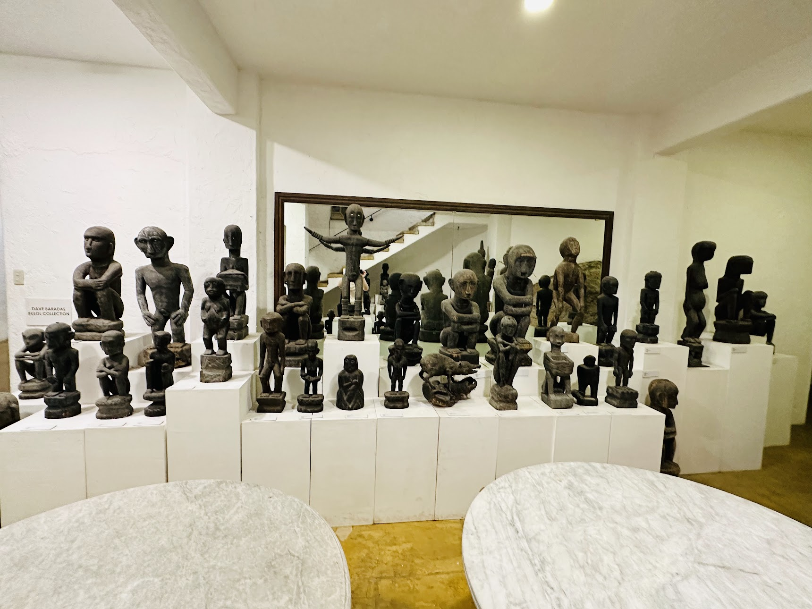

# The Body Before the Chair
2026-06-23

## Rediscovering an Ordinary Position

Not long ago, I encountered an article about the deep squat as a resting position. It was presented as a posture worth recovering, especially for people who spend much of their day sitting in chairs. The article was not describing an advanced athletic movement or a demanding strength exercise. It was simply discussing the act of lowering the body into a full squat and remaining there for a while.

At first, the idea seemed slightly contradictory. I had always associated rest with a chair, a sofa, or perhaps a comfortable gaming chair designed to support almost every part of the body. A deep squat looked more like an exercise than a form of rest. It appeared to require flexibility, balance, and some degree of muscular effort. Calling it a resting position seemed almost like calling standing on one leg a way of relaxing.

Yet the more I thought about it, the less unusual the idea became. Human beings have not always lived in environments filled with chairs. For most of history, people spent far more time near the ground. They prepared food there, worked there, waited there, spoke with one another there, and rested there. The deep squat may now appear to us as a specialized mobility exercise, but for earlier generations it was often simply one of the positions available to the body.

This realization interested me because I could not approach the posture casually. Last year, I experienced an inguinal hernia and underwent surgery. A mesh was placed in my groin area, and I was advised to be careful with heavy squats, excessive stretching, and movements that might place unnecessary pressure on the repaired region. For me, the rediscovery of the deep squat could not become an immediate physical challenge. I could not simply lower myself as deeply as possible and remain there to prove that the posture was beneficial.

That limitation made the subject more meaningful. I had to observe the posture before attempting to inhabit it. I had to distinguish curiosity from ambition and mobility from strain. The question was no longer whether I could perform a perfect deep squat. It was why this ordinary human position had become so unfamiliar that we now needed articles, videos, and fitness instructors to explain its value.

The deep squat began to look less like a newly discovered exercise and more like a forgotten relationship between the body and the ground.

## The Figure Close to the Ground

While thinking about the posture, I remembered the traditional woodcarvings of the Ifugao people in the northern Philippines. The figures often appear with their knees deeply bent, their bodies settled close to the ground, and their arms resting naturally around or across their legs. The position does not appear strained. It is not presented as a display of flexibility. It simply looks like a recognizable way for a human being to sit.

The best-known of these figures are the bulul, wooden representations associated with rice, ancestral presence, protection, and well-being. Their forms are stylized, and their cultural meaning cannot be reduced to posture alone. A religious or ritual carving is not a photograph of ordinary daily life. It would therefore be too easy to point at one figure and claim that it proves exactly how everyone in an earlier community sat.

Still, the posture must have been familiar enough to become part of the visual language through which the human body was represented. The carver did not need to explain why the figure was positioned so close to the ground. The body in deep flexion was not an exotic sight. It belonged to a recognizable world.

That image recalled other scenes as well. People waiting beside a road, resting outside a house, gathering around a fire, working in a field, talking in a marketplace, or pausing during a long day of physical labor have often used some form of squatting. Even within living memory, people in many Asian societies could be seen resting in this way. It was not necessarily associated with exercise, health, or deliberate training. It was simply convenient when no chair was available.

Of course, the squat was never the only human resting position. People knelt, sat cross-legged, leaned against walls, used low stools, stretched their legs in front of them, or shifted between several arrangements. The real difference may have been that the body was not expected to remain in one standardized position for most of the day. Earlier environments allowed, and often required, a wider vocabulary of postures.

The Ifugao figure therefore does not need to prove that the deep squat was the single universal position of humanity. Its value is more subtle. It reminds us that sitting close to the ground was once ordinary enough to appear in sculpture without explanation.

## The Posture We Once Knew

The deep squat is not something human beings first encounter through exercise. Long before it becomes a mobility drill, it appears naturally in childhood.

Young children often lower themselves into a full squat while playing, examining an object, arranging toys, or pausing between activities. They may remain there comfortably without thinking about ankle mobility, hip flexibility, knee alignment, or the position of the spine. The posture does not yet require instruction. It is simply one of the ways their bodies meet the ground.

This familiar childhood ability adds another dimension to the history of the squat. We do not need to look only toward traditional communities, old sculptures, or accounts of life before modern furniture. The same posture appears near the beginning of our own lives. Before the chair becomes central to our environment, the ground remains close and physically accessible.

It may be tempting to describe this as an ancestral memory, as though children somehow retain knowledge that civilization later removes. That would be an attractive image, but it should not be taken too literally. Their ease has several practical explanations. Young children have different body proportions from adults, including shorter limbs in relation to the trunk and a lower center of mass. More importantly, they move through these positions constantly.

A child’s daily life includes crawling, kneeling, squatting, sitting on the floor, standing up, falling down, and beginning again. These movements are not separated into exercise sessions. They are woven into play and exploration. Mobility is maintained because it is repeatedly used.

As children grow older, the environment begins to change. They enter classrooms organized around desks and chairs. They eat at tables, travel in vehicles, study in front of screens, and spend more leisure time on sofas or beds. The floor gradually becomes less central to everyday activity.

The change is not purely biological. Growing bodies acquire different proportions, greater body weight, and individual variations in joint structure and flexibility. Yet culture also begins to shape how the body is expected to rest. In many modern settings, sitting properly means sitting on a chair. Squatting may be regarded as childish, informal, rural, or unsuitable for a professional environment.

Through years of repetition, the chair becomes normal while the ground becomes remote. The ankles are rarely asked to bend deeply. The hips and knees remain within a limited range for much of the day. Getting down to the floor and rising again becomes less frequent. Eventually, an adult may attempt a deep squat and discover that the heels rise, the body tips backward, the knees feel uncomfortable, or the position creates unfamiliar tension.

It can feel as though the body has forgotten something.

The body does not forget in the way the mind forgets a name or an appointment. It adapts to what is repeatedly demanded of it. It becomes efficient within familiar positions and less prepared for movements that have disappeared from daily life. What appears to be forgetting is often the physical result of long disuse.

This changes how we might understand the loss of the squat in adulthood. Aging certainly matters, but age alone does not explain everything. The decline may begin much earlier, when furniture and social expectations gradually remove the posture from ordinary life. By the time the movement becomes difficult, the body may have spent decades without practising it.

Recovering the squat therefore does not necessarily mean learning an exotic or foreign movement. It may be closer to revisiting an old bodily possibility. Of course, an adult cannot simply return to the body of a child. An adult carries greater weight, different proportions, established habits, and a personal history of injuries or surgery. In my case, that history includes an inguinal hernia, an operation, and the presence of surgical mesh.

Any recovery must respect those differences. The aim is not to imitate the effortless mobility of childhood or to force the body into a position it can no longer tolerate. It is to ask whether some portion of that former range can be approached again, patiently and without aggression.

The more interesting question, then, may not be why adults find the deep squat difficult. It may be when the posture stopped belonging to ordinary life.

The answer may lie not only in the passage of time, but also in the long education of the chair.

## When Rest Still Involved the Body

Modern ideas of rest are closely connected with the reduction of effort. A good chair supports the back, distributes body weight, cushions the hips, and allows the muscles to relax. A sofa goes further by inviting the body to sink into it. Comfort is often measured by how little the body is required to do.

There is nothing inherently wrong with this. After a long day, physical support can be genuinely restorative. A chair can make work, study, eating, and conversation easier. For people living with pain, fatigue, disability, or limited mobility, it can be indispensable. The problem begins when rest becomes almost completely separated from movement.

A deep resting squat represents another kind of rest. It is restful in comparison with walking, running, carrying, or working, but it does not remove the body from participation. The ankles remain flexed. The knees and hips move through a large range. The feet continue to interact with the ground. The trunk adjusts to maintain balance. Even when the position becomes comfortable, the body is not entirely passive.

This is sometimes described as active rest. The phrase initially sounds contradictory, but it captures an important distinction. Activity does not always mean strenuous exercise, just as rest does not always mean complete muscular disengagement. Between hard effort and passive collapse, there are positions in which the body remains gently involved.

The value of the squat may also lie in the movement required to enter and leave it. Lowering the body toward the ground demands control. Rising again requires strength, balance, coordination, and confidence. When these transitions remain part of daily life, they are practised without being identified as exercise. When they disappear, the body gradually loses familiarity with them.

This may help explain why the ability to squat often declines with age. We naturally associate the loss with aging itself, and biological aging certainly changes strength, mobility, and recovery. Yet there is another possibility. Many people stop moving through deep ranges decades before they become old. They sit on elevated surfaces, avoid the floor, and organize their surroundings so that the knees and hips rarely have to bend fully. When the movement eventually becomes difficult, age receives all the blame, even though long disuse has also contributed.

The point is not that every older person should force a deep squat. Bodies have different histories, structures, injuries, and limitations. The more useful observation is that the abilities we stop using are often the abilities we eventually lose. A posture can disappear from the body because it first disappeared from daily life.

## The South Asian Memory of Training

The deep squat also reminded me of traditional exercises from India and the wider South Asian region. The movements commonly known in English as the Hindu squat and Hindu push-up have long been associated with wrestling culture. The squat is often called the baithak, while the flowing push-up is known as the dand.

The baithak is not the same as a resting squat. It is dynamic and rhythmic. The practitioner repeatedly lowers the body into a deep position and rises again, often allowing the heels to lift and using the arms to maintain balance and momentum. It may be performed for many repetitions, especially by wrestlers seeking endurance and conditioning.

Yet the movement reflects the same underlying familiarity with deep flexion. The knees and hips are not treated as joints that should rarely move beyond a right angle. The body repeatedly travels close to the ground and returns to standing. Depth is not a special achievement added at the end of training. It is built into the movement itself.

The dand expresses a similar understanding of exercise. Instead of keeping the body rigid and moving directly up and down like a conventional push-up, the practitioner shifts the body through a flowing pattern. The shoulders, spine, hips, arms, and legs participate in a continuous movement. Strength, mobility, breathing, rhythm, and coordination are trained together.

Traditional physical culture often approached the body as an integrated movement rather than a collection of isolated muscles. This does not make traditional exercises automatically superior to modern resistance training. Heavy barbell squats, machines, and carefully programmed strength exercises can build levels of force and muscle that bodyweight practice may not produce as efficiently. Modern training has also developed useful methods for controlling load, measuring progress, and managing recovery.

Still, traditional exercises preserve a meaning of strength that modern gym culture sometimes overlooks. Strength is not only the ability to lift a heavier object. It can also mean controlling the body through a full range, repeating a movement without losing coordination, rising from the ground with confidence, and maintaining mobility under fatigue.

The baithak also reminds us that bodyweight exercise is not necessarily gentle. Traditional wrestlers may perform hundreds of repetitions. Such training can place substantial demands on the knees, ankles, calves, lungs, and cardiovascular system. Ancient or traditional does not mean moderate.

For someone with my surgical history, attempting a wrestler’s routine would be unwise. The valuable element is not the volume or intensity but the principle. A supported squat, performed slowly and within a comfortable range, can still recover part of the movement without copying the extreme practice of a trained athlete. Tradition can offer direction without dictating the exact form.

## The World Organized Around the Chair

The more I considered the deep squat, the more noticeable the chair became. It is so common that we rarely think of it as an object that shapes the body. It appears neutral, almost invisible, yet much of modern life is organized around it.

We sit while eating breakfast, travelling to work, attending meetings, writing, reading, watching television, using a phone, playing games, and socializing. A person may move from a dining chair to a car seat, from a car seat to an office chair, and from an office chair to a sofa. Even the modern toilet reproduces the basic arrangement of a seated body supported at a fixed height.

The chair has become more than one resting option. It has become the central architecture of daily life. Schools, offices, restaurants, vehicles, waiting rooms, theatres, and homes assume that the human body will remain seated with the hips and knees held within a relatively narrow range.

This arrangement has obvious advantages. Chairs make prolonged concentration easier. They support activities that require stable hands and sustained attention. They allow people of different physical capacities to participate in work and conversation. The modern office could not function in exactly the same way without them.

But every convenience changes what the body is asked to do. When the environment continually raises us away from the ground, the floor becomes a place for objects rather than people. Kneeling begins to feel uncomfortable. Sitting cross-legged becomes difficult. Rising from the floor requires conscious effort. Squatting starts to resemble an athletic skill.

The problem may therefore be more precise than the familiar warning that sitting is harmful. Sitting itself is not necessarily the enemy. The deeper problem is postural monopoly. One position occupies nearly the entire day, while other positions gradually disappear.

Even the most carefully designed ergonomic chair cannot solve the problem of remaining still for too long. It may distribute pressure more effectively, improve alignment, or reduce immediate discomfort, but it still supports a limited pattern. A slightly better version of the same posture cannot replace variety.

This raises an uncomfortable question about comfort. The most comfortable position at a particular moment may not be the position that best preserves long-term capacity. A deeply cushioned chair feels comfortable because it removes physical demand. Yet when every surface removes demand, the body receives fewer opportunities to maintain strength, balance, and range of motion.

This does not mean discomfort should become a virtue. Pain is not proof of progress, and strain is not evidence of health. The goal is not to make life unnecessarily difficult. It is to recognize that a body supported at every moment may slowly become dependent on support.

## Recovering Without Romanticizing

Whenever a traditional practice is rediscovered, there is a temptation to turn it into a story about the superiority of the past. The same pattern appears in discussions of the paleo diet, fasting, barefoot movement, traditional sleep, and ancestral exercise. Modern life is presented as artificial and unhealthy, while earlier life is imagined as natural, balanced, and physically perfect.

This story is attractive because it contains part of the truth. Industrial and digital environments have changed human behavior rapidly. We move less, sit longer, consume food differently, sleep under artificial light, and spend far more time separated from natural environments. Some modern problems are clearly connected with these changes.

But the past was not a health paradise. Earlier communities experienced infectious disease, injury, malnutrition, food insecurity, physical exhaustion, and limited medical care. Traditional lifestyles were not designed according to modern ideas of wellness. They were shaped by necessity.

A practice should therefore not be accepted merely because it is old. History can show what the human body has been capable of and what kinds of movement once appeared in daily life. It can offer hypotheses and forgotten possibilities. It cannot replace careful observation, scientific evidence, or personal judgment.

The deep squat is worth reconsidering not because our ancestors used it, but because it preserves capacities that remain useful. The fact that it appeared in earlier societies explains why it was common. It does not prove that everyone should spend hours in the position today.

This distinction matters in my own case. My hernia surgery means that I cannot treat the posture as a challenge to overcome. The presence of mesh does not necessarily make normal movement impossible, but it gives me a reason to avoid force, heavy loading, aggressive stretching, and breath-holding. My body has a history that cannot be erased by enthusiasm for a traditional movement.

A careful practice might involve holding a stable support, lowering only as far as feels comfortable, breathing continuously, and observing the groin area without fear or impatience. The heels might remain slightly raised. The squat might stop well above the deepest possible position. Some days it might not be appropriate at all.

Such modifications do not make the movement meaningless. They make it personal. The purpose is not to reproduce the posture seen in a carving or to imitate a South Asian wrestler. It is to recover whatever portion of the movement can be safely integrated into the body I actually have.

There is also a psychological lesson here. Exercise easily becomes a test of identity. We want to prove that we are disciplined, strong, flexible, or younger than our age. A traditional exercise can become another arena for pride. Mindful practice requires the opposite attitude. It asks us to notice limitation without turning limitation into failure.

## A Larger Vocabulary of Rest

The most surprising thing about the deep squat is that it has returned to us as a discovery. A posture once used in ordinary life now appears in fitness articles, mobility programs, and health videos. We require instruction to enter a position that earlier generations may have assumed without thinking.

This reversal reveals how powerfully environments shape the body. The body adapts not only to the exercises we perform but also to the furniture we use, the surfaces we avoid, and the movements our routines no longer require. Culture becomes anatomy slowly, through repetition.

The answer is not to eliminate chairs. Chairs are among the many useful achievements of human design. They support work, learning, recovery, inclusion, and comfort. Rejecting them would be another form of romanticism.

The better response is to recover variety. A person might sit on a chair, stand for a while, walk, kneel, use a low stool, sit on the floor, or practise a supported squat. No single posture needs to carry the whole day. The body can be allowed to remember more than one way of resting.

This is a kind of postural literacy. A literate person is not confined to one word or one sentence. In the same way, a physically capable body is not confined to one arrangement. It knows how to move between levels, approach the ground, rise again, and adapt to different environments.

The Ifugao carving returns to mind here. The figure is close to the ground, stable and self-contained. It does not instruct us to abandon modern furniture. It does not prove that earlier life was healthier in every respect. It simply shows a human body occupying space in a way that modern surroundings seldom invite.

Perhaps this is the proper role of tradition. It does not command us to go backward. It reminds us that the present is not the only possible arrangement of life.

We do not need to recreate the world in which the deep squat was ordinary. We can keep our chairs, our desks, our computers, and the many benefits of modern medicine and technology. At the same time, we can notice what these conveniences have allowed us to forget.

The body before the chair was not a perfect body. It was simply asked to do more things.

Recovering the deep squat, even partially and carefully, is one way of asking the body to remember.

*Image: A photo captured by the author*