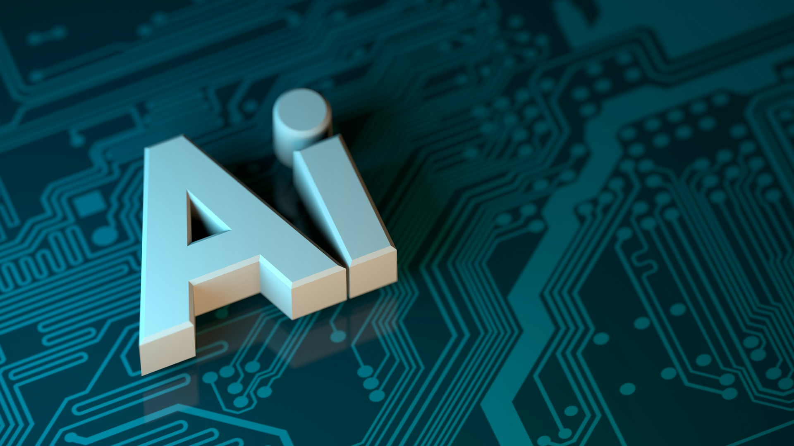

# When Security Vendors No Longer Own the Intelligence

2026-06-23

## The Challenger Becomes the Institution

Only a few years ago, the relationship between OpenAI and Anthropic appeared relatively easy to describe. OpenAI was the visible leader. It had introduced generative AI to a mass audience, built a rapidly expanding commercial platform, and encouraged companies across nearly every industry to reorganize their plans around artificial intelligence.

Anthropic occupied a different position. Founded by former OpenAI researchers, it presented itself as a company more willing to question the speed and direction of the industry. Its identity was closely connected to AI safety, responsible scaling, and the need to understand powerful models before releasing them too widely. OpenAI was often associated with commercial acceleration, while Anthropic could speak from the more cautious position of a challenger.

That distinction was partly philosophical, but it was also strategic. A smaller company can question the behavior of a market leader without carrying the same commercial responsibilities. It can argue that the industry is moving too quickly because it is not yet expected to supply infrastructure on which millions of customers depend. It can prioritize caution because it has fewer products, fewer enterprise commitments, and less pressure to remain ahead in every category.

Success changes that position. Anthropic is no longer simply a safety-oriented research company trying to catch up with OpenAI. It has become one of the central institutions of the AI economy. Claude is widely used for coding, research, enterprise work, content production, compliance, and increasingly sophisticated cybersecurity tasks. Major technology companies, financial institutions, cloud providers, and security vendors are building products and processes around Anthropic’s models.

As Anthropic’s technical and commercial importance has grown, the company has inherited the contradictions that accompany leadership. It must continue advancing its models while deciding which capabilities can be released, who should receive access, what restrictions should remain, and how those restrictions can be enforced. It must satisfy customers who want stronger models while assuring governments that those same models will not create unacceptable risks.

The company that once warned about the behavior of the incumbent must now confront the burdens of incumbency itself. This does not mean that Anthropic has abandoned its principles. The more interesting point is that principles take on a different meaning once they must operate inside a large commercial institution.

Safety can no longer remain mainly a research commitment or a public criticism of another company. It must become a working system that survives competition, customer demand, political intervention, technical failure, and deliberate attempts at misuse. The reversal is significant because OpenAI can now observe Anthropic facing problems that once appeared more closely associated with OpenAI.

Anthropic has become powerful enough for its safety decisions to influence national security discussions, enterprise strategies, and the direction of the cybersecurity industry. Its public statements are no longer merely arguments about what responsible AI should look like. They are decisions about how consequential technologies will actually be distributed.

Leadership has moved closer to Anthropic, but so has exposure.

## When Safety Becomes Part of the Product

[Project Glasswing](https://www.anthropic.com/glasswing/) reveals this tension clearly. Anthropic developed a model with unusually advanced cybersecurity capabilities and created a controlled program through which selected organizations could use those capabilities to examine important software systems. The stated purpose was defensive. Advanced AI could find weaknesses that had survived years of human inspection and conventional automated testing, allowing trusted organizations to repair those weaknesses before attackers discovered them.

The underlying idea is compelling. Software now supports financial systems, communication networks, transportation, healthcare, government services, and much of ordinary social life. Serious vulnerabilities can remain hidden for years because the amount of code is too large and complex for human researchers to examine completely. A model capable of reasoning across large codebases could give defenders an advantage that traditional security tools have not been able to provide.

Yet the same capability creates an immediate problem. A model that can discover a vulnerability can potentially help someone exploit it. A model that can reproduce an attack for validation can also explain how the attack works. A model that understands malware well enough to stop it may understand malware well enough to improve it.

Cybersecurity is not neatly divided into defensive and offensive knowledge. The same technical process may serve either purpose. What changes is the identity of the operator, the ownership of the system, the presence or absence of authorization, and the intended consequence of the action.

A prompt alone cannot always reveal those differences. A legitimate researcher and a criminal may ask technically similar questions. Both may claim to be conducting authorized testing, and both may request help identifying an attack path. The moral and legal distinction lies outside the technical content of the request, in facts that the model may not be able to verify independently.

Anthropic attempted to address this problem through a combination of model safeguards and controlled access. [Fable 5 and Mythos 5](https://www.anthropic.com/claude/mythos) represented different forms of access to the same underlying level of intelligence. Mythos-class capabilities could be supplied to trusted defenders through Glasswing, while Fable offered broader access with stronger restrictions around sensitive cyber and biological work.

This was more than a technical design. It became part of Anthropic’s public narrative. Mythos represented extraordinary capability placed in carefully selected hands, while Fable represented the possibility that the same general intelligence could be offered more broadly because safeguards would prevent dangerous forms of use.

The distinction was intellectually ambitious. It suggested that advanced intelligence did not have to remain entirely closed or entirely unrestricted. Different users could receive different forms of access according to their identity, purpose, and level of trust.

But it also created a fragile promise. Anthropic was effectively asking the public and governments to believe that the boundary between Fable and Mythos could be maintained reliably. Once concerns arose that safeguards might be bypassed, the issue was no longer an ordinary software weakness. It became a question about whether the central distinction between the two forms of access could be trusted.

The subsequent government directive restricting access to Fable and Mythos for foreign nationals demonstrated how quickly a model-safety question can become a matter of national policy. In [Anthropic’s statement on the access restrictions](https://www.anthropic.com/news/fable-mythos-access), the company disputed the technical basis and scope of the concerns, arguing that no universal bypass had been demonstrated. Even so, the episode showed that a company does not control the meaning of its technology once governments begin interpreting it through national security authorities.

Anthropic’s style of communication may have contributed to the intensity of the reaction. The company had strong reasons to explain why Mythos was important. It wanted to demonstrate the value of the model, attract trusted partners, and establish leadership in frontier cybersecurity. But repeated emphasis on the model’s exceptional and potentially dangerous abilities also raised the political stakes.

When a company describes a system as capable of transforming cybersecurity, officials may reasonably ask how it could transform cyber offense. When the company explains that the model is too capable for ordinary access, any apparent weakness in the access boundary becomes difficult to treat as a minor incident.

This does not mean Anthropic’s marketing caused the crisis. The government’s response, the uncertain state of AI regulation, the difficulty of evaluating jailbreak claims, and the dual-use nature of cyber research all played larger roles. Still, Anthropic had made exceptional capability and exceptional restraint central to its identity. That made any challenge to the restraint a challenge to the identity itself.

Safety had become part of the product promise.

## OpenAI Learns to Speak More Carefully

[OpenAI Daybreak](https://openai.com/daybreak/) faces the same fundamental contradiction. Its models can help defenders locate vulnerabilities, understand attack paths, generate patches, test corrections, and incorporate security into software development. Those abilities are valuable precisely because they are technically powerful. The same power that allows a model to understand how a system can be protected also allows it to understand how the system might be compromised.

OpenAI cannot remove this dual use through branding. Nor can it guarantee that every authorized user will remain trustworthy, that every account will remain secure, or that every downstream integration will be used as intended. Daybreak is structurally exposed to many of the same problems as Glasswing.

The difference lies in how OpenAI has organized and described the initiative. Daybreak is not presented primarily as one extraordinary model whose dangerous capabilities must be hidden from the public. It is described as a wider cybersecurity program involving models, Codex, Codex Security, trusted-access pathways, partner organizations, identity verification, account security, and supporting services.

Access depends on the organization, the proposed use, the level of risk, and the applicant’s potential contribution to the defensive security community. The [Daybreak Trusted Access for Cyber](https://help.openai.com/en/articles/20001258-openai-daybreak-trusted-access-for-cyber-overview) framework makes the surrounding process almost as important as the model itself.

The central question is not only what the technology can do, but who can use it, within which environment, under what controls, and for what purpose. That language is less dramatic than the story Anthropic constructed around Mythos. It is also easier to defend institutionally.

OpenAI can argue that risk is managed through several layers rather than through a single safeguard. Model behavior matters, but so do identity, authorization, workspace configuration, monitoring, account security, partner selection, and human review.

This is an interesting reversal in OpenAI’s position. The company once appeared to be the commercially aggressive actor from which Anthropic wanted to distinguish itself. OpenAI can now watch how Anthropic’s safety-centered presentation creates political and reputational pressure. It can structure its own initiative more procedurally, even while pursuing an equally ambitious commercial and technological strategy.

This should not be confused with restraint in the ordinary sense. Daybreak is expansive. OpenAI wants its models to become an important layer in secure software development, vulnerability research, remediation, and security services. It is building relationships with governments, enterprises, research organizations, and established cybersecurity vendors.

The caution lies in the form of expansion. OpenAI presents the model as one part of a professional system rather than as a nearly uncontrollable intelligence that only a select group may approach. The company is marketing capability through institutional reliability.

That approach may reduce the likelihood of a Glasswing-style controversy, but it creates another kind of risk. As Daybreak expands, more organizations will incorporate OpenAI’s cyber capabilities into their own products and services. Access will no longer be confined to a direct relationship between OpenAI and a small group of researchers. It will move through security platforms, consulting services, managed detection operations, software-development tools, and customer environments.

Anthropic’s most visible problem concerns the containment of a powerful model. OpenAI may eventually face the governance of an entire ecosystem. The difference is important, but neither problem is easy.

A limited model program creates intense pressure around who receives access. A broad partner network spreads capability more widely and increases the number of people, systems, accounts, and institutions that must behave responsibly. OpenAI has learned to speak more carefully, but careful language cannot eliminate the underlying tension.

## The Partnership That Is No Longer Optional

The changing role of cybersecurity vendors becomes visible in TrendAI’s recent partnerships. In April 2026, [TrendAI announced a strategic relationship with Anthropic](https://newsroom.trendmicro.com/2026-04-15-TrendAI-TM-Partners-with-Anthropic-to-Extend-Leadership-in-AI-Security), including the use of Claude models across its platform, security operations, automated workflows, and vulnerability research. It later joined Project Glasswing and integrated Anthropic capabilities more directly into parts of TrendAI Vision One.

Then, in June, [TrendAI joined the OpenAI Daybreak Cyber Partner Program](https://newsroom.trendmicro.com/2026-06-22-TrendAI-TM-Named-Trusted-Partner-in-the-OpenAI-Daybreak-Cyber-Partner-Program).

Viewed superficially, these announcements might look like a sequence of alliances with competing AI companies. One month, the company is associated with Anthropic. Soon afterward, it is associated with OpenAI. But this is not necessarily a contradiction or a change of allegiance. It is better understood as evidence of the new structure of the industry.

For a major cybersecurity vendor, partnership with frontier AI providers is becoming unavoidable. Security companies have developed machine-learning systems for many years. They have used automation to classify malware, identify unusual behavior, rank vulnerabilities, filter spam, and detect attacks across large volumes of data. Their products already contain substantial internal intelligence.

Frontier models introduce something different. They can reason across code, documentation, system configurations, threat reports, vulnerability histories, and natural-language instructions. They can connect information that conventional classifiers treat separately. They can participate in extended investigations and produce explanations, recommendations, or code changes that resemble the work of human analysts.

A security vendor could attempt to develop every part of this capability internally. But the cost would be enormous, and the frontier would continue moving. By the time an internal model approached the current abilities of Claude or GPT, the leading laboratories might already have advanced to another generation.

Partnership is therefore not simply a way to borrow a famous brand. It is becoming part of the basic infrastructure required to remain competitive.

Working with both Anthropic and OpenAI also reduces dependence on any single provider. A model may be strong in one type of code analysis but less reliable in another. One provider may offer better enterprise controls, while another offers stronger agentic capabilities. Access conditions may change. Governments may impose restrictions. Prices, interfaces, and product strategies may shift.

The Fable and Mythos controversy makes this risk concrete. A security vendor that had built its entire advanced research program around one restricted model could suddenly find that some employees or regions were no longer allowed to use it. A multi-model strategy provides technical flexibility and institutional resilience.

TrendAI is not alone in making this calculation. OpenAI and Anthropic are both building relationships with cloud providers, software companies, infrastructure operators, financial institutions, and major cybersecurity firms. Frontier AI partnerships are becoming normal components of security strategy rather than unusual experiments.

This creates a new difficulty. Once every large vendor can announce that it works with OpenAI, Anthropic, Google, Microsoft, NVIDIA, or another prominent AI company, the partnership itself no longer provides much differentiation. The names may attract attention during an announcement, but customers will soon ask what the vendor actually does with the technology.

Access is necessary, but it is not enough.

## The Intelligence Moves Upstream

Cybersecurity vendors have traditionally described their value through ownership. They developed proprietary detection engines, threat intelligence systems, malware-analysis techniques, behavioral models, vulnerability databases, and research methods. Their marketing emphasized technologies that competitors did not possess.

Customers purchased not only a service but a body of specialized intelligence created within the security company. The vendor’s engine was expected to recognize what others missed. Its researchers were expected to discover emerging threats first. Its accumulated data provided a defensive advantage.

Frontier AI changes this structure because some of the most advanced reasoning may now come from outside the security vendor. A company may still own the telemetry, the platform, and the customer relationship, but the model interpreting the information may be supplied by OpenAI or Anthropic.

The vendor chooses the model, connects it to internal systems, gives it access to selected data, evaluates its conclusions, and decides what actions may follow. Yet it does not fully control the intelligence on which those functions depend.

Important power therefore moves upstream. The frontier provider decides when a model is released, which capabilities are available, what safeguards apply, how much access costs, which regions are supported, and what kinds of use are permitted.

It may improve a feature, remove it, rename it, restrict it, or replace it. A security vendor can build a sophisticated product around the model while remaining exposed to decisions made by another company.

This creates the danger of becoming a thin wrapper. If several security vendors use similar models, customers may wonder whether they are purchasing distinctive innovation or merely different interfaces to the same intelligence. The underlying model provider may capture increasing value because improvements at that layer affect every downstream product.

The risk is serious, but it should not be overstated. A frontier model is not a complete security operation.

OpenAI and Anthropic do not automatically possess the full history of an enterprise’s endpoints, identities, cloud workloads, email systems, network activity, vulnerabilities, and previous incidents. They do not necessarily know which assets are critical, which behavior is normal, which regulations apply, or which actions the organization is prepared to automate.

They also do not have authority to isolate a machine, block a connection, apply a virtual patch, open an incident, or coordinate a response team unless someone gives them that authority through another system. Security vendors remain important because intelligence requires context and consequence.

A model may identify a possible vulnerability in a codebase. The vendor must determine whether the finding is real, whether the affected component is deployed, whether it can be exploited within the customer’s environment, and whether remediation will disrupt an essential service.

A model may recommend isolating an endpoint. The security platform must understand whether that endpoint belongs to an ordinary employee or controls a critical production process. The difference between an impressive answer and a useful security outcome is often found in these details.

This is where companies such as TrendAI retain substantial value. They possess long-running threat-research programs, vulnerability-disclosure relationships, global telemetry, product integrations, detection infrastructure, and experience responding to real incidents. They can place model reasoning within an environment shaped by decades of security work.

The competitive advantage is no longer found only in owning the intelligence. It is increasingly found in knowing what the intelligence should see, what it should be allowed to do, and how its conclusions should be tested.

## From Proprietary Engines to Intelligence Orchestration

This transformation can be described as a movement from technology ownership toward intelligence orchestration. Orchestration does not mean sending every problem to the same model. It requires deciding which model should handle which task, what information should be provided, how sensitive data should be protected, what tools the model may use, and where human approval remains necessary.

One model may be used to inspect source code, while another summarizes an incident. A smaller internal model may handle sensitive customer data, while a frontier model examines a carefully limited abstraction of the problem. Conventional detection rules may continue to block known threats immediately, while an agentic system investigates uncertain cases over a longer period.

The quality of the security product will depend on how these elements work together. This is less visually impressive than releasing a new foundation model, but it may matter more to customers.

Organizations do not primarily need a model that performs well during demonstrations. They need fewer false alarms, faster investigations, more accurate prioritization, safer remediation, and clearer explanations of risk.

A vendor should therefore be judged not by how often it mentions AI, but by whether the technology changes the customer’s security experience. Does an analyst resolve cases more quickly? Are serious vulnerabilities identified earlier? Can the platform connect weak signals that were previously separated? Does automated action remain understandable and reversible? Can the organization demonstrate why a decision was made?

These questions reveal why proprietary data remains important. A frontier model may contain broad knowledge, but security decisions require current and specific information. The model needs to know what is happening in the environment now. It needs reliable telemetry, asset relationships, vulnerability status, identity context, historical patterns, and threat intelligence.

Data alone is not a sufficient advantage. Every security vendor possesses large quantities of information. The value lies in whether the data is accurate, timely, connected, and meaningful. Poorly organized telemetry can confuse an advanced model just as easily as it confuses a human analyst.

Human expertise also remains central. Experienced researchers know that a technically possible attack is not always a probable one. Security operations teams understand that the most severe alert is not always the most urgent. Incident responders recognize when a system should be isolated immediately and when doing so would create greater harm.

The strongest use of AI may not replace this judgment. It may allow judgment to operate across a larger field.

A human analyst cannot manually examine every event generated by a global enterprise. A model can reduce the field, connect related information, and present the most important evidence. The analyst then applies accountability, organizational knowledge, and practical judgment.

The relationship is not simply human versus machine. It is a distribution of attention and responsibility. Cybersecurity vendors may become the institutions that organize this distribution. They will decide where frontier intelligence enters the workflow, how far it may act, and when responsibility must return to a person.

This gives them a role that the frontier laboratories cannot easily absorb. OpenAI and Anthropic can produce powerful general models, but they may not want to become the direct operator of every customer’s security environment. Doing so would require extensive product integration, regional compliance, continuous support, industry-specific knowledge, and responsibility for operational failures.

Security vendors already occupy that space. Their future depends on making it more valuable rather than merely adding an external model to it.

## The New Meaning of Leadership

The changing relationship between OpenAI and Anthropic shows how quickly leadership can reverse. Anthropic began as the challenger that placed safety at the center of its criticism of the industry. Its success has now made it responsible for decisions that cannot be resolved through principles alone. Glasswing, Mythos, and Fable demonstrate the difficulty of distributing powerful capability while preserving control over its use.

OpenAI has also changed. The company still moves aggressively, but Daybreak shows a more institutional style of expansion. It emphasizes access structures, verified users, partner ecosystems, security workflows, and layered governance. OpenAI appears to understand that the presentation of power can become as consequential as the power itself.

Neither company has solved the dual-use problem. Anthropic’s safety-centered identity does not guarantee perfect safeguards. OpenAI’s procedural structure does not guarantee that a wider ecosystem will remain controllable. Both are trying to turn frontier intelligence into a professional capability before society has fully decided how such capability should be governed.

Cybersecurity vendors face a related transformation. They can no longer define leadership only through the technologies they developed internally. The most advanced general intelligence may come from companies that did not grow out of the traditional security industry.

This creates dependency, but not necessarily irrelevance. Security vendors still possess the context, infrastructure, relationships, and authority required to turn intelligence into protection. Their challenge is to prove that these contributions form a genuine source of innovation rather than a supporting layer around someone else’s model.

Partnerships with Anthropic and OpenAI are becoming non-negotiable. The meaningful distinction will come afterward.

A strong security vendor will not simply promote that it has access to Claude or GPT. It will demonstrate that the model becomes more useful, more accurate, and more responsible when placed inside its platform. It will connect general reasoning to proprietary threat knowledge, turn suggestions into controlled actions, and recognize when uncertainty requires human judgment.

Leadership will therefore be measured less by possession and more by integration. The important question will not be who owns the most intelligent model, but who can make intelligence dependable within the conditions of actual work.

That question applies to the frontier laboratories as well. Anthropic must prove that safety can survive commercial success. OpenAI must prove that a large partner ecosystem can expand without dissolving responsibility. TrendAI and other security vendors must prove that dependence on external models does not reduce them to interchangeable channels.

The emerging landscape is not simply one in which AI companies replace cybersecurity companies. It is a new division of labor. Frontier laboratories create broad reasoning systems. Security vendors provide domain knowledge, telemetry, workflows, governance, and operational reach. Customers provide the environments in which the consequences become real.

None of these participants controls the full system alone. This may be the most important change.

Cybersecurity was once presented as a contest among vendors that owned separate technologies. It is becoming a network of interdependent institutions sharing intelligence, data, tools, and responsibility. The resulting system may be more capable than anything the industry previously possessed, but it may also be harder to govern because no single company can fully explain or control every layer.

The future of cybersecurity will not be secured by intelligence alone. Intelligence must be placed within a structure that can determine what it knows, what it may do, whose interests it serves, and who remains answerable for the result.

The companies that learn to provide that structure may become the real leaders of the AI security era.

Photo by [Numan Ali](https://unsplash.com/@king_designer99?utm_source=unsplash&utm_medium=referral&utm_content=creditCopyText) on [Unsplash](https://unsplash.com/photos/the-letter-a-is-placed-on-top-of-a-circuit-board-llNtovr7ctk?utm_source=unsplash&utm_medium=referral&utm_content=creditCopyText)