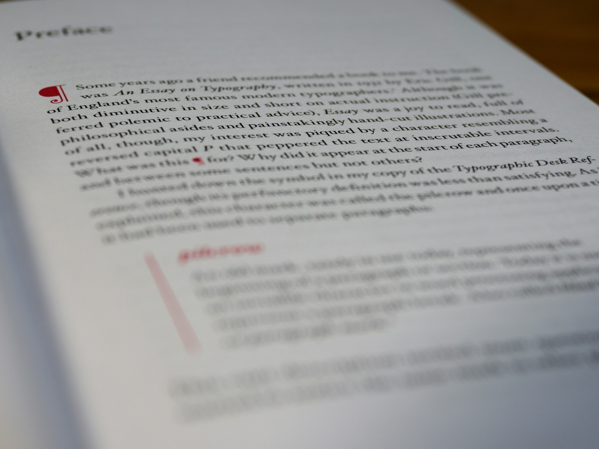

# The Lost Paragraph 

Recovering Sustained Thought in an Age of Fragmented Information

2026-06-26 

## Full of Information, Hungry for Understanding

We live in a time of extraordinary informational abundance. From the moment we wake up, messages, headlines, clips, alerts, posts, newsletters, and recommendations begin competing for our attention. During the working day, this stream expands to include emails, chat notifications, dashboards, meetings, slide decks, recorded presentations, and webinars. By evening, we may have consumed more individual pieces of information than a person from an earlier generation encountered in several days.

Yet abundance has not necessarily made us feel better informed. Many people finish the day with the strange sense that they have been reading, watching, and listening continuously, but have learned almost nothing they can clearly explain. They remember a striking phrase, an image, a moment of outrage, or a surprising statistic. They may struggle, however, to describe the argument surrounding it or place it within a larger understanding.

This condition is often described as information overload, but the problem is not simply the quantity of information. A long book may contain far more information than a day of social media browsing, yet the book may leave the reader calmer and more intellectually satisfied. It offers an architecture. Chapters follow one another, sections develop particular questions, and paragraphs guide the reader through distinct movements of thought. The reader may not remember every sentence, but the parts gradually form a whole.

Fragmented information behaves differently. Each item arrives as an interruption and must be interpreted independently. Before one idea can settle into memory or connect with something previously understood, another item replaces it. Attention remains active, but understanding does not accumulate. The mind works constantly without gaining the sense of completion that comes from following a sustained argument.

The experience resembles eating countless boxes of snacks. Each one offers an immediate flavor and a small moment of satisfaction. Because the portions are small, we continue reaching for another. After consuming a great deal, we may feel full in one sense, but poorly nourished in another. The body has received calories without receiving what it needs for lasting health.

The same can happen in our intellectual lives. We consume large amounts of informational material, but much of it has been designed for quick reaction rather than sustained understanding. It gives us stimulation without structure, familiarity without mastery, and opinion without sufficient reflection. We keep consuming because each item feels incomplete, but the next item rarely completes what the previous one began.

This helps explain why modern information consumption can be both exhausting and strangely empty. We are not merely carrying too much content. We are repeatedly forced to construct missing relationships among disconnected pieces. Each fragment asks for attention without explaining its place within a larger framework. The reader must decide what matters, what supports what, and whether any of the pieces belong together.

The deeper crisis, therefore, may not be that we receive too much information. It may be that we receive too little structure. We have become efficient at circulating sentences, images, clips, and bullet points, but less confident in assembling them into developed thought. To understand what has been lost, we need to return to one of the simplest structures in writing: the paragraph.

## The Smallest Developed Thought

A sentence can say a great deal. It can make an assertion, ask a question, issue a command, express an emotion, or capture a sudden insight. A memorable sentence may remain with a reader for years. Even so, a sentence normally presents only one moment in the life of an idea. It tells us what someone thinks, but not always why, how, under what conditions, or with what consequences.

A paragraph gives the thought room to develop. The first sentence may introduce a claim, while the sentences that follow explain its meaning, provide an example, establish a connection, or respond to an obvious objection. By the time the paragraph reaches completion, the reader has received more than a statement. The reader has followed a movement.

This is why the paragraph can be understood as the minimal unit of developed thought. The sentence remains its essential building material, but the paragraph creates the first level at which relationships become visible. Cause can be connected to effect. A principle can be tested against an example. An initial claim can be limited by a qualification. Two positions can be compared rather than merely announced.

Traditional instruction often describes a paragraph as containing a topic sentence, a supporting body, and a concluding sentence. This remains a useful model because it teaches writers to introduce, develop, and complete an idea. Mature prose may use the structure more flexibly. A paragraph may begin with a scene and arrive at its central claim later. It may conclude with a transition rather than a summary. It may even leave a carefully framed question open.

The essential point is not that every paragraph must obey a fixed formula. It is that the sentences within it must belong together. They should perform one recognizable intellectual task. When the paragraph ends, something should have been established, clarified, complicated, or prepared for what follows.

Paragraphs then combine into larger structures. Several paragraphs may examine different sides of the same issue and form a section. Several sections may build an essay or chapter. Chapters may become a book, and several books may contribute to a larger body of work. At each level, meaning emerges not only from the individual parts but from the relationships among them.

This hierarchy is more than a formal convention inherited from printed books. It helps readers understand scale. A sentence makes a local move. A paragraph develops one thought. A section advances one stage of an argument. A chapter places that stage within a broader inquiry. Without these levels, the reader encounters statements but may not understand their function within the whole.

One-sentence paragraphs can still have a legitimate role. A writer may use one to mark a decisive conclusion, create a pause, or give unusual emphasis to a thought that deserves to stand alone. Its force, however, depends on contrast. It works because the surrounding paragraphs have already carried the burden of development.

When nearly every sentence appears as a separate paragraph, that contrast disappears. The page may look clean and spacious, but the prose no longer shows which sentences belong together. Every line appears equally isolated and equally emphasized. The reader is invited to react to one statement at a time rather than follow a complete progression.

The loss is not only stylistic. Paragraph writing, paragraph reading, and paragraph thinking are closely connected skills. Writing a paragraph requires us to develop an idea beyond the initial reaction. Reading one requires us to hold several sentences together before deciding what they mean. Thinking in paragraphs requires us to resist premature judgment and allow relationships, qualifications, and consequences to become visible.

## What Gives Length and Shortness Their Value

The defense of the paragraph should not become a simple defense of length for its own sake. Long writing can be repetitive, inflated, and poorly organized. A writer may use many words because the central idea remains unclear. Modern AI systems make this kind of expansion especially easy because they can produce fluent sentences long after the underlying thought has been exhausted.

The proper length of an article depends on what it needs to accomplish. A focused question may be answered well in one thousand words. A subject involving history, competing theories, ethical tensions, and practical consequences may require several thousand. Length becomes necessary when the subject contains distinctions that cannot be removed without making the account misleading or superficial.

For the kind of reflective and analytical writing that examines several perspectives, two thousand words is often a reasonable starting point. It gives the writer enough space to move beyond assertion. An idea can be introduced, tested, placed within context, and considered from another angle. The reader can see not only the conclusion but the path by which it was reached.

Necessary length is therefore not verbal abundance. It is the space required for intellectual completeness. A serious article becomes long because it contains several developed thoughts, not because each simple thought has been stretched into several versions. Every paragraph should add something that changes, deepens, or clarifies the reader’s understanding.

Shortness also has genuine value, but its value is often misunderstood. A strong summary is not simply a small amount of text. It is the result of having understood a larger structure well enough to preserve what matters most. Brevity becomes meaningful when it represents concentration rather than absence.

A two-hundred-word abstract may carry the substance of a long research paper because every sentence corresponds to something fully developed in the original. An executive summary may allow a leader to grasp the main decision, risks, and recommendations without reading the entire report immediately. The short form works because the longer structure exists behind it.

This creates an important distinction between compressed content and undeveloped content. Both may be brief, but they are intellectually different. Compressed content has depth that can be recovered by returning to the full source. Undeveloped content has no larger structure behind it. Its brevity comes not from disciplined selection but from the fact that the thought was never completed.

Micro-learning must be understood in the same balanced way. Small lessons can be effective for memorization, repeated practice, vocabulary building, or the acquisition of a specific technical action. Breaking a task into manageable steps often helps people begin. The difficulty arises when the micro-unit becomes the dominant model for all forms of learning.

Knowledge may begin with small pieces, but it cannot remain there. Facts must be connected to concepts. Concepts must be compared, tested, and placed within systems. Individual lessons must belong to a curriculum, and isolated observations must eventually contribute to interpretation. Accumulation without integration produces familiarity, but not necessarily understanding.

The relationship between length and shortness is therefore asymmetrical. A substantial long work can be shortened in many useful ways. It can become an abstract, a presentation, a brief explanation, a set of key points, or a social post. A thin short statement cannot be transformed into substantial thought merely by extending its wording. Something must first be discovered, considered, or argued.

## The Over-Seasoned Information Diet

The fragmented information environment does more than weaken attention. It also changes the character of the content being produced. When every item must compete with thousands of others, moderation becomes a disadvantage. A statement must be sharper, more surprising, more frightening, more amusing, or more morally certain than the surrounding material.

This resembles the way some processed foods are designed. A simple flavor may not be enough to keep the consumer reaching for another portion. The product must become sweeter, saltier, spicier, or richer. The goal is not nourishment but continued consumption.

Information can be engineered in a similar way. Headlines intensify uncertainty into danger. Disagreement becomes betrayal. An unfortunate event becomes evidence of total decline. A complex person is reduced to a hero or villain. The content succeeds when it produces an immediate reaction strong enough to secure attention and encourage sharing.

The problem is not merely that these messages are short. A short statement can be careful and truthful. The greater problem is that the statement has been separated from the paragraph, the argument, and the surrounding context that might limit its emotional force. Qualifications disappear because they reduce certainty. Counterexamples disappear because they interrupt the preferred reaction.

A paragraph introduces resistance to this process. Once a writer must develop a claim, questions begin to appear. Does the statement apply in every case? What evidence supports it? What conditions might change the conclusion? How would someone with a different experience interpret the same event? The paragraph creates space for complexity before the judgment becomes final.

This does not mean that fragmented media alone has caused political, social, or cultural division. Economic insecurity, historical conflict, institutional distrust, strategic propaganda, inequality, and genuine differences of principle all matter. Fragmentation is better understood as a system that intensifies these tensions and circulates them in forms that discourage careful examination.

People are increasingly exposed not to the same developed arguments, but to different sequences of emotionally charged fragments. One group receives a series of stories confirming that society is collapsing in one direction. Another receives a different series showing collapse in the opposite direction. The fragments may not form coherent arguments, but they produce a consistent emotional atmosphere.

This is one reason public disagreement often feels more absolute than before. Participants may not be arriving at different conclusions after studying the same body of evidence. They may be inhabiting separate streams of selected events, phrases, images, and interpretations. Each stream creates its own sense of what is obvious.

The paragraph approach cannot remove every division, nor should it. Some disagreements are real and cannot be solved by better formatting. It can, however, improve the conditions under which disagreement occurs. A paragraph asks people to explain what they mean, make distinctions, acknowledge limits, and show how one claim leads to another.

When a culture loses patience with paragraphs, it may also lose patience with nuance. It becomes harder to say that one concern is legitimate while a proposed solution is mistaken, or that a person may be right about one matter and wrong about another. The fragment rewards immediate classification. The paragraph allows judgment to remain open long enough for thought to become more responsible.

## The Workplace of Open Loops

The same fragmentation has entered workplace communication. Many employees now spend their days moving among chat applications, email, meetings, project tools, dashboards, documents, and recorded sessions. The volume of communication has increased, but the amount of context within each interaction has often decreased.

A message may begin with a single “Hi.” After the recipient responds, another message appears: “Are you free?” Only after a further exchange does the subject emerge. What could have been communicated in one complete paragraph becomes a sequence of interruptions.

The stress created by this pattern is easy to underestimate. The recipient does not know whether the approaching request concerns a minor clarification, an urgent problem, a difficult decision, or an additional hour of work. The conversation has been opened without revealing its shape. Until the missing information arrives, the mind must keep the interaction unresolved.

One incomplete message may not matter. Dozens of them throughout the day create a workplace filled with open cognitive loops. Each conversation demands some degree of attention, but few provide enough information for the recipient to decide what must be done. The individual fragments are small, yet their combined effect can be exhausting.

The problem is not brevity itself. A brief message can be complete. “The client has approved the revised draft, so no further action is needed today” is short, but it closes the issue. “Can we talk?” is also short, but it creates uncertainty because it withholds the subject, purpose, and urgency.

A paragraph-style message may appear more demanding because it occupies more space on the screen. In practice, it can save time. The sender explains the background, identifies the question, and makes the expected response clear. The recipient can understand the request in one reading rather than extract it through repeated exchanges.

This is why paragraph writing can be considered a form of intellectual hospitality. The writer asks what another person needs in order to understand the situation. Relevant context is included, unnecessary detail is removed, and the purpose is stated clearly. Good communication is not measured only by how quickly the sender can type it.

Paragraph reading is equally important. People sometimes respond to the first sentence of a message without reading the explanation that follows. They may answer a preliminary point while missing the actual request in the final paragraph. This produces another round of clarification and reinforces the belief that long messages are inefficient.

To read a paragraph well is to delay reaction until the thought has reached its intended form. The reader holds several sentences together, notices their relationships, and distinguishes background from conclusion. In this sense, paragraph reading is closely related to listening. Both require us to receive more than the first available signal.

Corporate communication often celebrates speed, but speed should be measured across the entire interaction. A fragmented message may save the sender twenty seconds and cost several colleagues ten minutes each. A complete paragraph may take longer to write and still be the more efficient choice. It reduces uncertainty, prevents correction, and allows work to move forward with fewer interruptions.

## Beyond the Webinar and Slide Deck Party

Fragmentation also shapes the way organizations attempt to teach. Businesses organize webinars, town halls, short training modules, and slide presentations in large numbers. These activities are visible and easy to record. Attendance can be measured, links can be circulated, and completion rates can be reported.

A one-hour webinar may appear substantial. The presenter speaks confidently, the slides are polished, and the audience hears an organized sequence of ideas. When the session ends, however, many listeners discover that little remains. They remember the presenter’s style, a colorful diagram, or one striking phrase, but not the reasoning that connected the parts.

This is partly because spoken presentations move at the speaker’s pace. The listener cannot always stop to examine a definition, return to an earlier claim, or compare two sections. A moment of distraction may remove the link between several later points. Once the presenter advances, the previous slide disappears.

Reading gives control of time back to the learner. A reader can pause, reread, annotate, question a claim, or compare the conclusion with the opening premise. The written argument remains available. Its structure can be inspected rather than merely experienced.

This is one reason books and substantial articles remain essential to serious learning. They do not simply contain more information. They allow the learner to establish a personal rhythm of engagement. Difficult passages can receive more time. Familiar material can be read quickly. Understanding develops through active movement rather than passive exposure.

Slide decks have a related limitation. A slide normally contains a title, a few bullet points, and perhaps a diagram. The connections among those elements often exist mainly in the speaker’s explanation. Once the presentation is over, the deck may no longer function as an independent intellectual object.

This does not make webinars or presentations useless. They are valuable for demonstrations, live questioning, discussion, emotional communication, and collective alignment. A skilled presenter can make a difficult subject approachable and help an audience see why it matters. The problem begins when the presentation replaces the substantial written source rather than leading toward it.

A stronger model would be to read first and discuss second. Participants receive a coherent document before the meeting. They encounter the reasoning at their own pace and arrive prepared with questions. The live session can then focus on disagreement, clarification, interpretation, and decision.

The usual objection is that people do not have time to read. Yet many of those same people spend several hours each week attending meetings and webinars that produce little retention. A twenty-page document may appear demanding, but it can be efficient if it prevents repeated explanations, unclear decisions, and weeks of misaligned work.

The essential principle is that the full argument should exist somewhere. The webinar, slide deck, summary, and short message may provide access to it, but they should not become substitutes for it. Without a substantial source, an organization may communicate continuously while never completing its own thought.

## The Substantial Original in the Age of AI

Generative AI has made the question of length more complicated. It is now possible to produce several thousand words from a small prompt within seconds. The resulting prose may be grammatically correct, fluent, and professionally organized. None of these qualities guarantees that the text contains several thousand words of thought.

A limited idea can be expanded through paraphrase, repetition, generic examples, and broad transitions. The language grows while the intellectual content remains nearly unchanged. This creates the appearance of depth without the work that depth requires.

Writers therefore need to distinguish necessary expansion from verbal expansion. Necessary expansion introduces a new distinction, example, objection, historical connection, implication, or perspective. It changes the reader’s understanding. Verbal expansion merely says the same thing again in a slightly different form.

This distinction is easier to recognize when a writer has been trained to think in paragraphs. Each paragraph must have a purpose. If two paragraphs perform the same function, one may be unnecessary. If a paragraph contains several unrelated movements, it may need to be divided and clarified. Paragraph structure becomes a practical test of whether length has been earned.

AI becomes more useful when it works from a substantial original rather than attempting to manufacture substance afterward. A writer can first develop the complete argument, preserving its complexity and qualifications. Readers can then use AI to summarize it, translate it, extract key points, create questions, or adapt it for different levels of knowledge.

This is the proper value of shortness in the age of AI. A long work does not need to be reduced before publication simply because some readers prefer a shorter entry point. The full version can remain available, while technology creates several paths into it. One reader may choose the summary. Another may read selected sections. Another may follow the essay from beginning to end.

The asymmetry remains important. AI can compress a developed structure while preserving part of its value. It cannot reliably recover thoughts that were never developed. When asked to enlarge a thin statement, it can produce plausible language, but plausibility is not the same as insight.

Recovering the paragraph does not require rejecting short videos, micro-learning, social media, presentations, chat applications, or AI. These forms can all serve useful purposes. The task is to restore the relationship between the fragment and the whole. A short lesson should belong to a larger course. A summary should point toward a substantial source. A note should become part of reflection. A message should complete its communicative purpose.

A healthy intellectual life can include small portions. The small portion, however, should come from real nourishment. It should contain the concentration of something that has been fully prepared rather than the artificial intensity of something designed only to stimulate appetite.

The paragraph remains one of the simplest tools for making that distinction visible. It gives an idea enough room to become more than a reaction. It asks the writer to develop the thought, the reader to receive it fully, and both to recognize how one part belongs to another.

Recovering paragraph writing, paragraph reading, and paragraph thinking would therefore mean recovering more than an old literary habit. It would mean recovering the patience to complete a thought, the discipline to understand it in context, and the capacity to transform scattered information into knowledge.

Photo by [Brett Jordan](https://unsplash.com/@brett_jordan?utm_source=unsplash&utm_medium=referral&utm_content=creditCopyText) on [Unsplash](https://unsplash.com/photos/text-mO2MgoYLe5w?utm_source=unsplash&utm_medium=referral&utm_content=creditCopyText)
