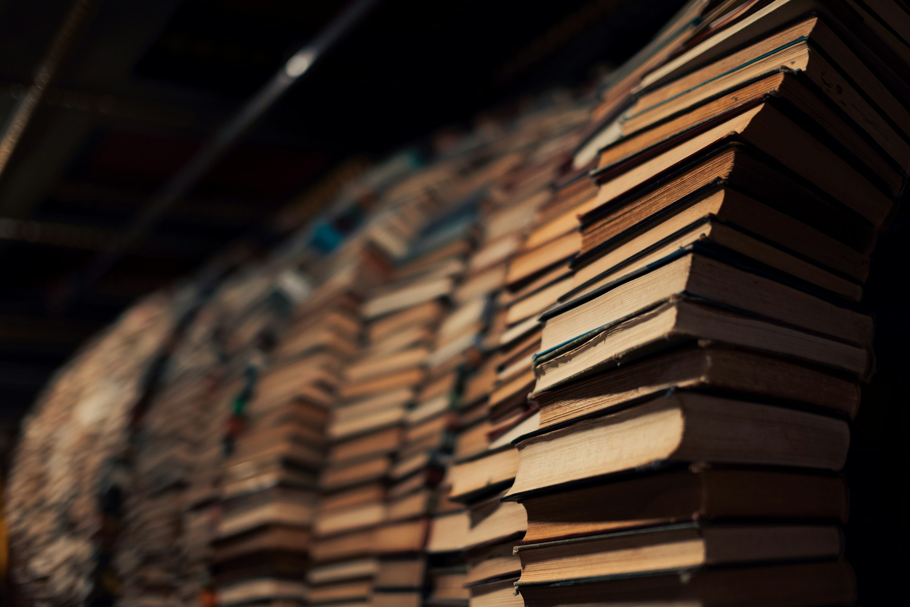

# The Work Beneath the Tools

2026-06-30

## Before the Second Brain

Long before digital devices became part of everyday life, intellectual work was carried by paper. The notebook was the most natural instrument because it was already familiar from school. We used it to copy lessons, solve problems, record experiences, and occasionally write down thoughts that did not belong to any formal assignment. For many people, the habit of writing began there, without being called a method or a productivity system.

A notebook offered continuity. One page followed another, and each entry remained connected to the day, place, and circumstances in which it was written. A diary preserved the movement of a life through time. A school notebook preserved the development of a subject. A personal journal slowly revealed the repetition of certain concerns, memories, and questions. Even when the writer had no larger purpose in mind, the notebook became a place where experience could remain long enough to be reconsidered.

As writing became habitual, it gradually changed its role. It was no longer only a way to record what had happened. It became a way to discover what one thought. A person might begin by describing an ordinary event and then notice a question beneath it. A conversation could open into a reflection on friendship, work, ambition, or disappointment. A childhood memory could reveal something about the person one had become. The act of writing allowed small experiences to remain present until their deeper meaning began to appear.

The notebook was therefore already much more than a container. It preserved continuity between the person who wrote yesterday and the person who returned to the page today. Yet its chronological structure also placed certain limits on how ideas could be reorganized. One thought followed another because that was the order in which they had been written, not necessarily because that was the most meaningful relationship between them.

A different possibility emerged when the individual note became movable.

## The Card as a Movable Unit of Thought

Tadao Umesao developed this possibility in *[The Art of Intellectual Production](https://en.wikipedia.org/wiki/Tadao_Umesao)*, originally published in Japanese as *Chiteki Seisan no Gijutsu* in 1969. The date matters. Personal computers, digital databases, cloud storage, and smartphones did not yet exist, but Umesao was already thinking systematically about how ordinary people could capture, organize, rearrange, and develop knowledge.

Even the phrase “intellectual production” was striking. Intellectual activity was often associated with scholars, researchers, writers, or other specialists. Umesao treated it more broadly as a practical activity relevant to people in general. His book was not written only for academics working within universities. It addressed anyone who needed to collect information, develop ideas, write clearly, and produce something meaningful from experience and knowledge.

This was one reason the book was pioneering. It did not present intellectual work as a mysterious gift possessed by a talented minority. It described it as a set of practices that could be examined, improved, and shared. Reading, note-taking, filing, drafting, and organizing ideas became parts of a recognizable process. In that sense, Umesao anticipated much of what is now discussed under knowledge work, personal knowledge management, and the second brain.

Umesao was an anthropologist and scholar of comparative civilization. He also became the first director-general of the National Museum of Ethnology in Osaka. His role there was closely connected to his broader vision of knowledge as something that should be collected, organized, compared, developed, and communicated.

This connection is personally meaningful to me. During my graduate years in Osaka, I worked part-time at the National Museum of Ethnology. I was excited to be working in an institution so closely associated with a thinker whose approach to knowledge had influenced my own intellectual habits. It was not merely a museum displaying cultural objects. It was also a research institution shaped by an energetic belief in the production and circulation of knowledge.

Umesao’s working materials are preserved there. His cards, notes, folders, field records, sketches, manuscripts, and related documents reveal not only the results of his scholarship but also the process through which his ideas developed. To encounter such materials is to see intellectual work in its unfinished form. The archive preserves the traces of thought before they became books, arguments, or public knowledge.

Umesao’s movement from notebooks to cards represented a different understanding of intellectual work. A notebook preserves sequence, while a card allows movement. By placing only one topic on each card, an idea becomes independent of the order in which it first appeared. It can be moved, grouped, compared, separated, and placed beside another idea that emerged months or years later.

The card becomes a unit of thought. Its physical boundary encourages the writer to give each note a certain coherence, while its independence allows it to enter new relationships. Cards can be spread across a table, arranged into temporary groups, and reorganized until a pattern begins to appear. A larger argument may emerge from fragments that were recorded in completely different situations.

For a global audience, the better-known example may be the Zettelkasten of the German sociologist Niklas Luhmann. The German term refers to a slip box or note box. Luhmann developed an enormous collection of handwritten notes connected through numbers and internal references. The system became central to his research and to his unusually extensive body of published work.

Umesao’s cards and Luhmann’s Zettelkasten were not identical. They emerged from different intellectual traditions and reflected different working habits. Umesao emphasized cards that could be sorted and physically reorganized, while Luhmann developed a dense network in which one note led to others through internal links.

Yet both systems rested on a similar recognition. A note becomes more intellectually productive when it can be separated from its original context and brought into new relationships. The card box was therefore not merely a container from which stored information could be retrieved. It was an external space in which patterns, arguments, and theories could begin to form.

This distinction remains important today. The value of a note does not lie only in its preservation. It lies in what becomes possible when the note encounters another thought. The card system made that encounter physical. Digital systems now make it searchable and linkable.

Even in this older world of notebooks, cards, folders, and slip boxes, however, the central activity remained writing. The system could preserve a thought and bring it into contact with other thoughts, but someone still had to notice the idea, formulate it, test it, and eventually turn it into sustained work.

## From Card Boxes to Digital Vaults

The modern second brain continues the same desire to place thought outside the limits of immediate memory. The card box has become a folder, a cloud drive, a database, or a collection of linked Markdown files. The physical index has become search. Dividers have become tags. The act of shuffling cards has become linking notes, filtering results, or moving blocks of text across a screen.

Applications such as Evernote, Notion, Obsidian, and Google Docs have made personal archives easier to build and maintain. A note can be written on one device and opened on another. A phrase can be found within seconds, even if it was recorded years earlier. Notes can belong to several categories at once, and links can reveal connections that would have been difficult to maintain in a physical system.

These developments are genuinely valuable. They reduce the friction between an idea and its preservation. They allow a person to carry a large intellectual archive in a pocket. They make it possible to continue working while moving between home, office, travel, and public spaces. With the support of AI, notes can also be summarized, reorganized, compared, translated, and retrieved through natural language.

We are fortunate to have these tools. Earlier writers depended on paper, libraries, copyists, typists, assistants, or institutions. A person working today can conduct research, draft an essay, translate a passage, check a reference, and revise a paragraph with a single device. Many forms of intellectual assistance that were once available only to a limited number of people have become widely accessible.

But abundance creates its own difficulty. Because so many tools are available, choosing and maintaining them can become a substantial activity. Articles and videos continually introduce new note-taking systems, new applications, new templates, and new theories of productivity. Each promises a smoother workflow or a more complete method for organizing knowledge.

It is easy to become absorbed in this world. We compare applications, redesign our folder structures, adjust tags, install plug-ins, and move our notes from one platform to another. We read about the best way to read, the best way to write, and the best way to remember what we have read. The entire process feels intellectual because it is connected to books, ideas, and knowledge.

Yet the presence of many notes does not necessarily mean that thought has deepened. A carefully maintained digital vault may contain thousands of fragments while producing very little finished work. The archive may expand without becoming an essay, theory, reflection, or work of art.

A system can preserve the ingredients, but it cannot cook the meal. It can store what we have encountered, but it cannot decide what matters. It can show us relationships among notes, but it cannot guarantee that those relationships will become meaningful. The difference between storage and intellectual production remains as important in the digital age as it was in the age of paper.

## When the System Begins to Replace the Work

The danger does not lie in the tools themselves. The danger appears when the maintenance of the system begins to replace the activity the system was created to support.

There is a form of productivity that is devoted almost entirely to improving productivity. We spend time designing the perfect workflow so that, at some later point, we can begin the real work under ideal conditions. We reorganize our notes, refine our templates, and search for better methods. The preparation continues, but the work itself remains postponed.

This can be called meta-productivity. It is activity concerned with the conditions of work rather than the substance of work. Some attention to method is necessary. Every writer needs to determine how to capture ideas, preserve drafts, and return to unfinished material. But method should gradually disappear into practice. A tool is most useful when it becomes ordinary enough that we stop thinking about it.

Life-hack articles often belong to the same world. They can be enjoyable, practical, and inspiring. They may help us establish a routine, reduce distraction, or recognize a habit that has been quietly consuming our time. In this sense, they perform a legitimate service.

Self-help books can also provide encouragement and direction. They remind us that change is possible and that a life can be shaped through repeated choices. They may help a person begin exercising, journaling, reading, or paying closer attention to relationships.

The difficulty begins when reading about how to live becomes a substitute for examining one’s own life. We can consume endless advice about purpose, discipline, and focus without asking what our discipline should serve or what deserves our focus. We may become efficient without becoming clear.

The deeper questions are usually less glamorous than the latest productivity method. What is essential in my life? What is worth exploring through my intellectual work, reflection, and contemplation? What concern continues to return even when I try to ignore it? What kind of work would still matter to me if nobody praised it?

These questions do not require grand philosophical language. They may begin with something very small. A memory that repeatedly returns may contain a question about identity. A frustration at work may reveal a conflict between ambition and integrity. A family story may open into a reflection on gratitude, obligation, or aging. A simple observation during a walk may lead to a deeper understanding of time.

Journaling allows these small beginnings to remain present. It gives ordinary experience enough duration to disclose its meaning. We do not need to begin with a complete argument. We begin with what happened, what we felt, or what we cannot stop thinking about. Through writing, the essential may gradually separate itself from the trivial.

This is why the proper order matters. Tools support habits. Habits support writing. Writing supports reflection. Reflection helps us recognize what is essential. When the order is reversed, the tool becomes the center and the purpose becomes unclear.

## The Necessary Work of Forgetting

Most systems of knowledge management are designed to prevent forgetting. They encourage us to capture everything, preserve everything, and make everything retrievable. Forgetting appears to be a failure of the system.

Yet serious intellectual work also depends on the ability to let something leave conscious attention.

The process often begins with effort. We read, take notes, write fragments, compare ideas, and return repeatedly to a question. We think until the mind becomes saturated. At this stage, concentration is necessary. The unconscious cannot transform material that has never been encountered with seriousness.

But concentration has limits. There comes a point when further effort produces repetition rather than insight. The same arguments circle through the mind. The same words return. The writer becomes tired, and the question begins to feel closed even though it remains unresolved.

This is the moment when stepping away becomes part of the work. We go for a walk, take a shower, exercise, travel, sleep, or turn to an unrelated task. The question is no longer held under direct pressure. It begins to recede from immediate awareness.

The old Chinese expression about ideas arising on horseback, on the pillow, and in the privy points toward this experience. Insight often appears when the mind is occupied but not fully controlled. The modern equivalents may be commuting, walking through a shopping mall, standing in line, exercising, or lying in bed before sleep.

These moments are not magical. The idea appears because something has already been prepared. Conscious effort has supplied the material. Temporary distance changes the relationships within that material. Some rigid assumptions weaken. Associations that were previously too distant begin to move closer.

Forgetting, in this sense, is not simple disappearance. It is a movement from one form of mental presence to another. The question leaves the center of attention, but it may continue to develop beyond deliberate control.

The process resembles fermentation. Pickles, wine, or other foods cannot be improved by constant interference. The ingredients must be prepared properly, but they also need time. Something changes through waiting that cannot be produced by force.

Thought can mature in a similar way. When an idea returns, it sometimes feels sudden and complete. Yet its appearance is usually the result of a longer rhythm: concentration, saturation, withdrawal, and return. The unconscious does not eliminate disciplined work. It continues that work differently.

This is one reason an excessively maintained second brain can become limiting. If every thought is constantly reviewed, categorized, and kept active, it may never be allowed to sink. We may keep the material too close to the surface. We preserve it perfectly but give it little time to transform.

A healthy intellectual life therefore requires both memory and forgetting. We need an archive that preserves what may later matter, but we also need enough trust to leave some things alone. The mind must sometimes release its grip before a new form can emerge.

## Writing as a Line Cast into Deep Water

If the archive preserves ideas and the unconscious transforms them, writing is the activity through which they return.

We often imagine that thinking happens first and writing follows. According to this view, an idea is completed internally and then transferred into words. This sometimes happens, but much of serious writing proceeds differently. The writer begins without knowing exactly what will appear.

A sentence leads to another sentence. A memory produces a distinction. An apparently minor observation reveals a larger concern. The writer discovers the thought through the act of trying to express it.

Writing is therefore not only the record of thought. It is one of the places where thought occurs.

Free writing, morning pages, journaling, and reflective drafting all create opportunities for this discovery. The writer begins without demanding immediate quality. Repetition and uncertainty are permitted. The purpose is to remain in motion long enough for something less obvious to emerge.

The process resembles fishing. Each act of writing casts a line beneath the surface of conscious thought. Much of what returns may be ordinary. Some passages may contain nothing worth keeping. But occasionally the line reaches something that has been developing below.

The important point is that nothing can be caught if the line is never cast. Waiting for a mature idea before writing can become another form of postponement. The idea may already be present in an incomplete form, but writing is required to bring it into view.

This is why a regular practice matters. Thirty minutes of free writing in the morning can create a space before the demands of the day take control. Writing before sleep can gather what remains unresolved and offer it to the unconscious. The practice does not guarantee insight, but it repeatedly opens a door through which insight may enter.

Dictation has expanded this practice. Writing no longer requires a desk, a notebook, or a keyboard. A smartphone allows a person to compose while walking, waiting, or moving through ordinary spaces. Applications such as Typeless can capture speech with increasing accuracy, even in places where conventional writing would be difficult.

Dictation is sometimes treated as a form of casual speaking, but practiced dictation is different. The speaker learns to construct sentences for preservation rather than immediate conversation. The mind begins to hold paragraphs, transitions, and sequences of argument while speaking. What initially feels loose can gradually become a disciplined form of composition.

The act remains writing because its purpose is to create durable language. The words are spoken, but they are shaped for later reading, revision, and publication.

Modern transcription tools reduce the distance between an emerging thought and a usable draft. AI can help correct grammar, remove repetition, reorganize sections, clarify transitions, conduct supporting research, and translate material. It can perform some of the editorial and secretarial work that earlier writers depended on other people to provide.

Historical comparisons should be made carefully because the working conditions of earlier thinkers were very different from our own. Immanuel Kant, for example, had assistants and practical helpers at different stages of his life. Reinhold Bernhard Jachmann served as one of his assistants, while Ehregott Andreas Christoph Wasianski helped him during his later years and became an executor of his will.

Kant nevertheless continued to produce extensive handwritten notes, drafts, and sketches, including the fragmentary materials later collected as the *Opus Postumum*. It would be an exaggeration to describe his working process as a direct equivalent of AI-assisted writing. His case does remind us, however, that even a philosopher associated with intellectual independence relied on material systems and human support.

Leo Tolstoy offers a clearer example of literary production sustained by another person’s labor. His wife, Sophia Tolstaya, deciphered, copied, and helped prepare his difficult manuscripts. She is especially remembered for repeatedly copying *War and Peace*, while also reading his work and offering opinions.

Her role was not that of a mechanical typist. She was a copyist, editor, reader, household manager, and intellectual participant. Her labor helped transform Tolstoy’s handwritten drafts into forms that could circulate more widely.

These cases reveal that intellectual production has rarely been as solitary as its public image suggests. Great books have depended not only on individual inspiration but also on paper, handwriting, copying, editing, libraries, assistants, spouses, publishers, and other forms of support.

What is new today is that some of this assistance has become available through ordinary digital devices. A smartphone, transcription application, and AI assistant can now provide capabilities that once required several forms of human help. They can capture spoken language, produce a readable draft, identify repetition, suggest structure, and help prepare a text for publication.

This does not make the modern writer equivalent to Kant or Tolstoy, nor does it diminish the human labor on which earlier writers relied. It shows that assisted intellectual production is not new. What has changed is its accessibility.

But the intellectual direction still has to come from somewhere. The device does not decide what deserves attention. The transcription application does not determine which memory should be followed. AI can refine a paragraph, but it cannot supply the personal history, concern, or commitment that gave the paragraph a reason to exist.

The center remains the repeated act of writing.

## The Language in Which Thought Travels

Intellectual work does not occur outside language. The language in which we read, write, and conduct research influences what becomes available to us and how we understand it.

For now, English is the primary operational language of my intellectual life. It is the language I use for much of my reading, research, writing, and dialogue. It provides access to a wide range of academic, technical, philosophical, and public discussions. It also allows my writing to reach readers from different linguistic backgrounds.

This does not mean that English is inherently more capable than other languages. Its present reach is the result of historical, political, economic, and technological conditions. These conditions have made it a common language across international institutions, science, business, and digital communication. Acknowledging that reality is different from claiming that the language is naturally superior.

Japanese remains essential to my intellectual formation. Many of the books, concepts, memories, and habits that shaped me first entered my life through Japanese. Umesao’s work is one example. Other Japanese thinkers and writers also remain part of the background from which my present questions emerge.

It may be useful to distinguish among three roles that language can play. There is the language in which an idea first enters one’s life. There is the language in which the idea is currently developed. There is also the language through which the idea eventually reaches others.

For me, a concept may originate in Japanese, be developed through English, and later return to Japanese in a changed form. The movement between languages is not merely a technical process. It affects the idea itself.

Translation forces the writer to notice what had previously seemed obvious. A Japanese expression may carry assumptions or associations that cannot be transferred directly into English. An English term may appear precise until one tries to explain it in Japanese. The difficulty reveals meanings that were hidden by familiarity.

Translation can therefore become a form of thought. It requires us to separate the concept from the comfort of its original wording. We must ask what the word is actually doing and which part of its meaning needs to be preserved.

AI has made this cross-linguistic work more accessible. A writer can now approach texts in German, Chinese, French, Latin, or other languages without first achieving full mastery. This does not remove the need for caution. Context, tone, ambiguity, and historical nuance can still be lost. AI translation should be treated as an opening rather than a final authority.

Even with these limitations, the possibilities are significant. Intellectual traditions that once remained distant can now enter conversation more easily. English can function as a shared workspace, Japanese can remain a source of formation and return, and other languages can become additional paths of inquiry.

The result is not a simple replacement of one language by another. It is a cross-linguistic practice conducted primarily through English, while continuing to draw from Japanese and other traditions. Language becomes both a means of circulation and a method of clarification.

This expanded linguistic reach also returns us to the question of time. The ability to read, translate, and produce more does not remove the need to choose. A wider intellectual world gives us more possibilities, but it also makes the discipline of attention more important.

## What Deserves the Remaining Time

The abundance of modern tools can create the impression that intellectual capacity is almost unlimited. We can store more, retrieve more, read more, translate more, and produce more quickly than previous generations.

But human time has not expanded.

The number of years, mornings, essays, and periods of sustained attention remains limited. No application can change that condition. AI may reduce friction, but it cannot add another life in which to use the saved time.

I sometimes find myself wondering how many essays I can still write. The question is not necessarily sad. It can also be a form of gratitude. To recognize that the number is finite is to recognize that each serious effort has value.

This changes the meaning of productivity. Productivity cannot be judged only by the volume of output. More notes, more drafts, and more published pieces may be useful, but quantity alone does not determine whether the work mattered.

A second meaning of productivity concerns the use of attention. Did the tools help us remain with a question long enough to understand it better? Did greater efficiency create room for deeper thought? Did the time saved from mechanical tasks return to the work that gave those tasks a purpose?

Life hacks and self-help can assist with this. They can help us remove unnecessary obstacles, establish routines, and protect periods of concentration. Their value lies in what they make possible.

But improvement cannot be the final purpose. We should not organize our lives merely to become more organized. We should not build a second brain simply to possess a larger archive. We should not learn to write faster only to produce more material that we ourselves do not consider important.

The essential questions must remain in view. What deserves the remaining time? Which experiences require reflection? What ideas are worth carrying through years of reading, forgetting, and return? What kind of work would still feel necessary even if its audience remained small?

These questions cannot be answered by a template. They are discovered gradually through living and writing. Their answers may also change. What seemed essential at one stage of life may become less urgent, while a concern once overlooked may move toward the center.

The tools should help us remain available to that movement. A notebook can preserve the first sign of a question. A card or digital note can connect it to an older thought. A walk can allow it to sink. A morning writing session can bring it back. Dictation can capture it before it disappears. AI can help shape the rough material into a clearer form. English can carry it toward a wider audience, while Japanese and other languages can deepen or challenge its meaning.

Each tool has a place. None of them is the center.

The center is the human act of paying attention to one’s life and giving that attention a durable form. Writing is where experience, memory, language, and reflection meet. It is how we preserve what would otherwise vanish and how we discover what we did not yet know we understood.

The archive may hold the fragments. The unconscious may transform them. Technology may reduce the effort required to capture and refine them. But the writer must still return, open the page, and cast the line into deep water.

There is no certainty about what will rise. That uncertainty is part of the work. We continue writing because life remains unfinished, because meaning is not always visible when experience first occurs, and because the number of opportunities to understand it is limited.

The most useful knowledge system is therefore not the one that stores everything. It is the one that leaves us enough time, freedom, and attention to write what matters while we still can.

Photo by [Igor Shalyminov](https://unsplash.com/@ishalyminov?utm_source=unsplash&utm_medium=referral&utm_content=creditCopyText) on [Unsplash](https://unsplash.com/photos/a-stack-of-books-sitting-on-top-of-a-table-vFShJLrC2_4?utm_source=unsplash&utm_medium=referral&utm_content=creditCopyText)