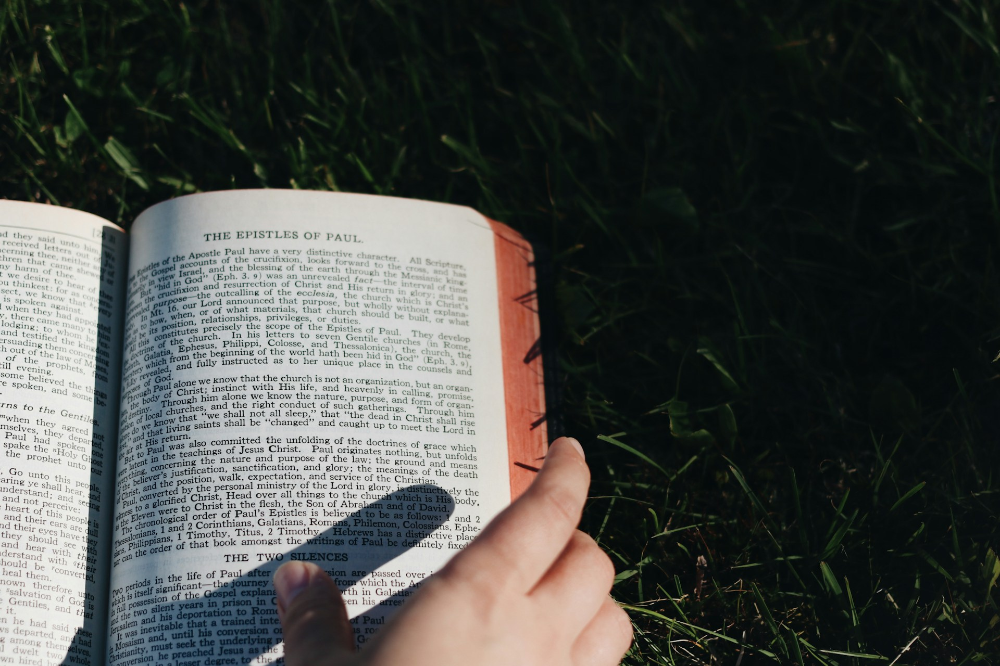

# The Books That Remain With Us

2026-07-01

## The Hunger That Short Reading Cannot Satisfy

We live in a time of extraordinary access to written material. Every morning brings new articles, commentary, analysis, newsletters, social media posts, and recommendations. It is difficult to reach the bottom of any news feed because the supply never stops. Yet this abundance does not always leave us feeling intellectually nourished. We may read throughout the day and still feel that we have not truly remained with a thought.

Many online articles are designed to be read in one or three minutes. Their titles must attract attention immediately, their main points must appear near the beginning, and their paragraphs must be short enough to survive the small screen of a mobile phone. Even serious subjects are often divided into brief sections, numbered lists, and easily extractable conclusions. Such writing may be useful. It can inform us quickly, introduce us to a subject, or help us follow current events. Still, something is often missing.

What I miss is not simply the physical length of older books. I miss the experience of entering a sustained discussion. When I was a student, I read books on philosophy, sociology, the human sciences, religion, and literature. Many of them were thick, difficult, and sometimes unnecessarily indirect. They contained long descriptions, extended arguments, historical digressions, and passages that did not immediately reveal their purpose. Yet reading them created a distinctive kind of intellectual experience.

A long book asks the reader to inhabit another person’s world of thought. The author does not merely announce a conclusion. The reader must follow distinctions, remember earlier discussions, tolerate temporary confusion, and wait for ideas to connect. In a novel, the reader must live with characters long enough for their choices to acquire moral weight. In philosophy, one must remain with a question long enough for familiar assumptions to become uncertain.

This kind of reading cannot always be judged by efficiency. There are books whose main argument could be summarized in several pages, yet the summary would not reproduce what it means to follow the argument slowly. It would give us the result without the intellectual journey. The destination might be preserved, but the transformation that occurred during the journey would be lost.

This is why the dissatisfaction created by short online content is not necessarily nostalgia for an earlier age. It is a hunger for continuity. We want writing that allows us to remain with a question, accumulate memories within the text, and feel that something has developed rather than merely appeared. We want more than information. We want the possibility of being changed.

## When Time Begins to Feel Different

The difficulty is that the desire for long reading remains even when our relationship with time has changed.

When I was young, I could spend hours in a library without feeling that every hour had to justify itself. I could struggle with a difficult page, return to the previous chapter, or continue reading even when I understood only part of the argument. There was time to be confused. There was time to follow a writer who seemed to be moving slowly. Life appeared open enough to permit intellectual wandering.

Now a book of several hundred pages feels different. It represents not only an opportunity but also a commitment. Every hour given to one book is an hour that cannot be given to another book, to writing, to work, to family, to prayer, or simply to rest. The awareness of time has become sharper because life no longer feels unlimited.

This does not mean that older people necessarily have fewer hours in the day than younger people. The change is partly psychological. Youth often experiences time as expandable. Even years of uncertainty can feel like part of a long preparation. Later, time begins to feel more defined. We become conscious not only of what we might still do, but also of what we will never have time to do.

Long books therefore create a genuine dilemma. We still desire the experience they offer, but we also feel the weight of what they demand. We may open a classic with enthusiasm, read for an hour, and then begin to feel tired. The argument seems slow. The author appears to repeat the same point. We wonder whether a reliable summary would allow us to understand the essence without spending several more days on the full text.

Sometimes this reaction reveals a damaged attention span. Contemporary digital life has trained us to expect frequent changes of subject, immediate explanation, and constant stimulation. A difficult book does not adjust itself to our impatience. It waits silently until we return.

Yet we should not blame the reader in every case. Some long books truly are repetitive. Some authors write indirectly because of the conventions of their time, while others simply fail to express their ideas clearly. A book does not become profound merely by being difficult, and length is not evidence of intellectual seriousness.

The mature question is therefore not whether we should always finish long books. It is what kind of attention a particular book deserves. Some books deserve several minutes. Others deserve a few selected chapters. Some deserve a complete reading, and a small number deserve to be read again across the course of a life.

This requires judgment rather than discipline alone. Reading everything from beginning to end can become another form of mechanical productivity. The real task is to recognize which books are connected to the questions we are actually living.

## Reading as Transformation Rather Than Possession

It is easy to treat books as accomplishments. We count the number we have finished, display them on shelves, record them in applications, or mention them as evidence of seriousness. Reading then becomes a form of possession. We own the book, remember its title, and add it to the story we tell about ourselves.

There is nothing wrong with finishing many books. The problem begins when the number becomes more important than the encounter. Intellectual life can easily become another territory for the ego. A person may take pride in having read difficult philosophers without allowing those philosophers to disturb anything in his life.

The books that matter most to me are not necessarily the ones I can summarize most accurately. They are the ones after which I felt that something had changed.

I still remember reading Søren Kierkegaard’s *The Sickness Unto Death*. It was difficult, and there were passages whose precise meaning I could not fully grasp. Kierkegaard’s descriptions of despair, selfhood, possibility, necessity, and the relation of the self to God required more concentration than I could always provide. Yet somehow, through that struggle, I felt that I had touched the core of existentialism.

The book helped me see that despair is not merely a strong feeling of sadness. It concerns the structure of the self and the failure to become what one is before God. A person may appear successful, confident, and satisfied while remaining in despair because he does not understand himself as a self grounded in something beyond himself.

I may not have mastered every part of Kierkegaard’s argument, but the book altered my Christian understanding. It gave me another lens through which to think about faith, sin, freedom, pride, and the refusal to accept oneself. Even my reading of the Bible changed. Familiar passages began to reveal questions about the self that I had not previously noticed.

This is what it means for a book to become part of one’s intellectual and spiritual life. Its influence cannot be measured only by how much information remains in memory. The book changes the reader’s way of perceiving other books, experiences, and relationships.

Something similar happens when reading Dostoevsky. *Crime and Punishment* can be summarized as the story of a man who commits murder, struggles with guilt, and moves toward confession. Yet such a summary gives almost nothing of the experience of reading the novel. The meaning lies in the pressure that accumulates around Raskolnikov, in his pride, his theories, his physical weakness, his fear, his isolation, and the moral presence of Sonya.

The same is true of *The Brothers Karamazov*. Its length allows competing ideas about faith, doubt, freedom, suffering, responsibility, and love to take human form. These ideas are not presented as neat positions in a list. They are embodied in people whose strengths and failures cannot be separated easily.

A summary can tell us what Ivan argues or what Alyosha represents. It cannot reproduce the experience of living with the brothers, their father, and the consequences of their relationships. It cannot create the same moral atmosphere. The reader must travel through the entire disorder of the family before certain questions acquire their full weight.

The value of such books lies partly in the fact that they do not permit us to remain untouched observers. We recognize something of ourselves in people we might initially condemn. We encounter ideas not as theories alone, but as forces that shape lives.

This is very different from reading merely for completion. A book that transforms us is never fully completed because its consequences continue after the final page.

## The Interior History Created by Long Reading

The Bible offers an even more powerful example of how long reading creates an experience that cannot be reduced to isolated lessons.

Individual biblical passages can be read separately and still carry great meaning. A psalm, a parable, a prophetic warning, or a teaching of Jesus can speak directly to a particular moment. Yet reading the Bible from beginning to end produces another kind of experience. The reader begins to feel the passage of generations.

Abraham first appears as a living figure within the narrative. He leaves his land, receives a promise, struggles with uncertainty, and becomes the father of Isaac. Isaac is followed by Jacob, and Jacob by Joseph and his brothers. These figures initially feel close because the reader is living through their stories in the present tense of the text.

As the biblical narrative continues, they begin to recede. Israel passes through slavery, liberation, wandering, settlement, conflict, monarchy, division, destruction, exile, and return. Abraham, Isaac, Jacob, and Joseph gradually become ancient ancestors within the world of the Bible itself.

When David appears, he is a young man standing before Goliath. Later he becomes king, sinner, father, poet, and founder of a royal line. The reader lives through his rise, his failures, his grief, and his death. Yet by the time the New Testament begins, David has also become a distant historical figure. His name is part of genealogy, prophecy, memory, and expectation.

The reader therefore experiences more than chronology. One feels the weight of accumulated history. Earlier figures remain present, but they are carried forward as memory. Promises made in one generation are remembered, forgotten, reinterpreted, and renewed in later ones.

This experience requires duration. It depends on reading enough for the earlier stories to become part of the reader’s memory before later stories refer back to them. The Bible creates an interior history because the reader has traveled through generations rather than merely receiving a diagram of them.

A summary can explain the sequence of biblical events. It can show how Abraham precedes Moses, how Moses precedes David, and how David’s line becomes important in the New Testament. What it cannot reproduce is the feeling that one has lived through the distance separating them.

Long reading allows the past to become past inside the reader.

That is one reason snackable content cannot provide the same kind of experience. Short material is usually designed to minimize memory. Each piece should stand independently. The reader should not need to remember what happened hundreds of pages earlier. The content is consumed and replaced.

A long work makes memory part of meaning. Earlier passages remain active even when they are no longer directly discussed. A character’s death changes the atmosphere of later chapters. A philosophical distinction introduced near the beginning acquires significance only after the argument develops. A biblical promise echoes across generations.

Length alone does not create this effect. A repetitive book may remain repetitive no matter how many pages it contains. What matters is whether the work uses duration to create accumulation, tension, recognition, and historical depth.

The best long books do not simply contain more material. They make time itself part of the reading experience.

## The Books We Meet Again

The value of formative books does not end with the first reading. In many cases, the first reading begins a relationship that continues throughout life.

A serious book remains available for rereading because the reader changes. The words may remain the same, but the person who returns to them has accumulated new experiences, losses, responsibilities, failures, and forms of understanding. The second reading is never identical to the first because the reader brings another life to the page.

A younger reader may encounter *The Sickness Unto Death* primarily as an intellectual challenge. The difficulty itself may be attractive. The reader struggles to understand Kierkegaard’s definition of the self and feels the excitement of entering existential thought.

Ten or twenty years later, the same book may feel more personal. Ideas that once appeared abstract may now describe recognizable forms of self-deception, pride, resignation, fear, and dependence. The reader no longer studies despair only as a philosophical category. He begins to recognize its quieter presence in ordinary life.

A later reading may change again. Questions about achievement, identity, and possibility may become less important than the question of surrender. The relation of the self to God may be read not only as a theory of human existence, but as preparation for accepting limitation, aging, and death.

Dostoevsky also changes as the reader changes. In youth, one may be drawn to rebellion, ideological conflict, crime, and dramatic spiritual struggle. The most intense characters dominate attention. Their arguments appear to contain the central meaning of the novel.

Later, one may notice different things. The suffering of parents becomes more visible. The damage caused by pride seems less romantic. Forgiveness appears more difficult and more important. Characters who once seemed passive or secondary may reveal forms of patience, compassion, or spiritual strength that the younger reader overlooked.

The Bible is perhaps the clearest example of lifelong rereading. A psalm read during a peaceful period does not sound the same when read during illness or grief. A passage about trust may appear comforting in one season and almost impossible in another. The story of Abraham changes when the reader becomes responsible for others. The Book of Job changes after one has encountered suffering that cannot be explained easily.

Rereading is therefore not simple repetition. It is a meeting between a stable text and a changing life.

It is also a meeting with one’s former selves. When we return to a book that moved us many years ago, we remember not only the text but also the circumstances of the earlier reading. We may remember a library, a classroom, a teacher, a period of doubt, or an intense youthful hope. The book preserves traces of the person we once were.

Sometimes we discover that our earlier interpretation was incomplete. Sometimes we are surprised by what we failed to notice. At other times, the younger reader understood something that the older reader has forgotten. Rereading can correct us, but it can also restore forms of openness that have been weakened by habit.

This is another reason it was valuable to encounter certain books in youth. Their importance does not belong only to that earlier period. The first reading created a relationship that can continue for decades. A book first encountered at twenty may speak differently at forty, sixty, or eighty.

I sometimes imagine that near the end of my life I may still try to read passages from these books. Perhaps I will not have the strength or concentration to read complete chapters. A few familiar pages may be enough. I may return to Kierkegaard, Dostoevsky, or passages from the Bible that have accompanied me for many years.

At that stage, reading would no longer be about achievement. There would be no reason to count pages or finish another title. The words would matter because they had already traveled through life with me.

## When Reading Gives Way to Writing

The awareness of limited time also changes the relationship between reading and writing.

When I was a student, reading occupied the center of my intellectual life. I had the good fortune to spend hours and days in libraries, struggling with books, enjoying them, and sometimes indulging in them without a clear practical purpose. Those experiences became part of my intellectual formation.

I do not remember every argument or every author. Much of what I read has disappeared from conscious memory. Yet the habits formed through those encounters remain. Philosophy taught me to notice distinctions. Sociology taught me to see institutions and structures surrounding individual experience. Literature taught me that human motives cannot always be reduced to simple explanations. Religious texts taught me to read a life in relation to faith, history, and transcendence.

The books I read have therefore not vanished simply because I can no longer summarize them. They have entered the way I think.

Now the direction has begun to change. Reading remains important, but I increasingly feel that I would rather spend my available time writing. This is not because I believe I have read enough or no longer need other voices. It is because the work of articulation has become more urgent.

Earlier in life, reading helped build the inner world from which thought could emerge. Now writing helps bring that inner world into form.

My essays are usually between 2,000 and 4,000 words. By current online standards, that is long. Many readers may prefer something shorter, faster, and easier to scan. Yet the length matters to me because certain reflections need room to develop.

This does not mean that a long essay is automatically better than a short one. Length can become another form of vanity. A writer may take pride in word count just as a reader may take pride in the number of completed books. A 4,000-word essay can repeat one shallow idea many times.

The purpose of length is not to create an appearance of seriousness. It is to resist premature compression.

When writing, I often begin with an intuition that is not yet clear. The first formulation may be too simple. As the discussion continues, exceptions appear, memories become relevant, and tensions that were initially hidden begin to emerge. Writing allows the thought to correct itself.

A short article often requires the point to be known before the writing begins. A reflective essay may discover its point through the act of writing.

This is why I sometimes feel that I am the primary and best reader of my own essays. They are not written only to deliver conclusions to others. They are places in which I can encounter my own experiences at a slight distance. Work, faith, technology, aging, memory, reading, and ordinary conversations can be brought into relation with one another.

The essay becomes a method of integration.

It would be arrogant to compare these modest essays with the classics that shaped me. They do not possess the philosophical depth of Kierkegaard, the narrative power of Dostoevsky, or the historical and spiritual weight of Scripture. That is not the claim.

The effort is much humbler. I want to align my writing with the conviction that thought deserves enough space to become honest. I want to remain with a subject long enough to discover what I actually think, rather than simply producing a quick opinion.

In that sense, my writing continues the reading life of my youth. The hours spent with difficult books have not been replaced. They have become part of the patience I now try to bring to my own reflections.

## What Deserves the Remaining Time

As life becomes visibly limited, the question of reading and writing becomes part of a larger question: what deserves the time that remains?

There will always be more books than I can read. There will always be important authors I have not encountered, classics I have not finished, and contemporary works that deserve attention. No reading plan can remove that reality.

This can create anxiety. Every recommendation becomes another reminder of limitation. The unread books on a shelf may begin to feel less like possibilities and more like accusations. Yet the impossibility of reading everything can also be freeing. It forces us to choose according to the actual shape of our lives.

Recommendations from scholars, critics, and intellectual communities remain valuable. They help us discover books we might otherwise miss. Still, a book should not be read only because a respected circle has declared it essential. The deepest reading often begins when a book meets a question that is already alive in the reader.

The same caution applies to writing. I do not want to measure the value of my life by the number of essays I produce. An expanding archive can become another possession, another way of convincing myself that I have used time well.

The real question is not how much I have read or written. It is what these activities have done to my attention.

Have they helped me see more truthfully? Have they made me more patient with complexity? Have they deepened my faith rather than merely giving me more religious language? Have they helped me recognize pride, fear, gratitude, responsibility, and love more clearly?

Reading and writing are valuable when they contribute to the formation of a life. They become empty when they serve only the image of the intellectual self.

The books that matter most are therefore not trophies. They are companions. They remain beside us because they continue to ask questions that our lives have not exhausted. We return to them not to prove that we are still serious readers, but because we have changed and need to hear their words again.

Our own writing can also become a form of companionship. Years later, an essay may return us to the person we were when a particular question felt urgent. We may recognize limitations in the earlier reflection, but we may also recover something sincere that would otherwise have disappeared.

Perhaps this is enough. Life is too short to read every book, but it is long enough to form deep relationships with a few. It is too short to express every thought, but it may be long enough to write some reflections carefully.

I still imagine familiar passages accompanying me near death. By then, the words may carry the memory of many readings, many stages of faith, and many versions of myself. I may not understand them completely even then. Complete understanding may never have been the point.

The point may be that certain books helped me live, helped me think, and helped me return repeatedly to the questions that mattered most.

My own essays are a modest attempt to participate in that same movement. They give me time to reflect while time is still available. They allow me to gather what I have received from books, experience, faith, and other people, and to place it into words that I can read again.

Reading gave me companions for life. Writing allows me to accompany my own life with greater attention.

Neither activity should become a source of pride. Both are ways of remaining present to the mystery of having lived at all.

Photo by [Jessica Mangano](https://unsplash.com/@jfdelp?utm_source=unsplash&utm_medium=referral&utm_content=creditCopyText) on [Unsplash](https://unsplash.com/photos/person-holding-book-on-green-grass-field-during-daytime-3ZAs1OR_Yj4?utm_source=unsplash&utm_medium=referral&utm_content=creditCopyText)
