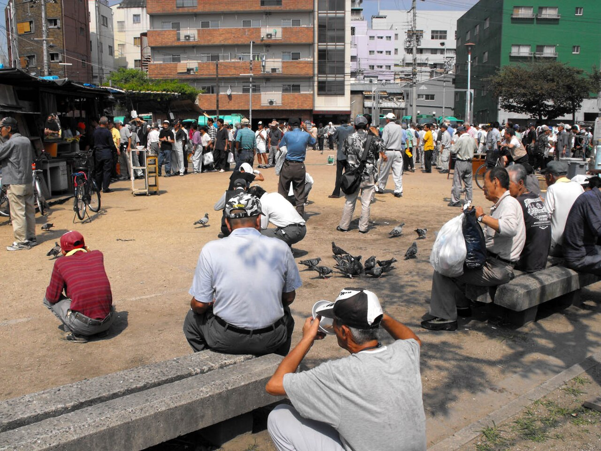

# A Day’s Work and a Lifetime of Labor

2026-07-02

## Before Dawn in Kamagasaki

When I was a university student in Japan, I once worked as a construction laborer for a day. I did not take the job because I needed the money. It was part of an activity organized by the youth group of the Christian church to which I belonged at the time. There were only three or four of us, and the purpose was to spend time in Kamagasaki, an area of Osaka long associated with day laborers, inexpensive lodging houses, homelessness, and social welfare work.

[Kamagasaki](https://en.wikipedia.org/wiki/Kamagasaki) was one of two places in Japan commonly known as gathering points for construction workers. The other was Sanya in Tokyo. Men without regular employment could stay in cheap lodging houses and gather before dawn at a labor center, where construction companies and subcontractors arrived in vans to recruit workers for the day. A person might be selected and earn enough for food and another night’s accommodation. He might also be left behind with no income at all.

We stayed at a place called [Tabiji no Sato](https://tabijinosato.org). The name can be translated loosely as “A Home Along the Journey.” It was a Christian center in Kamagasaki that supported people facing poverty, illness, homelessness, and social isolation. It also provided a place where church groups and young people could learn about the district and participate in local support activities.

The accommodation was extremely modest. The rooms were very small, perhaps only two tatami mats in size, and the facilities were basic. This was not a comfortable retreat prepared for visitors. It belonged to the same environment of inexpensive lodging and limited resources that characterized much of Kamagasaki.

The center depended on the commitment of priests, church members, volunteers, and others willing to remain beside people whom society had largely forgotten. Its resources were limited, but that limitation was itself part of what we were there to encounter. Social welfare in such places was not an abstract system. It was often sustained by small organizations working with insufficient money, aging facilities, and needs far greater than anything they could fully address.

We slept there for one night and woke before four in the morning. The hour itself was disorienting. The ordinary city had not yet begun its day, but the labor market of Kamagasaki was already active. Men were moving toward the center because they had to be visible when the recruiters arrived. If they came too late, the available places in the vans might already be filled.

The members of our church group decided to separate. We thought it would be more practical if each person handled his own expenses and work arrangements. At the time, this seemed like a simple decision. In retrospect, it also meant that each of us entered the day-labor system alone.

I was selected by one of the recruiters and directed into a van that was already occupied by several older men. I did not know them, and I did not know exactly where we were going. We were driven toward a suburban area in the northern part of Osaka, possibly near Takarazuka, where highway construction was underway. Junctions, roads, and areas near roadside restaurants were still being built.

Sitting in that van, I understood very little about the lives of the men around me. I knew that they were day laborers from Kamagasaki. I knew that we were going to perform difficult physical work. I did not yet understand what it meant for them to repeat the same journey day after day.

## The Work Given to the Lowest Workers

The construction site was large, noisy, and constantly moving. Trucks arrived with cement and building materials. Skilled workers operated machinery and performed tasks that required experience or certification. The workers recruited from Kamagasaki were assigned the simplest and most physically demanding jobs.

We moved debris from one place to another. We carried traffic separators, cones, and heavy materials. When cement trucks poured fresh concrete, professional workers used specialized equipment, while we used shovels and hand tools to spread and flatten areas that the machines could not finish properly. The work required constant lifting, bending, pushing, and carrying.

None of the individual movements seemed extraordinary. The difficulty came from having to repeat them for hours. A shovel filled with wet cement was not impossibly heavy, but after many repetitions the arms, shoulders, and lower back began to weaken. A concrete separator could be moved once without much trouble, but carrying one after another across the site gradually drained the body.

I was in my early twenties and physically strong. Even so, I remember realizing that I would not be able to continue that kind of work every day. I could complete the shift because I knew it would end. I could tolerate the exhaustion because I expected to rest afterward.

There were four of us in the small group assigned to some of the manual tasks. One man seemed experienced and may have been in his forties or fifties. The other two looked much older. They appeared physically worn and may have been close to homelessness. Their clothes, posture, and movements suggested that the work had already left its mark on their bodies.

They teased me because I was young. They said that I was probably the only person among us who could continue doing the hardest tasks without stopping. Their comments were friendly, but they also contained an uncomfortable truth. The youngest person had the greatest physical capacity, yet I was the one who did not need to return the next day.

The older men had to conserve their strength while still appearing useful. A worker who seemed too slow, too weak, or too injured might not be selected again. The body was not only the instrument of labor. It was also the worker’s qualification, his source of income, and perhaps the only asset he still possessed.

During lunch, we ate inexpensive bento boxes inside the van. The meal was practical and sufficient to allow us to continue working, but the arrangement also revealed our position. We were not part of the regular workforce in any meaningful sense. We had been collected in the morning, delivered to the site, given food, and expected to perform the work that others did not want to do.

The highway would eventually be completed. Cars would pass over it, restaurants and businesses would benefit from improved access, and most people would never think about the workers who had moved the debris or spread the cement by hand. Once construction is finished, the labor disappears into the structure.

The road remains visible. The bodies that built it do not.

## The Difference Between Enduring and Being Trapped

The wages for a day of work were around 9,000 yen. At the time, I heard that the contractor might receive between 10,000 and 13,000 yen for each worker, but intermediaries took their share before the money reached us. After a full day of demanding labor, the worker returned to Kamagasaki with an amount that might cover food, lodging, cigarettes, alcohol, and a few other necessities.

For me, the 9,000 yen was almost incidental. I had not entered the activity because I needed income. I was a student participating in a church program, and I had a home to which I could return. My future did not depend on whether I was selected for work the following morning.

For the other men, the same amount had a different meaning. If they were chosen, they could survive for another day. If they were not chosen, they might have no income. If they were injured, sick, or too exhausted to work, the loss was immediate. Rest was not simply a matter of listening to the body. It had an economic cost.

This distinction changes the meaning of physical hardship. A demanding task can become an educational experience when a person performs it temporarily and voluntarily. The same task becomes a trap when refusal threatens food, shelter, or survival.

Looking back, the early morning recruitment felt disturbingly close to a market in which human bodies were being inspected and transported. Men gathered before dawn, waited to be selected, entered vans driven by strangers, and were taken to distant sites to perform the lowest level of physical work. When the shift was over, they were returned to the place from which they had been collected.

It would be too strong to describe the system as legal slavery without evidence of confinement, deception, or direct coercion. The workers were technically free to decline the offer. Yet freedom becomes difficult to define when every available choice carries the threat of hunger, homelessness, or deeper poverty.

A person with savings, family support, education, and alternative employment can refuse a dangerous job. A person without those resources may possess freedom in a legal sense while having almost no practical ability to exercise it. Poverty does not always force people through chains or guards. It can compel them by steadily removing every other path.

This is what made my position so different. I could leave Kamagasaki after the activity. The older men could leave the construction site, but they could not easily leave the system surrounding it.

At the time, I probably understood this difference only partially. I felt the exhaustion, saw the lodging houses, and spoke with the workers. Yet I was still viewing the experience through the confidence of youth. My own life remained stable enough that the situation could become a lesson rather than a lasting condition.

The men around me did not have the luxury of treating their lives as an educational experience.

## Meeting the Men Again Through an Aging Body

Decades have passed since that day. I am now approaching the age of the workers whom I once regarded simply as older men. This has changed the memory more than I expected.

When I was in my twenties, I believed that the body could recover from almost anything. After a difficult day, I might experience soreness or fatigue, but a few nights of sleep would usually restore me. Youth created the impression that recovery was automatic.

An aging body teaches a different lesson. A strained shoulder may remain painful for weeks. A knee problem can return whenever the load increases. The lower back can carry the memory of movements performed years earlier. Fatigue is no longer something that always disappears after one good night’s sleep.

I still exercise and believe that strength training can be beneficial when performed carefully. Weightlifting, walking, swimming, and other forms of physical activity can preserve mobility and support health. But exercise normally takes place under conditions of choice and control.

At the gym, I choose the weight. I decide how many repetitions to perform. I can rest between sets, reduce the load, or stop when something feels wrong. I can eat properly afterward and allow the muscles time to recover. The purpose of training is to challenge the body while preserving its ability to adapt.

Daily construction labor is different. The worker does not control the weight of the materials, the duration of the shift, the temperature, the deadline, or the pace expected by the supervisor. He may have to lift while already injured, continue while dehydrated, and return the next morning before recovery is complete.

In athletic terms, this resembles chronic overtraining. The body is repeatedly stressed without receiving sufficient rest, nutrition, or medical attention. The worker may become skilled at enduring discomfort, but endurance should not be confused with health.

The men I worked beside did not look healthy. Their bodies appeared thin, stiff, and worn rather than strong in the way that athletes appear strong. They may have suffered from chronic joint pain, untreated injuries, malnutrition, poor sleep, alcohol dependence, or general physical exhaustion. Their work required strength while steadily consuming the strength they possessed.

Now that I am closer to their age, I can imagine more clearly what it meant to carry concrete separators with painful knees or to flatten cement with an aching back. I can understand why they moved more slowly, why they joked about my youth, and why my temporary energy may have seemed remarkable to them.

Age has not given me direct knowledge of their lives. I still cannot claim to know what each man felt or why he had come to Kamagasaki. But age has given me a more honest awareness of bodily limits.

The memory has therefore become less about what I was able to endure and more about what they were required to endure.

## The Man from Fukui

During the lunch break, I spoke with the most experienced man in our group. He seemed to act as a small leader, helping to assemble the workers and organize some of the tasks. He told me that he had come from Fukui Prefecture.

He had been living and working in Kamagasaki for several years. He also said that he had become completely disconnected from his family. He was alone.

I do not remember every detail of the conversation, and I do not know what had happened before he arrived in Osaka. Perhaps there had been conflict, debt, illness, addiction, unemployment, or shame. Perhaps he had left home voluntarily. Perhaps his family had rejected him, or perhaps he believed that returning was no longer possible.

It would be easy to invent a complete tragedy around the fragments he shared, but doing so would turn him into a symbol rather than a person. The truth is that I met him only briefly. I knew very little about his past, his failures, his responsibilities, or the choices he had made.

What remained with me was the fact of his disconnection. He had once belonged somewhere else. He had come from a prefecture with towns, families, schools, workplaces, and ordinary social relationships. By the time I met him, Kamagasaki appeared to be the last structure still holding his life together.

This kind of poverty cannot be measured only by income. A person may receive public assistance or find occasional work and still remain impoverished in relationships, belonging, and hope. Family ties often provide support during illness, unemployment, or emotional crisis. When those ties are lost, even a small setback can become irreversible.

Loneliness also affects the ability to change. A person who has someone waiting, calling, or expecting him to return has a reason to protect his health and plan for the future. A person who feels that nobody would notice his disappearance may gradually stop imagining a future at all.

This may help explain why alcohol and gambling have remained serious problems in places such as Kamagasaki. It is easy for outsiders to condemn people who spend limited money on drinking or pachinko. Personal responsibility still matters, and addiction can harm both the individual and those who attempt to help. Yet these behaviors often grow within lives already shaped by isolation, shame, physical pain, and the absence of long-term purpose.

Money alone cannot repair such a life. Moral instruction alone cannot repair it either.

A person may need stable housing, medical treatment, freedom from addiction, relationships of trust, suitable employment, and repeated opportunities to recover from failure. Churches, priests, pastors, volunteers, doctors, and welfare workers can provide parts of this support, but rebuilding a fragmented life is slow and uncertain.

Tabiji no Sato belonged to that world of limited but persistent assistance. Its modest rooms and facilities could not solve the problems of Kamagasaki. Still, it offered a place where people could gather, learn about the district, support local activities, pray, and encounter those whose lives were otherwise kept outside public attention.

The work of religious and welfare communities rarely produces dramatic results. Some people refuse help. Others accept assistance and later return to addiction or homelessness. Resources remain limited, and the needs are larger than any single organization can meet.

Yet the absence of immediate success does not make the effort meaningless. Sometimes human dignity is protected not through complete transformation, but through the simple refusal to abandon someone entirely.

## The Workers Modern Cities Keep at a Distance

The traditional day-labor districts of Kamagasaki and Sanya have changed. Their populations have aged, public welfare programs have expanded, and parts of the neighborhoods have been redeveloped. The early morning labor market is no longer as large or visible as it was during Japan’s periods of rapid construction.

The need for low-paid and physically demanding labor has not disappeared. It has moved into other systems.

In Japan and many other wealthy countries, immigrant workers now perform a growing share of construction, infrastructure maintenance, agriculture, manufacturing, caregiving, cleaning, and other essential work. They may arrive through formal employment programs rather than gathering at an open labor center, but their vulnerability can resemble that of the older day laborers.

Singapore offers a particularly visible example. The country’s modern skyline, housing, roads, and transportation systems depend heavily on migrant workers from other parts of Asia. These workers can often earn more than they would in their home countries and send money to their families. The arrangement may provide genuine economic opportunity.

At the same time, they often live separately from the people who enjoy the cities they build. Their accommodation, legal status, freedom to change employers, access to public spaces, and social recognition may all be restricted. They are physically present in the city but remain outside its ordinary social life.

This separation creates a moral contradiction. Wealthy urban residents benefit from efficient transportation, clean buildings, affordable services, and expanding infrastructure. Yet the workers who make these conditions possible may live in crowded dormitories, endure long periods away from their families, and receive limited protection when they are injured or dismissed.

Calling such an arrangement “win-win” captures only part of the reality. A worker may benefit economically while still facing discrimination. A country may need migrant labor while still maintaining a social hierarchy that treats those workers as temporary, replaceable, or inferior.

Mutual benefit does not guarantee equal dignity.

The same principle applied to the men in Kamagasaki. Construction companies needed their labor. The workers needed the wages. Both sides received something from the exchange. Yet the difference in power was enormous. One side could choose among workers, control transportation, set the conditions, and deduct margins. The other side had little more than an aging body and the hope of being selected.

Modern cities are skilled at hiding these relationships. Once a building is completed, the construction fences disappear. Once a road opens, the public sees only the convenience. The dirt, heat, injuries, exhaustion, and temporary accommodations become invisible.

This invisibility allows people to enjoy the results of difficult labor without confronting the conditions under which it was performed. The city appears clean because the dirty work has been moved somewhere else. It appears safe because the dangerous work is assigned to people who remain outside public attention. It appears prosperous because the insecurity supporting that prosperity is kept at a distance.

Japan once described such work through the three Ks: kitanai, kiken, and kitsui. Dirty, dangerous, and demanding. The expression identified the nature of the tasks, but it also revealed a social division. Certain forms of necessary work were recognized as undesirable, and the burden was passed to those with the fewest alternatives.

The workers may change. The social mechanism remains familiar.

## Remembering Without Romanticizing

My day as a construction worker did not make me an expert on Kamagasaki. I stayed there briefly, performed one shift, and returned to a stable life. I did not experience years of uncertainty, chronic injury, family separation, or repeated rejection at the labor center.

It would be misleading to present the experience as evidence of my own toughness. I was able to work hard because I was young, healthy, and protected by a life outside the construction site. The hardship was real, but it was temporary.

That temporary exposure still mattered.

I entered the van before dawn. I worked beside older men. I moved debris, carried materials, flattened cement, and felt the exhaustion of repetitive labor. I ate the same inexpensive lunch and listened to a man describe his separation from his family. For a short time, the distance between my life and theirs became smaller.

The experience did not give me complete understanding. It gave me a point of reference.

Decades later, that point of reference has become more meaningful. When I feel the limits of my own aging body, I remember the men who had to rely on bodies already worn down by labor. When I exercise in a controlled environment, I remember that they could not choose their load or recovery time. When I see highways, buildings, and urban development, I remember that every finished structure contains work that has disappeared from view.

The most important question is not whether hard work builds character. Sometimes it does. Sometimes it simply damages the body.

The more important questions concern the life surrounding the work. Can the worker refuse an unsafe task? Can he rest without losing his shelter? Can he receive treatment when injured? Does he have relationships beyond the workplace? Can he imagine a future in which his value does not depend entirely on physical strength?

These questions apply not only to Kamagasaki, construction work, or Japan. They apply wherever prosperity depends on people who remain insecure, separated, and easily replaced.

My church activity was intended to expose young people to lives different from our own. At the time, I may have understood that purpose mainly as an encounter with poverty. I now see that it was also an encounter with dependence, aging, labor, and the fragility of belonging.

The men I met were not merely poor people in a troubled district. They were workers whose bodies helped build the infrastructure used by others. They were also individuals with places of origin, family histories, disappointments, habits, and memories that were mostly unknown to me.

One of them came from Fukui. Perhaps he once expected to live an ordinary life there. By the time we shared lunch in the van, that ordinary life had become unreachable.

I cannot know what happened to him or to the other men. They may have entered welfare housing, returned to their families, remained in Kamagasaki, or died alone. Their lives continued beyond the single day in which they crossed mine.

What I can do is remember them without turning their suffering into a beautiful story. Their hardship was not noble simply because it was difficult. Their labor was not spiritually valuable because it required endurance. The conditions they faced should not be praised as a test of character.

The value lies in refusing to look away.

As a student, I saw older men struggling beside me during a demanding shift. Now, having reached something close to their age, I can see that they were carrying much more than debris and cement. They were carrying damaged bodies, uncertain futures, broken relationships, and part of the hidden physical burden of Japan’s development.

For me, it was a day’s work.

For them, it was a lifetime of labor.

*Image: [Wikipedia](https://en.wikipedia.org/wiki/Kamagasaki)*

