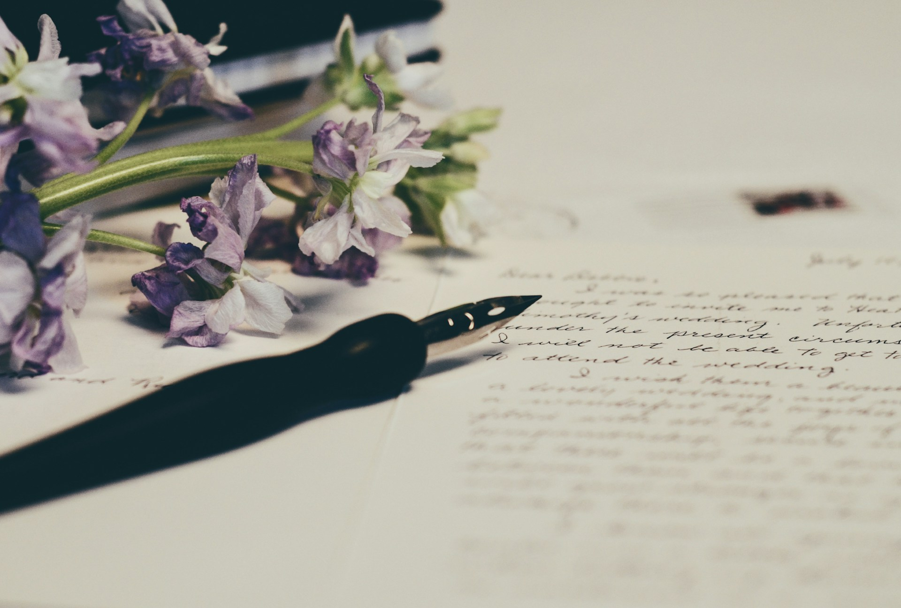

# The Room That Has Never Changed

James Allen, Timeless Prose, and the Discipline of Writing Toward Essence

2026-07-05

## Entering a Room That Has Never Changed

Every time I return to [the prose of James Allen](https://james-allen.in1woord.nl), I feel as if I am entering a room that has never changed. The world outside may be noisy, hurried, and restless, but his sentences seem to belong to another atmosphere. They do not rush toward the reader. They do not try to impress. They do not lean on the urgency of the present moment. They simply stand there, calm and clear, as though they have already passed through the fever of time.

This is one of the rarest qualities in writing. Many essays are interesting because they belong to a particular moment. They respond to an event, a public figure, a new technology, a political argument, or a social condition. Such writing can be necessary and valuable. It helps us understand what is happening around us. It gives form to confusion and allows us to think more clearly about the world we inhabit.

But there is another kind of writing that does not seem to belong to any one moment. It may have been written long ago, but it does not feel old. It may use words that are no longer common, but the voice remains alive. It may come from a particular author, country, and century, yet it does not seem confined by those facts. James Allen’s prose often has that quality. It feels as though it has been lifted out of time, not because it avoids human life, but because it speaks from beneath the changing surfaces of human life.

When I read him, I do not feel the pressure of argument. I do not feel that I am being pushed toward a position, a belief system, or a social identity. I feel instead that I am being invited to remember something. His writing does not create truth by force. It reveals truth by quietness. The effect is not dramatic, but it is deep. One feels that behind the words there is a stillness, and that stillness has more authority than display.

This is why his work has become one of my role models in writing. I do not mean that I can imitate him completely. I do not even think imitation would be the right aim. But his prose gives me a standard, not only of style, but of inward posture. It reminds me that writing can be calm without being weak, serious without being heavy, moral without being preachy, and beautiful without becoming decorative.

It also reminds me that writing is not merely a way of expressing what one thinks. It is a way of disciplining the self that thinks. The serenity of James Allen’s prose does not seem accidental. It feels like the result of a life that had learned to remove noise from the mind before placing words on the page. This is why his writing does not merely sound calm. It makes the reader calm.

## The Discipline of Refusing the Temporary

One reason James Allen’s prose feels timeless is that it refuses to depend on temporary things. He rarely anchors his reflections in names, events, controversies, trends, or local details. He does not ask the reader to remember who was famous in his day, which argument was active in public life, or what social mood surrounded the original publication. His writing does not require that kind of historical rescue.

This is easier to praise than to practice. When we write, we are naturally surrounded by the present. We are influenced by the news we have read, the people we have met, the comments we have received, the books currently being discussed, the technologies that shape our work, and the events that have disturbed or encouraged us. The present is not only around us. It presses itself into our language.

There is nothing wrong with this in itself. We live in time, and writing that pretends not to live in time can become thin or abstract. Human beings remember through detail. A place, a face, a conversation, a street, a meal, or a public event can make reflection concrete. Without such details, writing may become too detached from life.

Yet there is a danger. The more writing depends on what is current, the faster it begins to age. A name that feels powerful today may sound obscure a hundred years from now. A controversy that feels urgent may become a footnote. A public figure who dominates our attention may become almost meaningless to future readers. What once made the essay vivid can later become the very thing that makes it distant.

This is the paradox I see in James Allen. Because his prose cannot really be updated, it does not become outdated. It does not ask to be revised according to the latest circumstances. It does not depend on topical freshness. It speaks of thought, character, desire, discipline, peace, purity, fear, self-control, and inward freedom. These things do not expire. They appear in different clothing from age to age, but their essence remains recognizable.

This is why his writing does not make us worry about whether it belongs to the nineteenth century, the early twentieth century, or our own time. The human conditions he describes were present before him and will remain after us. Ambition will remain. Anxiety will remain. Pride will remain. The hunger for peace will remain. The need to govern thought and conduct will remain. The relation between inward life and outward action will remain.

To write in this way requires a kind of discipline. It requires the writer to ask whether a detail is truly necessary, or whether it is only borrowing energy from the present. It requires a willingness to let go of the easy charm of relevance. The timely reference often gives writing an immediate spark, but it may also fasten the writing too tightly to one passing hour.

James Allen seems to have understood this instinctively or spiritually. He wrote below the level of the day’s noise. He wrote at the level of recurring life. Because of that, his prose still reaches us. It does not arrive as an artifact that must be explained before it can be felt. It arrives almost directly, with the quiet force of something already known.

## Common Truths Made Luminous

Another remarkable feature of James Allen’s writing is that his teachings are often very simple. If reduced to bare propositions, many of them may sound almost common. Our thoughts shape our character. Selfishness brings unrest. Purity brings peace. Discipline matters. Inner disorder appears in outward life. Serenity is a sign of self-command. These are not surprising claims in themselves.

Yet when Allen writes them, they do not feel ordinary. They become luminous. This is one of the mysteries of his craft. He does not depend on novelty. He does not try to shock the reader with a new theory. He takes moral truths that may seem familiar and arranges them with such clarity, rhythm, and calm conviction that they regain their original power.

This is why his prose can feel both common and unique. The truths are common because they belong to human experience. They are not private inventions. They do not require a special intellectual system in order to be understood. Yet the voice is unique because Allen has purified the language around those truths. He removes much of what usually obstructs them: ego, cleverness, local argument, excessive explanation, and the desire to appear original.

His vocabulary is also part of this effect. He often works with a small set of morally charged words: thought, character, peace, purity, truth, mind, desire, law, love, service, self, serenity. These words are not fashionable. Some may even sound slightly archaic to contemporary ears. But this is part of their strength. They have not been selected for novelty. They have been selected for durability.

The sentences also carry a special rhythm. They often sound close to poetry, proverb, or scripture, but without becoming bound to a single religious institution. His prose seems familiar with Christianity, and at times it carries echoes of gospel teaching. It also feels close to contemplative traditions that speak of desire, detachment, discipline, and inward peace. Yet the writing does not feel sectarian. It does not ask the reader to enter through a doctrinal gate before receiving its wisdom.

This may be why people from many backgrounds can read him without feeling pressured. He does not write as though he is guarding a boundary. He writes as though he is pointing toward an open truth. The ethical, philosophical, and psychological dimensions of his work meet one another quietly. The reader may hear Christian overtones, Buddhist resonances, or the language of moral philosophy, but no single label seems to contain the whole atmosphere.

His use of poetry also matters. The poetry at the beginning of his works often prepares the reader for a different mode of attention. It slows the mind before the prose begins. It tells us that what follows is not merely explanation, but meditation. The prose then unfolds with a measured quality, as if each paragraph is less an argument than a clarification.

This is why his writing does not feel preachy, even when it is morally serious. Preaching becomes oppressive when the speaker’s ego stands above the reader. Allen’s voice does not usually feel like that. He speaks with authority, but the authority seems to come from the truth being spoken, not from the personality of the speaker. He does not seem to say, “Look at me, I know.” He seems to say, “Look carefully, this is so.”

That difference is essential. It allows the reader to receive correction without humiliation. It allows moral truth to appear as invitation rather than command. Allen can be firm, but his firmness is quiet. He can be idealistic, but his idealism is not sentimental. He can be simple, but his simplicity does not feel shallow. He reminds us that common truth, when expressed with purity, can become uncommon again.

## The Selfless Writer

The question that follows is not only how James Allen wrote such prose, but what kind of inward attitude made such prose possible. Style alone does not explain it. A writer can imitate old vocabulary, balanced sentences, and moral language, but still fail to produce the same effect. The deeper quality in Allen is not merely verbal. It is spiritual.

His writing feels selfless. This does not mean it lacks personality. In fact, his voice is unmistakable. But the personality does not advertise itself. It does not crowd the page. Allen does not seem eager to turn his life into a monument, his experiences into credentials, or his insights into possessions. He writes as though the truth matters more than the writer.

This is rare. Most writers, including sincere writers, struggle with the desire to be seen. We want our ideas to be recognized. We want our experiences to matter. We want our sentences to sound beautiful. We want the work to carry some trace of our uniqueness. Even when we write about universal things, the self often stands nearby, hoping to be praised for having expressed them well.

James Allen’s prose seems to come from a different posture. It does not feel like ownership. It feels like transmission. He appears less interested in saying, “This is my unique opinion,” than in saying, “This truth is available, and I must make it clear.” That sense of service gives the writing its gentleness. The reader does not feel trapped inside the author’s self. The reader feels guided toward something larger than both writer and reader.

There is a paradox here. The more Allen withdraws himself, the more distinct his writing becomes. By not trying to be original in the modern sense, he becomes original in a deeper sense. By not insisting on his personality, he leaves behind a voice that cannot easily be confused with anyone else. His uniqueness comes through self-effacement.

This may also explain why his prose feels so free from pressure. He does not seem to be competing. He does not seem anxious to prove that he is brilliant. He does not seem interested in winning a debate. His writing has the serenity of someone who believes that truth does not need to be decorated in order to be true. The writer’s task is to remove distortion, not to create a spectacle.

For anyone who writes today, this is a difficult lesson. Our environment trains us in the opposite direction. We are encouraged to develop a voice, build an audience, sharpen a position, produce a reaction, and make our work recognizable in a crowded space. These things are not entirely wrong. A writer needs some form of voice and some form of readership. But they can easily become spiritual traps.

The self can hide inside craft. It can hide inside moral seriousness. It can even hide inside humility. We may want to write about truth while secretly wanting to be admired for being truthful. We may write about simplicity while taking pride in our refined simplicity. We may criticize materialism while chasing the immaterial currency of recognition.

Allen corrects this tendency. Not by accusing us, but by giving another example. His prose shows what writing can sound like when the self has become quieter. It does not mean the self has disappeared completely. No human writer is free from personality. But in Allen, the personality seems disciplined enough that it serves the message rather than dominating it.

That may be the true root of his clarity. The sentences are clear because the intention is clear. The intention is clear because the writer is not mainly trying to possess the truth, but to make it available.

## My Own Writing Between Experience and Essence

My own writing cannot and should not be exactly like James Allen’s. I often begin from personal experience, memory, place, culture, work, religion, family, aging, or daily observation. I notice things in the world and try to understand what they reveal. In that sense, my writing has an ethnographic dimension. It is not purely distilled moral prose. It often begins with something seen, heard, remembered, or lived.

This is not something I want to abandon. The details of life matter. They keep writing human. A small experience can contain more truth than an abstract declaration. A conversation over lunch, a walk through a city, a moment at church, a scene at work, a memory from youth, or an ordinary inconvenience at home can open into reflection. Human life does not arrive first as principle. It arrives as experience.

But the challenge is to prevent the experience from becoming the center in a selfish way. Personal writing can easily become too opinionated. It can become a display of reaction. It can become a record of the self defending, explaining, or promoting itself. Even when the subject is meaningful, the writing may remain trapped at the level of personal preference.

This is where James Allen becomes a guide. He reminds me that the particular should lead toward the essential. A detail should not be included merely because it is vivid, current, or personally important. It should help reveal something deeper. The visible world should become transparent to the invisible structure beneath it.

My task, then, is not to erase the particular, but to let the particular become transparent to the essential. I may begin with a concrete experience, but I should not end there. The experience should open into a reflection on pride, fear, duty, longing, humility, discipline, love, mortality, faith, or peace. These are the realities that remain after names and circumstances fade.

This may be my own path between James Allen and my lived world. Allen often begins very close to essence. His prose seems already purified of social and historical texture. My writing may need to begin closer to the ground. It may need the weight of experience, the texture of place, and the evidence of memory. But from there, it can still move inward and upward. It can still seek what is durable.

A contemporary event, a public figure, or a personal memory can serve as a doorway. But it should not become the foundation of the whole house. If the reader forgets the name, the reflection should still remain. If the event fades from public memory, the human truth should still be visible. If the social context changes, the essay should still speak to something recognizable.

This is not easy. The present moment is seductive because it gives writing immediate energy. A current reference can make a piece feel relevant. A strong opinion can make it feel confident. A sharp formulation can make it shareable. But these qualities do not always make the work more truthful. Sometimes they only make it more consumable.

James Allen’s example asks for another measure. It asks whether the writing can survive the loss of its circumstances. It asks whether the insight remains when the occasion has passed. It asks whether the reader encounters only the writer’s reaction, or something deeper than reaction.

In this sense, my admiration for Allen is not a desire to escape my own material. It is a desire to purify my use of it. I still want to write from life. But I want life to become a path toward essence, not a stage for the ego.

## The Temptation to Be Catchy

The temptation to be catchy is one of the great temptations of writing in our time. It is not only a matter of style. It is a moral problem. We live in an environment where attention is constantly measured, displayed, and rewarded. Views, likes, shares, comments, and impressions become visible signs of response. It is easy to begin believing that response is the same as value.

A writer may not be chasing money directly, but the chase for attention can still become materialistic. Recognition becomes a subtle form of possession. We want our words to travel. We want our thoughts to be noticed. We want to feel that something we wrote has entered the minds of others. These desires are understandable, but they can quietly corrupt the work.

When I return to James Allen, I feel corrected. His prose seems to come from a scale of measurement different from the one used by modern platforms. It does not ask first whether a sentence will attract. It asks whether it is true. It does not ask whether an idea will spread quickly. It asks whether it is clean, useful, and inwardly honest. It does not try to excite the reader. It tries to steady the reader.

This is why his writing feels so precious. It gives relief from the economy of reaction. It reminds us that writing does not need to be loud in order to be strong. A quiet sentence may last longer than a clever one. A calm paragraph may do more inward work than a dramatic claim. A piece of writing may reach fewer people immediately and still remain available to readers who need it many years later.

The desire to be catchy often comes from fear. We fear being ignored. We fear that careful thought will not be read. We fear that if we do not sharpen the hook, the reader will leave. Some of this fear is practical. Readers do have limited time. Clarity matters. Form matters. A writer should not be careless and then call the result profound.

But there is a difference between clarity and performance. There is a difference between inviting the reader and manipulating the reader. There is a difference between writing with life and writing for reaction. James Allen helps me remember that difference.

His prose does not feel like a product. It feels like a practice. It carries the discipline of someone who did not want to waste the reader’s attention. That may be why the reader’s attention becomes deeper. The writing does not demand attention by force. It earns attention by purity.

This is a humbling lesson. It shows that the problem is not only outside us, in platforms or modern culture. The problem is also inside us. We are not naturally selfless. Even when we admire selflessness, we may admire it in a way that secretly flatters ourselves. We may be proud of our stress, proud of our discipline, proud of our seriousness, proud of not being shallow. The ego can turn almost anything into its material.

That is why the example of James Allen is not merely literary. It is ethical. His work reminds me that the writer must be trained not only in language, but in humility. The page reveals the state of the mind. If the mind is restless, the prose will often carry restlessness. If the mind is proud, the prose may carry pressure. If the mind is seeking attention, the prose may carry anxiety even when the subject is noble.

To write more clearly, one must become clearer. To write more calmly, one must become less governed by agitation. To write toward essence, one must loosen the grip of the self. This is not achieved once and for all. It is a continuing discipline, and perhaps that is why we need role models. We need to return to voices that remind us what we are trying to become.

## Writing Toward What Remains

James Allen remains one of those voices for me. I do not return to him because he gives me new information. I return to him because he restores my sense of direction. He reminds me that wisdom does not always need to be novel. Sometimes it needs to be purified. Sometimes the deepest task of writing is not to discover an unprecedented idea, but to say an enduring truth without noise.

This is why his prose feels like a room that has never changed. The room is not empty. It contains the basic furniture of the moral life: thought, character, desire, discipline, peace, service, love, truth, and serenity. These are simple things, but they are not small things. They are the conditions through which human beings continue to suffer, grow, fail, recover, and become whole.

When I read him, I feel that the world outside has not been denied. Rather, it has been placed in proportion. The events of the day may still matter. The names, places, and struggles of life may still deserve attention. But they are no longer absolute. They are seen against a larger background. They become part of a human story that is older and deeper than any one moment.

This is the kind of writing I hope to move toward, humbly and slowly. Not writing that avoids life, but writing that does not become enslaved by the surface of life. Not writing that removes personal experience, but writing that lets personal experience serve a truth beyond the self. Not writing that rejects the present, but writing that asks what in the present belongs to what is permanent.

I may continue to mention particular events, people, places, and memories. That is part of how I encounter the world. But I hope to use them with greater care. I hope to ask whether each detail opens the way toward something more essential. I hope to remember that what feels urgent today may soon disappear, while the inward realities beneath it may remain.

James Allen’s role in my writing life is therefore not that of a model to copy mechanically. He is more like a quiet standard. His prose asks whether my own prose has become too noisy. It asks whether I am writing from reaction or from reflection. It asks whether I am trying to be seen, or trying to see clearly. It asks whether I am adding to the agitation of the world, or helping to make a small space of calm within it.

There is a kind of mercy in such a standard. It does not condemn. It clarifies. It gives the writer a way to return. Whenever I feel tempted to make something catchy for its own sake, whenever I feel the pull of attention, whenever I mistake visibility for value, I can return to Allen and hear again the sound of prose that has no need to shout.

I may never write with his purity. Perhaps very few can. But that does not make the aspiration meaningless. A role model does not exist only to be equaled. Sometimes a role model exists to keep the direction clear. James Allen reminds me that writing is not only a craft of expression. It is also a discipline of becoming clear.

To write in the presence of such an example is to remember that words are not innocent tools. They carry the condition of the soul that uses them. They can be used for display, possession, agitation, and pride. They can also be used for service, clarity, peace, and truth. The difference is not only technical. It is inward.

That may be why his prose still feels alive. It was not written merely to win a moment. It was written from a place that had already turned away from the moment’s vanity. And because of that, it continues to speak beyond its own time.

The world will keep changing. Names will rise and fade. Events that fill our attention today will become difficult for future readers to recall. Many clever sentences will lose their force when the conditions that produced them are gone. But some writing will remain, not because it captured the moment perfectly, but because it touched what the moment could not exhaust.

James Allen belongs to that rare company. His work reminds us that the eternal is not always reached through grandeur. Sometimes it is reached through restraint. Sometimes it appears when the self steps back. Sometimes it speaks most clearly through a sentence that has been made simple enough to carry truth without claiming ownership over it.

That is the lesson I continue to receive from him. Begin from life, but write toward essence. Use experience, but do not worship the self. Speak from time, but do not become trapped by time. Let the prose become calm enough for truth to pass through.

And when the noise of the world becomes too strong, return to the room that has never changed.

Photo by [Debby Hudson](https://unsplash.com/@hudsoncrafted?utm_source=unsplash&utm_medium=referral&utm_content=creditCopyText) on [Unsplash](https://unsplash.com/photos/purple-flowers-on-paper-DR31squbFoA?utm_source=unsplash&utm_medium=referral&utm_content=creditCopyText)