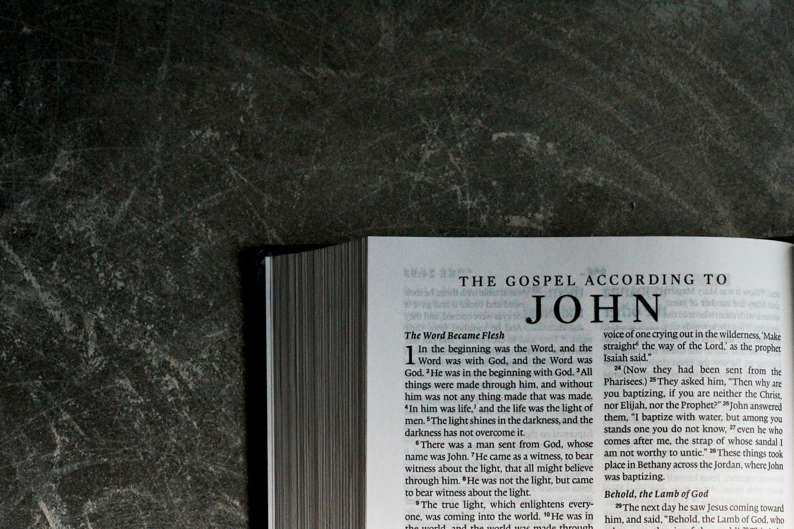

# The World Made Audible

2026-07-09

## The First Question Was Smaller Than the Answer

The question began in a practical place. How does one become more articulate? It sounds like the kind of question that belongs to the world of books, training, public speaking, pronunciation, presentation, and confidence. There are indeed many books that promise to help a person speak more clearly, argue more persuasively, or express ideas with greater ease. Such books can be useful. They offer techniques, exercises, examples, and reminders. They can help us remove clutter from our sentences, organize our thoughts, and become more aware of the listener.

But the question becomes much larger once we begin to examine it seriously. Articulation is not only the ability to speak smoothly. It is not merely verbal confidence, elegant phrasing, or the absence of hesitation. A person can sound polished and still remain shallow. A person can speak quickly and fluently without saying much that is true, humane, or deeply understood. The surface of language can shine while the interior life remains undeveloped.

True articulation requires more than technique. It involves knowledge, comprehension, experience, judgment, and wisdom. It also involves the body. Speech is not produced by the mind alone. It passes through breath, throat, tongue, lips, posture, rhythm, hearing, and feeling. To become articulate is therefore not merely to learn how to arrange words. It is to become the kind of person from whom ordered and meaningful words can arise.

This is why articulation begins to look less like a skill set and more like a form of human formation. A skill can be trained in isolation, but formation involves the whole person. It is connected with reading, writing, listening, speaking, praying, remembering, reflecting, and living. It is shaped by what we pay attention to, what we love, what we suffer, what we believe, and what kind of community we inhabit.

In this sense, a daily writing practice is not only a habit of production. It is a way of returning to the power of language. To write regularly is to remember that human beings live through meaning, and meaning asks to be given form. We do not simply experience the world. We interpret it, narrate it, test it, share it, and preserve it. Language allows the world to become intelligible, and articulation allows that intelligibility to become audible.

The original question, then, was smaller than the answer. It began with how to speak better. It gradually opened into a deeper question: how does a human being give voice to life?

## When Language Enters the Body

Silent reading is one of the great achievements of the human mind. It allows us to enter a text inwardly, privately, and quickly. We can sit alone with a book and travel across centuries, languages, cultures, and states of soul. We can read slowly or rapidly, pause at a difficult sentence, return to an earlier page, and let the text work quietly within us. Silent reading is indispensable.

Yet silent reading is not the whole of reading. Something changes when a text is read aloud. Language leaves the hidden chamber of the mind and enters the body. Words must pass through the breath. Sentences must find rhythm. Meaning must be carried by voice. The reader discovers whether the thought can live in sound.

This is why reading one’s own essay aloud is such an effective practice. On the page, a sentence may appear clear enough. But once spoken, its weaknesses often reveal themselves. A phrase may feel too heavy. A transition may sound forced. A paragraph may move too quickly or too slowly. A line that looked elegant may become awkward in the mouth. A thought that seemed complete may feel unfinished when heard.

The body becomes a judge of language. Breath detects excess. The ear detects false rhythm. The mouth detects unnecessary complication. The voice detects where emphasis naturally belongs. Reading aloud therefore does more than improve pronunciation. It tests whether thought has found a livable form.

This practice becomes even more important when writing in one language and translating into another. Before translating an English essay into Japanese, reading the English aloud can clarify the inner movement of the piece. It allows the writer to hear the structure, not only see it. Where is the center of the paragraph? Which sentence carries the emotional weight? Which idea prepares the next movement? What should be preserved in Japanese, not merely as information, but as tone, rhythm, and intention?

In this way, reading aloud becomes part of comprehension. It is not only a performance after understanding has already occurred. It is one of the ways understanding becomes fuller. To speak the text is to encounter it again through another channel. The eyes, mind, mouth, ear, and breath cooperate. The written word becomes an event.

This is why the physiological side of articulation should not be treated as secondary. The mouth, throat, tongue, lips, chest, and breath are not merely mechanical tools used after thought is complete. They participate in the shaping of thought. A person who reads aloud regularly is training the body to carry meaning. That training matters because speech is not an abstraction. It is embodied intelligence.

Modern technology can support this practice in ways that would have been unimaginable in earlier generations. A word whose pronunciation is uncertain can now be heard instantly. A sentence, paragraph, or passage can be made audible through text-to-speech. A non-native speaker can compare, repeat, adjust, and internalize. This does not replace the need for judgment, but it gives the learner a living model of sound. It restores, in a technological form, something that language learning has always needed: the voice of another.

Still, the essential practice remains ancient. Read. Speak. Listen. Repeat. Let the word pass through the body until the thought becomes more fully one’s own.

## The Old Discipline of Reading and Listening

The connection between articulation and education is older than modern classrooms. In *How to Speak, How to Listen*, Mortimer J. Adler points out that, before printed books became widely available, education depended much more heavily on speaking and listening than on private reading. In the medieval university, the teacher was a “lecturer” in a more literal sense of the word. He read a text aloud, usually with running commentary, while students listened carefully and learned through what they heard. Knowledge, in that older educational world, moved first through the human voice before it entered the notebook.

This older meaning is easy to forget because the modern lecture often suggests a person speaking from slides, notes, or memory to an audience that may or may not be listening carefully. But the older image is more demanding. The lecturer had to read accurately and clearly. The students had to listen with disciplined attention. Education required vocal skill on one side and auditory discipline on the other.

This reminds us that articulation is never isolated from listening. To speak well is important, but to listen well is equally necessary. A society that trains people to speak without training them to listen will not become more articulate. It may only become noisier. Articulation belongs to a shared field in which meaning passes from one person to another. The speaker gives form. The listener receives, tests, remembers, and responds.

In an oral or manuscript-based culture, the listener’s responsibility was obvious. If the student did not listen, the text might be lost. If the words were not copied carefully, the teaching could be distorted. Attention was not merely a personal preference. It was part of the preservation of knowledge.

This older educational world can correct our assumptions. We often think of articulation as a modern soft skill, useful for meetings, interviews, presentations, or leadership. It is all of these things, but it is much more. Articulation has always been tied to memory, teaching, transmission, and civilization. Human beings preserve meaning by giving it form, and for much of history that form was spoken before it was widely printed.

Civilization is not built only by roads, buildings, institutions, weapons, or trade. It is built by words. Laws, prayers, poems, stories, philosophical arguments, letters, sermons, songs, and testimonies all depend on articulation. They allow experience to outlast the moment. They allow one generation to speak to another. They allow a community to remember what it has suffered, what it has learned, and what it hopes to become.

From this perspective, to become more articulate is not merely to improve oneself. It is to participate more responsibly in the long human work of meaning. We inherit language from those who came before us, and we pass it on, either clarified or degraded, to those who come after us.

## The Sacred Event of Spoken Words

Religious ritual shows this with special force. In a Mass or service, words are not treated as private material for silent consumption. Scripture is proclaimed. Prayers are spoken aloud. The creed is recited together. The community responds, sings, listens, stands, sits, kneels, and receives. The whole body is drawn into the act of worship.

This is not accidental. Religion understands, often more deeply than modern intellectual culture, that human beings are not detached minds. We are embodied persons. We learn through repetition, posture, sound, gesture, rhythm, memory, and shared presence. A prayer silently understood is one thing. A prayer spoken together by a gathered community is another.

One may read the Bible alone every day, and such reading is valuable. Private reading can deepen faith, console the soul, and open the mind to truth. But communal worship does something that private reading cannot fully replace. It turns the word into an event. It places language within time, space, voice, body, and community. The word is not merely studied. It is heard. It is answered. It is shared.

This gives new depth to the beginning of the Gospel of John: “In the beginning was the Word, and the Word was with God, and the Word was God.” Christianity begins not with a technique of speech, but with a vision of reality as meaningful at its source. The Word is not a human invention added later to a silent universe. Meaning is present from the beginning.

Human articulation, viewed from this height, is not a minor ability. It is a small participation in a larger order of meaning. When people speak truthfully, pray sincerely, teach carefully, write responsibly, and listen with attention, they are not merely using language. They are entering into the mystery that reality is intelligible and that human beings are called to respond.

This is why sacred language often carries unusual weight. The same words may be repeated week after week, year after year, century after century, yet they do not become empty when they are truly inhabited. Repetition can become mechanical, of course. But repetition can also become formative. It allows words to pass from the page to the mouth, from the mouth to memory, from memory to action.

The communal dimension matters. When a congregation recites the creed, each person speaks, but no one speaks alone. The voice of the individual is held within the voice of the community. This is a powerful image of articulation itself. Human speech is personal, but it is never merely private. We speak from ourselves, yet we speak in languages we inherited. We use words shaped by history, culture, family, faith, and community.

The sacred and the ordinary are not as far apart as they first appear. A parent comforting a child, a teacher explaining a difficult idea, a friend offering honest advice, a writer shaping an essay, a reader proclaiming Scripture, and a community praying together all reveal different levels of the same truth: words can make meaning present. They can gather scattered experience into form. They can make the invisible audible.

## Writing as a Daily Practice of Meaning

Daily essay writing belongs within this larger vision. It is easy to treat writing as output, especially in a world of platforms, deadlines, metrics, and constant publication. But writing can also be a discipline of attention. It can become a way of asking what an experience means before rushing past it.

A thought often begins in an unclear form. It may appear as an irritation, memory, question, phrase, image, or uneasiness. At first, it may not know what it is. Writing gives it space to become visible. The writer follows the thought, tests it, corrects it, expands it, and gradually discovers its shape. What was vague becomes shareable. What was private becomes communicable. What was fleeting becomes durable.

This is why writing is connected to the fullness of life. Human beings do not live only by events. We live by interpreted events. Two people may pass through the same experience, but the meaning of that experience depends on reflection, memory, language, and response. Writing helps experience become part of a life, rather than merely something that happened.

For a person who writes regularly, the world becomes more articulate. Ordinary scenes begin to speak. A conversation at work, an article encountered online, a memory from childhood, a phrase from Scripture, a book by an old author, a misunderstanding in daily life, or a small domestic moment can become the starting point for reflection. The writer learns to listen to life more carefully.

Reading aloud then completes part of the process. The essay returns to the body. It is no longer only a written object. It becomes something heard. The writer discovers whether the language breathes, whether the thought moves naturally, and whether the tone remains humane. Reading aloud protects writing from becoming too abstract, too ornate, or too detached from speech.

Translation adds another layer of discipline. To translate one’s own essay is to ask what must remain constant beneath the change of language. The words may alter, but the thought must survive. Tone, rhythm, and intention must be carried across. Translation reveals whether the original thought was truly understood or only partially formed.

Sharing brings the practice into community. An essay that remains private may still have value, but articulation naturally seeks relation. We write not only to express ourselves, but to offer something understandable to another person. This offering requires humility. The writer must ask whether the words help or obscure, whether they invite or merely impress, whether they clarify experience or only decorate it.

In this sense, daily writing is a form of life. It gathers thinking, reading, listening, speaking, memory, faith, and community into one practice. It trains the mind, but also the conscience. It asks the writer to become more honest, more attentive, more patient, and more capable of giving form to what matters.

## The New Machine at the Door of Language

Into this ancient human activity, generative AI has now arrived. Its arrival is strange because it does not come to us first as a machine of metal, gears, engines, or visible force. It comes through language. We type a question, and it answers. We offer fragments, and it creates structure. We bring uncertainty, and it suggests possible forms. It speaks in the medium through which human beings think, teach, pray, argue, remember, and write.

This is why generative AI feels different from many earlier technologies. A calculator works with numbers. A camera captures images. A vehicle moves bodies through space. But generative AI touches articulation itself. It enters the human world through words.

This creates both possibility and danger. Used poorly, AI can weaken articulation. It can allow a person to avoid thinking, avoid reading, avoid struggle, and avoid responsibility. It can produce language that sounds fluent but has not passed through experience, conscience, or wisdom. It can encourage speed without depth, polish without formation, and output without understanding.

But used well, AI can support articulation. It can become a partner in dialogue, revision, translation, questioning, and clarification. It can help a writer examine whether an idea is coherent, whether a paragraph flows, whether a phrase is natural, or whether a thought can be developed further. It can make visible what was still vague. It can offer alternatives that sharpen judgment.

The difference lies in the human posture. If AI is used as a substitute for thought, the person becomes weaker. If it is used as a mirror and instrument for thought, the person may become stronger. The human being must remain the center of responsibility. The writer must bring memory, lived experience, moral judgment, faith, and intention. AI can assist with language, but it cannot live the life from which truthful language comes.

This distinction is essential. AI can generate words, but it does not inhabit the word. It does not breathe through a sentence. It does not kneel in prayer. It does not listen to Scripture with a history of sorrow and hope. It does not feel the cost of misunderstanding. It does not love a community. It does not carry mortality in its body. It does not need to become wise.

Human articulation is incarnate. It comes from a life. It is shaped by the body, by memory, by suffering, by discipline, by prayer, by friendship, by failure, by work, and by the desire to communicate truthfully with others. AI articulation is synthetic. That does not make it worthless, but it does mean that it must be placed properly.

Perhaps generative AI has arrived at a moment when human beings need to rediscover what language really is. If we treat language merely as content, AI will tempt us to produce more and mean less. But if we understand language as a human and spiritual activity, AI may help us see the difference between generated fluency and lived articulation.

The question is not only whether AI can write. The deeper question is whether human beings will continue to become articulate.

## Toward a More Articulate Life

A more articulate life is not simply a life in which one speaks better. It is a life in which thought, feeling, body, memory, and belief are gradually brought into clearer relation. It is a life that resists vagueness without becoming harsh, seeks clarity without becoming simplistic, and values speech because speech can serve truth and communion.

This kind of articulation begins privately, but it does not remain private. The person who learns to think clearly can listen more patiently. The person who writes carefully can speak more responsibly. The person who reads aloud can hear language more honestly. The person who prays with others can understand that words are not possessions, but shared forms of life.

Better articulation can therefore contribute to better community. Words can confuse, manipulate, wound, flatter, and divide. But words can also clarify, heal, teach, encourage, reconcile, and gather. A community becomes healthier when its members can express concern without cruelty, disagreement without contempt, conviction without arrogance, and faith without empty performance.

This is why articulation should not be reduced to personal branding or public performance. Its deeper purpose is not to make the self more impressive. Its purpose is to make meaning more shareable. A truly articulate person does not merely draw attention to himself. He helps others see, understand, remember, and respond.

The daily practices of writing, reading, reading aloud, translating, praying, listening, and sharing are therefore not small things. They are exercises in becoming more fully human. They allow language to pass through the whole person. They allow the world to be received, interpreted, and offered back with greater care.

The beginning of John’s Gospel remains a profound reminder. “In the beginning was the Word.” Before technique, there is meaning. Before performance, there is truth. Before communication strategy, there is the mystery that reality can be spoken, heard, received, and lived.

To write each day is to remember this. To read aloud is to let meaning enter the body. To pray with others is to let words become communal. To listen carefully is to honor the voice of another. To speak truthfully is to make oneself responsible before reality and before one’s neighbor.

The world becomes audible through such acts. Not because language invents reality, but because language allows reality to be received in a human way. Through words, life becomes visible to itself. Through voice, meaning becomes shared. Through listening, the self discovers that it is not alone.

This is why articulation matters. It is not merely the art of saying things well. It is one of the ways human life becomes fully lived.

Photo by [April Dunn](https://unsplash.com/@aprildunn?utm_source=unsplash&utm_medium=referral&utm_content=creditCopyText) on [Unsplash](https://unsplash.com/photos/white-printer-paper-on-black-textile-0XjrGu5dLO4?utm_source=unsplash&utm_medium=referral&utm_content=creditCopyText)