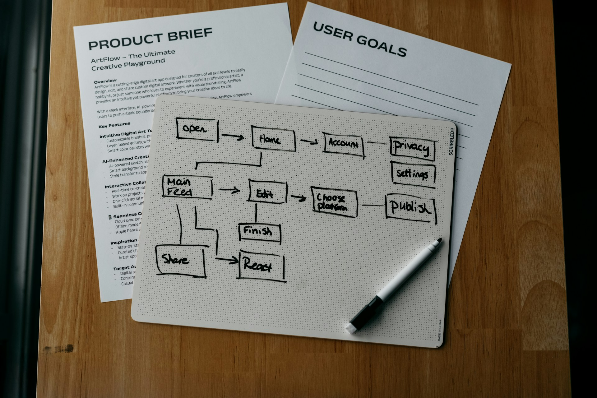

# Clear Thought Before Rich Format

2026-07-11

## A Simple Request With Hidden Layers

The realization often begins with a task that looks simple from the outside. A document needs to be revised, a slide deck needs to be created, a spreadsheet needs to be cleaned up, or a dashboard needs to be turned into a more useful page. These are ordinary requests in modern knowledge work, and because the final objects are familiar, we tend to assume that the work itself will also be straightforward.

Once the process begins, however, the apparent simplicity often disappears. A link may break, a heading may shift, or a chart may stop referring to the correct data range. A slide may look polished while expressing something slightly different from the intended message. A spreadsheet may preserve its appearance while hiding a fragile formula, and a web page may render properly while depending on unclear data logic. What looked like one task turns out to contain several forms of work at once.

This should not be dismissed as a simple failure of AI. It reveals something more interesting about the nature of the task. The question is less whether AI can handle Word files, PowerPoint decks, Excel workbooks, or web pages than what these formats require it to manage. Each one carries several layers. A Word document is not only text, a PowerPoint deck is not only an argument, an Excel workbook is not only data, and a web dashboard is not only information presented on a screen.

These formats combine meaning with presentation. They contain content, but they also contain style, layout, hidden structure, metadata, links, formulas, objects, and application-specific rules. When we ask AI to work directly inside them, we often ask it to perform two different kinds of work simultaneously. It must interpret or improve the content while also managing the machinery that carries it. Errors become more likely when meaning and implementation are treated as one undivided task.

A more reliable method begins by separating them. The content should first be clarified in a form suited to reasoning and review. Once its meaning and structure are stable, it can be implemented in the format required for distribution or presentation. This principle applies not only to AI-assisted document production, but also to human writing, software development, data analysis, and publishing.

Markdown, CSV, JSON, and other plain or structured text formats become useful within this sequence because they reduce the distance between the content and its underlying structure. Their main value is not simply that they are lightweight. They make it easier to distinguish the work itself from the container through which that work will eventually be presented.

## The Plain Text Instinct

Long before generative AI became part of everyday work, many writers had already discovered the practical value of plain text. They preferred simple text editors, Markdown files, or lightweight writing environments, not because they rejected sophisticated tools, but because they wanted to protect the act of writing from unnecessary interference.

At the beginning of a draft, the work is still unsettled. A sentence may be searching for its proper form. A paragraph may contain several ideas that have not yet been separated. The writer is trying to understand the subject while also finding an order that makes sense. This stage requires concentration because the content is still being discovered rather than merely recorded.

A word processor can be useful during this process, but it also introduces other kinds of decisions. The writer may notice that the font is inconsistent, the spacing has changed, the heading looks too large, or the image has moved to another page. The application may slow down as the document grows. A style setting may change unexpectedly. None of these problems is difficult by itself, but each one pulls attention away from the sentence that was being formed.

Plain text reduces this interference. The writer does not need to decide how the page should look because there is no designed page yet. The focus remains on language, sequence, argument, evidence, and tone. Markdown adds enough structure to make the draft readable without forcing the writer into visual design. A heading can be identified as a heading, a quotation as a quotation, and a link as a link, while the final appearance remains open.

The attraction of plain text therefore goes beyond simplicity in the technical sense. It creates an environment in which thought remains close to expression. The writer can decide what a passage means before deciding how much space it should occupy on a page. Structure is present, but decoration does not compete with it.

This does not make Word or other rich formats unnecessary. They remain valuable for formal review, printing, distribution, commenting, and submission. Their strength lies in presentation and collaboration. The plain text instinct simply recognizes that the tool best suited to finishing a document is not always the tool best suited to beginning one.

## The Cost of Divided Attention

The preference for plain text can be understood as a response to divided attention. Human beings do not possess unlimited working memory. When we write, we are already holding several concerns at once: the point of the passage, its relation to what came before, the evidence that supports it, the tone of the language, and the direction of the next paragraph.

Formatting introduces another set of concerns before the first set has been resolved. The writer begins to manage appearance while still developing meaning. This is not necessarily disastrous, and experienced writers may move between these layers with ease. Even so, every additional layer creates a chance for attention to shift away from the intellectual work.

The effect is often subtle. A writer may not stop completely to fix a heading, but the visual irregularity remains present in the background. A slow application may not prevent progress, but it adds friction to every action. A misplaced image may not destroy the argument, but correcting it breaks the rhythm of thought. Over time, these small interruptions make the work feel heavier.

The problem is not merely efficiency. Divided attention can affect the quality of the result. A paragraph may be left underdeveloped because the writer moves too early into polishing. A structural problem may remain hidden because the document already looks complete. Visual order can create the impression that the reasoning is finished even when the underlying ideas are still unstable.

Plain text delays this illusion of completion. A draft remains visibly unfinished, which can be useful. The writer is less tempted to confuse neat formatting with intellectual clarity. The page does not look final, so the content must earn its sense of completion through coherence, accuracy, and depth.

The same principle appears in other kinds of work. A presentation can look convincing before its central claim has been tested. A spreadsheet can look professional before its formulas have been checked. A dashboard can create confidence through color and motion even when the metric definitions are unclear. Rich presentation is persuasive, which is precisely why it should rest on content that has already been examined.

## When AI Meets the Weight of Format

AI does not experience distraction in the human sense. It does not become impatient with menus, irritated by page breaks, or mentally tired of adjusting margins. Yet the structure of the task can still become more difficult when too many layers are mixed together.

A complex file carries information that may be relevant to the final artifact but irrelevant to the current reasoning task. A Word document may include styles, tables, comments, hyperlinks, section breaks, and internal XML relationships. A PowerPoint deck may contain text boxes, slide masters, grouped shapes, embedded media, charts, speaker notes, and alignment rules. An Excel workbook may include formulas, named ranges, hidden sheets, merged cells, conditional formatting, and links to external sources.

When AI is asked to work directly with such a file, it may need to interpret all of these elements while also handling the visible content. If the task involves revision, translation, analysis, or restructuring, the AI must decide what should change and what should remain untouched. It may also need to preserve the file well enough for the original application to open it correctly afterward.

The resulting workload is not only larger in volume. It is more varied in kind. The AI may be asked to reason about meaning, maintain structural consistency, manipulate an application-specific format, and generate a valid output file in a single sequence. Each responsibility creates another point at which something can go wrong.

A sentence may be improved while a link is damaged. A chart may be recreated while its source range changes. A slide may be redesigned while its message becomes less precise. A table may be reformatted while a hidden dependency is lost. These are not all failures of language understanding. Some arise because content decisions and implementation decisions are being made together.

Complex formats can also introduce unnecessary processing. Not every style attribute, object property, or cell format is important to the intellectual task. When such information enters the workflow too early, it becomes noise. The AI must either interpret it, ignore it, or risk altering it, even though the immediate goal may be only to clarify the content.

A cleaner workflow reduces this burden by limiting each stage to a more coherent kind of work. The model first handles meaning in a form that makes meaning visible. It later handles implementation with a more stable specification. This does not remove all errors, but it makes them easier to prevent, detect, and correct.

## Content First, Implementation Second

The distinction between content and implementation becomes practical when it is turned into a sequence. First, the work is clarified in a simple and inspectable form. Then it is implemented in the format required for presentation, distribution, or continued use.

For prose, the first form may be Markdown. For tabular information, it may be CSV or a clean dataframe. For hierarchical data, JSON may be more appropriate. For analysis, SQL or another explicit query language may help reveal the logic. The intermediate format should match the nature of the content rather than forcing every task into one universal system.

Consider a PowerPoint deck. Asking AI to create the finished file immediately may produce an attractive result, especially when the topic is simple. A more demanding presentation benefits from an earlier stage in which the narrative is developed separately. Each slide can first be described through its title, central message, evidence, recommended visual, and speaker note.

At that point, the user can evaluate the presentation without being distracted by its appearance. The sequence can be challenged. Repetition can be removed. Weak evidence can be identified. A slide carrying too many ideas can be divided. The visual recommendation can be assessed according to the message rather than according to decorative appeal.

Once the structure is approved, the implementation instruction becomes narrower. The AI no longer needs to decide what the presentation should say. It can focus on converting an accepted plan into slides, while preserving the wording, numbers, and logic that have already been reviewed.

Excel work can follow a similar order. Before formatting the workbook, the data should be checked in a form where rows, columns, values, and calculations are easy to inspect. Missing values, inconsistent categories, duplicate records, and unclear metric definitions should be addressed before charts and conditional formatting are added.

A dashboard also benefits from separation. If the data is available through an API, it may be cleaner to move from the API into structured data, then into calculation logic, and finally into the presentation layer. Excel should be included when it serves a real review, reporting, or manual adjustment need, not simply because it is a familiar intermediate step.

## The Stable Middle Ground

Plain text and structured text formats are useful because they provide a stable middle ground between raw thought and finished output. They are not always the starting point, and they are rarely the final product, but they make the movement between stages easier to manage.

Markdown illustrates this well. It can preserve headings, lists, quotations, links, and basic emphasis without tying the content to one visual system. A human can read it directly. An AI can interpret it easily. Version control can track meaningful changes. Other tools can convert it into HTML, Word, PDF, presentation formats, or CMS content.

CSV and JSON serve a similar role for data. They may not be visually impressive, but they expose structure clearly. In a CSV file, a value belongs to a specific row and column. In JSON, an item belongs to a named field or a defined hierarchy. The relationships are visible without being buried inside extensive formatting.

This portability matters because modern content rarely remains in a single form. A research report may later become a blog post, a slide deck, a translated edition, a set of social media statements, and a downloadable PDF. A group of performance metrics may appear in a spreadsheet, a management report, a dashboard, and a presentation.

When the only source of truth is the final formatted artifact, every new use creates additional work. Content has to be extracted from the designed file, interpreted again, and adapted to another container. Each conversion creates another chance for inconsistency.

A structured source makes reuse more reliable. The layout may change while the meaning remains stable. A CMS can be replaced without rewriting the article. A presentation template can be updated without changing the approved argument. A report can be republished in several forms without rebuilding its content from the beginning.

The plain form is therefore not a retreat from sophisticated output. It is often the foundation that allows sophisticated output to be produced repeatedly without losing coherence. Its lack of visual richness is part of its strength because it keeps the underlying material accessible.

## From AI Native to Structure Native

The current discussion around AI often focuses on becoming AI native. Organizations want employees to use AI more frequently, write better prompts, automate more processes, and adopt new tools quickly. These capabilities matter, but they do not fully explain why some people work with AI more effectively than others.

A deeper advantage may come from being structure native. Such a person naturally separates content, logic, data, design, implementation, and distribution. They see a finished artifact as the result of several distinct stages rather than as one indivisible object.

Writers who already draft in plain text have part of this habit. They understand that composing and formatting are different activities. People who outline a presentation before opening PowerPoint recognize that the story must exist before it is placed on slides. Analysts who clean data before designing charts know that visual polish cannot compensate for uncertain definitions.

These habits transfer naturally into AI collaboration. A structure native user is less likely to ask the model to do everything at once. They may first ask for an analysis, then for an outline, then for a draft, then for an implementation specification, and only afterward for a final file. The workflow gives each stage a clear purpose.

This approach also improves review. If the content is wrong, the content stage can be corrected. If the implementation is wrong, the output can be repaired without reopening the reasoning. The source of an error becomes easier to identify because the stages have not been collapsed into one opaque process.

The quality of AI-assisted work therefore depends on more than the intelligence of the model or the skill of the prompt. It also depends on how the task is divided. A well-written instruction cannot fully rescue a workflow in which too many responsibilities have been combined. A clear process can make even simple instructions more reliable.

This suggests that AI literacy is partly a form of work design. The user must know what kind of problem is being solved, which format best represents that problem, and when the work is ready to move into another layer. These decisions may become more important as AI gains access to increasingly complex tools.

## The Work and the Container

The plain text movement and AI-assisted work meet around a shared distinction: the work itself is not identical to the container that carries it. A document is not only its Word file. A presentation is not only its slides. A dataset is not only its workbook. A published article is not only its CMS page.

A writer who begins in Markdown is not rejecting Word. The writer is placing Word at the stage where its strengths matter most. A team that develops a slide narrative before designing the deck is not rejecting PowerPoint. It is making sure the presentation has a reason to exist before deciding how it should look.

The same applies to data. An analyst who checks a CSV before building an Excel report is not avoiding Excel. The analyst is making sure the values and definitions are stable before adding visual interpretation. A developer who connects structured data directly to a web page is not dismissing spreadsheets. The developer is reducing unnecessary layers in the data path.

Rich formats remain essential because work must eventually reach other people. Reports must be reviewed. Presentations must be delivered. Dashboards must be used. Articles must be published. Design, readability, accessibility, and ease of use all matter. The distinction between content and implementation does not diminish these concerns. It gives them a firmer base.

There are also many situations in which the stages can be combined without serious risk. A short memo may be drafted and formatted in one pass. A small slide deck may not require a separate planning document. A simple spreadsheet correction may be easier to make directly. The method should respond to the scale and importance of the task rather than becoming a rigid ritual.

Separation becomes more valuable as complexity increases. Long documents, sensitive figures, multiple reviewers, multilingual content, repeated updates, linked data, and formal publication all create reasons to establish a stable content layer before implementation begins.

The practical question is not whether every task must pass through Markdown, CSV, or JSON. It is whether the current form allows the essential work to be seen clearly. When the container begins to hide the content, add unnecessary decisions, or make errors difficult to trace, a simpler intermediate form can restore clarity.

## A Habit of Clearer Work

The principle that emerges is broader than a recommendation about file formats. It concerns the order in which intellectual work should proceed. Meaning should be clarified before appearance creates the impression of completion. Structure should be tested before implementation makes revision expensive. Data should be verified before visualization gives it authority.

Human beings have long benefited from this order because attention is limited. We work better when the present task is not burdened with decisions that belong to a later stage. AI systems benefit for a different technical reason, but the practical result is similar. Their work becomes easier to guide when irrelevant complexity is removed.

This parallel does not mean that human beings and AI think in the same way. A human writer experiences distraction, fatigue, and mood. An AI system processes instructions, context, tools, and representations. Yet both can produce weaker results when too many distinct responsibilities are introduced at once.

People who already understand the value of plain text may therefore possess a useful foundation for working with AI. They are accustomed to separating drafting from formatting, structure from appearance, and source material from final output. They know that a clean intermediate form is not an unnecessary delay, but a way of preserving the integrity of the work.

As AI becomes more capable of operating Word, PowerPoint, Excel, browsers, design tools, and local files, the temptation will be to ask it to complete entire workflows in one uninterrupted action. Sometimes that will be appropriate. Greater capability does not remove the value of decomposition, however. It makes thoughtful decomposition more powerful because each stage can be delegated with greater precision.

The future of AI-assisted work may therefore depend less on asking AI to do everything and more on understanding what it should be doing at a particular moment. First the content is clarified. Then the structure becomes explicit. After that, the work is implemented in the required form and checked against the approved source.

This sequence is not only efficient. It creates a calmer relationship with tools. The writer can write before becoming a formatter. The analyst can confirm the data before becoming a designer. The AI can reason before becoming an application operator. Each form of work receives the attention appropriate to it.

Plain text remains valuable within this process because it offers a place where meaning can remain visible before it is enclosed in a richer format. Word, PowerPoint, Excel, PDF, HTML, and CMS platforms still have important roles, but their strongest role may often come later. Clear work begins by identifying what belongs to thought, what belongs to structure, and what belongs to presentation. Once those distinctions are respected, both people and AI can work with greater accuracy, continuity, and confidence.

Photo by [Kelly Sikkema](https://unsplash.com/@kellysikkema?utm_source=unsplash&utm_medium=referral&utm_content=creditCopyText) on [Unsplash](https://unsplash.com/photos/workflow-diagram-product-brief-and-user-goals-are-shown-wdnpaTNwOEQ?utm_source=unsplash&utm_medium=referral&utm_content=creditCopyText)
