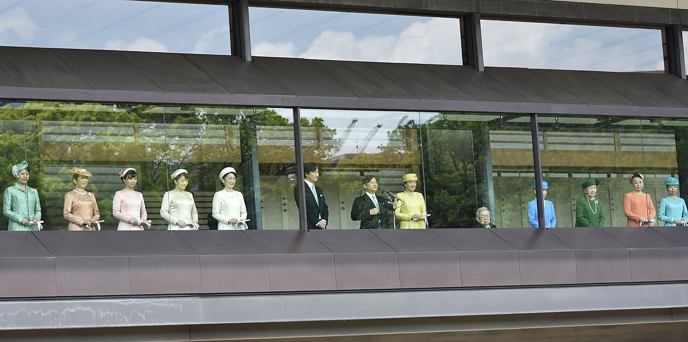

# The Line That Holds the Throne

2026-07-14

## A Debate Hidden Inside Another Debate

Japan’s current discussion about the Imperial Family appears, at first, to concern a limited institutional problem. The number of imperial family members has been declining, largely because female members traditionally leave the Imperial Family when they marry commoners. Since most of the younger unmarried members are women, the number of people available to perform imperial duties may continue to fall.

Two responses have therefore received serious political consideration. One would allow female members to retain imperial status after marriage. The other would make it possible for members of the Imperial Family to adopt male-line descendants of collateral imperial houses whose members lost imperial status after the Second World War. 

Under the Allied Occupation led by General Douglas MacArthur, the occupation authorities (GHQ/SCAP) sought to reduce the size and political influence of the Imperial House as part of Japan's postwar democratization. In 1947, eleven collateral imperial houses were removed from the Imperial Family and became ordinary citizens. Although they ceased to hold imperial status, their descendants remain members of the historical male imperial line, which is why proposals concerning their possible return continue to appear in contemporary succession debates.

Neither proposal, at least as officially framed, is intended to alter the present order of succession. The current Imperial House Law states that the throne shall pass to a male descendant in the male line of the Imperial lineage. It places the descendants of the Emperor first, followed by his brothers and their descendants, his uncles and their descendants, and then the nearest eligible member of the Imperial Family.

This would seem to leave little room for confusion. The immediate question concerns the size and functioning of the Imperial Family, not whether Princess Aiko should become emperor or whether succession should be permitted through women.

Yet those larger questions repeatedly enter the debate. Princess Aiko, the only child of Emperor Naruhito and Empress Masako, enjoys considerable public affection. Prince Hisahito, the son of Crown Prince Akishino and currently second in line to the throne after his father, occupies a different position in the public imagination. Consequently, an institutional discussion about imperial membership easily becomes a personal comparison between two young members of the Imperial Family.

The comparison is understandable, but it conceals the true structure of the problem. Japan is not simply choosing between Princess Aiko and Prince Hisahito. Nor is it choosing only between a male and a female successor. Beneath the public discussion lie several competing principles: male-line descent, male-only succession, direct descent from the reigning emperor, institutional survival, and public acceptance.

Each principle sounds reasonable when considered alone. The difficulty arises because they do not always point toward the same person or the same future.

To understand why the debate has become so sensitive, several terms must remain distinct. A male-line male belongs to the imperial lineage through an unbroken sequence of fathers and is himself male. A male-line woman also belongs to that same paternal lineage but is female. A female emperor can therefore still be a member of the male line. A female-line emperor, by contrast, would inherit imperial descent through the mother.

Princess Aiko is a woman of the male line because her father is the Emperor. If the law were changed to permit a male-line woman to ascend the throne, she could theoretically become a female emperor without ending male-line succession at the moment of her accession. If she married a man outside the Imperial Family and their child later inherited the throne, however, that child would belong to the imperial lineage through the mother. That would constitute female-line succession.

This distinction is clear in genealogy but difficult to contain in politics. Once a beloved female emperor had a child, many people would ask why the sovereign’s own child should be excluded while a distant male-line relative remained eligible. The original reform might concern sex alone, but the next discussion would concern direct descent.

The debate therefore asks a question larger than any current proposal: when Japan speaks of preserving the Imperial House, which form of continuity is it trying to preserve?

## The Historical Order of Legitimacy

Modern people often imagine hereditary succession as a line running from a parent to a child, preferably the eldest. When such a direct descendant exists, a distant cousin may appear to possess a weaker claim. In an ordinary family, a daughter or grandchild is usually regarded as closer than a male relative descended from an ancestor several generations earlier.

Imperial succession, however, has not always followed the logic of an ordinary family inheritance.

The Japanese throne did not pass for two thousand years through an uninterrupted sequence of fathers and eldest sons. Brothers succeeded brothers. Uncles were followed by nephews. At various moments, the throne passed from one branch of the dynasty to another. Direct descent was certainly valued, but it was never the sole basis of legitimacy.

The deeper boundary was membership in the imperial male line.

Traditional succession can be understood as a two-stage structure. The first question was whether a person belonged to the male imperial lineage. Once that boundary was established, closeness, seniority, political circumstances, and direct descent could determine priority among those who were eligible.

Directness therefore operated within male-line identity. It did not normally replace it.

This structure remains visible in the present Imperial House Law. The Emperor’s sons and their descendants receive priority, followed by his brothers and their descendants, then his uncles and their descendants. If none of those individuals exists, succession moves to the next nearest eligible member of the Imperial Family. Senior branches and senior members receive preference.

The law favors direct descent, but only after limiting eligibility to male descendants in the male line. A daughter may be genealogically and emotionally closer to the Emperor than his brother, yet she does not enter the order of succession under the present law. The brother is eligible because he belongs to the male line and is male.

This order can seem strange when viewed through the assumptions of contemporary family life. It becomes more intelligible when the throne is understood not as the private possession of the reigning emperor but as an inherited office carried by a dynasty with its own rules of membership.

A reigning emperor does not create the imperial line. He temporarily embodies it. His closest personal descendants do not necessarily acquire a superior claim if they fall outside the established category of succession. The dynasty extends backward and sideways as well as downward.

Historical cases in which the throne passed to a distant male-line relative illustrate this principle. The accession of Emperor Keitai in the sixth century is often discussed because he was not a close descendant of his immediate predecessor. Questions remain about the exact historical circumstances and the reliability of ancient genealogical accounts, but later imperial tradition recognized his accession through male-line descent.

Whether every ancient genealogical detail would satisfy modern historical standards is not the central issue. Dynastic legitimacy depends partly on the way an institution has interpreted its own continuity. For centuries, the Imperial House understood collateral male-line succession as continuity rather than replacement.

The male line supplied the larger frame within which changes of branch could occur.

This historical pattern does not prove that Japan must retain male-only succession forever. Laws may change, and traditions may be reinterpreted. It does show, however, that the preference for a distant male-line relative over a closer female-line descendant is not an accidental defect recently introduced into the system. It follows an old understanding of what constitutes membership in the dynasty.

Calls to prioritize direct descent therefore represent more than a practical adjustment. They reorder the principles of legitimacy.

## The Narrow Opening for a Female Emperor

Japan has had female emperors. Traditionally counted, eight women reigned in ten reigns because two of them ascended the throne twice. Their existence demonstrates that the exclusion of women from the throne is not an unbroken feature of Japanese history.

Those female emperors nevertheless belonged to the male imperial line. Their fathers were emperors or male-line members of the Imperial Family. Their reigns did not establish new female-line dynasties.

This history creates an apparent compromise between present law and broader reform. Japan could retain the male line while removing the requirement that the sovereign be male. Succession would then remain limited to descendants belonging to the paternal imperial lineage, but women within that lineage could become emperor.

Under such an arrangement, Princess Aiko could be considered without immediately abandoning male-line continuity. Her accession would change the sex requirement, not the lineage requirement.

For people seeking a cautious expansion of eligibility, this may appear to be the furthest historically defensible line. Male-line male succession would remain the normal principle. A male-line female emperor could be permitted when circumstances required it. Female-line succession would remain excluded.

The legal architecture is possible. The social architecture is more difficult.

A female emperor could marry. She might have children. Those children would be the direct descendants of the reigning sovereign, perhaps known and loved by the public from birth. Yet if their father did not himself belong to the male imperial line, the children would be female-line descendants and would remain ineligible under a strictly male-line system.

At that moment, a distinction that appears coherent in genealogy would encounter the emotional force of ordinary family life.

Why should the child of the Emperor be excluded? Why should a distant male-line relative take priority over the sovereign’s son or daughter? If the public had already accepted a woman as emperor, why should descent through that woman suddenly become disqualifying?

These questions would not be frivolous. They would arise naturally from a competing idea of hereditary legitimacy. Once a woman occupies the throne, direct descent becomes visible in a way that it is not when the throne remains exclusively male.

This explains why many supporters of male-line succession resist even a male-line female emperor. Their objection is not necessarily based on a belief that women are incapable of performing imperial duties. Nor does it require denying the historical female emperors.

Their concern is institutional sequence.

A reform limited to female accession could generate the political language for female-line succession. The public might first be told that sex should not prevent a qualified member of the male line from becoming emperor. Later, it might be told that the sex of the transmitting parent should not prevent the emperor’s child from succeeding. Each proposition can be presented as a modest removal of unfairness, even though the second would change the governing principle of the lineage.

Nothing about this progression would be legally automatic. A law permitting Princess Aiko to ascend could expressly exclude her children unless they separately qualified through the male line. Parliament could draw a clear boundary.

The uncertainty is whether that boundary could remain politically stable.

Modern society places considerable weight on equality between sons and daughters, continuity between parents and children, and the emotional reality of the nuclear family. A system that allowed a woman to reign but permanently excluded her own children could come to seem internally contradictory. What had begun as a limited historical restoration might be treated as an incomplete reform demanding correction.

For defenders of the male line, the danger lies not in the first step considered by itself but in the moral pressure created by everything that would follow.

## Direct Descent as a Rival Form of Continuity

The idea of direct descent helps explain why some people support female-line succession without seeing themselves as opponents of the Imperial House.

Their reasoning begins from a different image of continuity.

Suppose the choice eventually lies between a child or grandchild of the reigning emperor through a daughter and a male-line descendant of a collateral branch whose family left the Imperial Household decades earlier. The latter may satisfy the traditional genealogical rule. The former may appear more closely connected to the living Imperial Family.

A female-line descendant might have been raised near the center of imperial life, educated for public responsibility, and known to the nation from childhood. A collateral male-line relative might have lived entirely as a private citizen, perhaps with little expectation of entering the Imperial Family.

Under those circumstances, the female-line descendant could feel more continuous with the present dynasty, even if the male-line relative is more continuous with the traditional paternal genealogy.

This is not necessarily a revolutionary argument. Many people who favor female-line succession do so because they fear the extinction of the Imperial House under an overly narrow rule. In their view, preserving the descendants of the reigning family is preferable to allowing succession to depend on the birth of a boy within one remaining branch.

They may also question whether “hereditary” must mean hereditary only through fathers. The Constitution states that the Imperial Throne shall be dynastic and succeeded to according to the Imperial House Law passed by the Diet. It does not itself define dynastic succession as exclusively male-line or male-only. The detailed restriction appears in the Imperial House Law.

From this perspective, an emperor’s daughter and her child remain members of the emperor’s biological line. The descent has not disappeared. It has passed through a woman.

Male-line supporters answer that this formulation changes the meaning of the imperial lineage. Biological descent in any direction is not the same as membership in the historical dynasty as traditionally constituted. Everyone has countless ancestors and descendants through both men and women. A dynasty survives not by recognizing every biological connection but by maintaining a rule that determines which line carries its identity.

The disagreement is therefore not about whether a female-line descendant has imperial ancestry. Such a person clearly would. The disagreement concerns whether imperial ancestry through the mother is sufficient to transmit the throne.

One side treats the dynasty as a paternal line that may pass among several branches. The other treats it as the family descending from the sovereign, with sex becoming less relevant than closeness and public continuity.

Direct-line reasoning gains much of its power from the contemporary experience of family. For most people, a daughter’s child is no less a grandchild than a son’s child. A family that claimed otherwise would appear unnatural. When this ordinary intuition is applied to the throne, a direct female-line grandchild can seem more legitimate than a distant male-line cousin.

Yet an ancient institution cannot be fully understood through the habits of the modern household. The throne is not a family property divided according to contemporary inheritance law. Its unusual character is precisely what has allowed it to preserve an identity different from ordinary kinship arrangements.

To say this is not to settle the debate in favor of the male line. It clarifies the cost of the alternative. Giving direct descent priority over male-line membership would not merely make the old system more inclusive. It would establish a different hierarchy of legitimacy.

The older hierarchy asks first whether someone belongs to the male imperial lineage, then how directly that person is related to the current sovereign.

The newer hierarchy asks first whether someone descends directly from the current imperial family, then whether the route passes through a man or a woman.

Both speak in the language of continuity. They preserve different kinds of continuity.

## When Principles Acquire Faces

Abstract constitutional questions become politically powerful when they acquire recognizable faces. In contemporary Japan, those faces are often Princess Aiko and Prince Hisahito.

Princess Aiko holds a unique place in public consciousness. She is the only child of the Emperor and Empress. Her development from a closely watched child into an adult member of the Imperial Family has unfolded before the public. Her formal appearances, work, manner, and relationship with her parents have contributed to widespread warmth toward her.

For many people, she appears to represent natural continuity. She is not an unfamiliar theoretical candidate. She is the daughter of the reigning emperor, raised inside the Imperial Household and already participating in its responsibilities.

Prince Hisahito occupies the constitutionally stronger position. The current law places his father, Crown Prince Akishino, first in the order of succession and Prince Hisahito second. The law does not ask whether either individual is more popular than another member of the Imperial Family. Eligibility follows lineage and sex, not public preference.

Public perception, however, rarely remains within legal categories.

Prince Hisahito has grown up amid intense attention toward the Akishino family. Media controversies surrounding other family members, scrutiny of his education, and online speculation have affected the atmosphere in which the public views him. Some of these judgments have little to do with his own conduct. A young imperial family member cannot campaign for public support, explain every private decision, or freely answer criticism.

Comparing the popularity of Princess Aiko and Prince Hisahito therefore risks placing both in an unfair position. Neither created the succession rules. Neither has sought election to the throne. Neither should be treated as the leader of a political faction.

The institutional danger is equally serious.

If popularity becomes a practical qualification for succession, hereditary monarchy begins to resemble an informal election. The public may favor one member today and another tomorrow. Media treatment, personal style, family reputation, and selective exposure would influence perceptions of suitability.

A hereditary institution relies partly on removing the highest symbolic office from ordinary political competition. The successor is determined by rules established before the personalities involved can be judged. This can seem rigid, but the rigidity protects the throne from campaigns, factions, and contests of personal approval.

Popular affection is still relevant in a constitutional monarchy. The Emperor possesses no governing power of the ordinary political kind. The institution depends deeply on trust, restraint, and the willingness of the public to recognize its symbolic role. A sovereign who had entirely lost public respect would create a profound institutional crisis.

The difficulty lies in distinguishing the broad legitimacy of the monarchy from the fluctuating popularity of individual imperial family members.

Princess Aiko’s popularity is therefore a double-edged force. It strengthens the connection between the public and the Imperial Family. It also makes female succession appear emotionally obvious before its institutional consequences have been fully examined.

The public question can quickly shift from “Should a male-line woman ever be permitted to reign?” to “Why should this admirable and popular woman be excluded?” Once framed in the second form, disagreement begins to look like a judgment against Princess Aiko herself.

A further shift may follow. If she became emperor and had a child, the question could become “Why should the Emperor’s own child be excluded?” The power of direct descent would then be joined to the popularity of a living sovereign.

A permanent constitutional principle should not be built around the appeal of one individual, however deserving that person may be. The law must govern future generations whose personalities, family circumstances, and public reputations cannot be known.

The same restraint applies in the other direction. Criticism of the Akishino family or unease about Prince Hisahito should not be converted into an argument that the established order may be disregarded. A rule ceases to be a rule if it is followed only when the eligible person is popular.

The choice before Japan is not properly described as Aiko versus Hisahito. Personalizing it in that manner may increase attention, but it diminishes understanding.

## Preservation Without Identity, or Identity Without Survival

Every long-lived institution changes. Ceremonies acquire new forms. Administrative structures are revised. Public roles adapt to new political conditions. The Japanese monarchy has survived court conflict, warrior government, national unification, modern constitutionalism, war, defeat, occupation, and the transformation from sovereign rule to symbolic status.

Change alone cannot therefore be treated as betrayal.

At the same time, an institution cannot survive merely by retaining its name while every defining feature becomes negotiable. A tradition requires some distinction between what can change and what cannot change without producing a different institution.

Male-line supporters place paternal continuity near that boundary. To them, the male line is not an obsolete administrative detail added to the throne. It is the principle through which branches of the Imperial House have remained part of a single dynasty despite distance, interruption, and changes in political power.

From this perspective, female-line succession would not simply permit another descendant to inherit. It would redefine the carrier of dynastic identity. The resulting monarchy might preserve the palace, ceremonies, titles, and constitutional function, but it would no longer continue according to the genealogical principle that had previously identified the imperial line.

The change could therefore be described as revolutionary in the structural sense, even if it occurred peacefully through legislation. It would not resemble the violence of the French Revolution or the cultural destruction of Maoist China. Most advocates of female-line succession do not seek the execution of a monarch or the abolition of inherited culture. Many wish precisely to prevent the monarchy from disappearing.

Their argument begins with a different fear.

A tradition that insists on a single form of biological transmission may eventually be unable to reproduce itself. If the male line is preserved so rigidly that no eligible heir exists, the institution could end not because reformers destroyed it but because its defenders refused every adaptation.

Female-line supporters therefore ask whether the continuity of ritual, responsibility, family memory, public service, and descent from the reigning house should outweigh the exclusive paternal rule. They see adaptation not as surrender but as survival.

The two sides are haunted by opposite failures.

One fears survival without identity. The name of the Imperial House might continue, but the historical line that gave it meaning would have been replaced.

The other fears identity without survival. The traditional rule might remain untouched until there was no one left who could inherit under it.

Neither anxiety can be dismissed by assigning bad motives. Some reformers are strongly influenced by egalitarian ideology and regard male-line succession as incompatible with modern ideas of sex equality. Others are monarchists who believe a broader succession rule offers the only realistic protection against extinction.

Likewise, male-line supporters range from uncompromising traditionalists to cautious institutional thinkers who might accept a female emperor but fear the political movement toward female-line succession.

The debate becomes clearer when neither side is reduced to a caricature.

A supporter of female-line succession need not hate tradition. Such a person may define tradition as the living continuity of the Imperial Family rather than the exclusive continuity of fathers.

A defender of the male line need not oppose women or deny Princess Aiko’s abilities. Such a person may believe that the throne’s identity rests on a rule deeper than individual merit.

Both positions can be sincere. They remain incompatible because they answer the question of imperial identity differently.

## The Line Japan Must Name

The present political approach has been cautious. Official discussions have generally sought to separate the immediate need to secure a sufficient number of imperial family members from any change to the order of succession. Proposals concerning married female members and the adoption of male-line descendants from former collateral houses have been presented as responses to institutional capacity, while the succession through Prince Hisahito remains undisturbed.

This caution is understandable. Once the succession principle is opened, every connected question arrives with it.

Should women of the male line be eligible? Would their spouses join the Imperial Family? What status would their children hold? Could those children inherit? Should the eldest child succeed regardless of sex? Should a direct female-line descendant take precedence over a collateral male-line descendant? Could former branches return after generations of private life? How much weight should public acceptance receive?

No single reform remains isolated for long.

The most conservative coherent position is to preserve male-line male succession, strengthen the collateral male line, and maintain a sufficiently large Imperial Family to perform public duties. Under this view, a distant male-line successor is not an embarrassing substitute for a direct descendant. Collateral succession is one of the historical mechanisms through which the dynasty has endured.

A more limited reform could permit male-line women to become emperor while explicitly excluding female-line succession. This position draws support from historical female reigns and preserves the paternal boundary. Its weakness lies in the pressure that would arise around the children of a female sovereign.

A broader reform would prioritize direct descent and permit succession through either parent. This would provide a larger and more stable pool of heirs and might accord more closely with contemporary family intuitions. It would also replace the traditional male-line hierarchy with a new principle.

Each option protects something and places something else at risk.

The popularity of Princess Aiko makes the question feel immediate, but it can also obscure this structure. Her dignity, intelligence, or public appeal cannot by themselves decide what kind of dynasty Japan intends to preserve. Nor can doubts about Prince Hisahito’s popularity invalidate a legal order that does not depend on popularity.

The two individuals should not be made to carry an ideological conflict that precedes them and will continue beyond them.

Japan’s unresolved difficulty comes from the absence of a shared definition of continuity. For some, continuity means an unbroken paternal imperial line, even when succession passes to a distant branch. For others, it means preserving the living descendants of the current sovereign and maintaining public recognition of the Imperial Family. Still others seek a carefully bounded combination, perhaps permitting a woman of the male line while resisting succession through her children.

No arrangement can fully maximize male-line identity, direct descent, sex equality, demographic security, and public familiarity at the same time.

A decision will therefore require more than sympathy for a particular person. It will require a hierarchy of values.

If male-line identity is the highest principle, directness must sometimes yield to collateral succession. If direct descent is placed first, the male-line boundary will eventually become difficult to defend. If institutional survival is treated as supreme, broader reform may appear unavoidable. If historical continuity is considered the foundation of legitimacy, survival achieved through a different lineage principle may no longer count as preservation.

The deepest question is not who should become emperor after the current generation. It is what makes a successor part of the same imperial tradition.

Japan has maintained the throne partly because earlier generations did not demand that every succession resemble an ordinary family inheritance. They accepted collateral branches when direct lines failed. Yet the monarchy now exists under a constitutional order in which public understanding and acceptance carry a significance unlike that of earlier periods.

Neither history nor contemporary opinion can be ignored. Neither can decide the matter alone.

The task is to identify which line holds the throne together: the male line extending across distant branches, the direct line descending from the present emperor, or a newly defined relationship between the two. Until that question is answered openly, discussions about imperial numbers, marriage, adoption, Princess Aiko, and Prince Hisahito will continue to draw larger arguments into proposals that officially concern something else.

The Imperial House cannot be protected by pretending that these principles are interchangeable. It can be protected only by naming clearly what Japan believes it is preserving, and by accepting the consequences of that choice.

Image: [Wikipedia](https://commons.wikimedia.org/wiki/File:Emperor_Naruhito_20190504b.jpg)