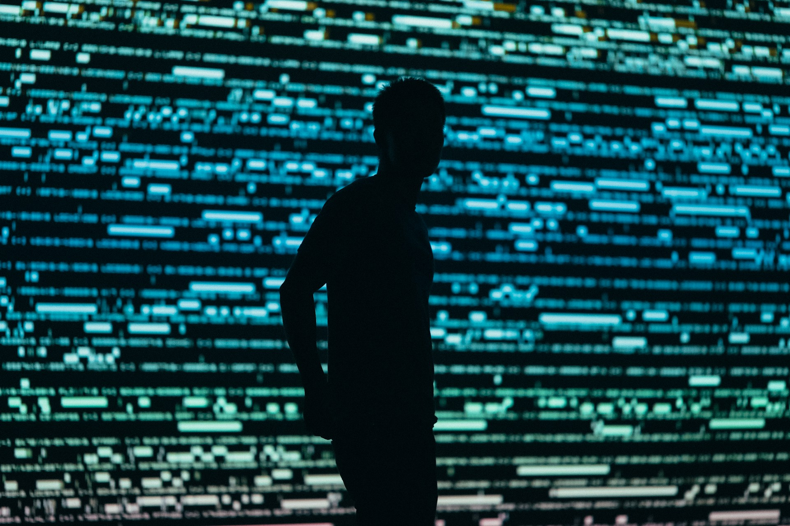

# The Limits We Mistook for Reality

2026-07-16

## The Month the Numbers Broke the Pattern

Patch Tuesday has long followed a familiar rhythm. Security professionals know that the second Tuesday of each month will bring another collection of Microsoft updates, vulnerability descriptions, severity ratings, and deployment decisions. Some months are lighter. Others require more attention. The number of vulnerabilities may rise above one hundred, but it usually remains within a range that experienced teams recognize.

Then came July 2026. In its monthly review, the Zero Day Initiative described the release as “The Mother of All Releases.” [ZDI counted 621 new Microsoft CVEs for the month](https://www.zerodayinitiative.com/blog/2026/7/14/the-july-2026-security-update-review), covering Windows, Office, Azure, Exchange Server, Hyper-V, Defender, Visual Studio, GitHub Copilot, and even products such as Minecraft Server and Age of Empires II. ZDI also observed that Microsoft’s year-to-date CVE count had already exceeded every complete annual total from the previous twenty years.

The immediate concern for security teams is practical. Hundreds of vulnerabilities must be assessed, prioritized, tested, and addressed. A raw number cannot tell an organization which systems are exposed, which vulnerabilities are being exploited, or which patches carry the greatest operational risk. Yet even after those practical questions are considered, the scale of the release leaves behind another impression. Something appears to have changed.

It would be premature to say that all or even most of the July vulnerabilities were discovered by artificial intelligence. Microsoft has not publicly attributed the entire release to AI, and the total includes a wide range of products, services, and vulnerability categories. Changes in reporting practices, expanded product coverage, accumulated research, conventional security testing, external submissions, and other factors may all have contributed.

Even so, the wider direction is becoming difficult to miss. Microsoft has stated directly that AI is changing the scale and speed of vulnerability discovery. Its [MDASH system uses multiple specialized AI agents](https://www.microsoft.com/en-us/msrc/blog/2026/05/a-note-on-patch-tuesday) to discover, validate, and help remediate security flaws, and Microsoft has already integrated this work into engineering processes across Windows, Azure, identity systems, and other parts of its software environment.

Anthropic has provided an even more dramatic example. Through [Project Glasswing](https://www.anthropic.com/research/glasswing-initial-update), Anthropic and around fifty partner organizations used Claude Mythos Preview to identify more than ten thousand high or critical severity vulnerabilities in important software. Anthropic described the resulting shift plainly: progress had once been constrained by how quickly vulnerabilities could be found, but the new constraint was how quickly they could be verified, disclosed, and patched.

That statement reaches beyond cybersecurity. It describes a movement that may soon affect almost every form of knowledge work. The July Patch Tuesday release is therefore interesting not only because of its extraordinary size. It may offer a visible glimpse of a deeper structural transition. The vulnerabilities are the part we can count. Beneath them lies a broader change in how risks, patterns, possibilities, and previously hidden features of the world can be brought into view.

The release may be the tip of an iceberg, but the iceberg is not simply a larger collection of software flaws. It is the arrival of a new scale of observation.

## The Limits We Mistook for Reality

Human beings have always lived within limits. We can look only so far, remember only so much, and devote attention to only a small portion of what surrounds us. These boundaries are natural and unavoidable for an individual. Difficulties arise when we mistake them for boundaries within reality itself.

Before powerful telescopes, distant objects existed beyond human sight. Before microscopes, entire biological worlds were present but unavailable to ordinary observation. Before modern genetic sequencing, countless relationships within living organisms remained hidden, not because they were absent, but because no available instrument could reveal them at sufficient scale.

Knowledge work has similar limits, although they are less visible. A vulnerability researcher can inspect only so much code. A physician can examine only so many patient records. An economist can compare only so many variables and historical cases. A historian can read only a fraction of the documents preserved in an archive. A writer can encounter only a small part of the literature that might deepen an idea.

Institutions increase this capacity by dividing labor among specialists, but every institution also has limits of time, money, memory, and coordination. A university may hold millions of books while no one can read more than a small selection. A company may gather enormous quantities of data while using only a narrow part of it. A software organization may maintain billions of lines of code without possessing enough human attention to inspect every possible interaction.

Many things remain unknown because no one thought to look for them. Others remain unknown because searching would require more effort than any person or organization could reasonably provide. AI begins to alter this boundary by examining large fields of information without requiring a human being to choose every item in advance.

It can compare documents, code paths, images, measurements, and historical records across a scale that no individual could sustain. It can search for recurring patterns, unusual deviations, missing connections, and possible explanations that have not yet become part of an established inquiry.

In cybersecurity, this may involve asking what could be exploited, what could fail, or what inconvenience could be prevented before it becomes visible to users. The same structure extends into other areas. A medical system might look for combinations of symptoms that precede a serious condition. An engineering model might identify circumstances under which a structure could fail. An economic analysis might reveal relationships hidden by conventional categories. A public institution might recognize a pattern of hardship that appears insignificant when each case is considered separately.

This enlarged field includes risks, but it is not limited to danger. AI can also support discovery in a positive sense. It can propose new materials, compare possible treatments, reveal overlooked historical relationships, identify alternative designs, or connect concepts that developed in separate intellectual traditions.

Human inquiry has traditionally begun with a question. Someone notices something, develops a hypothesis, and searches for evidence. That pattern remains essential, but AI adds another possibility. We can ask a system to examine a large domain and show us what appears unusual, neglected, inconsistent, or unexpectedly connected. The questions no longer need to come entirely before the search. Some of them can emerge from it.

This changes the relationship between the known and the unknown. The unknown was once largely outside our field of vision. We knew that unanswered questions existed, but we often had no practical way to identify them. Machine-scale exploration allows parts of that unknown territory to become searchable.

AI does not make reality transparent. Every model has limitations, and every dataset contains omissions, distortions, and inherited assumptions. Yet even an imperfect extension of attention can alter what human beings are capable of noticing. Many boundaries that once appeared to be limits of knowledge may turn out to have been limits of observation.

## When Scarcity Changes Its Location

Greater capacity does not eliminate scarcity. It changes where scarcity is found.

When discovering a software vulnerability required days or weeks of specialized human investigation, the vulnerability itself was the scarce result. The researcher who found it possessed unusual technical skill and had succeeded where many others had not looked or had failed to notice the weakness.

Once AI systems can inspect large codebases, reason about past fixes, test possible failure conditions, and generate candidate exploits, discovery becomes less scarce. That does not make every machine-generated finding valid. False positives, duplicated reports, impractical attack scenarios, and incomplete reasoning remain serious concerns. The volume itself creates a new difficulty because someone must still decide what deserves attention.

A list of ten thousand possible vulnerabilities is not yet a secure software environment. Each finding must be validated. Its severity must be understood in relation to actual deployments. Similar findings must be grouped. Exploitability must be assessed. Maintainers must be contacted. Fixes must be created and tested. Users must receive updates without unnecessary disruption.

Anthropic’s description of Project Glasswing captures this relocation of scarcity. Finding vulnerabilities is no longer necessarily the slowest stage. Verification, disclosure, patching, and deployment may become the new constraints.

Microsoft has made a related point by [advising customers to prioritize vulnerabilities according to exposure and impact](https://www.microsoft.com/en-us/msrc/blog/2026/05/a-note-on-patch-tuesday) rather than raw vulnerability counts. When the number of available findings grows, treating every item as equally urgent becomes impossible. Mature risk management depends increasingly on context, including whether a system is exposed, whether exploitation has been observed, what privileges are required, and what damage is realistically possible.

The role of the vulnerability researcher therefore changes, but it does not disappear. Researchers may spend less time manually inspecting every possible code path. Their contribution may move toward designing more effective investigations, building environments in which AI can test its hypotheses, recognizing findings that appear minor in isolation but become dangerous when combined, and understanding how real attackers are likely to behave.

A machine may identify a flaw, while a skilled researcher recognizes that it can be chained with another weakness, that it affects a widely deployed configuration, or that attackers would value it for reasons not reflected in a standard severity score. Human expertise becomes less centered on the number of items personally discovered and more centered on directing, challenging, interpreting, and governing a much larger discovery process.

This may change institutions such as ZDI as well. Programs built around independent researchers will continue to play a valuable role, particularly because external researchers often examine systems from perspectives that internal development teams may overlook. Yet the wider research environment will contain increasing numbers of AI-supported discoveries.

Researchers do not need to compete with AI by trying to inspect code faster than a machine. They can learn to work with AI, test its claims, improve its methods, and pursue the difficult questions that arise once the obvious bottleneck has moved.

The same pattern appears throughout science and technology. When AI can generate thousands of possible scientific hypotheses, the scarce contribution becomes choosing which hypotheses deserve experiments. When it can analyze large economic datasets, the difficult work lies in deciding whether a detected relationship is meaningful, causal, or merely produced by the structure of the data. When it proposes many engineering designs, experts must judge which ones are safe, efficient, maintainable, and appropriate for the people who will use them.

Abundance in one part of a process creates pressure elsewhere. The human contribution may move toward judgment, prioritization, interpretation, and responsibility. These have always been present, but they become more visible when the mechanical or repetitive parts of intellectual labor can be performed at a much greater scale.

AI does not remove the need for experts. It reveals more clearly what expertise is for.

## Beyond the Scale of a Single Reader

The same movement is already entering ordinary reading and writing.

A human life can contain only a limited number of books. Even a serious reader encounters a small portion of what has been written. Much of what is read is eventually forgotten. Connections that seemed clear at one moment disappear. Ideas encountered years apart may belong together, but the reader may never remember them at the same time.

This has always been accepted as part of intellectual life. Reading involves selection, and selection involves loss. No one can read everything. AI does not remove the need to read, but it can alter the scale at which a person’s intellectual life is organized.

The simplest use is summarization. A system reads a document and produces a shorter account. That function is helpful, but it does not capture the more interesting possibility. A context-aware AI can relate a new text to the questions, experiences, and earlier writings of a particular reader.

It may notice that an argument resembles something the reader considered months earlier. It may identify a tension between a new source and a position the reader has repeatedly taken for granted. It may recall an unfinished question buried in old notes. It can compare several works and show how they approach the same concern from different directions.

In that sense, AI does more than compress information. It mediates the relationship between information and the person encountering it. Care is needed when describing this capacity, however. It would be naive to say that AI knows us better than we know ourselves. A model does not inhabit our bodies, experience our relationships, or carry the consequences of our decisions. It knows what has become available through language, records, behavior, and context.

Still, it may notice certain things that we miss. Human beings become accustomed to their own assumptions. We repeat patterns without hearing them. We return to the same questions while believing that each return is new. We overlook relationships because the relevant memories are separated by years or because one idea belongs to a different area of life.

AI may identify such patterns precisely because it approaches them differently. Conversely, human beings understand dimensions that remain unavailable to a machine. The relationship is complementary, not hierarchical.

Writing develops through the same exchange. A writer working alone may have a strong intuition but struggle to find its structure. Important connections may remain undeveloped because researching them would require too much time. Repetition may go unnoticed. An opposing argument may not receive enough attention. A promising idea may be abandoned because the writer cannot yet see how it fits within the whole.

AI can help compare structures, retrieve related material, test counterarguments, question assumptions, identify repeated phrasing, and suggest alternative ways of developing an idea. It can support a process that once required access to researchers, editors, assistants, or long periods of solitary work.

None of this guarantees meaningful writing. Fluent prose can still be empty. A person can generate dozens of articles without having anything worth saying. Increased production may create the appearance of intellectual activity while weakening the patience required for genuine thought.

Yet the opposite possibility is equally real. A person with a serious question, lived experience, and a developing perspective may use AI to pursue the idea more fully than would otherwise have been possible. The deepest opportunity may not be the ability to produce more articles. It may be the ability to sustain intellectual continuity.

AI can help a person remain in conversation with books, experiences, earlier drafts, unresolved questions, and forgotten insights. It can extend memory without replacing the act of understanding. It can bring scattered parts of an intellectual life into relation while leaving the human being responsible for deciding what those relationships mean.

A danger remains. A highly personalized system could become too skilled at making every new idea fit what the person already believes. It could turn intellectual continuity into intellectual enclosure. The best partner would need to understand our perspective while retaining the capacity to challenge it. Good collaboration does not merely make us more coherent. It also shows us where coherence has become too comfortable.

## The Professions That Welcome the Shift

Some fields may adapt to this transition more readily than others.

Cybersecurity professionals already recognize scalability as a central difficulty. No security team can manually inspect every line of code, investigate every alert, review every configuration, and anticipate every possible attack. When AI expands coverage, professionals have an immediate reason to use it.

They may need to learn new skills and unlearn familiar parts of their work, but the benefit is visible. A broader field of inspection can make systems safer. Findings can be tested against code, observed exploitation, and operational evidence. The technology responds to a limitation that the profession already acknowledges.

Much of science and engineering has a similar relationship with scale. Scientific research often requires repetitive analysis, extensive comparison, simulation, measurement, and the evaluation of many possible explanations. AI can assist with both quantitative and qualitative work, increasing the number of possibilities that can be considered while helping researchers organize the resulting abundance.

Even economics and other social sciences can benefit from this expansion. Human societies generate records at a scale no individual researcher can process. AI may help compare policies, identify patterns across historical periods, examine differences among communities, or expose assumptions hidden within established models.

Researchers remain responsible for deciding whether the categories are valid, whether the evidence is trustworthy, and whether the resulting interpretation respects the complexity of human life. Machine-scale analysis does not remove those responsibilities. It gives them a larger field in which to operate.

Traditional publishing, the humanities, education, and the arts face a more difficult transition because their practices are closely tied to ideas of authorship, authenticity, and human effort.

Publishers often present the absence of AI as a guarantee of quality. Such statements gained force during the early flood of generic AI-generated material, when readers encountered repetitive articles assembled without care, verification, or genuine perspective. People were right to dislike that material, but the weakness lies in treating AI use itself as the defining problem.

A manually written article can be shallow, inaccurate, derivative, or dishonest. An AI-assisted article can be carefully researched, revised, personally grounded, and responsibly argued. Detecting whether a text contains machine-generated language does not tell us whether its author understands the subject or whether the work deserves to be read.

Standards must gradually move away from technological purity and toward intellectual responsibility. Did the author direct the argument? Did the person verify the claims? Can the writer explain and defend the position? Does the work contain a perspective shaped by actual thought and experience? Has AI been used to support judgment, or merely to imitate its appearance?

Education faces an even more fundamental problem. A polished essay no longer proves that a student has performed the reading, reasoning, and organization that the assignment was designed to test. Banning AI may preserve the appearance of the older system, but it does not prepare students for a world in which AI-assisted knowledge work will be ordinary.

Unrestricted adoption is no better. Students who delegate every intellectual difficulty may become skilled at producing answers without becoming capable of judging them. Education will need to teach both independent thinking and intelligent partnership. Students may sometimes work without AI so that they develop memory, reasoning, and expression of their own. At other times they may use AI to explore a larger field, compare perspectives, test arguments, and improve their work.

Assessment may need to include oral explanation, source evaluation, revision, direct engagement with evidence, and the ability to criticize an AI-generated answer. The aim is not to prove that no machine participated. It is to make the student’s understanding visible.

The humanities cannot claim exemption because they are concerned with meaning rather than software or measurement. History, philosophy, literature, and cultural research are forms of knowledge work. They contain archives too large for individual reading, patterns that cross languages and centuries, and assumptions that may become visible only through broad comparison.

AI cannot decide what a historical pattern means for us. It can, however, help reveal that the pattern exists.

## Sludge at the Edge of a New Culture

The benefits of scale become harder to celebrate when the same technology fills our screens with endless low-quality entertainment.

AI-generated short dramas now appear across social platforms in remarkable quantities. Their characters are exaggerated, their conflicts are immediate, and their storylines are built around betrayal, revenge, humiliation, sudden wealth, romantic rivalry, or miraculous reversal. Each episode ends at the moment most likely to keep the viewer watching. The result can feel cheap, corny, and strangely compelling.

AI did not invent this structure. Sensational stories, formulaic television, tabloid publishing, and addictive entertainment existed long before generative systems. Social platforms had already learned to reward content that captured attention quickly and encouraged continuous consumption.

AI increases the scale. Stories can be generated, translated, illustrated, voiced, and distributed at a cost far below traditional production. Variations can be created endlessly. Content can be adjusted for different audiences, and recommendation systems can continue supplying it for as long as someone remains willing to watch.

Calling some of this material AI sludge is reasonable. Much of it is created with little concern for artistic depth. Its primary purpose is to occupy attention and produce engagement. Yet it would be a mistake to allow the weakest output of a new medium to define the medium permanently.

New cultural forms often appear first in places that established institutions do not respect. Early creators imitate older styles because the unique language of the new form has not yet developed. Work is uneven, excessive, technically awkward, and shaped by commercial opportunity. Audiences form around it before critics know what to call it.

Not every cheap form becomes a serious artistic movement. Most disposable content remains disposable. Still, some communities begin to create shared conventions, visual languages, humor, methods of collaboration, and standards of their own. What begins as an industrial product may be remixed, parodied, criticized, and transformed by the people who encounter it.

A subculture is not simply low-quality content rejected by the mainstream. It requires some form of community and creative participation. AI-generated short video may become part of such a culture when viewers and creators do more than consume it, when they develop their own styles, references, techniques, and ways of making meaning.

Alongside the sludge, more sophisticated work is already appearing. AI-generated images and films that once looked obviously artificial are becoming more coherent and visually convincing. Individual creators can attempt forms of science fiction, fantasy, animation, and experimental cinema that previously required access to large teams and expensive equipment.

The comparison with computer graphics is helpful. CGI can be used to produce empty spectacle, but it can also extend a director’s imagination with restraint and precision. Its artistic value depends less on whether it was used than on how it serves the work.

AI may eventually become similarly ordinary. A film might combine human performance, conventional cinematography, generated environments, synthetic effects, machine-assisted editing, and collaborative writing. Viewers may care less about isolating each contribution than about whether the finished work possesses coherence, emotional truth, and artistic intention.

The same technology can therefore produce two very different futures. It can industrialize distraction, making compulsive content cheaper and more abundant. It can also democratize creation, giving people outside established institutions the ability to express ideas that once exceeded their technical or financial reach. Neither possibility cancels the other.

AI can also help identify deceptive media, duplicated material, automated content farms, and other forms of abuse. Technical policing alone will not be enough, because platforms still have incentives to reward material that captures attention. A system designed around continuous engagement will find uses for whatever increases consumption, whether the content was created by a human studio or a generative model.

The cultural question therefore reaches beyond the tool. It concerns the economic systems, platform designs, habits, and communities that determine how the tool is used.

## The Partnership After the Leap

Human beings have always extended their abilities through tools.

An automobile allows a person to travel farther and faster than the body could move alone. It does not make the body unnecessary. People still walk, carry, judge distance, choose destinations, and bear responsibility for how the vehicle is used.

A telescope extends sight without replacing the observer. Writing extends memory without removing the need to understand. Calculators expand our ability to work with numbers while leaving us responsible for choosing the operation and interpreting the result.

AI reaches more deeply because it enters activities associated with cognition itself. It reads, compares, predicts, drafts, classifies, and proposes. It can participate in tasks through which people have traditionally understood their own intelligence and professional identity.

That depth makes resistance understandable. People may fear that accepting AI assistance diminishes their contribution. A researcher may wonder whether finding a vulnerability still counts if the machine first identified it. A writer may question whether a sentence remains personal after receiving extensive assistance. A teacher may worry that learning has disappeared behind fluent machine output. An artist may feel that the craft has been separated from the image.

Some familiar contributions will lose their former scarcity. Certain tasks will become easier, faster, or less valuable as evidence of expertise. Pretending otherwise will not preserve them. The human role does not vanish, but it moves.

Researchers will direct larger systems of inquiry. Writers will make choices among more possibilities. Teachers will cultivate judgment rather than reward the appearance of knowledge. Artists will decide how new tools can serve an intention rather than merely display technical novelty. Readers will rely on AI to approach more material while retaining responsibility for what they accept and how it changes them.

A healthy partnership requires more than enthusiastic adoption. People must learn when to delegate, when to collaborate, when to verify, when to work independently, and when to refuse what a system offers.

Institutions must also decide what they will do with expanded capacity. AI can free professionals from repetitive work, giving them more time for judgment, care, creativity, and difficult decisions. It can also be used to increase production demands until every gain in efficiency becomes another expectation.

A company may respond to AI-assisted writing by allowing employees to think more deeply, or by demanding ten times as many documents. A university may redesign education around inquiry and judgment, or automate assessment while weakening the relationship between teachers and students. A platform may use generative media to support new creators, or fill every available moment with personalized distraction.

Technological capability does not choose among these paths.

The July Patch Tuesday release brings us back to a concrete field where the stakes are visible. Hundreds of vulnerabilities were addressed. Some were severe. Some required urgent attention. Others belonged to systems that many organizations may not use. The raw count was extraordinary, but the deeper lesson was not that every number carried equal weight. The larger field had become visible, and human beings had to decide what to do with it.

That may become a common condition of knowledge work. We will have more findings than we can investigate, more hypotheses than we can test, more articles than we can read, more images than we can view, and more possible remedies than we can apply. AI will help generate that abundance, and AI will also help organize it. Human beings will remain responsible for its direction.

Many limits that shaped our understanding were never absolute limits of knowledge. They were limits of how much one mind, one team, or one institution could examine. AI is beginning to move those boundaries. The freedom created by that movement is real, and so is the responsibility.

We are not being released from the work of understanding. We are being asked to understand within a field that no individual mind could sustain alone. The vulnerability researcher still stands before the code. The writer still stands before the idea. The teacher still stands before the student. The artist still stands before the unfinished work. What has changed is the size of the illuminated space before them.

The July Patch Tuesday release may eventually be remembered for its unprecedented number of vulnerabilities. Its deeper significance may lie in what that number allowed us to see. A boundary that had seemed natural began to move, and behind it appeared a much larger world of risks, connections, possibilities, and human choices.

Photo by [Chris Yang](https://unsplash.com/@chrisyangchrisfilm?utm_source=unsplash&utm_medium=referral&utm_content=creditCopyText) on [Unsplash](https://unsplash.com/photos/silhouette-photography-of-man-1tnS_BVy9Jk?utm_source=unsplash&utm_medium=referral&utm_content=creditCopyText)

