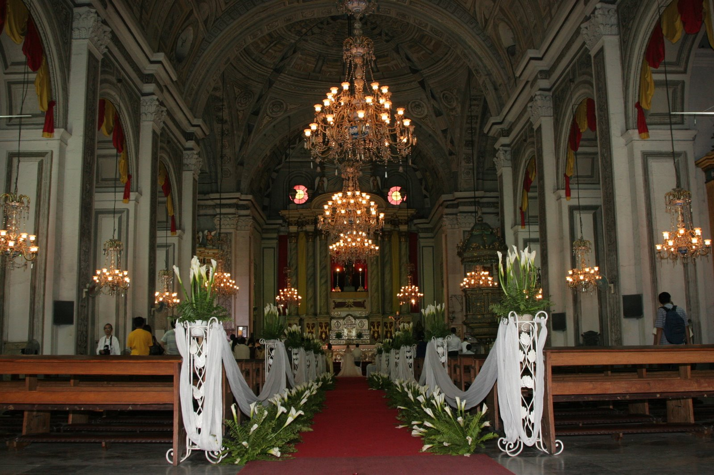

# The Canon Principle

Writing, Meaning, and the Shape of a Life

2026-07-17

## When Music Changes the View

When my wife walked through the church during our wedding, Pachelbel’s *Canon* accompanied her steps. I had chosen the music because it seemed naturally suited to the occasion. It was peaceful, dignified, and familiar without becoming ordinary. Its beauty did not demand attention, yet it gave the moment a depth that silence alone might not have provided.

At the time, I did not analyze why the music belonged there. A wedding is rarely the place for musical theory. The bride is approaching, the families are gathered, and the future seems to be opening before two people. Music enters that moment as feeling before it becomes thought.

Only much later did I begin to ask why this particular composition has become so closely associated with weddings and other important passages of life. Its famous harmonic progression explains part of its appeal, but not all of it. Many popular songs use similar chord patterns. They may be moving, memorable, or beautiful, yet they do not always create the same impression of timelessness.

Pachelbel’s *Canon* seems to do more than please the ear. It changes the position from which we experience time.

During ordinary life, we stand inside events. We worry about the next decision, the unfinished task, the disagreement from yesterday, and the uncertainty of tomorrow. At certain moments, however, we seem to step outside the immediate flow. A wedding, a funeral, a retirement, a serious illness, or the birth of a child can allow us to see life from a greater distance. For a brief time, the individual event becomes part of a larger movement. We are still living inside time, but we also appear to be looking upon it from above.

The *Canon* seems made for that change of perspective. Its melodies move forward, but beneath them something remains. The music develops, yet it repeatedly returns to the same ground. It gives us the sensation that time is passing without everything being lost.

Perhaps this is why the composition belongs so naturally to the thresholds of life. It allows us to hear an event not only as something happening now, but also as part of a whole whose full meaning cannot yet be seen.

## A Form Built on Return

The beauty of Pachelbel’s *Canon* is often attributed to what is now commonly called the Canon progression. That harmonic sequence has appeared in many later songs, especially in popular music. Its movement creates familiarity, emotional warmth, and a satisfying sense of departure and return. Yet the progression alone does not fully explain the original work.

The composition rests upon a repeating bass pattern. This ground remains stable while the upper voices develop above it. The basso continuo supports the harmonies, giving the music a firm but gentle foundation. Three violin voices then enter at different moments, each following the same melodic material while occupying a different position in time.

One voice begins, another follows, and a third enters later. They do not compete for dominance, nor do they simply repeat one another in unison. Each voice carries the same musical identity, but because it begins at a different moment, it forms new relationships with the voices already sounding. The result is unity without sameness.

As the composition proceeds, the rhythms gradually become more active. The music does not suddenly announce a new direction. It grows from within. Longer notes give way to finer movement, and the melodic surface becomes increasingly rich while the underlying cycle continues at the same measured pace.

This is one reason the music feels as though it is rising even when it repeatedly returns to the same harmonic ground. The progression forms a circle, but the growing activity of the voices turns that circle into something closer to a spiral. We return, but we do not return unchanged.

The listener already knows the foundation. The ear recognizes the harmonic path and begins to anticipate it. Yet the combination of voices continues to produce new textures. Familiarity creates trust, while difference prevents the repetition from becoming lifeless. The composition therefore holds together two experiences that often seem opposed. It gives stability without stagnation and movement without disorientation.

This may be the first insight of what I have come to think of as the Canon Principle. A strong foundation does not prevent development. It makes development intelligible.

Without the repeated ground, the increasingly active voices might feel restless or scattered. Without the developing voices, the repeated ground might become mechanical. Beauty appears through their relationship. Something remains faithful enough to be trusted, while something changes freely enough to remain alive.

## The Perfection That Does Not Judge

Pachelbel’s *Canon* can sound almost too perfect. The foundation does not collapse. The voices do not lose their relation to one another. Rhythmic complexity increases, but the whole remains clear. Mild tensions appear and pass without threatening the order of the composition.

Actual human life rarely unfolds with such proportion. Foundations can disappear. Families divide. Illness interrupts plans. Some people lose the opportunity to complete what they began. Relationships end without reconciliation. Questions remain unanswered, and suffering does not always reveal a reason.

From this perspective, the *Canon* might seem less human precisely because it is so ordered. It offers a world in which every voice retains its place and every movement belongs to a coherent whole. Yet the composition does not feel cold. Its perfection does not stand over the listener as an accusation. It does not expose the disorder of human life and demand that we correct ourselves. Instead, it seems to create a space wide enough for us to rest within it.

This is a different kind of perfection from the perfection people often attempt to manufacture. Manufactured perfection removes whatever does not fit. It hides failure, corrects irregularity, and controls appearances. It creates anxiety because everything must remain in the proper position, and a mistake becomes a threat to the whole.

The perfection of the *Canon* feels more generous. Different voices are allowed to enter at different times. They move at different levels of activity. One may hold a longer note while another becomes more elaborate. Brief tension is not excluded from the music. It is held within a form capable of receiving it.

The composition is strict in structure but gentle in effect. Its order does not flatten difference. It allows difference to belong.

Perhaps that is why its perfection feels less like technical flawlessness and more like depth of heart. It suggests a harmony spacious enough to contain many movements without losing its identity. Such perfection does not say that every event is good. It does not claim that pain was secretly pleasant or that injustice was necessary. Rather, it allows us to imagine that what is broken, unfinished, or contradictory may still be received within a larger meaning.

There is a profound difference between correcting an imperfect life and embracing it. The first demands that the past be repaired before it can be accepted. The second acknowledges that many things cannot be changed, yet refuses to reduce the value of a life to its failures.

The *Canon* seems to offer this second kind of perfection. It does not resemble a life without wounds. It resembles a mercy large enough to hold the wounded life as a whole.

## The View from Beyond the Immediate Moment

During ordinary days, human beings experience life from close range. A minor conflict can occupy the entire mind. A disappointing message may seem to define the week. Physical pain, financial pressure, and uncertainty about work can narrow attention until the immediate difficulty appears to be the whole of reality.

This closeness is unavoidable. We cannot live our lives entirely from a distance. Responsibility requires attention to the present, and suffering demands to be felt before it can be interpreted. Yet there are moments when the perspective widens.

At a wedding, two people do more than make promises about the future. They arrive carrying separate histories, families, expectations, habits, fears, and hopes. The ceremony gathers these different times into one visible movement. When my wife walked through the church, she was taking only a series of physical steps. Yet those steps also carried the years before we met, the decisions that brought us together, and the life that neither of us could yet foresee.

The *Canon* allowed that movement to feel larger than the immediate scene. One voice begins before another. They do not share exactly the same point in time, but they are drawn into a common order. Each retains its own movement while becoming part of a shared harmony.

Marriage often unfolds in a similar way. Two people do not become identical. They do not always understand an event at the same moment or carry the same emotional rhythm. One may be ready to move forward while the other is still processing what has happened. One voice may become active while the other holds a longer note. A marriage becomes deep not when these differences disappear, but when they can remain within a common foundation.

The same change of perspective may occur near the end of life. A person facing cancer or another serious illness may experience anger, fear, grief, and a profound sense of unfairness. Plans remain unfinished. Loved ones may still need care. The body begins to impose limits that the mind did not choose.

It would be wrong to treat this suffering as a simple path toward wisdom. Not everyone reaches peaceful acceptance, and no one should be judged for struggling against death. Pain does not automatically become meaningful merely because it occurs near the end of life. Still, there may come a moment when the person sees life from a slightly greater distance.

The questions have not disappeared. The unfairness has not been explained. Yet the whole life begins to appear alongside the illness rather than being consumed by it. Childhood, friendship, work, love, mistakes, forgiveness, and ordinary days return to view. Acceptance in such a moment is not the same as surrendering to meaninglessness. It may be a decision to receive one’s life even without understanding every part of it.

The Japanese expression *daiōjō* literally suggests a “great passing.” The word *ōjō* has roots in Buddhist thought, where it originally referred to departing from this life and being reborn in the Pure Land. In contemporary use, *daiōjō* usually describes a peaceful and fulfilled death, often after a long life that appears to have reached its natural completion. It conveys more than longevity. It suggests that a person has lived fully enough to depart without bitterness or violent resistance.

Pachelbel’s *Canon* seems appropriate to such a moment because it does not turn death into a dramatic victory. It offers a quieter image. One voice comes to rest, but the larger music has not been destroyed. The individual melody does not become meaningless because it ends. It has already entered the whole.

## From Passion to Ascension

Christian faith offers another language for this movement from suffering toward a larger perspective. The Ascension cannot be separated from the Passion, death, and Resurrection of Christ. Christ does not return to the Father by avoiding earthly life. He carries earthly life with him, including the wounds of the Cross.

The risen Christ is not presented as though the Passion never occurred. The wounds remain. This is one of Christianity’s deepest images of completion. Restoration is not a return to an untouched past. The wounded life is not discarded and replaced with a cleaner version. It is transformed without having its history erased.

The movement toward heaven therefore does not reject the earth. It gathers earthly life into divine life.

This offers a way to understand the heavenly quality of the *Canon*. The music does not sound heavenly because it escapes time altogether. It remains grounded in repetition. The bass continues beneath the upper voices, and the melodic movement is supported by something stable and low. The ascent happens while the ground remains.

The music may therefore suggest not the abandonment of life, but the lifting of life into a wider order. The individual voices carry their separate movements, tensions, and timing into a harmony that none of them could create alone.

Such an interpretation should not be mistaken for a claim about Pachelbel’s conscious theological intentions. A work of art can acquire meanings beyond what its creator explicitly planned. Listeners bring their own histories, beliefs, losses, and hopes into the act of hearing.

For a Christian listener, however, the composition may resonate with a movement from Passion through Resurrection toward Ascension. Suffering is not denied. Death is not treated as an illusion. Yet neither is allowed to become the final measure of life.

The gentleness heard in the music is therefore not innocence. It can be heard as compassion after suffering, peace after struggle, and acceptance after the demand for complete explanation has been released. It is not the kindness of someone who has never been wounded, but the kindness of someone who has passed through the wound without allowing it to become the limit of love.

This may also explain why the perfection of the *Canon* feels heavenly rather than artificial. Manufactured perfection conceals the wound because the wound threatens the appearance of completeness. Christian completion carries the wound forward. It does not permit suffering to possess the final word, but neither does it erase the history through which love was tested.

Ascension, understood in this way, is not escape. It is the carrying of a fully lived earthly life into a reality spacious enough to receive it. The *Canon* seems to offer a musical image of that possibility. Its voices rise without losing the ground beneath them. Time continues, but nothing that has entered the harmony appears entirely lost.

## Writing According to the Canon Principle

This understanding of the *Canon* has gradually become connected to the way I think about writing. I have found increasing meaning in the writing of essays. It is not merely a method of recording opinions or displaying knowledge. Writing has become part of my intellectual and spiritual activity, and perhaps part of my commitment to life itself.

The Canon Principle offers a way to understand what I hope an essay can become. Its main components correspond, in an approximate but useful way, to the musical elements that support the beauty of Pachelbel’s composition:

- **A stable ground:** Every essay needs a central question, value, image, or intuition that remains present beneath the entire reflection, like the repeated bass line supporting the music.
- **A sustaining structure:** The movement of thought needs continuity. Logic, tone, and emotional proportion serve a role similar to the basso continuo, quietly supporting the essay even when they do not call attention to themselves.
- **Several related voices:** History, personal experience, philosophy, faith, science, literature, and other perspectives may enter at different moments. They should remain distinct while contributing to the same underlying inquiry.
- **Gradual deepening:** The essay should not begin with its most demanding conclusion. Meaning can gather slowly, as the rhythm of the composition becomes richer while the underlying pace remains steady.
- **Return with transformation:** A strong essay often returns to its opening image or question. The reader recognizes the beginning, but the intervening reflection has changed its meaning. The movement is circular in form but spiral in experience.
- **A coherent progression:** Each stage should prepare for the next. The development may contain tension, surprise, and temporary uncertainty, but the reader should still feel that the movement belongs to a larger pattern.

These components should not be treated as a rigid formula. Their purpose is not to make every essay resemble every other essay. Musical structure does not prevent expressive freedom, and literary structure should not do so either. The principle offers a foundation strong enough to support movement without determining every step in advance.

In one essay, the stable ground may be the relation between knowledge and mercy. In another, it may be the meaning of work, the experience of reading, the influence of artificial intelligence, or the way faith reshapes ordinary life. The central question does not have to appear explicitly in every paragraph. Like the repeated bass, it can remain quietly present, allowing the essay to move widely without losing itself.

Different perspectives then enter like separate voices. History may begin one line of thought. Personal experience may follow. Philosophy, technology, literature, or theology may enter later. These voices do not need to repeat the same argument. Their value lies in revealing dimensions of the central question that a single perspective could not contain. An essay becomes richer when its voices remain distinct without becoming disconnected.

The gradual increase of musical activity also has an equivalent in prose. A reflective essay does not need to announce its deepest insight at the beginning. It can start from something ordinary and tangible, allowing meaning to develop as the reader becomes prepared to receive it. A familiar melody, a church aisle, a book left unread, a conversation at work, or an everyday technological habit may open into a wider human question. Depth should grow from attention rather than being declared in advance.

The return is equally important. A strong essay often comes back to the image or question with which it began. Yet the closing return should not merely repeat the introduction. The reader has travelled through other voices and perspectives, and the original object now carries a different weight. This is the prose equivalent of the spiral. The essay arrives at the same place, but neither the writer nor the reader occupies the same position.

The Canon Principle also shapes the ethical character of writing. An essay does not need to defeat an opponent in order to be clear. It does not need to simplify complexity in order to guide the reader. Conviction can coexist with generosity.

Many forms of public writing are designed to win. They identify an error, isolate an opposing position, and lead the reader toward a conclusion that has been decided from the start. Such writing may be effective, but it often leaves little room for the reader’s own thought.

The kind of essay I hope to write would do something different. It would remain faithful to its central question, allow several voices to enter, deepen without abandoning clarity, and return to its beginning with greater mercy. Its purpose would not be to make the writer appear victorious. It would help the reader see more of the world than was visible before.

## Guidance Without Becoming Self-Help

A life devoted to writing may also offer guidance to readers. This does not require turning the essay into self-help. Conventional self-help often begins with a promise of improvement. It offers habits, systems, goals, and strategies designed to make the individual more productive, successful, confident, or satisfied.

Some of this advice can be useful. Yet meaning is not always produced through optimization. A person may follow every recommended habit and still feel that life lacks coherence. Another person may live without a defined mission statement yet find deep meaning in family, work, faith, friendship, and quiet responsibility.

Meaning is often discovered through sustained attention to what has already been given.

Writing can cultivate this attention. To write carefully about work is to notice that work is not only economic activity. It is also a relationship with time, responsibility, other people, and one’s own limitations.

To write about technology is to see that technology is never only about devices. It reveals assumptions about intelligence, control, identity, memory, and human value. To write about faith is to recognize that belief is not confined to doctrine. It shapes the way suffering, gratitude, community, failure, and hope are understood.

The essayist does not need to tell the reader how to live in a direct or commanding manner. Guidance can arise through perception. A reader may become more patient because an essay has shown the hidden history behind another person’s behavior. Someone may become less afraid of uncertainty because a piece of writing has demonstrated that unanswered questions can be carried without intellectual surrender. An essay may encourage humility without presenting humility as a technique.

This kind of guidance is quieter than instruction, but it may reach deeper. People often change not because they have been ordered to act differently, but because they have begun to see differently.

A well-formed essay may therefore offer something more enduring than a set of recommendations. It can enlarge the reader’s capacity to live within realities that cannot simply be solved. Grief, uncertainty, disagreement, mortality, and moral complexity do not disappear when they are understood more clearly. They may, however, become possible to inhabit with greater patience and less fear.

Such writing does not promise to provide meaning from outside. It helps readers recognize the forms of meaning already present in their responsibilities, relationships, memories, and questions. It does not construct a perfect life. It changes the angle from which an imperfect life can be received.

## The Life Formed by Writing

Writing also forms the person who writes. Returning to a subject over many years reveals that no important question is exhausted by a single answer. Considering several perspectives resists the temptation to judge too quickly. Searching for precise language requires patience with experiences that do not fit easy categories.

The writer gradually learns that clarity and certainty are not the same. One can speak clearly while acknowledging mystery. It is possible to develop a position without treating every unresolved question as a weakness. Thought can become more disciplined while judgment becomes more generous.

Perhaps this is where intellectual activity becomes a life commitment. The purpose is not to accumulate conclusions. It is to become more capable of attention, more willing to receive complexity, and more generous toward what cannot be fully resolved.

The *Canon* returns here once again. The music that accompanied my wife through the church can now serve as an image of the writing life. A stable ground supports movement. Different voices enter without erasing one another. Complexity grows gradually. The beginning returns with a meaning it did not possess at first.

The composition may also offer an image of a completed life. The individual voice does not need to be flawless. It may enter late, hesitate, or pass through moments of tension. Its dignity comes from having belonged to a larger movement and from having contributed something that no other voice could contribute in exactly the same way.

To write according to the Canon Principle is not to make life appear perfect. It is to search for a form spacious enough to let an imperfect life be heard as a whole. Perhaps that is also one of the deepest purposes of an essay. It does not solve life. It gathers parts of life that might otherwise remain separated. It allows memory, reason, faith, uncertainty, suffering, and hope to sound together without requiring one voice to silence all the others.

When this happens, writing becomes more than the communication of ideas. It becomes an act of hospitality. The writer creates a space in which difficult questions may remain present without becoming unbearable, and in which different human experiences may be received without being reduced.

Such writing may never achieve the perfection of Pachelbel’s *Canon*. Human language is less orderly, and human lives are far less obedient to form. Yet the aspiration remains valuable. A person may write in the hope that intelligence can become gentler, that complexity can become clearer, and that the reader may leave with a slightly greater capacity to accept both the world and the self.

The music continues to return to the same ground, but each return carries more life. Perhaps a meaningful life does something similar. We return to the same questions about love, work, faith, mortality, and purpose. The questions remain recognizable, but we hear them differently as other voices enter and our own understanding deepens.

A life may not become perfect. It may, however, become large enough to receive what it has been. When it is finally seen from a greater distance, perhaps its many unfinished melodies may still be heard as belonging to one generous harmony.

*Image: A photo captured by the author*