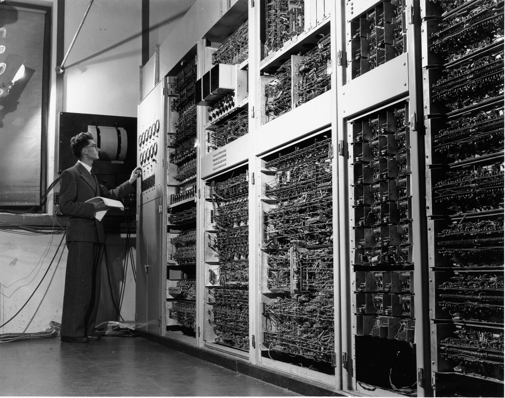

# The Return of the Knowledge Worker

2026-07-18

## The Strange Feeling That Something Has Already Changed

The first signs were easy to overlook because they appeared through ordinary tasks rather than dramatic technological events. When publishing an article through a content management system, I found myself speaking to an AI instead of opening the dashboard and entering the information manually. I could ask it to prepare the post, arrange the formatting, upload the images, assign the appropriate categories, and save everything as a draft. By the time I opened the website, much of the operational work had already been completed. My role was no longer to perform every step. It was to inspect the result, make any necessary adjustments, and decide whether the article was ready to publish.

The same pattern began appearing in other systems. Enterprise applications that once required navigating unfamiliar menus and completing complicated forms could increasingly be approached through conversation. Instead of remembering which category to select, where a particular field was located, or how the organization classified a request, I could describe the situation in ordinary language. The AI could then translate that description into the structure required by the system, prepare the necessary entries, and leave the final submission for my approval.

Reading changed in a similar way. A lengthy report, whether delivered as a PDF, Word document, presentation, or spreadsheet, no longer had to be read from beginning to end before I could identify its significance. I could ask the AI to process it first, summarize the main findings, explain which sections were relevant to my responsibilities, and identify points that deserved closer attention. Once the agent had absorbed the contents, I could begin with questions rather than pages. What had changed since the previous report? Which conclusions affected our current direction? What assumptions remained uncertain? Where should I read the original text more carefully?

The document still mattered. Careful reading had not become unnecessary, especially when the subject involved important decisions or subtle qualifications. The sequence of work, however, had changed. Instead of reading everything in order to discover what deserved attention, I could use the AI to identify the areas that required deeper examination. Conversation became the entrance to the material, while the original document remained the place where claims could be verified and details explored.

Each of these developments seemed modest when considered alone. Together, they suggested that software was slowly disappearing from the center of the experience. The content management system still existed. The case platform still routed requests. The spreadsheet still contained the data. Yet I was spending less time operating those environments directly. More and more often, my work began with a conversation and reached the application only when review or approval became necessary.

This raised a strange but increasingly unavoidable question: if an AI is operating the interface on my behalf, what exactly is a user interface now?

For decades, software was judged by how easily people could operate it. Designers refined menus, simplified navigation, rearranged toolbars, and reduced the number of clicks required to complete a task. Entire professions developed around interface design and user experience because interaction itself was treated as one of the central problems of computing. Agentic AI does not remove that problem entirely, but it changes its location. The human no longer needs to perform every operation personally. Instead, the person expresses an intention, and the agent translates that intention into the sequence of actions required by the underlying system.

The interface remains, but it begins to recede behind the relationship between the person and the agent. The shift can feel subtle because the familiar applications are still present. Its consequences, however, may eventually prove as significant as earlier transitions in personal computing.

## Every Interface Was a Translation Layer

The history of computing can be read as a long effort to reduce the amount of translation required from the human user.

In the early years of personal computing, communication with the machine often flowed through the command line. The computer possessed useful capabilities, but those capabilities were available mainly to people who learned its language. Users memorized commands, parameters, directory structures, and strict forms of syntax. A small error could prevent the machine from understanding the instruction, and the user had to know not only what outcome was desired but also the exact sequence required to produce it.

Programmers still value command line interfaces because they remain powerful, precise, and easy to combine. A command can be repeated, automated, placed inside a script, or joined with other commands to create a larger workflow. The command line appears unfriendly to many ordinary users, but it offers a structured environment that communicates efficiently with the machine.

Graphical interfaces introduced a different philosophy. Instead of expecting users to express their intentions through formal syntax, the computer began presenting its capabilities through visible objects and familiar metaphors. Files appeared as icons. Directories became folders. Commands became menus, buttons, and windows. The mouse allowed users to point, select, drag, and move objects rather than describe every action in text.

The graphical user interface did more than make computers visually attractive. It shifted a large part of the translation burden from the person to the software. Users no longer needed to remember every command because the available actions could be seen. A menu suggested what was possible. A button implied a function. A folder showed where files were grouped. The interface represented the machine in a form that more closely matched human perception and physical experience.

This change opened personal computing to millions of people who would never have learned formal command syntax. Over time, however, the graphical interface created a different form of expertise. Users no longer memorized commands, but they still had to learn where functions were located, how menus were organized, and how each application expected work to be performed.

For several decades, becoming digitally competent largely meant becoming fluent in applications. A knowledge worker learned Word, Excel, PowerPoint, email, web browsers, content management systems, financial tools, customer platforms, and internal enterprise applications. Each one had its own vocabulary, visual structure, and sequence of operations. Professional effectiveness often depended on the ability to move confidently through these environments.

Beneath the visible differences, every interface was solving the same basic problem: how could a human intention be converted into an instruction that a machine could execute?

The command line required the human to perform most of that conversion. The graphical interface allowed the software to represent commands through visual choices. Conversational AI shifted the process again by allowing users to express intentions in ordinary language. Agentic AI extends the movement further because the person may no longer need to specify each operation at all. The user can describe the outcome, while the agent identifies the tools, information, and intermediate steps required to produce it.

The development of interfaces is therefore more than a sequence of changing design preferences. It is a gradual reduction in the distance between human intention and machine execution. Each generation removes part of the translation work that previously belonged to the user.

## When Software Stops Being a Place

For most of the history of personal computing, software has been organized around destinations. If people wanted to write, they opened a word processor. If they wanted to analyze numbers, they opened a spreadsheet. If they wanted to publish an article, they logged into a content management system. If they needed support from an internal department, they entered a case management portal and completed the required fields.

Each application expected the user to enter its environment and learn its internal logic. Even experienced professionals spent a surprising amount of time remembering where functions were located, which options were required, and how one system classified information differently from another. A person might understand the substance of a task very well and still struggle with the application through which the task had to be completed.

Writing an article and learning the publishing interface are separate activities. Resolving an IT problem and understanding a service management taxonomy are also separate. An employee may know exactly what happened to a laptop but still be uncertain whether the request should be classified as an incident, a service request, a hardware issue, or a software issue. The organization needs those categories for routing and reporting, but the person experiencing the problem does not necessarily need to understand the entire administrative structure behind them.

Traditional software exposed much of that structure directly to the user. Forms, menus, dashboards, and required fields often reflected the internal needs of the organization rather than the natural way a person would describe a situation. The human had to translate lived experience into institutional language before the system could respond.

Agentic AI begins to absorb that translation. A user can explain that a laptop failed to boot after an update, that the problem interrupted work, and that a temporary solution was found through the BIOS. The agent can determine which details belong in the case, identify the likely category, prepare the submission, and ask only for information that cannot be inferred. The complexity remains inside the system, where it may still serve operational purposes, but the user no longer has to confront all of it directly.

The same pattern applies to publishing. A writer should not need to think primarily in terms of metadata fields, image slots, formatting controls, URL settings, and category menus. The writer’s concern is the article, its presentation, its audience, and whether it is ready to appear in public. An agent can translate those concerns into the requirements of the publishing platform.

As this pattern develops, applications stop feeling like places people must personally inhabit. They begin to resemble specialized services operating behind the agent. The content management system still stores and publishes articles. The service platform still routes cases. The spreadsheet still calculates and organizes data. Their functions remain essential, but their interfaces no longer need to dominate the user’s attention.

The conversation becomes the place where work begins, while applications become capabilities the agent can call upon.

This resembles earlier changes in computing. Cloud storage reduced the importance of knowing the physical location of a file. Search engines reduced the need to remember where information lived on the web. Agentic AI may reduce the need to remember where a particular operation lives inside software. Instead of locating the correct application and reconstructing its workflow, the user describes the desired result.

Software does not vanish. It becomes infrastructure, present and necessary but less visible in everyday work.

## The Arrival of the Agent Interface

The chat interface has already become familiar to millions of people. It offers an unusually open form of interaction because the same empty box can be used to ask a factual question, revise a paragraph, analyze a spreadsheet, prepare an email, or plan a sequence of actions. Unlike a conventional application, it does not reveal its capabilities through a fixed collection of menus. The user begins by describing a need.

This openness is one reason chat has become such an influential interface. It allows people to approach computing through ordinary language rather than through a vocabulary designed by the application. Yet the chat window alone is unlikely to become the final form of agentic computing.

Conversation is well suited to expressing goals, providing context, asking questions, and refining incomplete ideas. It is less effective when people need to compare many alternatives at once, inspect a complex set of changes, monitor ongoing work, manage permissions, or approve actions with significant consequences. Important decisions can also become buried inside a long transcript, making it difficult to see what the agent has done, which assumptions remain unresolved, or where the user’s authorization is still required.

A mature agent interface will probably combine conversation with visual and operational elements. The user may begin by stating a goal in ordinary language. The agent could then show its interpretation of that goal, explain the actions it plans to take, display the systems it expects to access, and identify the points requiring human judgment. After performing the work, it could present a clear record of what changed, what remained untouched, and what could still be reversed.

Such an environment would not resemble a traditional dashboard filled with unrelated controls. It would be organized around intentions, plans, evidence, approvals, and outcomes. The interface would not ask the user to operate the system step by step. It would help the person understand and govern the work being carried out.

Graphical elements would remain important, but their role would change. A spreadsheet, chart, slide, photograph, timeline, or map can communicate relationships that are difficult to grasp through text alone. Humans often understand complex information by seeing several elements together rather than receiving them sequentially through conversation. Visual interfaces will therefore continue to support comparison, exploration, and judgment.

Their central purpose, however, may shift from operation to comprehension. In traditional software, the GUI helped the user perform the work. In agentic software, the visual layer may increasingly help the user inspect work that the agent has already prepared.

Behind these visible changes, a deeper relationship begins to form. The agent gradually understands the person rather than responding only to isolated requests. It may learn ongoing projects, recurring preferences, writing style, professional responsibilities, trusted sources, and established boundaries. A request to prepare an article is no longer interpreted without history. The agent may already know the preferred tone, formatting principles, publishing workflow, and level of review expected before anything becomes public.

This continuity makes the agent feel less like another application and more like an extension of the person using it. Individual tools remain specialized, but the agent connects them through an understanding of the user’s purposes and context. The center of computing shifts from the software product to the working relationship.

## The Return of the Knowledge Worker

Every generation of computing has rewarded a different form of fluency. The command line favored people who could remember exact syntax and think procedurally. The graphical interface favored those who mastered increasingly complex applications. Professional development often meant learning another tool, attending another software training session, or becoming familiar with another collection of menus and shortcuts.

These abilities created real value because software expected humans to operate it directly. A person who understood Excel deeply could perform analysis more quickly than someone unfamiliar with formulas, tables, and functions. Someone who mastered presentation software could produce polished material without external support. Application fluency became a visible sign of professional competence because so much of knowledge work passed through those tools.

Agentic AI does not remove the need for skill. It changes where skill is concentrated.

The emerging knowledge worker may spend less time learning the exact sequence required by each application and more time learning how to direct intelligent systems. This ability is sometimes described as prompting, but that term can make the activity sound like another collection of technical commands. It suggests that success depends upon discovering special phrases that make the machine respond correctly.

The deeper ability might be called intent fluency.

Intent fluency begins with knowing what should be accomplished and why. It includes the ability to explain relevant context, define constraints, identify the audience, clarify what a satisfactory result would look like, and distinguish what the agent may decide independently from what still requires human approval. These are communication skills, but they also reveal the quality of the person’s thinking.

An unclear intention cannot be rescued by elegant wording. If the user has not decided whether a message should persuade, inform, reassure, or request action, the agent may produce language that sounds polished but lacks direction. If priorities conflict, the result will often reflect that confusion. Communicating with an agent therefore requires the user to make implicit judgments more explicit.

This is one reason expertise remains valuable. Two people can use the same AI and receive very different outcomes because they bring different levels of understanding to the interaction. A beginner may ask for a summary of a report. An experienced professional may ask which conclusions affect current strategy, which claims depend on weak evidence, what has changed since the previous period, and which risks have been hidden by the report’s presentation.

The difference does not come from knowing a better trick. It comes from knowing the subject well enough to ask better questions.

Experience also helps the user evaluate what the agent returns. Fluent language can make incomplete analysis appear stronger than it is. A confident recommendation may rest on assumptions that deserve examination. A useful knowledge worker must recognize when a result is technically correct but unsuitable, comprehensive but unfocused, or persuasive without being sufficiently reliable.

The person remains responsible for judgment. The agent can gather, compare, draft, calculate, and execute, but responsibility cannot be delegated as easily as operation. Someone must decide whether the evidence is adequate, whether the wording is fair, whether the action is proportionate, and whether the result should be published, submitted, or shared.

These requirements return attention to the abilities that have always formed the substance of knowledge work: understanding problems, organizing information, interpreting evidence, communicating clearly, and making decisions under imperfect conditions. Software often surrounded those abilities with layers of operational complexity. Agentic AI may begin removing some of those layers, allowing the underlying work to become more visible.

## Technology That Brings Us Back to Ourselves

There is a quiet irony in this direction of change. For decades, people adapted themselves to computers. We learned commands because machines required commands. We learned menus because applications divided their capabilities into menus. We adjusted our habits to the categories, workflows, and limitations imposed by software.

The relationship is beginning to reverse. Computers are becoming more capable of adapting themselves to human intentions, language, and context. The user can increasingly begin with the problem as it is understood by a person rather than translating it immediately into the structure expected by a particular application.

This shift does not reduce the importance of technology. It changes the distribution of effort between the human and the machine. The computer assumes more of the mechanical translation, while the person contributes more of the purpose, context, judgment, and responsibility.

That redistribution may prove healthier than earlier forms of automation. Much of modern work has required people to behave like extensions of software. They copied information between systems, followed rigid sequences, completed repetitive fields, and learned internal procedures that had little connection to the substance of their responsibilities. Efficiency often depended upon becoming better at accommodating the tool.

Agentic AI offers the possibility that the tool will accommodate the person instead.

The qualities that gain value in such an environment are not mysterious or newly invented. They include clear communication, curiosity, discernment, empathy, and the ability to understand how a decision affects other people. They include knowing when a request is incomplete, when a confident answer should be questioned, when an action should remain a draft, and when the consequences require a human decision.

These qualities also transfer beyond interaction with AI. Someone who can provide an agent with clear context is often better prepared to brief a colleague. Someone who can identify ambiguity in an automated result may also recognize ambiguity in a meeting or proposal. Someone who can distinguish intention from procedure is better able to explain why a task matters, not merely how it should be performed.

The skill of communicating with AI is therefore not as artificial as it may first appear. At its best, it is an extension of the communication required in any mature professional relationship. The user must describe goals, establish shared understanding, respond to misunderstandings, refine expectations, and judge the quality of the completed work.

The new knowledge worker will not be defined by the number of applications they can operate. Their strength will come from the ability to move across tools and domains without allowing any single interface to define the limits of their work. They will know how to turn an unclear situation into a meaningful objective, how to guide an agent through complexity, and how to preserve human responsibility at the points where judgment cannot be reduced to procedure.

The history of personal computing is often presented as a story of increasingly powerful machines. It can also be understood as a gradual effort to shorten the distance between human thought and human action. The command line required people to learn the language of machines. The graphical interface taught machines to present themselves through forms that people could recognize. Conversational AI allowed intentions to be expressed more naturally. Agentic AI begins translating those intentions into completed work.

As the mechanical layers recede, the qualities that remain are surprisingly familiar. The ability to think clearly, communicate honestly, understand context, and judge wisely has always been central to meaningful work. Technology may finally be making those qualities easier to see.

Photo by [Museums Victoria](https://unsplash.com/@museumsvictoria?utm_source=unsplash&utm_medium=referral&utm_content=creditCopyText) on [Unsplash](https://unsplash.com/photos/woman-in-black-coat-standing-in-front-of-mirror-WGeO6dW5GZM?utm_source=unsplash&utm_medium=referral&utm_content=creditCopyText)