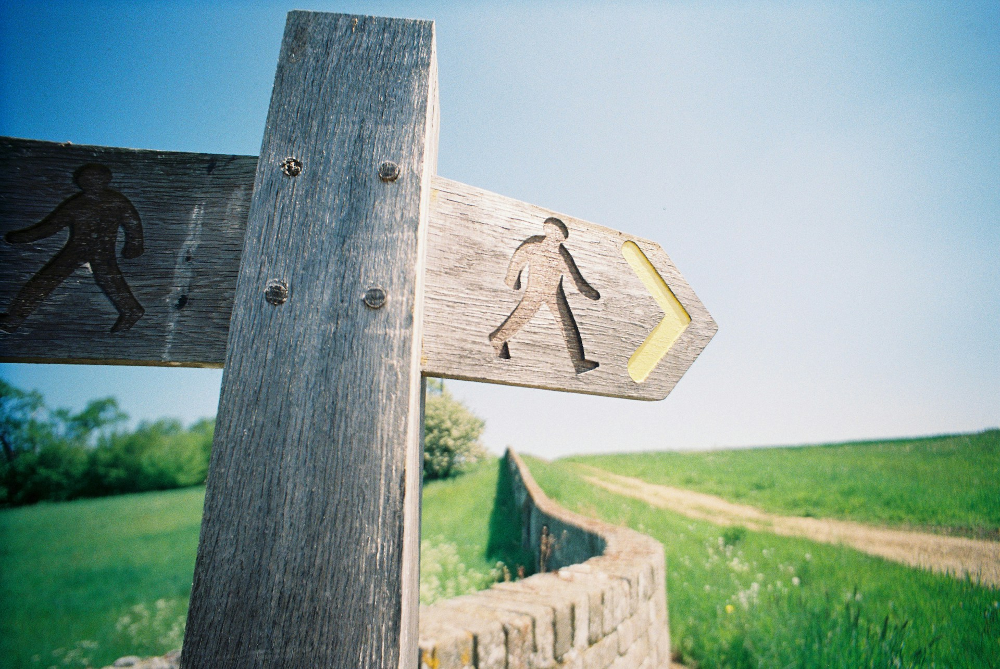

# The Future That Keeps Us Young

2026-07-19

## Growing Older No Longer Looks the Same

There is a familiar surprise in watching television programs recorded several decades ago. A person introduced as being in his forties may appear, to contemporary eyes, closer to sixty. Someone in her fifties may look as though she has already entered what we would now consider old age. The difference can be seen in family photographs as well. Our parents and grandparents often seemed to acquire the outward appearance of adulthood earlier, while many people reaching fifty or sixty today still appear relatively young.

Some of this impression comes from fashion. Hairstyles, glasses, clothing, makeup, posture, and even photographic technology influence the age we assign to a face. Once a style becomes associated with our parents’ or grandparents’ generation, anyone wearing it can appear older to us. Formal clothing also gave earlier adults a gravity that is less common in an age of casual dress.

Yet fashion does not explain everything. Many people today really do reach middle age with healthier skin, stronger teeth, greater mobility, and fewer visible signs of physical hardship. A sixty-year-old who has never smoked, receives regular medical examinations, exercises, protects the skin from excessive sunlight, and has benefited from good nutrition since childhood may have experienced less cumulative physical damage than someone of the same age several generations earlier.

The meaning of age has also changed because the expected shape of life has changed. When fewer people lived far beyond retirement, fifty could feel like the beginning of life’s final movement. In a society where many people expect to remain active into their seventies or eighties, fifty can feel closer to the middle. The number itself is the same, but its place within an imagined lifetime has shifted.

Our ideas about adulthood have moved as well. People once entered full-time employment, marriage, parenthood, military service, or family responsibility at younger ages. Many people in their twenties today remain in education, live with their parents, or postpone marriage and financial independence. This sometimes creates the impression that the young are maturing more slowly.

There may be truth in that observation, although it should not be reduced to a complaint about weakness or irresponsibility. Modern life often requires a longer period of preparation. Education has become more extended, professional paths are less direct, housing is expensive, and the knowledge needed to function in society has grown more complex. Adulthood has not disappeared. Its milestones have become less uniform.

At the opposite end of life, older people are no longer expected to withdraw as quickly from work, learning, travel, creativity, or public participation. Youth appears to have stretched in both directions. Some people enter conventional adulthood later, while others continue living actively long after the age at which previous generations were expected to slow down.

We may therefore be witnessing more than a change in appearance. The human timetable itself is being revised.

## What Each Generation Learns to Avoid

Every generation inherits knowledge purchased through the experience of those who came before it. Some of that knowledge is preserved in medicine and public-health guidance. Some remains in families as stories of what happened to a parent, grandparent, colleague, or friend. Advice that sounds ordinary today was often learned through lives damaged or shortened before the danger became widely understood.

Smoking offers one of the clearest examples. It was once woven deeply into adult culture. Cigarettes appeared in offices, restaurants, trains, films, advertisements, and homes. A person could smoke throughout the day without being treated as unusual. The long-term consequences were not always understood, and even when evidence accumulated, social habits were slow to change.

Many people now grow up knowing that smoking damages the lungs and blood vessels, increases the risk of cancer and heart disease, and accelerates visible aging. The knowledge does not eliminate smoking, but it changes the default expectation. Refusing a cigarette no longer requires an explanation in many social settings.

Alcohol occupies a more ambiguous position. Its risks are known, yet it remains connected with celebration, friendship, hospitality, business, and relaxation. In Japan, the custom of *banshaku*, drinking in the evening with dinner or before sleep, has long been treated as a normal rhythm of adult life. Western cultures have comparable habits in the evening drink or nightcap. Wine is sometimes surrounded by the language of culture, sophistication, and even health.

My father belonged to a generation in which this understanding was deeply established. He looked remarkably young. Even when he reached sixty, he could easily have been mistaken for someone in his forties. As his son, I took his youthful appearance as evidence that he would live for a very long time.

There was also longevity in his family. His mother, my grandmother, lived to 103. No one can calculate an individual life span from a relative’s age, and genetics never guarantee a particular outcome. Still, her long life suggested that my father may have inherited favorable possibilities.

He gave up smoking because he understood its danger. Drinking was different. It was part of his daily life and probably felt less like a destructive habit than a familiar form of rest.

One day, he noticed that he could not speak properly and that his fingers were partly paralyzed. The symptoms came from bleeding in the brain. The condition was diagnosed early enough for him to recover, but he did not stop drinking. A similar episode happened again, and then once more. Eventually, his condition became critical, and he died in his seventies.

His death remains painful partly because another path seems so easy to imagine. Had he treated the first event as a final warning and changed his habits, he might have lived much longer. His youthful appearance and family background seemed to hold that possibility. Yet physical potential is not the same as destiny. A strong constitution can be gradually overcome by repeated harm.

His story became part of the health knowledge I inherited. I do not smoke, and although I sometimes drink at a party or dinner, I have never wanted alcohol to occupy the place in my daily life that it occupied in his. General medical knowledge matters, but personal memory often gives that knowledge its emotional force.

Future generations will inherit similar lessons from us. They may be astonished by practices we still consider normal. Perhaps they will wonder why office workers remained seated for eight or ten hours a day. They may question the amount of processed food we accepted, the sleep we sacrificed for work, the constant exposure to screens, or the ease with which digital devices were allowed to interrupt attention.

We can recognize some dangers already, but recognition and cultural change rarely arrive at the same time. The knowledge of an age is always incomplete. We see certain mistakes in the past with clarity while remaining partially blind to our own.

## The Long Historical Escape from Early Death

The possibility of living into one’s seventies, eighties, or nineties is not entirely new. Some people in the ancient and medieval worlds reached advanced ages. Saint Augustine, for example, lived into his seventies, despite inhabiting a world without antibiotics, modern surgery, or contemporary public health. Such lives remind us that human beings have always possessed some capacity for longevity.

What has changed is not the existence of old age but its distribution. Survival into later life has become far more common. Earlier societies lost enormous numbers of people in infancy, childhood, childbirth, epidemics, war, famine, and infections that are now preventable or treatable. A person who survived those dangers might live for many years, but far fewer reached that position.

Modernity transformed this pattern through many developments working together. Clean water and sanitation reduced the spread of disease. Vaccination prevented infections that once killed or disabled large populations. Antibiotics made bacterial illnesses more survivable. Improvements in obstetrics protected mothers and infants. Safer food systems reduced contamination and malnutrition.

Agricultural science also changed the scale on which societies could feed themselves. Mechanization, fertilizers, irrigation, plant breeding, transportation, and refrigeration made food more abundant and reliable. Hunger remains a serious problem in many places, but humanity now possesses capacities for producing and distributing food that earlier civilizations could scarcely have imagined.

Medical progress then extended beyond survival. High blood pressure can be detected before it produces a stroke. Cancer can sometimes be identified while still treatable. Damaged joints can be replaced. Blocked arteries can be opened. Eyes can be repaired. Infections that once marked the beginning of death can be treated within days.

These advances do not make us invulnerable. They alter the odds. They also allow a greater number of people to enter later life with enough physical strength to remain active.

The result can be seen in ordinary streets, offices, churches, parks, and families. People in their sixties travel, exercise, learn languages, begin new projects, care for grandchildren, write books, and change careers. Many in their seventies remain socially and intellectually engaged. Centenarians are still exceptional, but they are no longer almost unimaginable.

Dr. Shigeaki Hinohara embodied this expanded possibility. He remained connected with medicine and public life until shortly before his death at 105. His long career included work at St. Luke’s International Hospital and involvement during several major crises in modern Japanese history. He was also among the passengers on Japan Air Lines Flight 351 when it was hijacked in 1970.

Hinohara was fifty-eight at the time, not yet an old man, but old enough to have already built a substantial life. During the hijacking, he faced the possibility that it might end abruptly. Survival appears to have deepened his sense that the years afterward were not simply his personal possession.

That conviction carries special weight when connected with his Christian faith. Life could be understood not as property but as a gift entrusted to him. Additional years were not merely time gained for private enjoyment. They brought the responsibility to serve, learn, teach, and prepare work that might outlast him.

Modern medicine helped make a life of 105 years possible. Medicine alone, however, cannot explain what he did with those years. Longevity gives time. It does not determine the direction in which time is used.

## When Work Stops Wearing Down the Body

The history of technology can partly be understood as the gradual removal of excessive human strain. Machines lifted weights that damaged backs and joints. Engines transported goods and people across distances that would otherwise require exhausting labor. Agricultural equipment reduced the physical burden of cultivating large areas of land. Household appliances removed hours of repetitive work from washing, cleaning, and preparing food.

These inventions did not eliminate hardship, and industrialization introduced dangers of its own. Factories could be brutal places. Pollution damaged cities. Mechanized production often treated workers as extensions of machines. Still, the broader movement was clear. Tasks that once demanded continuous physical exertion could increasingly be transferred to tools.

The rise of office work appeared, for a time, to represent an escape from bodily exhaustion. A desk seemed safer than a field, mine, dock, or factory floor. Yet knowledge work created a form of strain. The body remained in one position for hours. The eyes stayed focused at a fixed distance. Fingers repeated the same movements across a keyboard. Shoulders tightened, necks bent forward, and mental fatigue accumulated beneath the appearance of physical ease.

I experienced much of that transition personally. Before digital tools became widely available, writing a long work meant producing every letter by hand. Reaching one hundred pages required not only sustained thought but considerable physical patience. Revisions were difficult. A new passage might require rewriting an entire page. Copies had to be made separately, often through photocopying. Losing the original could mean losing months of work.

The computer solved many of those problems but created others. Writing became editable and reproducible, yet it still demanded long hours before a screen. Data had to be encoded manually. Spreadsheets required repeated operations. Documents needed formatting. Information had to be searched, copied, reorganized, and checked line by line.

The work was mental, but its physical effects were unmistakable. Fingers and forearms became painful. Eyes grew tired. The neck suffered from remaining in one posture. A productive day could leave the body feeling as though it had been used badly.

AI is beginning to alter this arrangement. Dictation allows writing to begin with speech rather than typing. Transcription can convert spoken reflections into text. Language systems can help reorganize an argument, compare versions, summarize material, identify gaps, and assist with mechanical revision. Data that once required hours of manual entry can be processed more directly.

My own writing practice has changed accordingly. A substantial part of my drafting now happens while I am walking outside with an iPhone. I speak, the device transcribes my words, and AI helps transform the raw dictation into clearer prose. Thinking no longer requires me to remain fixed to a desk.

The contrast is remarkable. In the past, an extended draft might have required an entire day in a library or office, sitting before paper or a computer. Now the early stages of the same intellectual work can take place in motion, under natural light, with the body participating rather than being temporarily neglected.

Such tools do not automatically make knowledge work healthy. A person can use AI while remaining seated, distracted, and overworked. Automation may even encourage employers to demand more output because tasks can be completed faster. Technology releases a burden only when human beings choose not to replace it immediately with another.

Even so, the possibility matters. Physical machinery reduced some forms of muscular exhaustion. AI may reduce part of the repetitive strain attached to language, administration, analysis, and information processing. It can create room for walking, conversation, reflection, and creative judgment.

The deeper benefit may not be that people produce more. It may be that thought can become less physically punishing.

## The Student Who Never Graduates

A youthful body is valuable, but it is not the only form of youth. Some people remain physically strong while becoming inwardly closed. Others live with illness or frailty while retaining an unmistakable curiosity. They continue asking questions, making plans, learning skills, and looking forward to work that has not yet begun.

Ryōtarō Shiba expressed this attitude through the phrase 生涯一書生, *shōgai issho-sei*. A direct English translation would be “a student throughout one’s life,” though *shosei* carries the older atmosphere of a scholar or young person devoted to study. Shiba, one of Japan’s major historical novelists and essayists, spent his career returning to the past, not to preserve it untouched, but to keep asking how Japan had become what it was.

The phrase is modest, but not passive. To remain a student does not mean refusing responsibility or denying one’s experience. A lifelong student can become a teacher, leader, expert, or master. The humility lies in refusing to treat knowledge as complete.

Accumulated learning can produce two opposite responses. One person becomes increasingly certain that little remains worth discovering. Another becomes more aware of how much exceeds individual understanding. The first may possess information but lose intellectual youth. The second continues to grow because every answer reveals another question.

Hinohara lived with this second orientation. Even at an advanced age, he spoke about projects he still wanted to complete and subjects he still wished to learn. The list was long enough to require more years than he could confidently expect. Yet its incompleteness did not make the list meaningless. The remaining work gave direction to the time still available.

This way of thinking reverses the usual emotional structure of old age. People are often encouraged to look back, summarize their achievements, and prepare gradually to withdraw. Hinohara continued looking ahead. His future was shorter than his past in numerical terms, but it remained large in possibility.

A similar spirit is expressed in the Italian phrase *ancora imparo*, usually translated as “I am still learning.” It is commonly associated with Michelangelo, although the exact historical attribution is uncertain. The saying has endured because it captures an image people want to believe: an artist of immense accomplishment, late in life, still standing before reality as a learner rather than as someone who had mastered everything.

Charlie Chaplin’s often-repeated answer about his best film belongs to the same family of thought. When asked which film was his best, he is widely said to have answered, “The next one.” The precise wording and original setting are difficult to establish securely, so it is wiser to receive it as a saying associated with his creative outlook rather than as a carefully documented transcript.

Its appeal does not depend entirely on attribution. “The best one should always be the next one” expresses the refusal to live only through completed achievements. Previous work may deserve gratitude and pride, but it must not close the future.

Shiba speaks as a scholar. Michelangelo’s attributed saying speaks as an artist who still learns. Chaplin’s answer speaks as a creator who still expects something better from himself. Hinohara speaks as a physician whose unfinished projects reach beyond the years available to him.

Together, they suggest that youth is partly a direction of attention. The person absorbed only in what has already happened slowly becomes a resident of the past. The person who continues learning, creating, and serving remains oriented toward a future that has not yet taken final form.

## The Life Still Waiting Ahead

I still feel like a student.

That feeling does not come from believing that I have learned nothing. Age brings experience, and experience should not be dismissed. Decades of professional work, study, reading, writing, faith, friendship, error, and responsibility leave their mark. A person should be able to speak with greater judgment at sixty than at twenty.

Yet experience can deepen the identity of a student rather than replace it. The more one learns, the more visible the remaining territory becomes. Familiar subjects acquire new dimensions. Ideas that once appeared separate begin to connect. A conversation about aging leads to medicine, technology, work, family, faith, and creativity. One question opens several others.

AI has intensified this experience for me. I do not use it only as a machine for producing faster answers. Much of its value lies in dialogue. I speak through an idea, receive a response, notice something missing, offer another example, correct the direction, and discover a connection I had not seen before.

Writing then becomes both production and education. The essay is not merely the record of thoughts I already possessed. It is the visible trace of a learning process. By the time the writing is complete, I have usually changed my understanding of the subject.

The physical freedom of dictation supports that mental freedom. I can walk while thinking, speak while observing the world, and return later to refine what emerged. The old separation between intellectual work and bodily movement becomes less rigid. Learning enters the rhythm of daily life.

This may help explain why I continue to feel young. The feeling does not arise from denying my chronological age. Nor does it depend on pretending that the body does not change. It comes from the persistence of unfinished interests.

There are still books to read, essays to write, ideas to test, people to understand, technologies to examine, and aspects of faith that remain beyond easy explanation. Each day offers more material than one person could absorb. The list does not become shorter because life becomes more efficient. Greater efficiency often reveals more possibilities.

Hinohara’s understanding of life as a gift adds moral depth to this condition. A gift is not something we earn, and it cannot be held indefinitely. Yet receiving it fully involves using it. Time entrusted to us can be spent learning, helping, making, forgiving, repairing, and preparing something for those who follow.

From this perspective, caring for health is not merely an attempt to resist death. It is a way of preserving the ability to answer what life still asks of us. Avoiding destructive habits, remaining physically active, accepting medical guidance, and using technology wisely can protect the years in which learning and service remain possible.

Longevity by itself is empty. A person might live for a hundred years while gradually losing interest in everything beyond personal comfort. A shorter life may contain extraordinary generosity and depth. The number of years cannot measure the fullness with which they are inhabited.

Still, it is natural to hope for time. We hope for health because there is work we love, people we want to accompany, and knowledge we have not yet reached. We wish to remain not merely alive, but available to the future.

Modern medicine, nutrition, sanitation, and technology have given many people more years than earlier generations could reasonably expect. AI may now reduce some of the repetitive mental and physical burdens that consumed those years. These developments can help us look younger and remain active longer, but their greatest promise lies elsewhere.

They may allow more people to remain students throughout life.

Perhaps the deepest form of youth is not the absence of wrinkles or the preservation of a particular appearance. It is the presence of something still calling us forward. The next question has not yet been answered. The next work has not yet been created. The next lesson is already waiting.

The best one should always be the next one.

Photo by [Nick Page](https://unsplash.com/@nickpage?utm_source=unsplash&utm_medium=referral&utm_content=creditCopyText) on [Unsplash](https://unsplash.com/photos/brown-wooden-cross-with-arrow-sign-MDeevV3gSAI?utm_source=unsplash&utm_medium=referral&utm_content=creditCopyText)