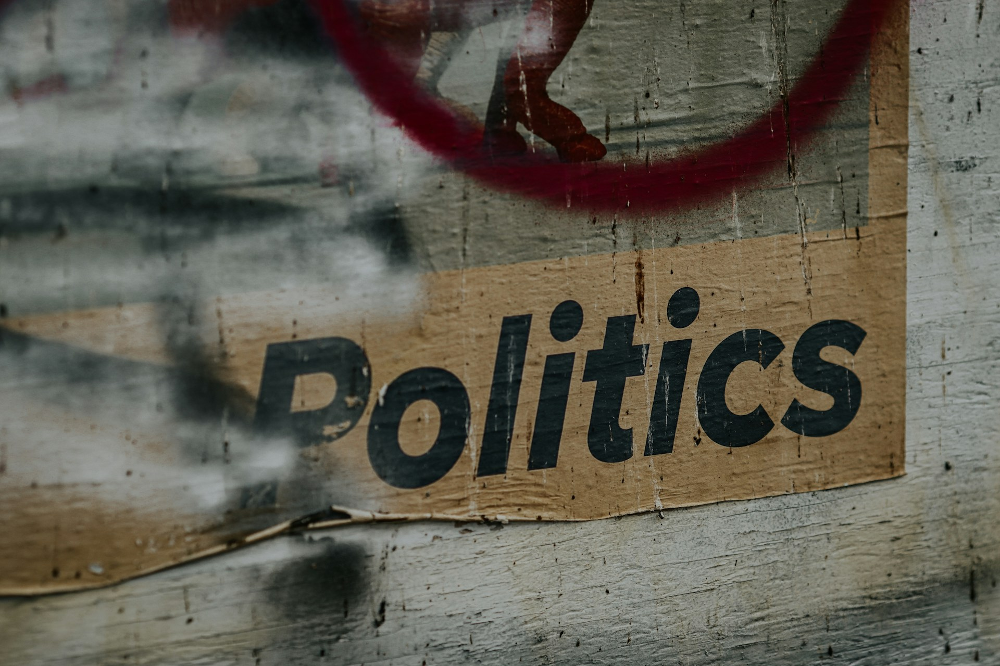

# When We Mistake Theology for Politics

2026-07-20

## The Headline That Says More Than It Appears To

Some news headlines appear straightforward until we begin asking what assumptions lie beneath them.

Recently, I came across [reports](https://ncc-j.org/%e3%80%8c%e6%88%a6%e4%ba%89%e8%b2%ac%e4%bb%bb%e3%81%a8%e6%88%a6%e5%be%8c%e8%b2%ac%e4%bb%bb%e3%81%ae%e5%91%8a%e7%99%bd%e3%81%ab%e7%ab%8b%e3%81%a1%e3%80%81%e5%a4%a9%e7%9a%87%e5%88%b6%e3%81%ae%e7%b5%82/) that a Protestant organization in Japan had reaffirmed its hope that the emperor system would one day come to an end. The statement attracted attention because it touched one of the country’s most sensitive institutions. Supporters welcomed it as a continuation of postwar reflection, while critics regarded it as another example of progressive Christianity entering political debate. Yet the headline itself was only a small part of the story.

Many readers moved quickly from one organizational statement to much broader conclusions. Some assumed that Christianity itself opposed the Japanese monarchy. Others concluded that Japanese Protestantism had become politically left-wing. Still others saw the episode as evidence that religion inevitably becomes political. These reactions were understandable, but they became less convincing once the wider landscape came into view.

No single organization speaks for all Christians in Japan. Evangelical churches, independent congregations, Catholics, Orthodox Christians, and churches within the same denomination may hold different views regarding the emperor system, constitutional questions, and the proper relationship between faith and public life. The statement represented one organization speaking from its own theological and historical perspective. The headline may have been accurate, but many of the generalizations that followed were not.

The same habit appears far beyond religion. A university president makes a statement, and people begin speaking about universities as though they possessed one mind. A newspaper publishes an editorial, and suddenly the media has one opinion. A corporation adopts a policy, and observers assume every employee shares the same conviction. Labels reduce the effort required to understand complex institutions, but they also reduce accuracy.

Religion is particularly vulnerable because it frequently addresses moral questions, and politics does the same. Their concerns overlap often enough that people begin treating them as different expressions of one conversation. Yet theology and politics begin from different premises. Theology asks who God is, what it means to be human, why the world is fractured, and how people should live. Politics asks how power should be exercised, laws formed, and public life ordered. Political implications may grow from theological convictions, but the two are not identical.

Modern disagreement is increasingly translated into the vocabulary of progressive and conservative, left and right, liberal and traditional. These categories remain useful within political life, but they become less reliable when applied to institutions whose foundations were laid long before those political distinctions existed. The result is not merely an incomplete explanation. It is the use of the wrong map.

## Different Maps Describe Different Landscapes

Maps simplify reality by emphasizing one part of the landscape and setting aside others. A road map is designed for navigation. A geological map explains the earth beneath the road. A subway map distorts geographical distance to clarify connections between stations. None is false, but each answers a different question.

Difficulties arise when one map is expected to do the work of another. Trying to understand theology entirely through political categories resembles trying to understand a country using only its subway system. Some relationships remain visible, but much of the terrain disappears.

Religious traditions generally do not begin by asking whether they are conservative or progressive. They begin by asking what they believe to be true. Those convictions shape their understanding of sin, human need, salvation, justice, and responsibility. From that understanding come moral priorities, which then influence the way believers interpret society. Political affinities normally appear later, after theology has already supplied the basic framework.

This helps explain why two churches may support the same policy for entirely different reasons, or why churches sharing many theological convictions may disagree sharply about particular political questions. Politics often appears near the end of the process rather than at its beginning.

History reinforces the distinction. The language of left and right emerged during the French Revolution, while liberalism, conservatism, socialism, and nationalism developed under particular modern conditions. Christianity has spent nearly two thousand years wrestling with creation, sin, redemption, authority, forgiveness, justice, and hope. Connections between Christian traditions and modern political movements certainly exist, but they do not share the same foundations.

Once this is recognized, many apparent inconsistencies become easier to understand. An evangelical church may cooperate with conservative politicians on family policy while criticizing them on immigration or economic ethics. A Catholic bishop may defend traditional marriage while speaking forcefully about workers, refugees, or the responsibilities of wealth. A mainline Protestant denomination may advocate for peace and environmental stewardship while containing members who disagree over abortion or economic policy.

Such positions appear contradictory only when political ideology is assumed to be the organizing principle. Political labels remain useful, but they do not reach deeply enough to explain why religious communities think as they do.

## Why Christians Reach Different Political Conclusions

Christian diversity is often explained through denominational history. People learn about Catholics, Orthodox Christians, Lutherans, Anglicans, Baptists, Methodists, Presbyterians, Pentecostals, and many other traditions. Those distinctions matter, but institutional names do not always reveal which theological concerns receive the greatest attention.

Historic Christian traditions affirm love, justice, truth, mercy, holiness, forgiveness, worship, and service. Their differences do not usually arise because one tradition accepts justice while another rejects it. They emerge from the ordering of priorities, the interpretation of Scripture, and the questions regarded as most urgent within a particular historical setting.

Evangelical conservatism, for example, often gives priority to biblical authority, personal conversion, evangelism, unborn life, family, and sexual ethics. Because these concerns frequently overlap with the platforms of conservative parties, evangelical churches are often assumed to be politically conservative by nature. Yet the political affinity grows from a set of theological and moral priorities rather than from an original commitment to a party.

Social or mainline Protestant traditions tend to give greater attention to peace, human rights, opposition to discrimination, social justice, and environmental responsibility. Their public positions often place them closer to progressive or center-left movements. Again, the political resemblance comes later. It grows from a theological emphasis on the social consequences of sin and the Church’s responsibility toward unjust institutions.

Historically Black Protestant churches in the United States demonstrate how theology and historical experience can combine in a different way. Many retain relatively traditional beliefs about Scripture, worship, personal morality, and family life. At the same time, their political culture has been shaped by slavery, segregation, the civil rights movement, and continuing racial inequality. Their frequent support for Democratic candidates cannot be understood through theology alone. Historical memory determines which public questions receive the greatest urgency.

Catholicism contains several tendencies within one broad tradition. Catholic moral conservatism gives particular attention to unborn life, family, doctrine, religious freedom, and continuity with historic teaching. Catholic social thought places strong emphasis on poverty, labor, migration, peace, inequality, and care for creation. These are not necessarily competing forms of Catholicism. They grow from the same larger framework of human dignity and the common good, even though modern politics often separates them into opposing camps.

A Catholic voter may therefore appear conservative when discussing abortion and progressive when discussing labor or migration without experiencing any contradiction. The inconsistency may belong to the political map rather than to the theological framework.

Liberation theology offers another example. It begins from the experience of the poor and interprets sin not only as personal wrongdoing but also as oppression embedded within social structures. Its language of liberation, participation, and justice has sometimes brought it close to left-wing social movements. Yet its advocates have understood their work as a theological response to suffering, not merely as an adoption of secular ideology.

These differences become clearer when we compare the two broad approaches that often shape Christian public engagement. Traditions centered on personal conversion understand humanity’s deepest problem as separation from God. The Church’s first responsibility is therefore to proclaim reconciliation through Christ. Transformed individuals are then expected to shape families, communities, and society. Marriage, sexual morality, religious liberty, family life, and the sanctity of life receive particular attention because they express deeper convictions about human nature and divine authority.

Traditions emphasizing the social consequences of sin direct greater attention toward poverty, discrimination, war, exploitation, and political oppression. These are understood not only as collections of personal failures but also as realities embedded within institutions and history. The Church’s mission consequently includes challenging unjust structures as well as caring for individuals. Human rights, peace, labor conditions, migration, racial reconciliation, and environmental stewardship become prominent expressions of responsibility toward one’s neighbor.

The two approaches are not necessarily opposites. A church emphasizing conversion may also maintain extensive ministries among the poor. A church emphasizing social justice may still insist on repentance and personal responsibility. The difference often lies in which concern becomes the primary lens through which the others are interpreted.

Japanese Christianity contains its own variations. Evangelical congregations, mainline Protestant bodies, Catholics, Orthodox Christians, and independent churches may share central Christian beliefs while differing considerably in their understanding of pacifism, constitutional questions, the emperor system, and postwar responsibility. A statement from one Protestant organization therefore cannot be treated as the voice of Japanese Christianity as a whole.

Christianity has never been politically uniform because politics has never been its sole organizing principle. Theology comes first, but political conclusions emerge through theology’s interaction with history, culture, and institutional experience.

Reading a headline seldom reveals that process. Reading history usually does.

## The Missing Dimension: Authority

Theological priorities explain why churches are drawn toward different public causes, but they do not explain how strongly a religious organization can direct collective political behavior.

Imagine two churches that affirm biblical authority, encourage personal conversion, support missionary work, and hold similar views on marriage and family. When an election approaches, one encourages members to pray, examine the candidates, and vote according to conscience. The other endorses particular candidates and expects members to support the decision as an expression of communal unity.

Their beliefs may be similar. Their structures of authority are not.

At one end of the organizational spectrum are congregational or decentralized churches. Local congregations possess considerable autonomy, pastors and elders provide teaching and oversight, and members retain broad freedom in political matters. Strong theological agreement can therefore coexist with considerable variation in voting behavior.

Denominational or synodical traditions operate differently. Councils, conferences, assemblies, or synods may issue official statements on behalf of the institution. These declarations provide a recognizable public voice, but they should not be interpreted automatically as the unanimous convictions of every congregation or member. Institutional teaching and personal political judgment remain distinct.

Pastor-centered megachurches create another pattern. Their formal structure may be less centralized than that of an established hierarchy, yet the senior pastor’s visibility and personal authority can be considerable. Members may remain formally free to disagree, but the leader’s recommendations can carry significant moral and social weight.

Episcopal or hierarchical churches organize authority through bishops and established governing structures. They may speak with greater continuity on matters of doctrine and public ethics, but hierarchical teaching does not necessarily produce uniform voting. In traditions such as Catholicism, the Church may articulate moral principles while leaving the application of those principles to the prudential judgment of individual citizens.

Highly centralized and discipline-oriented organizations operate differently again. Leadership communicates through unified channels, institutional identity is strong, and members may place a high value on public solidarity. Such communities possess a greater capacity to coordinate collective behavior, including electoral behavior.

These categories describe tendencies rather than fixed rules. A decentralized church may still develop a powerful political culture. A hierarchical church may contain wide political diversity. A pastor-centered congregation may listen respectfully to its leader while rejecting any attempt to direct voting. Organization does not determine behavior completely, but it affects how easily a community can act together.

The relevant sequence differs from the theological one. Leadership structure shapes the balance between member autonomy and communal discipline. That balance affects the capacity for coordination. Coordination can produce electoral concentration, which in turn creates political influence.

Understanding a church therefore requires more than asking what it believes. We must also ask how it organizes authority.

## From Shared Faith to Political Influence

Every enduring institution develops mechanisms that allow people to act together. Governments have constitutions, universities have faculties and senates, corporations have boards, and religious communities have congregations, councils, bishops, elders, synods, or central administrations.

Organization determines how shared beliefs are translated into public action. A decentralized church may contain members with nearly identical beliefs who nevertheless vote in many different ways. A centralized organization may present a more unified political identity even when its members’ theological convictions do not differ greatly from those of other churches.

This helps explain why public influence cannot be measured by membership numbers alone. Two communities of similar size may differ greatly in their ability to mobilize volunteers, communicate with members, respond to public events, or engage political leaders. Influence depends not only on how many people belong to an organization, but also on how closely they are connected.

A small orchestra playing from the same score may produce a stronger performance than a larger gathering of talented musicians who have never rehearsed together. Coordination amplifies influence.

Religious influence itself takes several forms. Moral influence shapes how members think about public questions. Organizational reach allows a church to communicate quickly through a durable network. Electoral discipline creates an expectation that members will act together. These forms can coexist, but they should not be confused.

A respected pastor may exercise considerable moral influence without creating an electoral bloc. A church may operate extensive schools, hospitals, charities, and disaster-relief programs without directing how members vote. A smaller but more centralized organization may exercise greater electoral leverage than a much larger denomination whose members make independent choices.

This is why politicians regularly seek relationships with religious leaders. Churches and other faith-based institutions often provide services that governments value, including education, health care, counseling, poverty relief, and emergency assistance. Cooperation with public officials can therefore be natural and beneficial.

Religious communities also bring together people who know one another, meet regularly, and maintain relationships developed over many years. Members worship, volunteer, celebrate important events, and support one another in times of need. From the perspective of political organization, these networks are unusually durable.

Elections add another consideration. Politicians seek communities that are organized, engaged, and capable of communicating with large groups of people. A community of one million members who vote independently is politically different from a community of one hundred thousand whose choices can be coordinated. The smaller group may offer politicians something more valuable than size: predictability.

The relevant democratic question is not simply whether religious leaders discuss politics. Moral guidance is a natural part of religious life. Churches inevitably speak about justice, life, peace, family, poverty, and responsibility because these subjects arise from their understanding of faith.

The more difficult question is where moral guidance ends and political obedience begins. Members may receive serious teaching about public issues while retaining responsibility for their own electoral judgment. Tension arises when disagreement with a political endorsement is treated as disloyalty to the religious community itself.

The distinction between recommendation and command therefore matters. So does the distinction between an institution speaking publicly and every member speaking with it. A church may possess an official position without requiring identical political behavior from all believers.

Understanding religious political influence requires two separate questions. We need to know what a church believes, and we also need to know how it organizes authority. The first reveals its theological priorities. The second reveals how those priorities may be translated into collective action.

## Why Similar Beliefs Produce Different Political Cultures

Christianity often appears politically inconsistent across countries because doctrine is only one part of the explanation. Churches develop within particular national histories, and those histories shape habits of public engagement.

Some traditions emerge under authoritarian governments, while others develop within constitutional democracies. Some become national churches closely connected to public institutions. Others grow as minority communities accustomed to existing outside political power. These experiences influence how leaders speak, how members understand civic responsibility, and how comfortable churches become with direct political involvement.

Japan illustrates this complexity well. Christianity has remained a small minority throughout modern Japanese history. Protestant denominations arrived through different missionary movements, responded differently to the Second World War, and developed distinct interpretations of postwar responsibility. A statement issued by one organization may therefore reflect theology, institutional memory, and decades of historical experience.

Reading it simply as the Christian position removes most of the context that gives it meaning.

The same pattern appears elsewhere. American evangelicalism cannot be understood apart from the country’s party system, debates over abortion and sexuality, and the development of the religious right. African American Christianity cannot be separated from slavery, segregation, civil rights, and the continuing struggle for racial equality. Latin American Catholicism has been shaped by poverty, authoritarian governments, popular devotion, and social movements. European national churches carry histories of establishment that minority churches do not share.

Churches with similar doctrinal statements may therefore develop very different political cultures. One may emphasize resistance to state authority because it was formed under persecution. Another may emphasize public responsibility because it has long participated in national institutions. A third may avoid partisan politics because it regards evangelism as its primary mission. A fourth may consider public advocacy inseparable from faith because its members have experienced systematic injustice.

Religious communities are not merely collections of beliefs. They are institutions shaped by theology, authority, memory, relationships, and culture. Theology shapes moral priorities. History determines which concerns become urgent. Organization influences whether members act independently or collectively. Politics receives the result.

Recognizing that complexity does not eliminate disagreement. It makes the disagreement more intelligible.

## Why Political Labels So Easily Mislead

The tendency to simplify religion reflects a broader habit. Modern society frequently reduces complex institutions to a single political identity. Universities become left-wing. Businesses become capitalist. The media become liberal. Religious organizations become conservative or progressive. Countries themselves are summarized by one adjective.

Such descriptions may contain part of the truth. They become misleading when treated as complete explanations.

Large institutions pursue several purposes at once. Universities combine education, research, professional training, public service, and financial survival. Newspapers balance accuracy, readership, commercial pressure, independence, and influence. Businesses create products, generate profit, employ people, and respond to regulation. Churches worship, teach, preserve tradition, care for members, serve society, and transmit faith across generations.

Political language usually captures only one part of this activity.

A university may defend academic freedom and later impose strict standards of research integrity. A Protestant denomination may speak about peace and later address abortion. A Catholic bishop may advocate for migrants and then defend traditional marriage. Observers often treat each statement as evidence of an ideological shift, although the institution may simply be applying different principles to different questions.

The issue changes. The underlying framework may not.

The Japanese example demonstrates how quickly complexity disappears. A statement by one Protestant organization expressing hope for the eventual end of the emperor system becomes, in public discussion, Japanese Christians oppose the emperor. Only a few words have vanished, but those words contained nearly everything that mattered: which organization, which tradition, which historical experience, and whose opinion the statement actually represented.

Simplification may serve political debate, but it rarely serves historical understanding.

## Reading Institutions the Way They Understand Themselves

Before asking where an institution stands politically, it is worth asking how the institution understands itself.

Every enduring institution possesses an internal logic that predates the controversy of the moment. A university asks how knowledge should be pursued and transmitted. A court asks how justice should be administered under law. A hospital asks how illness should be treated and human life protected. A church asks what God has revealed, how human beings should live, and what hope ultimately sustains them.

From those first principles emerge moral priorities. Those priorities shape the interpretation of social problems. Organizational structures determine how convictions are expressed collectively. Political positions then appear as consequences rather than as the institution’s defining purpose.

Understanding therefore requires movement inward before movement outward. Instead of beginning with electoral alliances, we begin with first principles. Instead of asking which political party a church resembles, we ask what vision of humanity it is trying to defend. Instead of assuming that every public statement reflects political calculation, we consider whether it arises from theology, history, institutional responsibility, or some combination of them.

This approach does not prevent criticism. It makes criticism more serious by grounding it in understanding rather than assumption.

Historians do not begin by asking whether ancient Rome belongs on today’s political spectrum. Economists do not understand medieval guilds solely through the language of modern corporations. Anthropologists seek to understand cultures through the meanings those cultures give to themselves before translating them into external categories.

Religious communities deserve the same intellectual courtesy. Their beliefs may be accepted or rejected, and their political conclusions praised or criticized. Yet interpretation becomes deeper when it begins within the institution’s own framework.

Political labels then recover their proper place. They remain useful descriptions of particular public positions, but they no longer pretend to explain the whole institution.

## Seeing More Than a Headline

The news report that first caught my attention now seems almost secondary to the questions it raised.

The remarkable fact was not that one Protestant organization in Japan had reflected critically on the emperor system. Religious institutions have always considered political authority, just as political authorities have always responded to religious influence. What mattered was how much context was required before the statement could be understood responsibly.

A reader needed to know something about Japanese Protestant history, Christian diversity, postwar theological reflection, the constitutional role of the emperor, denominational organization, and the difference between an official statement and the convictions of individual members. None of that appears in a headline, yet all of it shapes the meaning of the report.

The same is true of most large institutions. The more visible they become, the stronger the temptation to summarize them with a single adjective. Yet institutions carry memories, preserve traditions, develop internal cultures, and pursue several purposes at once. Few can be explained adequately through one ideological category.

Headlines inevitably simplify. Their purpose is to attract attention, not to preserve every layer of complexity. The responsibility for understanding begins after the headline has done its work.

That responsibility asks something modest but demanding of us. Before deciding where an institution belongs politically, we may first ask what kind of institution it believes itself to be. Theology, history, organizational structure, and public life each illuminate part of the landscape. None replaces the others.

Every day we encounter people and institutions that are more complex than the categories we assign to them. The challenge is not simply to gather more information. It is to choose the right map before beginning the journey.

Photo by [Jon Tyson](https://unsplash.com/@jontyson?utm_source=unsplash&utm_medium=referral&utm_content=creditCopyText) on [Unsplash](https://unsplash.com/photos/a-sign-on-a-wall-A8BWoNvljVA?utm_source=unsplash&utm_medium=referral&utm_content=creditCopyText)
