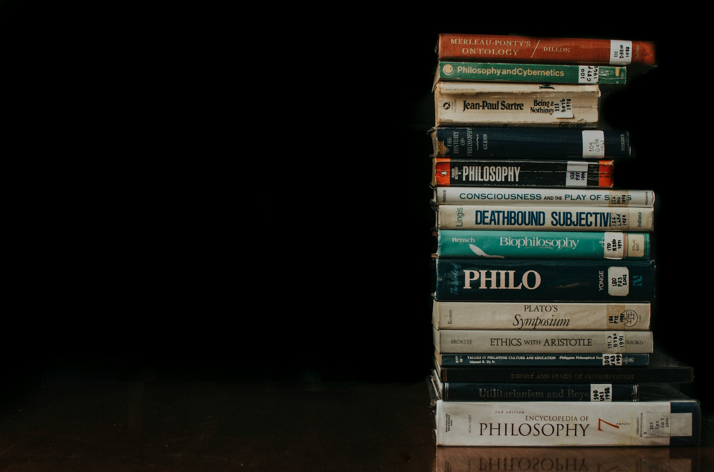

# Standing Outside Our Own Time

2026-07-23

### **The Difficulty of Seeing the Age We Live In**

One of history’s quiet ironies is that people rarely understand the age in which they are living. Looking backward, we comfortably divide the past into familiar periods. We speak of the Renaissance, the Enlightenment, the Industrial Revolution, modernity, and postmodernity as though each possessed clear boundaries and a recognizable identity. Those names give the impression that each generation understood itself while history was unfolding. The reality was almost the opposite. Historical eras usually receive their names only after enough time has passed for later generations to recognize the patterns that were invisible to those living through them.

The same uncertainty surrounds our own moment. We speak constantly about artificial intelligence, social media, political polarization, identity, globalization, climate change, and technological acceleration. Every day introduces another headline, another controversy, another prediction about where society is heading. Yet these developments often appear disconnected from one another. They resemble pieces of a puzzle whose overall picture remains difficult to recognize because we are standing too close to it.

This difficulty is not simply a matter of lacking information. Few generations have possessed access to knowledge comparable to our own. Libraries that once required years of travel now fit inside a smartphone. Academic journals, historical archives, lectures, interviews, and books circulate across the world almost instantly. Artificial intelligence has expanded this abundance even further by making it possible not only to retrieve information but also to organize, compare, and summarize ideas that previously remained scattered across thousands of separate sources.

Paradoxically, greater access to knowledge has not necessarily produced greater clarity. If anything, the opposite often seems true. The more information becomes available, the easier it is to become overwhelmed by competing explanations. Every event can be interpreted through multiple political theories, psychological models, economic assumptions, religious traditions, or philosophical perspectives. Each framework highlights certain aspects of reality while leaving others in the background. The result is not simply disagreement about facts. It is uncertainty about which framework deserves our confidence in the first place.

This uncertainty gives contemporary life a distinctive character. Earlier generations often disagreed while still sharing broad assumptions about the world. Today disagreement frequently extends to the assumptions themselves. Before debating a political question, people may already disagree about the meaning of justice. Before discussing education, they may hold incompatible understandings of human nature. Even conversations about science, technology, or ethics often reveal deeper differences concerning truth, authority, and the possibility of objective knowledge.

Many of these disagreements are treated as isolated cultural conflicts, yet they may instead be expressions of a much longer intellectual history. Ideas rarely emerge without predecessors. The concepts shaping public discussion today have often traveled through centuries of philosophical reflection before appearing in ordinary conversation. Questions about identity, freedom, language, equality, and tradition did not suddenly arise with social media. They belong to a much older dialogue concerning how human beings understand themselves and the world they inhabit.

Recognizing this historical continuity changes the way contemporary society appears. Headlines become less interesting than the assumptions beneath them. Political debates begin to reveal philosophical disagreements that neither side may consciously recognize. Even the language people use carries traces of older intellectual movements whose influence survives long after their original texts have faded from public attention. We inherit ways of thinking much as we inherit languages. Most of the time we speak them without noticing their history.

Philosophy has always attempted to illuminate this hidden dimension of ordinary life. It does not merely ask whether particular opinions are correct. It asks why certain questions become important at particular moments in history, why some answers appear persuasive to one generation and implausible to another, and how changes in thought gradually reshape entire civilizations. Seen from this perspective, philosophy resembles neither abstract speculation nor detached scholarship. It becomes an effort to understand the intellectual atmosphere within which people already live, often without recognizing it.

Our own historical moment invites precisely this kind of reflection. The rapid development of artificial intelligence has encouraged renewed discussion about work, creativity, education, consciousness, and the future of knowledge itself. At the same time, many of the assumptions guiding these conversations originate in debates that began long before computers existed. Understanding the present therefore requires more than following technological progress. It also requires tracing the intellectual paths that brought us here.

Perhaps the most revealing question is not whether we have entered an entirely new age. Every generation is tempted to believe its own moment is unprecedented. A more fruitful approach begins by asking what kind of story we have been telling about ourselves, why that story gradually lost its persuasive power, and whether the emergence of artificial intelligence is inviting us to imagine a different way of understanding both knowledge and our place within history. That journey begins well before the first computer, reaching back to a period when many believed that history itself possessed a clear direction and that human reason could eventually discover it.

## When History Believed It Had a Direction

There was a time when many people believed that history itself possessed an intelligible direction. The future remained uncertain in its details, but the overall movement appeared comprehensible. Human knowledge would continue to expand, science would steadily replace superstition, education would improve society, and political institutions would gradually become more just. Although disagreements persisted about the best path forward, confidence in progress provided a shared horizon that united otherwise competing worldviews.

This confidence took many different forms. Enlightenment thinkers trusted the power of reason to illuminate both nature and society. Scientists sought universal laws capable of explaining the physical world with increasing precision. Liberal democracies envisioned the gradual expansion of individual rights and constitutional government. Socialists imagined history moving toward a more equitable economic order. Christianity continued to interpret history through the drama of creation, redemption, and the fulfillment of God’s purposes. These traditions often challenged one another vigorously, yet each offered a comprehensive account of where humanity had come from, where it was going, and why individual lives possessed significance within that larger movement.

The differences between these visions should not obscure what they shared. Each assumed that reality was ultimately intelligible. Beneath the complexity of everyday events lay a deeper order waiting to be discovered. Human beings might disagree about its nature, but few doubted that truth itself remained a meaningful objective. The task of philosophy, science, politics, and religion was to move gradually closer to that truth, correcting errors while preserving confidence that understanding could continue to grow.

Looking back, this confidence may appear optimistic, perhaps even naive. The twentieth century witnessed wars, genocides, economic collapse, and technological destruction on a scale that severely tested belief in inevitable progress. Yet reducing modernity to optimism alone would overlook its profound self-awareness. Many of its greatest thinkers recognized the tensions hidden within the very project they defended.

Immanuel Kant celebrated reason while carefully defining its limits. Georg Wilhelm Friedrich Hegel understood history as a dynamic process driven by conflict rather than simple improvement. Karl Marx argued that industrial progress created new forms of exploitation alongside unprecedented productivity. Sigmund Freud questioned whether rational consciousness truly governed human behavior. Friedrich Nietzsche challenged the moral and religious foundations upon which much of European civilization had rested, warning that the decline of traditional belief would eventually confront society with the possibility of nihilism.

Modernity therefore contained both confidence and unease from the beginning. The search for universal explanations continued, but growing awareness of their limitations accompanied every advance. Progress remained an aspiration rather than an accomplished fact. Certainty became increasingly difficult to sustain, even as the desire for certainty persisted.

Existentialism emerged within this atmosphere of confidence tempered by doubt. It is often remembered as a philosophy of anxiety, isolation, and personal freedom, yet it still belonged deeply to the modern search for meaning. Thinkers such as Søren Kierkegaard, Martin Heidegger, Jean-Paul Sartre, and Albert Camus disagreed profoundly about religion, morality, and the human condition, but they shared one conviction that distinguished them from many later philosophers. They believed that the question of meaning remained unavoidable.

For Sartre, human beings were condemned to freedom because no predetermined essence dictated how life should be lived. Every choice contributed to the person one became. Freedom therefore carried an inescapable burden of responsibility. Rather than retreating into private contemplation, Sartre argued that individuals should participate actively in the world around them. His concept of *engagement* expressed the belief that philosophy should not remain detached from history but should enter into political, cultural, and social life. A meaningful existence required commitment.

This commitment often extended beyond personal decisions. Throughout much of the twentieth century, existential concerns became intertwined with broader political movements. Marxism, anti-colonial struggles, democratic reform, labor activism, and various forms of social transformation all attracted individuals who believed their own lives gained significance by contributing to a larger historical purpose. Even those who questioned traditional religion frequently retained a strong sense that history itself possessed a direction worthy of dedication.

Seen from today’s perspective, this combination may appear surprising. Existentialism emphasized individual freedom, while many political ideologies emphasized collective destiny. Yet these currents proved remarkably compatible because both still assumed that human action participated in something larger than immediate personal experience. Whether that larger story was understood as divine providence, historical progress, social revolution, or the expansion of human freedom, individuals could locate themselves within an unfolding narrative that extended far beyond their own lifetimes.

The language of mission, responsibility, vocation, and progress reflected this deeper confidence. People certainly argued over competing visions of the future, but relatively few questioned whether history itself possessed a meaningful structure. The disagreement concerned which story was true, not whether humanity needed a story at all.

That shared assumption gradually weakened during the second half of the twentieth century. The change did not occur because a single philosopher disproved modernity, nor because one historical event erased confidence overnight. Instead, a series of intellectual developments began asking increasingly uncomfortable questions. Perhaps the stories people trusted were less universal than they appeared. Perhaps language shaped thought more deeply than previously imagined. Perhaps cultures interpreted reality through frameworks that could never claim absolute neutrality. As these questions accumulated, confidence slowly shifted into suspicion, opening the door to one of the most influential intellectual transformations of the modern world.

## The Century That Learned to Distrust Its Own Stories

The gradual loss of confidence in modernity did not begin with politics. It began with language.

For centuries, language had often been treated as a transparent medium through which people described an already existing world. Words referred to things, and the task of communication was simply to represent reality as accurately as possible. Although philosophers had long debated the relationship between language and truth, relatively few questioned the assumption that language functioned primarily as a mirror reflecting an objective order beyond itself.

The Swiss linguist Ferdinand de Saussure proposed a subtle but revolutionary alternative. He argued that words possess meaning not because they contain some intrinsic connection to the objects they describe, but because they exist within a network of relationships. A word becomes meaningful through its differences from other words. Language therefore operates less like a collection of labels attached to reality than like a system whose internal relationships shape how reality is understood.

At first glance, this may appear to be a technical observation about linguistics. Its implications, however, reached far beyond language itself. If meaning depends upon relationships within a system rather than upon direct access to reality, then understanding the world becomes inseparable from understanding the structures through which that world is interpreted. Human beings do not simply observe reality. They also inherit languages, concepts, and categories that quietly organize what they are capable of noticing in the first place.

This insight encouraged scholars in many fields to search for the hidden structures beneath the diversity of human experience. Among the most influential was the anthropologist Claude Lévi-Strauss. After studying Indigenous societies in Brazil and elsewhere, he reached a conclusion that challenged many assumptions inherited from European civilization. The apparent differences separating so called primitive societies from technologically advanced civilizations concealed remarkable similarities in the underlying organization of human thought.

Myths, kinship systems, rituals, and social customs varied enormously across cultures. Yet beneath these visible differences Lévi-Strauss identified recurring patterns that suggested a common architecture of the human mind. Every society classified the world, established symbolic relationships, and developed sophisticated ways of organizing experience. Western civilization no longer occupied an unquestioned position at the summit of cultural development. It became one expression of a much broader human capacity for creating meaning.

Seen in this light, structuralism did not celebrate relativism as much as it challenged cultural arrogance. It suggested that every civilization possessed intellectual depth deserving of serious attention. The distinction between advanced and primitive cultures gradually gave way to a more modest recognition that different societies often solved similar human problems through different symbolic systems. This shift represented an important expansion of intellectual humility rather than a rejection of rational inquiry.

Yet structuralism contained a question that it could not fully answer. If every system of meaning depends upon an underlying structure, what guarantees the stability of the structure itself?

This question became the starting point for a new generation of thinkers who would later be associated with poststructuralism and postmodern philosophy. Jacques Derrida argued that meanings never settle into complete stability because every concept refers to other concepts in an endless chain of interpretation. Each attempt to establish a final foundation quietly depends upon assumptions that themselves require explanation. Language continually postpones complete certainty.

Michel Foucault approached a similar problem from a different direction. Rather than asking how language produces meaning, he investigated how institutions produce truth. Hospitals, prisons, schools, universities, and governments do more than organize society. They also establish categories through which people understand themselves and others. Definitions of sanity, criminality, sexuality, health, or normality appear objective, yet they are also shaped by historical circumstances and relationships of power. Knowledge and power become intertwined, not because truth is impossible, but because every society develops its own practices for deciding what counts as truth.

Jean François Lyotard captured the spirit of this broader transformation with remarkable simplicity. He described the postmodern condition as an “incredulity toward metanarratives.” The statement became famous because it expressed a growing skepticism toward comprehensive stories claiming universal authority. The Enlightenment, scientific progress, Marxist history, religious salvation, and national destiny all promised to explain humanity through a single overarching narrative. Postmodern thought did not necessarily prove these stories false. It questioned whether any story could legitimately claim to speak for everyone.

The influence of these ideas gradually extended far beyond philosophy departments. They reshaped literary criticism, anthropology, sociology, history, architecture, and the emerging field of cultural studies. Many social movements also found powerful intellectual resources within this new perspective. Feminist scholarship exposed assumptions that earlier generations had accepted as natural. Postcolonial thinkers challenged historical narratives written almost entirely from imperial viewpoints. Some strands of queer theory questioned whether categories of identity previously regarded as fixed were instead shaped by culture and history. In each case, inherited assumptions became subjects for careful examination rather than unquestioned acceptance.

Seen from a distance, this intellectual movement appears less like a rebellion against truth than an expansion of critical self awareness. It encouraged societies to examine the invisible assumptions hidden beneath familiar ideas. Questions that had rarely been asked suddenly became unavoidable. Who defines normality? Which voices have been excluded from accepted history? Which perspectives appear universal only because alternative perspectives were ignored? Every established certainty invited another question.

The appeal of this approach is easy to understand. It exposed genuine blind spots within modern civilization and gave intellectual expression to people whose experiences had often remained outside dominant narratives. Its contribution should not be dismissed simply because later generations sometimes extended its conclusions beyond what its original thinkers intended.

At the same time, the success of postmodern criticism created a new intellectual situation that few anticipated. Once every grand narrative had become open to suspicion, another question slowly emerged, one that was less comfortable than the critiques themselves.

If every framework deserves to be questioned, what remains after the questioning has no obvious end?

## The Freedom That Became Weightless

Every intellectual revolution eventually encounters a question that it did not originally intend to answer. Postmodern thought proved remarkably effective at revealing hidden assumptions, exposing inherited hierarchies, and reminding societies that ideas often reflect historical circumstances rather than timeless necessities. Its greatest strength lay in its capacity to make the familiar appear unfamiliar. Customs that had long been accepted without reflection suddenly became subjects for careful examination. Institutions once regarded as natural began to reveal the historical processes that had shaped them.

This critical attitude produced lasting benefits. It encouraged greater sensitivity toward voices that had been overlooked. It made historians more attentive to whose stories were being told and whose were being omitted. It reminded scientists, philosophers, and political thinkers that even the most confident theories are developed within particular intellectual traditions. Humility gradually replaced certainty as an intellectual virtue.

Yet criticism possesses a peculiar momentum. Once people become accustomed to questioning one set of assumptions, it becomes difficult to explain why another set should remain exempt. Every tradition can be examined. Every institution can be challenged. Every moral framework can be interpreted as the product of history rather than nature. The habit of critique slowly expands until the distinction between legitimate questioning and permanent suspicion becomes increasingly difficult to maintain.

This development transformed deconstruction from a philosophical method into something closer to a cultural instinct. Jacques Derrida originally used deconstruction to reveal tensions hidden within texts, showing how apparently stable meanings often depended upon neglected ambiguities and internal contradictions. He did not propose that every tradition should simply be discarded, nor did he celebrate destruction for its own sake. His work invited careful reading rather than indiscriminate rejection.

Ideas, however, often change as they spread beyond the circles in which they first emerged. Once deconstruction entered wider intellectual and cultural life, it frequently became associated with a broader impulse to dismantle inherited structures wherever they appeared. Traditions were no longer merely interpreted. They increasingly became objects of suspicion. Religious authority, national identity, family structures, gender roles, educational canons, moral norms, and cultural customs all came under sustained examination. Many of these critiques addressed genuine injustices. Others reflected a growing assumption that inherited structures carried the burden of proof simply because they had been inherited.

The attraction of this perspective is understandable. Traditions can preserve wisdom, but they can also preserve prejudice. Institutions can protect communities, yet they can also concentrate power. Moral conventions may guide human life while simultaneously excluding those who do not fit comfortably within them. Every generation inherits responsibilities as well as limitations from those who came before.

Liberation therefore carries genuine value. Few people would wish to return to a world in which every inherited authority remained beyond question. The ability to examine established beliefs critically is among the great achievements of modern intellectual life.

The difficulty appears only when criticism becomes the primary mode through which society understands itself. Human beings do not live by exposing assumptions alone. They also require orientations that help them decide how to act, what deserves loyalty, which responsibilities should be accepted, and what kind of future they hope to build together. Removing inherited structures may eliminate certain forms of oppression, yet it also removes many of the frameworks through which people understand who they are.

The experience resembles removing the scaffolding from a building before determining which walls are structural and which are merely decorative. At first the newly opened space feels liberating. Air and light enter places that once seemed confined. Gradually another realization appears. Some of the structures that limited movement were also carrying weight. Eliminating them without understanding their deeper function risks weakening the very building they helped support.

Perhaps a different image captures the emotional experience more clearly. Imagine carrying a heavy backpack throughout your life. After years of effort, someone finally removes it from your shoulders. The relief is immediate. Walking becomes easier. Every movement feels lighter than before. Then, after traveling a little farther, you discover that the backpack contained your food, your compass, your map, and the tools needed for the journey ahead. Freedom has not disappeared. Orientation has.

This tension helps explain why contemporary societies often appear simultaneously liberated and unsettled. Individual choice has expanded dramatically across many areas of life. People possess greater freedom to define careers, relationships, beliefs, identities, and personal aspirations than many previous generations could have imagined. Yet alongside these new possibilities runs a persistent uncertainty about what any of those choices ultimately mean. The multiplication of options has not necessarily produced a corresponding increase in confidence.

Long before postmodernism emerged, Friedrich Nietzsche sensed the possibility of such a condition. His famous declaration that “God is dead” is often misunderstood as a celebration of unbelief. It was, in fact, a diagnosis of a civilization entering unfamiliar territory. Nietzsche recognized that religious faith had long provided Europe with a shared moral horizon. If that horizon disappeared, replacing it would prove far more difficult than many anticipated. The danger was not simply atheism. The deeper danger was nihilism, a gradual erosion of confidence that any value could command lasting commitment.

The twentieth century explored many possible responses to this dilemma. Some sought new political ideologies capable of replacing older religious frameworks. Others turned toward psychology, art, nationalism, consumer culture, or personal self expression. Still others embraced the postmodern insight that no single framework deserved universal authority. None of these responses fully resolved the underlying tension. The desire for freedom remained inseparable from the equally human desire for belonging and meaning.

Perhaps this is one of the defining experiences of the early twenty first century. Many people no longer feel constrained by a single grand narrative, yet neither do they feel entirely comfortable without one. Public debates frequently oscillate between demands for greater liberation and renewed calls for shared values. The resulting conflicts often appear political on the surface, while beneath them lies a more fundamental question about the kind of creatures human beings actually are.

We have become remarkably skilled at asking what should be dismantled. The more difficult question is beginning to change. What, after all this careful criticism, deserves to be built?

## AI and the Return of the Philosophical Mind

It is tempting to think of artificial intelligence primarily as a technological breakthrough. Discussions usually focus on automation, productivity, employment, education, or the future of creative work. These questions deserve careful attention, yet they may not represent the most significant transformation now taking place. Every major technology changes what people are able to do. Occasionally, a technology also changes how people think. Artificial intelligence belongs to this second category.

For much of modern history, intellectual life followed a familiar pattern. Knowledge expanded by becoming increasingly specialized. Every discipline developed its own vocabulary, methods, journals, and professional communities. Progress depended upon narrowing one’s field of attention. A physicist could rarely master anthropology. A historian might know little about neuroscience. Economists, linguists, psychologists, philosophers, and biologists each explored territories that became deeper while growing more distant from one another.

This specialization produced extraordinary achievements. Modern science would have been impossible without it. Medicine advanced because researchers concentrated on increasingly specific questions. Technology matured through the accumulated efforts of countless specialists whose expertise extended far beyond what any individual could comprehend.

The cost of this success gradually became apparent. As knowledge multiplied, seeing the relationships among different fields became increasingly difficult. Universities organized themselves into departments, academic journals rewarded narrow expertise, and professional careers encouraged ever greater concentration. The intellectual map expanded while becoming harder to view as a whole. Many people came to understand one region of knowledge in remarkable depth while losing sight of how that region related to the larger landscape.

Philosophy traditionally occupied a different position. It rarely competed with the sciences by producing new empirical discoveries. Its contribution lay elsewhere. Philosophers asked how different forms of knowledge belonged together, what assumptions connected apparently separate disciplines, and what broader picture emerged when individual insights were considered side by side. In this sense, philosophy functioned less as another specialized subject than as an effort to understand the architecture of knowledge itself.

For centuries, pursuing such synthesis demanded enormous personal effort. Constructing a broad intellectual perspective required years of reading across multiple traditions, often in several languages. Even accomplished scholars could devote an entire career to understanding only a small portion of humanity’s accumulated thought. The ambition to integrate philosophy, history, science, literature, theology, economics, and politics increasingly became the privilege of a relatively small number of exceptional individuals.

Artificial intelligence changes this condition in a surprising way.

It does not eliminate the need for careful reading, nor does it replace the patient judgment required for genuine understanding. Dense books still deserve to be read. Historical contexts still matter. Original sources continue to reward attention that no summary can fully substitute. Yet AI dramatically lowers the cost of orientation. It allows readers to approach complex intellectual traditions with a conceptual map that earlier generations often spent years constructing for themselves.

This seemingly modest shift alters the rhythm of learning. Previously, people often wandered through enormous bodies of literature before gradually recognizing the larger patterns connecting them. Today those patterns can appear much earlier. A student may compare Aristotle and Confucius before reading either in depth. A conversation about Nietzsche naturally expands into questions about Christianity, existentialism, psychology, and contemporary politics. Connections that once remained hidden until the later stages of scholarship become visible near the beginning of the journey.

Reading therefore changes its purpose. Instead of searching blindly for the outline of a landscape, readers can begin with a provisional map while remaining prepared to revise it as their understanding deepens. The map never replaces the territory, but it makes exploration more deliberate. Encountering an original text becomes less like entering an unfamiliar forest without direction and more like traveling through a region whose major landmarks are already faintly visible.

This reversal has consequences extending far beyond education. It encourages a style of thinking that had become increasingly difficult during the age of specialization. Rather than asking only how one discipline solves a particular problem, people can once again ask how different disciplines illuminate one another. Scientific discoveries invite philosophical reflection. Historical events reshape ethical questions. Literature deepens psychological insight. Theology enters conversations about consciousness and artificial intelligence. Knowledge begins recovering relationships that institutional specialization had often obscured.

Perhaps the most remarkable feature of artificial intelligence is not its capacity to generate answers but its ability to reveal patterns across vast intellectual distances. It continually proposes connections that invite further examination. Some prove persuasive. Others collapse under closer scrutiny. The responsibility for judgment remains entirely human. Yet the opportunity to perceive relationships expands dramatically.

This changes the role of the knowledge worker as well. During the Information Age, value often belonged to those who possessed access to information that others lacked. Search engines gradually democratized that access. Artificial intelligence shifts attention once again. Information alone becomes less valuable than the ability to organize, evaluate, and integrate it into coherent understanding.

The distinction is subtle but significant. Collecting facts and constructing wisdom are no longer neighboring activities. They are becoming increasingly separate skills.

The coming decades may therefore reward a different intellectual habit. Specialists will remain indispensable, just as surgeons remain indispensable within medicine. Yet alongside specialization, another role is quietly returning. Society also needs people capable of moving across disciplines, recognizing recurring patterns, translating ideas between different communities, and asking questions that no single field can answer alone.

In many respects, this resembles one of philosophy’s oldest ambitions. The earliest philosophers did not divide knowledge into isolated departments. They sought to understand nature, ethics, politics, mathematics, language, and human existence as different expressions of a single reality. Their confidence sometimes exceeded their evidence, but the breadth of their vision reflected an important intuition. Understanding grows not only by looking more closely at individual parts, but also by seeing how those parts belong together.

Artificial intelligence unexpectedly makes that older aspiration practical once again.

Standing on the shoulders of giants has long served as a metaphor for intellectual progress. Today it begins to resemble an everyday experience. Conversations that once required years of preparation now become accessible to curious readers willing to ask thoughtful questions. Plato can be placed beside Darwin. Augustine enters dialogue with Nietzsche. Confucius illuminates Aristotle. Contemporary neuroscience meets Buddhist philosophy. These encounters remain imperfect, and no machine can replace the careful interpretation that serious scholarship demands. Yet the distance separating ordinary readers from humanity’s accumulated intellectual heritage has become dramatically shorter than at any previous moment in history.

For that reason, the greatest gift of artificial intelligence may not be speed. It may be perspective.

By making the larger landscape visible again, AI quietly invites people to recover a habit that civilization has always needed but that modern specialization gradually pushed toward the margins. It encourages us to become not merely consumers of knowledge, nor even producers of knowledge, but interpreters of knowledge. In doing so, it may be returning philosophy to the center of intellectual life, not as an academic discipline among many others, but as the continuing human effort to understand how the many stories we inherit relate to one another, and how they might help us understand ourselves.

## Becoming Spectators of Our Own Civilization

Every generation participates in history without fully understanding it. Daily life leaves little room for stepping back. People work, raise families, argue about politics, build careers, respond to crises, and adapt to technologies that seem to arrive faster each year. The present always feels immediate. Reflection usually comes later, when historians gather scattered events into narratives that were invisible while they unfolded.

Artificial intelligence offers an unusual opportunity to narrow that historical distance. It cannot grant the perspective that only time provides, yet it allows us to compare ideas, trace intellectual lineages, and recognize historical patterns while we are still living through them. For perhaps the first time, ordinary readers can move comfortably across centuries of philosophy, science, literature, religion, and political thought without requiring a lifetime devoted exclusively to scholarship. The result is not omniscience. It is a greater capacity for orientation. That orientation encourages a habit that has always stood at the heart of philosophy.

Human beings must learn to occupy two positions at once. One position is that of the participant. We belong to families, communities, professions, nations, and traditions. We make decisions whose consequences shape the lives of others. We vote, teach, create, protest, forgive, build institutions, and occasionally help transform them. None of us stands outside history. Every life contributes, however modestly, to the civilization it inhabits.

The second position is that of the spectator. From time to time we pause and ask different kinds of questions. Why does this debate feel so urgent today? Which assumptions are guiding both sides without either fully recognizing them? Which ideas have traveled quietly across generations until they became common sense? What historical circumstances made today’s disagreements possible?

These questions do not remove us from society. They deepen our participation by making it more conscious.

The image of the spectator has sometimes been misunderstood as detachment or indifference. Philosophy, however, has rarely encouraged withdrawal from ordinary life. Socrates spent his days in conversation within the city. Confucius devoted himself to public service and education. Hannah Arendt reflected on politics because political life mattered profoundly. Jean Paul Sartre insisted that human freedom required engagement with the world rather than escape from it. Their methods differed, yet they shared the conviction that understanding and participation belong together.

Perhaps the challenge of our own century is learning to move continuously between these two perspectives. We enter public life, then step back to examine the assumptions shaping it. We immerse ourselves in contemporary debates, then ask how earlier generations might have understood the same questions. We inherit traditions, subject them to honest criticism, preserve what continues to deserve confidence, and revise what no longer serves human flourishing. Reflection and action become partners rather than rivals.

Seen from this perspective, the long movement from modernity through postmodernity begins to appear less like a sequence of victories and defeats than a process of intellectual maturation.

Modernity gave humanity extraordinary confidence in reason, science, and progress. Without that confidence, many of the achievements of the modern world would never have been realized.

Postmodernity reminded us that confidence can become arrogance. Every civilization possesses blind spots. Every language carries assumptions. Every institution reflects a history that deserves examination. Without that criticism, inherited certainties easily become instruments of exclusion or domination.

Neither inheritance is sufficient by itself. Confidence without humility becomes dogmatism. Humility without confidence drifts toward paralysis.

Our historical moment invites a different balance. We can preserve the modern desire to understand the world while retaining the postmodern awareness that every understanding remains partial. We can continue questioning inherited assumptions without believing that permanent skepticism is itself the final destination. The goal need not be the recovery of a single grand narrative, nor the endless multiplication of fragments. It may instead be the patient work of integration, bringing different perspectives into conversation without expecting complete agreement.

Artificial intelligence does not perform this work for us. It merely makes the work more accessible. The machine can compare texts, identify patterns, summarize arguments, and reveal connections across remarkable distances. It cannot determine which ideas deserve our trust, which traditions should be preserved, or what kind of civilization we hope to build together. Those remain profoundly human questions because they depend not only upon knowledge but also upon judgment, character, memory, imagination, and moral responsibility.

For that reason, the age of artificial intelligence may also become an age in which philosophy quietly returns to ordinary life. Not philosophy understood as academic specialization. Not philosophy as the construction of another comprehensive system. Rather, philosophy as a disciplined habit of learning to see ourselves more clearly. Perhaps that has always been its deepest purpose.

Every generation inherits stories about the world. Some become so familiar that they disappear into the background, shaping perception without attracting attention. Others collapse under the weight of history and are replaced by new interpretations that eventually become equally familiar. The responsibility of philosophy has never been merely to defend these stories or to dismantle them. It has been to understand them, to ask where they came from, what truths they illuminate, what limitations they conceal, and how they continue to shape the lives we are already living. That responsibility has not diminished in the age of AI. If anything, it has become more urgent.

We may never possess enough historical distance to name our own age with complete confidence. Future generations will almost certainly describe this period differently from the way we describe it ourselves. Yet perhaps understanding history has never depended upon certainty. It begins whenever we develop the willingness to stand, however briefly, outside our own assumptions and observe our civilization with the same curiosity, sympathy, and intellectual honesty that we would bring to any other.

That may prove to be one of the gifts of artificial intelligence. Not that it teaches us what to think. But that it encourages more of us to become philosophers again.

Photo by [Karl Raymund Catabas](https://unsplash.com/@karlcatabas?utm_source=unsplash&utm_medium=referral&utm_content=creditCopyText) on [Unsplash](https://unsplash.com/photos/a-stack-of-books-sitting-on-top-of-a-wooden-table-6yFGUCyLgMI?utm_source=unsplash&utm_medium=referral&utm_content=creditCopyText)