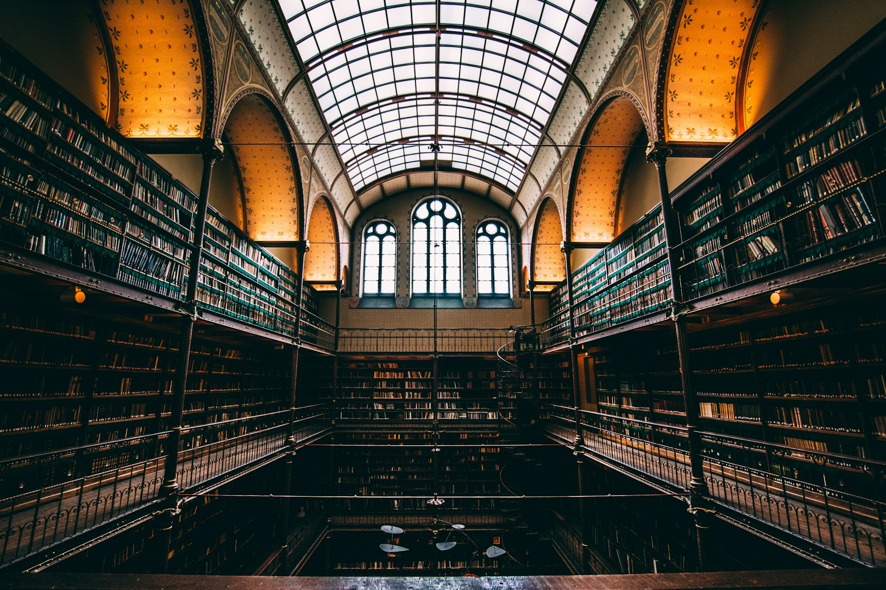

# The Library We Carry Within

2026-07-24

## The Strange Feeling That Something Is Missing

Most people who spend time reading today eventually notice a curious feeling. They finish article after article, newsletter after newsletter, and post after post, yet struggle to remember what they have just read. The experience is not necessarily unpleasant. Many of these pieces are informative, carefully researched, and professionally written. They answer immediate questions, summarize recent developments, and offer practical advice. After hours of reading, however, there remains an unexpected sense that very little has stayed behind.

The usual explanation is that modern life moves too quickly. We blame our shortened attention spans, the endless stream of notifications, or the overwhelming amount of information available every day. There is truth in each of these observations, but they do not fully explain the experience. People have always lived amid distractions of one kind or another, and every generation has complained that genuine reflection has become more difficult than it once was. Another possibility deserves consideration. The dissatisfaction may arise less from the quantity of information we consume than from the environment that shapes the way we encounter it.

Many readers eventually recognize a subtle change in themselves. They no longer measure a day’s reading by the number of pages completed or links opened. Instead, they begin asking a different question. Which ideas are still present after several days have passed? Which arguments continue returning unexpectedly during ordinary conversations? Which books invite another reading instead of merely rewarding the first? These questions suggest that reading is not simply about acquiring information. It is also about creating conditions in which understanding has time to develop.

That difference is easy to overlook because today’s reading habits encourage continuous movement. There is always another recommendation waiting below the screen, another headline competing for attention, another conversation already replacing the previous one. Even thoughtful readers may gradually become accustomed to moving forward before an idea has fully settled. The result is not necessarily confusion or misinformation. More often, it is a lingering sense that knowledge is accumulating faster than understanding.

A simple comparison helps explain why this happens.

Imagine arriving at a busy railway station. Thousands of people pass through every hour. Announcements echo overhead, departure boards change constantly, and conversations begin and end within moments as travelers continue toward different destinations. Such places possess remarkable energy, but they are designed for movement. No one expects to remain there for long because remaining is not their purpose.

Now imagine walking into an old library. The atmosphere changes almost immediately. Shelves stand beside one another, each preserving conversations that began decades or even centuries apart. Time seems to move differently. A reader may spend an entire afternoon with a single volume without feeling hurried because the building was created to give thought room to unfold rather than to encourage constant movement.

Both places serve society well. Transportation would become impossible without stations, just as civilization would lose much of its memory without libraries. The mistake would be to expect one to provide what only the other was designed to offer. Something similar has happened to writing.

Much of today’s digital world resembles the railway station more than the library. Articles, videos, podcasts, newsletters, and social media posts continually arrive, each responding to the newest event or the latest conversation. Readers move rapidly from one piece to the next because another recommendation always appears before the previous one has had time to settle in the mind. The system functions remarkably well for keeping people informed. It was built for circulation, and it performs that task with extraordinary efficiency.

Many readers, however, eventually discover that information alone no longer satisfies them. They begin searching for a place where ideas have enough room to mature before giving way to the next subject. They want writing that remains worth returning to after the immediate circumstances have passed. Instead of asking only what happened yesterday, they begin wondering how today’s events belong within longer histories, older questions, and more enduring patterns of human life.

Writers experience a similar transition. Many begin by asking how to reach more readers. They learn how headlines attract attention, how publication schedules influence visibility, and how different platforms encourage particular styles of communication. None of these concerns is inherently misguided. Every writer hopes that thoughtful work will find its audience, and communication naturally involves considering those who will receive it.

Over time, another question sometimes replaces the first. Instead of asking how to attract attention, the writer becomes increasingly occupied by the subject itself. The writing slows because the thinking slows. New questions appear before old ones have been fully answered. One essay unexpectedly leads into another until subjects that originally seemed unrelated reveal unexpected connections. History begins speaking to philosophy. Technology raises theological questions. Art illuminates politics. Scientific discoveries reshape old assumptions about human nature. The boundaries separating different fields become less rigid than they once appeared.

Writing then begins to change in a fundamental way. It no longer feels like producing individual pieces for immediate consumption. It becomes the gradual construction of a place where ideas can meet one another across time. Each completed essay remains valuable on its own, yet it also contributes to something larger that no single piece could fully express. Readers who return months later may discover that a newer essay sheds fresh light on an older one, while the older essay unexpectedly deepens the meaning of the newer. The collection becomes more than the sum of its individual parts.

That may explain why some writing remains alive long after the circumstances surrounding its publication have disappeared. Its value never depended entirely upon the moment in which it first appeared. Instead, it joined a continuing conversation that neither began with its author nor ended with its first readers.

Recognizing this possibility invites a question that receives surprisingly little attention. Not every writer is building the same kind of place. Some are constructing platforms where people gather briefly before continuing elsewhere. Others are adding another room to a library they hope will still welcome thoughtful visitors many years from now. Neither choice is inherently superior. Confusion begins only when we mistake one for the other.

## The Different Clocks They Follow

Once the distinction becomes visible, it begins appearing in unexpected places. It reaches far beyond books, websites, or social media. Nearly every form of human activity exists somewhere between the demands of the present and the hope of remaining meaningful after the present has passed.

Some work naturally belongs to the moment. A weather forecast is valuable because it describes today’s conditions. News reporting serves the public by helping people understand recent events while those events are still unfolding. Emergency announcements lose their usefulness if they arrive a week too late. Their purpose is inseparable from timing, and no one expects otherwise.

Other forms of work follow a different rhythm. A philosophical essay, a piece of music, a scientific theory, or a great novel does not depend upon immediate relevance in the same way. Readers may discover such works years after they first appeared without feeling that they have arrived too late. Time alters the circumstances surrounding them, yet the conversation itself remains open.

The difference lies not in quality but in purpose. Fresh bread and aged wine are both valuable because they answer different human needs. One is prepared to be consumed immediately. The other gains character precisely because it has remained. Judging either by the standards of the other would miss the reason each exists. Writing follows a similar pattern.

Some writing enters a conversation already taking place. It responds to current events, recent discoveries, or questions that people happen to be asking today. It accepts that tomorrow’s discussion will probably move elsewhere, and it willingly moves with it. Such writing performs an essential public service because every generation needs interpreters who can explain the present to those living through it.

Other writing follows a slower rhythm. It is less concerned with joining the conversation of the day than with participating in conversations that have already continued across centuries. A writer discussing artificial intelligence may unexpectedly find guidance in Aristotle. A reflection on political conflict may return to Augustine. Questions raised by modern neuroscience may illuminate, rather than replace, ideas first considered by philosophers long before the scientific method existed. New subjects continually emerge, yet they often belong to older patterns of thought.

Readers instinctively recognize this difference, even if they seldom describe it in these terms. Some books are purchased because they seem useful this month. Others remain on the shelf for decades because they continue offering something that cannot be exhausted in a single reading. The first kind of reading satisfies curiosity. The second gradually reshapes judgment.

Neither path deserves criticism. Civilization depends upon both. We need people who explain today’s discoveries with clarity, just as we need those who preserve conversations extending beyond a single generation. Difficulties arise only when the measures appropriate to one kind of writing are imposed upon the other.

A writer whose deepest questions require years of reflection may become discouraged because the work does not attract immediate attention. Another may feel pressured to produce a constant stream of commentary simply because every platform rewards regular activity. Meanwhile, a reader searching for enduring insight may begin wondering why so much contemporary writing feels strangely disposable, even when it is accurate, informative, and professionally produced.

These disappointments often share the same hidden cause. We have forgotten that different kinds of writing follow different clocks. One measures success by how effectively it serves the present moment. The other asks whether the work will still invite thoughtful readers to return after the present has become history.

Neither clock is wrong. They simply measure different forms of time. The mistake begins when we assume that every writer, every reader, and every piece of writing ought to live by the same one.

## The Invisible Question Behind Every Writer

If two writers produce essays of similar length on the same subject, they may appear to be doing the same kind of work. They may quote many of the same sources, arrive at similar conclusions, and write with comparable skill. From the outside, the differences can seem surprisingly small because the most consequential distinction often lies somewhere readers cannot immediately see.

Every piece of writing begins before the first sentence appears on the page. It begins with a question that remains largely invisible to everyone except the writer. That question shapes not only what is written, but also what is left out, how evidence is selected, how the argument develops, and when the writer decides that the work is complete.

For some writers, the first question is directed toward the reader. They ask what people would find useful today, which concerns deserve immediate attention, or how a difficult subject can be explained more clearly than it has been before. These are thoughtful and legitimate questions. Journalism depends upon them, as do education, technical communication, and much of professional writing. They reflect a genuine desire to serve others by making complicated subjects more accessible.

Other writers begin with a question that arises from the subject itself. They find themselves returning to an idea that refuses to leave them alone. The subject remains unfinished long after they have closed the books or turned off the computer. They continue thinking while walking, commuting, or having conversations that seem unrelated at first. New experiences become attached to the original question until it grows larger than the event that first inspired it.

Writing enters this process not only as a means of presenting an idea, but as the place where the idea takes shape. Sentences are revised because the writer has begun seeing the subject differently, not only because the phrasing could sound better. A paragraph that seemed persuasive yesterday may disappear today because it no longer expresses what the writer actually believes. Revision becomes part of thinking rather than merely a later stage of editing.

Readers often recognize this difference without consciously analyzing it. Some essays feel as though they were written because someone had information or an opinion to deliver. Others carry the sense that the writer genuinely needed to understand something. The distinction has little to do with expertise, since both writers may possess equal knowledge. It lies more in the direction of the conversation. One primarily offers an answer, while the other allows readers to enter an inquiry whose movement remains visible in the finished work.

This may help explain why certain essays continue rewarding repeated reading. Their value does not depend solely upon the information they contain. Readers return because the writer has preserved something of the movement of thought itself. Following that movement encourages them to think alongside the author rather than simply receive conclusions. Even when the reader already knows the facts, the path by which the writer brings them into relation may reveal possibilities that were previously difficult to see.

Many enduring writers worked in this way. Montaigne rarely treated his essays as definitive statements. He used them to examine ordinary experiences, allowing uncertainty to remain when premature certainty would have distorted the inquiry. C. S. Lewis returned to familiar themes across decades, with each book extending conversations begun in earlier works. Simone Weil’s notebooks reveal a mind continually testing ideas rather than arranging them into a finished system. Their writings differ greatly in subject and style, but each treated writing as one of the means through which understanding could be pursued.

From this perspective, the familiar distinction between writing for oneself and writing for others becomes less useful. Every serious writer hopes to be read, and every thoughtful reader benefits from work shaped by genuine reflection. The choice is not between private expression and public communication. It concerns which question comes first and which question follows from it.

Some writing begins by asking how it will be received, while other writing begins by asking what is true. When the second question comes first, concern for the reader does not disappear. It enters at another stage. The writer still revises for clarity, removes unnecessary complexity, and chooses examples that make difficult ideas easier to follow. Communication remains essential, but the writer serves the reader by sharing an honest intellectual journey rather than constructing the appearance of one.

The distinction cannot be measured through length, vocabulary, publication venue, or audience size. A short article can emerge from years of thought, while a long essay can be shaped almost entirely by the desire to appear substantial. Commercial writing can be sincere, and unpaid writing can be performative. The visible form never settles the question because the deeper orientation belongs to the writer’s relationship with the subject.

Readers nevertheless sense that orientation with remarkable consistency. They recognize when ideas have been gathered to satisfy a format and when a format has emerged because the ideas required it. Even when they disagree with the conclusions, they may trust the sincerity of the search because the writing bears the marks of someone willing to revise an assumption, remain with uncertainty, and follow a question beyond the answer originally expected.

## When Writing Becomes a Place Instead of a Product

Few writers begin their work intending to create a body of thought that will accompany them for decades. Most begin much more modestly. An observation demands attention. A question refuses to disappear. A conversation continues long after everyone else has moved on. One essay follows another because the previous one has not completely settled the matter.

Looking back, however, the pattern often appears remarkably different from the way it felt while it was unfolding. Subjects that once seemed unrelated begin revealing unexpected connections. A reflection on technology raises philosophical questions that later reappear in discussions of education. A historical essay unexpectedly influences the way one thinks about artificial intelligence. A theological question illuminates an issue in politics, while a work of art offers language for experiences that had previously resisted explanation. Individual essays remain independent, yet they gradually begin speaking to one another. Most writers discover this only after years have passed.

They return to work written long ago expecting to find only the limitations of their earlier thinking. Those limitations are certainly present, but something else often surprises them. Questions they thought belonged to one period of life quietly continued beneath the surface, returning in new forms as experience deepened. What appeared to be a series of separate interests gradually reveals itself as a single conversation viewed from different directions. Readers sometimes notice this before the writer does.

Someone who encounters several books by the same author often begins recognizing recurring habits of thought. Familiar questions appear in different settings. Similar concerns emerge through entirely different subjects. The vocabulary may change, yet the underlying pursuit remains recognizable. Eventually readers no longer return only for individual topics. They return because they have learned the character of the author’s way of thinking. This may explain why the works of certain writers resist becoming obsolete.

Montaigne wrote about friendship, education, aging, fear, custom, and countless ordinary experiences. C. S. Lewis moved comfortably between literary criticism, Christian theology, medieval thought, and children’s fiction. Jacques Ellul explored technology, politics, sociology, and biblical faith throughout his career. At first glance, these subjects appear widely separated. Seen across an entire lifetime, they begin resembling different rooms within the same house.

Their achievement did not consist in writing repeatedly about the same topic. It consisted in returning repeatedly to the same intellectual orientation.

Each new question became another opportunity to examine reality through habits of attention patiently cultivated over many years. The continuity therefore existed at a deeper level than subject matter. It lived within the writer rather than within the table of contents. That continuity cannot be manufactured.

A writer may imitate another person’s style or adopt fashionable themes, but no deliberate strategy can produce the gradual coherence that develops through decades of sincere inquiry. It emerges because every new question is allowed to converse with earlier ones instead of replacing them. Writing becomes cumulative without becoming repetitive. The work grows through extension rather than duplication.

Many readers sense this kind of coherence instinctively. They finish one essay and become curious about another, not because they expect more information on the same topic, but because they wish to spend more time within the same intellectual world. The writer has gradually created something larger than a collection of individual publications. The essays have become places where readers learn not only particular ideas, but also a certain way of approaching questions.

Seen from this perspective, publication itself occupies a surprisingly modest place in the writer’s life. Finishing an essay is less like completing a product than like adding another room to a house that remains permanently under construction. No single room can express the whole design, and the design itself is never completely visible while the building continues. Each addition changes the meaning of what already exists, just as each new experience reshapes the understanding of questions first asked years before.

A body of work therefore acquires its unity retrospectively. The architecture becomes visible only after enough rooms have been built for readers, and for the writer, to walk from one to another. What originally appeared to be separate essays gradually reveals itself as a single conversation extending across years, perhaps even across an entire lifetime.

## When Information Is No Longer Scarce

Every technological age changes the value of particular intellectual skills. The invention of printing reduced the scarcity of books without reducing the importance of reading. Search engines made information easier to retrieve without making judgment less necessary. Artificial intelligence appears to be introducing another change, one that may prove even more significant because it affects not only access to knowledge but also the production of explanation itself.

For many years, the internet rewarded those who could gather information efficiently. Finding the right article, locating an obscure quotation, or assembling facts from scattered sources required time and experience. Writers performed an important service by collecting material that most readers would never have discovered on their own. The ability to organize information was therefore almost inseparable from the ability to create value. That relationship is beginning to change.

Today, a thoughtful question presented to an AI system can produce summaries, comparisons, historical background, technical explanations, and translations within moments. Tasks that once required hours of searching have become available to almost anyone. This development has understandably raised concerns about the future of writing. If information and explanation can be generated so easily, what remains for human writers to contribute? The answer may be found by asking a different question.

What has become scarce?

Information no longer occupies that position. Explanation increasingly belongs there as well. The challenge many readers now face is not finding answers but determining which answers belong together. Facts rarely exist in isolation. Every historical event, philosophical argument, scientific discovery, and cultural movement forms part of a larger landscape whose shape is often difficult to perceive while standing within it. Orientation therefore becomes increasingly valuable.

A reader may easily learn what Kant argued, how neural networks function, why a political crisis developed, or what a recent scientific paper concluded. Understanding how those subjects illuminate one another is a different kind of achievement. It requires judgment, historical perspective, and the patient habit of asking whether ideas that appear unrelated may actually belong to the same conversation. This changes the role of the writer in subtle but important ways.

Rather than serving primarily as a collector of information, the writer increasingly becomes a guide through relationships. The work consists less in delivering isolated facts than in arranging them so readers can recognize patterns that were previously difficult to see. The individual pieces of knowledge may already be familiar. Their significance emerges through their placement beside one another.

Seen from this perspective, artificial intelligence does not diminish the importance of thoughtful writing. It alters the conditions under which thoughtful writing becomes valuable. As explanation becomes easier to produce, genuine synthesis becomes more visible. Readers gradually notice the difference between an essay that gathers information and one that reorganizes their understanding.

This may also explain why many people continue returning to classic works even when modern summaries are readily available. AI can describe Plato’s arguments, Augustine’s theology, or Darwin’s observations with impressive clarity. It can compare interpretations, identify historical influences, and answer detailed questions. Yet readers often discover that they still wish to encounter the original works themselves. They are not searching merely for conclusions. They want to experience the movement of thought through which those conclusions emerged.

The same distinction extends to contemporary writing.

An essay that merely repeats available information becomes easier to replace as information becomes easier to obtain. An essay that helps readers see the world differently acquires a different kind of durability. Its value does not depend upon possessing exclusive knowledge. It depends upon offering an orientation that readers continue finding useful long after the individual facts have become familiar.

This suggests that the future of writing may resemble one of its oldest traditions. Writers have always helped readers understand more than isolated events. They have offered ways of seeing. The tools surrounding that task continue changing, but the task itself remains remarkably constant. Every generation inherits new technologies, while continuing to ask many of the same enduring questions about truth, meaning, beauty, justice, memory, and human nature.

Artificial intelligence may therefore be remembered less as the technology that replaced writers than as the technology that revealed more clearly what thoughtful writers had been contributing all along.

## The Place We Return To

Every writer eventually develops habits that extend beyond the act of writing itself. Certain books remain within reach long after they have been read. Familiar questions continue returning in unexpected situations. New experiences reshape old convictions, while ideas once considered settled invite another examination. Looking back across many years, it becomes difficult to separate reading, writing, and living into distinct activities. They gradually become different expressions of the same lifelong conversation.

Readers experience something similar. Most books pass through our lives only once. They answer a question, satisfy a curiosity, or accompany a particular stage of life before gradually giving way to other interests. A much smaller number continue calling us back. We revisit them after several years and discover that the books themselves seem unchanged, while our understanding has become different. The second reading is therefore never simply a repetition of the first. It becomes a meeting between the same work and a different person. The books endure not because they contain inexhaustible information, but because they continue entering into dialogue with a life that has continued to grow.

The same is true of writers whose work accompanies us over many years. We may first encounter one of their essays because it addresses a subject that already interests us. Later we return for a different topic and gradually recognize something more enduring than the individual subjects themselves. A recognizable way of seeing begins connecting works that appeared unrelated at first glance. The writer is no longer offering isolated observations. Each essay becomes another invitation to participate in an ongoing conversation whose center lies deeper than any single publication.

This helps explain why the metaphor of the library reaches beyond shelves filled with carefully arranged volumes. A library is defined not only by what it contains, but also by the possibility of return. The books remain available because understanding is never exhausted by a single encounter. Questions mature together with the people who continue asking them, and every return allows earlier insights to be reconsidered in the light of later experience.

Platforms serve a different purpose. They bring people together around what deserves attention today. They encourage discovery, conversation, and movement from one subject to the next. Modern society would be poorer without them because public life depends upon shared awareness of the present. Libraries ask another question. They invite us to consider what deserves our return. That invitation gradually changes the way both readers and writers understand their work. Reading becomes less concerned with finishing books than with entering conversations capable of continuing throughout life, while writing becomes less concerned with producing individual publications than with contributing honestly to those conversations, wherever they may eventually lead.

As this perspective matures, many writers find themselves worrying less about whether every essay reaches the widest possible audience. They naturally hope their work will find readers, and they remain grateful whenever it does. Another form of success gradually becomes visible. An essay written today may clarify another written years later. A question explored in youth may become fully understandable only in old age. Readers may arrive unexpectedly from directions the writer never anticipated, discovering relationships among essays that were invisible while they were being written. The work continues to grow because each new addition changes the meaning of what came before.

Seen across a lifetime, a body of work resembles less a sequence of completed projects than a place that gradually becomes inhabitable. Every thoughtful essay enlarges that place a little further. Every sincere question creates another connection between rooms that once appeared unrelated. The architecture becomes clearer with time, not because it was planned in advance, but because each addition remained faithful to the same habit of inquiry. A library is rarely built according to a complete blueprint. More often, it emerges as the natural consequence of returning, year after year, to the questions that continue proving worthy of another conversation.

Many writers spend years wondering whether they should devote themselves to building a platform or a library. The question deserves consideration, but it is probably not the first one to ask. Before deciding where our writing will appear, it may be worth asking where our thinking itself is most likely to flourish. The answer will not look the same for everyone, nor should it. Different vocations require different rhythms, different audiences, and different forms of communication. Once that deeper question has been answered, the practical decisions become easier to understand. Some people are called to construct stages where society gathers to discuss the concerns of the present. Others gradually build places where conversations continue long after the present has passed. Both enrich our common intellectual life, but they should not be measured by the same standards, because they were never intended to become the same kind of place.