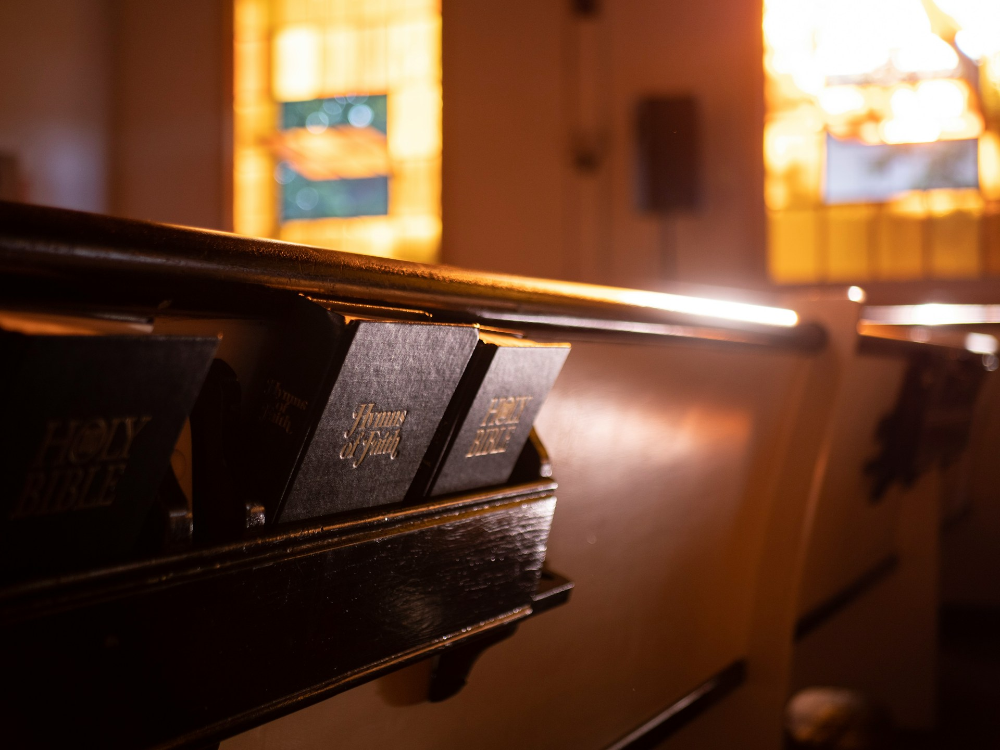

# The Faith We Sang Together

2026-07-28

## The Hymns That Remember Us

Only after many decades do we begin to understand what certain songs have carried for us. A traditional hymn may have seemed ordinary when we sang it every Sunday morning. It was part of the expected order of worship, announced by a number written on a board or spoken from the pulpit. We opened the hymnbook, found the page, stood together, and followed the organ or piano as best we could.

At the time, I was more interested in sermons. I preferred messages that dealt with theological questions, philosophical ideas, and demanding interpretations of scripture. The sermon appeared to be the intellectually serious part of the service, while the hymns provided an introduction, an interval, or a conclusion. Singing was meaningful, but it did not seem to require the same level of attention.

Years later, the relationship has changed. When I hear one of those hymns now, I do not first recall the argument of a sermon. I remember the congregation.

The memories arrive through sound. I can hear many ordinary voices singing the same words, some confident and others hesitant. A few people sang strongly. Others lost the melody or entered a moment too late. Children followed their parents. Elderly members continued singing hymns they had probably known for most of their lives. My own voice was never exceptional, but it belonged within that collective sound.

The accompaniment was modest. There may have been an organ, a piano, or sometimes a guitar. No sophisticated band stood at the front. There were no dramatic lighting changes, large screens, visual effects, or carefully designed emotional climaxes. The music supported the congregation rather than replacing it.

A professional recording may present the same hymn with greater precision. The voices are balanced, the harmonies are controlled, and every instrument enters at the proper moment. Yet musical excellence does not always awaken the same memory. What moves me most is often the plainest version, because it leaves room for the voices I once knew.

Those old hymns became containers of communal memory. Their melodies absorbed the chapel, the wooden pews, the Sunday clothes, the turning pages, the familiar faces, and the feeling of belonging to a place that expected our presence. Hearing the music again restores not only a younger version of myself but also the people who surrounded me.

Some of them may no longer be alive. Others may have moved away or followed different paths. The congregation that once existed cannot be reassembled. Yet the sound remains in memory, preserved within the songs we repeated together.

There is a particular blessing in having such memories. They remind us that faith once entered our lives through more than private belief or intellectual conviction. It entered through voices, bodies, repetition, and shared time. We did not only learn Christianity. We inhabited it with other people.

## The Human Scale of Belonging

The size of a congregation changes the nature of religious experience. A church of one hundred people does not feel like a church of one thousand, even when both affirm the same beliefs and follow similar forms of worship.

In a small congregation, the people around us are not an anonymous crowd. We recognize faces. We know names. We notice who usually sits in a certain place and who has been absent for several weeks. We learn which families have welcomed a child, which members have lost someone, and which individuals are going through illness, unemployment, conflict, or grief.

Not everyone becomes a close friend. Human beings do not form equally intimate relationships with an entire congregation. Yet recognition itself carries moral weight. A person who is recognized cannot disappear as easily into the background.

The idea commonly called Dunbar’s number offers a useful analogy. Human communities often remain socially comprehensible when they contain around one hundred to one hundred and fifty people. This should not be treated as a sacred formula or a fixed rule for church organization. It expresses an intuition about the scale at which a group can still feel visible to its members.

A congregation within that range may contain enough diversity to avoid becoming a family circle. It can include different generations, professions, personalities, and experiences. At the same time, it remains possible to know who belongs, to remember personal histories, and to sense changes in the community.

The Greek word *ekklesia*, often translated as church, originally referred to an assembly or gathering. The word does not first describe a building, a corporation, a stage, or a system for distributing religious content. It names people called together.

That definition carries greater force in an age when the church building often receives more attention than the gathering itself. We speak of going to church as though the church were the physical location. Yet a building can remain standing after the community has disappeared. A congregation can also gather in a house, a school, a rented hall, or an open field and still become a church in the older sense.

Gathering involves more than occupying the same room. A crowd at an airport also occupies a shared space, but the people remain largely unrelated. A congregation becomes a community through repetition. The same people meet week after week, pray for one another, sing familiar songs, raise children, endure disagreements, and witness the changing stages of life.

This repeated presence creates a history that cannot be produced by a single successful event. A visitor may enjoy a service, but belonging develops when a person returns often enough to become known. Over time, the congregation becomes part of one’s personal world.

Small churches should not be romanticized. Familiarity can become intrusive. Members may gossip, judge differences, resist outsiders, or impose narrow expectations. A community that knows everyone’s name can also watch everyone’s behavior. Human scale makes care possible, but it can also intensify conflict.

These limitations do not erase the value of belonging. They reveal that community is not automatically good. It becomes healthy through maturity, restraint, forgiveness, and practices that protect human dignity. A small congregation can become suffocating, but it can also become one of the few places where people are remembered across decades.

Traditional hymns contribute to this continuity because they are repeated without needing to be reinvented. The same song may accompany baptisms, weddings, ordinary Sundays, funerals, seasons of confidence, and periods of uncertainty. Its meaning expands with the history of the people who sing it.

## The Freedom and Fragility of the Local Church

Many Protestant traditions carry a strong local and pioneering character. A pastor gathers people, forms a congregation, teaches scripture, visits families, and helps create a religious community where none existed before. The church may begin in a rented room, a private house, or a modest chapel built through the labor and donations of its members.

This pattern has deep roots in the history of the United States. Immigrant and settler communities often established churches as they entered unfamiliar territory. A church stood alongside the home, school, and town meeting as one of the institutions through which a community understood itself.

The pastor in such a setting was not only a weekly speaker. He was often a teacher, counselor, organizer, mediator, and public representative. His character shaped the congregation because the church had been formed through his initiative and sustained through his presence.

That form of leadership can produce impressive commitment. People do not feel that they are entering a distant institution. They are building something together. They know who repaired the roof, who donated the organ, who taught the children, and who remained during difficult years. The church becomes part of local history because its members have invested their lives in it.

Protestantism, however, is broader than the image of an independent pastor founding a local congregation. Anglican, Lutheran, Methodist, Presbyterian, and other traditions possess denominational structures, systems of accountability, inherited liturgies, and regional authorities. The strongly entrepreneurial model appears most clearly in some evangelical, Pentecostal, Baptist, and nondenominational churches.

Local freedom offers flexibility. A congregation can respond to its surroundings without waiting for instructions from a distant center. It can develop ministries suited to the needs of its neighborhood, adopt new methods, and speak in a language people understand.

The same freedom creates fragility. When the pastor becomes the founder, chief strategist, primary preacher, public face, and final authority, the life of the church may become inseparable from his personality. Members may believe that they are committed to the congregation when they are actually attached to one individual.

Charisma is not always harmful. Religious communities need people capable of communicating conviction, inspiring cooperation, and guiding others through uncertainty. The danger appears when charisma stops serving the community and begins to replace it.

A church built around one exceptional leader can grow rapidly. The leader’s confidence attracts people, his vision organizes them, and his energy creates momentum. Yet the congregation may remain dependent even as it becomes large. When the pastor leaves, fails, or changes direction, the community discovers that it has not developed enough life beyond him.

This pattern can also distort accountability. A leader who believes that the church exists because of his calling may begin to treat disagreement as disloyalty. Members become supporters of a vision rather than participants in a shared tradition. Financial success, attendance, media visibility, and organizational expansion may be interpreted as evidence of spiritual authority.

The best form of local Protestant life preserves the energy of initiative without allowing the pastor to own the congregation. Leadership gives direction, but the church must possess practices, relationships, and memories strong enough to survive a change of leader.

A healthy pastor does not try to make himself indispensable. He helps the congregation become capable of continuing without him.

## A Tradition Stronger Than Its Pastor

Catholicism offers a contrasting model. The Catholic Church is global, hierarchical, sacramental, and institutionally continuous. A local parish does not invent its doctrine, basic liturgy, or ecclesial identity. It receives them from a tradition that extends across countries and centuries.

From a Protestant perspective, this structure can appear restrictive. Local parishes may seem to occupy the lowest level of an immense organization, receiving teachings, liturgical rules, and pastoral directions from above. The local community may struggle to understand its distinctive purpose when so much has already been determined.

Yet hierarchy also protects a parish from becoming the property of one priest. A priest may serve for several years and then be transferred. Another priest arrives with a different personality, preaching style, and set of priorities. The parish continues because its identity does not depend entirely on the current leader.

The liturgy remains. The sacraments remain. The calendar remains. The wider church remains.

This continuity can feel impersonal, especially when institutional authority becomes bureaucratic or distant. It can also become a source of stability. The community belongs to something larger than itself, and the priest serves a tradition he did not create.

Catholic parishes are not passive units without local character. They develop particular forms of devotion, charitable work, catechesis, social relationships, and communal memory. A parish in Manila will not feel the same as one in Tokyo, Rome, or a rural village. Local culture enters the life of the church even when the basic structure remains shared.

The Amish offer another response to the danger of personality-centered faith. Their communities resist the professionalization and celebrity of religious leadership. Ministers are known within the community, but they do not usually construct public brands, develop media platforms, or present themselves as religious entrepreneurs.

Leadership exists, and it can carry significant authority. Amish communities are not leaderless. Yet their spiritual life depends heavily on inherited practices, shared discipline, family relationships, mutual aid, Bible reading, prayer, and hymn singing.

The congregation does not gather to witness the performance of an extraordinary pastor. It gathers to continue a form of life.

Amish hymnody illustrates this principle. The songs belong to a historical tradition shaped by persecution, endurance, and collective memory. Singing does not need to be musically elaborate because its purpose is not artistic display. The hymn connects the present congregation with generations that lived and suffered before them.

This model has severe limitations. Strong communal discipline can suppress individuality, restrict freedom, and make departure costly. No tradition should be praised without recognizing the human burdens it can impose.

Still, the Amish example clarifies an essential question. Can faith remain strong when the pastor is not the center of attention?

A durable congregation needs leadership, but it also needs a common life that does not have to be generated anew every Sunday. Scripture, prayer, hymns, service, meals, rituals, and memories give the community a structure that survives personal change.

The pastor then becomes a guardian and interpreter rather than the source of the church’s existence. His task is to serve practices that existed before him and will continue after him.

Traditional hymns belong to this form of continuity. They do not require the worship team to compose a new emotional experience. The congregation receives words and melodies shaped by earlier generations. Each person enters something already in progress.

That inheritance limits the power of the present moment. The church cannot define itself only through current fashion, the pastor’s personality, or the preferences of its most active members. It must listen to voices that came before.

## From Congregation to Audience

The modern megachurch represents one of the most successful religious forms of recent decades. A large congregation can provide resources that a small church cannot. It may offer extensive children’s programs, professional counseling, specialized ministries, social services, media production, and educational opportunities.

Megachurches also reach people who would never enter an old chapel. Their music feels familiar, their language is accessible, and their buildings may appear less formal or intimidating. A charismatic pastor can address thousands of people at once and build a sense of shared direction across a large institution.

These achievements deserve recognition. Scale is not automatically corrupt, and contemporary worship is not automatically shallow. Many people encounter genuine faith, friendship, and support in large churches.

Yet scale changes the basic structure of the gathering.

When several thousand people attend, the congregation can no longer know itself as a single face-to-face community. Most attendees do not recognize one another. The stage becomes the stable center of attention, while the surrounding crowd changes from week to week.

Music also takes on a different role. A continuous band, professional singers, lighting effects, large screens, and carefully designed transitions create an atmosphere closer to a concert. The congregation may still sing, but its sound is often overwhelmed by amplification from the stage.

The musicians lead not only the melody but also the emotional movement of the service. The music rises, people raise their hands, the final chorus repeats, and the instruments stop at the moment the preacher appears. The transition has been designed for maximum impact.

Some worshippers find this powerful. Others feel that their emotional response is being managed.

The difference lies less in musical style than in the relationship between performance and participation. A traditional hymn can also be performed badly if a choir or organist dominates the congregation. A contemporary song can become truly communal if the musicians support rather than replace the people singing.

Still, the megachurch environment creates a structural temptation. Excellence becomes visible, measurable, and marketable. A gifted singer, an impressive band, and a dynamic preacher help attract attendance. The ordinary voice of the person in the twentieth row contributes very little to the sound filling the room.

In a small chapel, that same voice matters. If several members refuse to sing, the difference can be heard. The congregation produces the hymn through collective effort. No one needs to be excellent, but everyone is invited to participate.

This distinction reaches beyond music. A religious audience receives an experience. A congregation creates and sustains a common life.

Large churches often respond by organizing small groups, local circles, or neighborhood ministries. These smaller communities can provide the recognition and mutual responsibility missing from the main service. In practice, the megachurch becomes a network of smaller churches gathered around a central event.

The need for such groups reveals the limits of scale. Human beings may enjoy large gatherings, but they form durable bonds in smaller communities.

## Faith Without the Gathering

The internet has introduced a more fundamental change than the megachurch. A megachurch still asks people to gather in one place. Digital faith allows the individual to receive religious content without joining a physical congregation at all.

Anyone with an internet connection can listen to sermons from almost any tradition. A person can watch Catholic Mass from Rome, hear a Baptist preacher in the United States, follow an Orthodox liturgy, study Reformed theology, or listen to a small local congregation broadcasting from another country.

The Bible is available on phones, tablets, and computers in many translations. Commentaries, lectures, historical documents, and theological debates can be accessed at any hour. AI can explain difficult passages, compare doctrinal interpretations, provide historical context, and answer questions that a local pastor may not have time or training to address.

From the perspective of religious information, the local church has lost its monopoly. The most knowledgeable preacher in one’s city may be less accessible and less compelling than a theologian available online. A person can choose a speaker whose temperament, education, politics, and theology fit personal preferences.

This development brings real freedom. Some congregations are controlling, exhausting, or spiritually unhealthy. Religious communities can reproduce gossip, rivalry, favoritism, prejudice, and manipulation. People who have been hurt by churches may need distance before they can consider entering another community.

Digital resources also serve those who cannot attend because of illness, disability, age, travel, work schedules, or geographic isolation. Online worship may be the only available connection to a tradition they love.

The internet can broaden faith beyond local limitations. A person raised within one narrow interpretation can discover the diversity of Christian thought. Historical knowledge becomes harder to suppress when original sources and alternative perspectives are widely available.

These gains should not be dismissed as evidence of laziness or declining commitment. Individual believers now possess freedoms that earlier generations could not imagine.

Yet freedom from community can become freedom from responsibility.

Online, we can leave whenever we feel uncomfortable. We can stop a sermon, change the speaker, skip the hymn, accelerate the video, or move to another tradition. We can construct a spiritual environment that rarely challenges our preferences.

Religious life begins to resemble personalized media consumption. We choose the most persuasive preacher, the most agreeable interpretation, the most inspiring music, and the most convenient time.

Such access can produce knowledge without belonging. A person may listen to hundreds of sermons and remain unknown to anyone. The individual may understand theology well while carrying no responsibility for a specific community.

A physical congregation places us among people we did not choose. Some are difficult. Some hold opinions we dislike. Some sing badly, speak too long, or fail to meet our expectations. Their presence interrupts the creation of a perfectly customized faith.

This inconvenience may carry spiritual value. Christianity teaches patience, forgiveness, service, humility, and love, but these virtues cannot be practiced only as ideas. They require actual people, including people who disappoint us.

Community also gives others the opportunity to care for us. Someone notices when we are absent. A member brings food during illness. People attend a funeral, visit a hospital, celebrate a child, or remain present during a crisis.

A digital service can inspire us, but it cannot easily create that pattern of mutual obligation. A livestream does not know whether we have stopped attending. An AI system can explain grief, but it does not sit beside us during mourning.

Digital connection is real, and online communities can become meaningful. People form friendships, pray together, and support one another across distance. Yet embodied presence still carries a distinctive force. Shared space makes needs visible in ways that digital communication often does not.

The Christian faith is not reducible to worldly social ties. A church can become socially active while losing theological depth. Friendship alone does not define spiritual community.

At the same time, Christianity has never been only a private relationship between the individual and God. Its central practices involve gathering, eating, singing, praying, confessing, serving, and remembering together.

AI can provide excellent theological insight. It can compare interpretations and help a believer study scripture with remarkable breadth. It cannot become the congregation.

## What the Old Hymns Still Teach

We cannot return to the good old days because those days never existed in the perfect form memory sometimes gives them. The old churches contained conflicts, exclusions, narrowness, and failures. Some people felt loved within them, while others felt watched, judged, or pushed aside.

Wooden pews, hymn-boards, organs, and printed books do not guarantee spiritual depth. A traditional service can become lifeless repetition. A small congregation can become inward-looking and resistant to necessary change.

Nostalgia therefore needs examination. It can preserve beauty, but it can also hide pain. It can lead us to confuse familiarity with truth and age with wisdom.

Yet nostalgia is not always a desire to reverse history. It can also reveal what progress has placed at risk.

The old hymns remind me that faith once had a human scale. It was practiced among recognizable people who met in the same place over many years. We did not select every member of the congregation. We inherited one another.

The repetition mattered. Singing the same hymns did not provide novelty, but it allowed the words to enter memory. A song learned in youth could return during illness, grief, uncertainty, or old age. Its meaning changed as life changed.

The imperfections mattered as well. We were not performers. Our voices did not need to satisfy an audience. The hymn became beautiful because people participated in it together.

This experience offers a useful lesson for the digital age. Religious information is becoming abundant. We can access more sermons, commentaries, translations, and theological perspectives than any earlier generation. The challenge is no longer access alone. It is learning what knowledge cannot replace.

Information cannot replace recognition. Interpretation cannot replace responsibility. Inspiration cannot replace the long work of belonging to people.

The future of faith may not require a choice between old churches and digital tools. Online resources can deepen study, connect isolated believers, and expose unhealthy authority. AI can support serious theological reflection. Large churches can provide ministries that small congregations cannot sustain.

Traditional communities can preserve another form of wisdom. They remind us that faith is also built through limited places, repeated practices, ordinary relationships, and voices that do not need to be impressive.

A church worth attending will not survive by offering better content than the internet. It will survive by offering a form of life the internet cannot provide.

Such a church does not have to reject technology or reproduce the customs of the past. It needs to help people become visible to one another. It needs practices that allow the community to endure beyond the personality of its pastor. It needs worship in which ordinary members contribute rather than watch.

The old hymn remains a fitting image of that possibility. No single voice carries the song. The organ provides direction, but it does not become the purpose of the music. The words come from an inherited tradition, yet each congregation gives them a present human sound.

Some people sing confidently. Others hesitate. A few lose their place. Children learn by following adults, while older members sing from memory. The result is imperfect, but it belongs to everyone.

When I hear those hymns now, I feel blessed that they entered my life before I understood their value. They bring back a community that no longer exists in the same form, but they also remind me that faith was never only something I believed.

It was something we sang together.

Photo by [Aaron Burden](https://unsplash.com/@aaronburden?utm_source=unsplash&utm_medium=referral&utm_content=creditCopyText) on [Unsplash](https://unsplash.com/photos/brown-pew-yiI_e4zSEvo?utm_source=unsplash&utm_medium=referral&utm_content=creditCopyText)