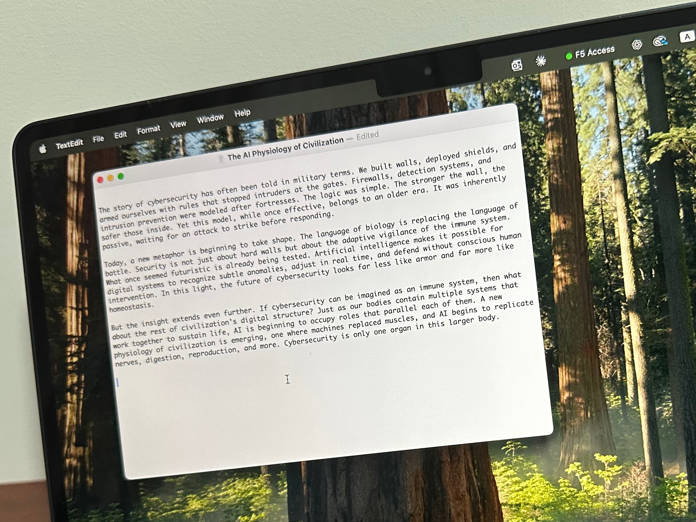

# The House Built by Writing

 2026-07-30

## The Beginning Without a Blueprint

When I started [Tom’s Blog](https://tomyonashiro.com/) in 2019, I chose one of the most familiar templates available on WordPress.com. Anyone who had visited other blogs on the platform would probably have recognized it. There was nothing distinctive about the design, but that did not concern me. I wanted a place where I could write and share my reflections. The website itself did not need to become a separate creative project.

I am not a web developer, and I never wanted to spend more time designing the container than developing what would go inside it. Learning complex customization, adding technical features, and adjusting every visual detail might have been interesting, but none of those activities represented the purpose of the blog. My attention belonged to the writing.

The uncomplicated design also made publishing easier. I could finish an entry, review it, and place it online without passing through an elaborate production process. If posting one essay had required numerous technical steps, I might have written less frequently. A publishing system should support the practice it exists to serve. Once it begins demanding too much attention from the writer, the relationship has been reversed.

At the time, I had no reason to imagine that the blog would continue for more than six or seven years. I did not expect the number of entries to approach 1,000. Each post was written in response to a question, an experience, a book, a conversation, a development in technology, or an event in the world. I was concerned with the subject in front of me, not with building an extensive archive.

That may have been one reason the blog was able to continue. I did not begin with an ambitious plan that had to be fulfilled. There were no publishing targets or audience projections. Writing remained connected to the movement of daily life. One reflection led to another, and the archive grew through sustained attention rather than a predetermined program.

Years later, the familiar template was still functioning. Nothing was technically wrong with it. Yet the relationship between the writing and its home had changed. What began as a collection of individual posts had developed enough history and substance to require a more fitting form. The writing had come before the architecture, but the architecture could now respond to what the writing had become.

## From Posts to a Record of Consciousness

An individual blog entry belongs to a date. It reflects what the writer was thinking at a certain moment and under particular circumstances. Read by itself, it may appear complete. Placed beside hundreds of other entries written over several years, it becomes part of a larger movement that no single post can reveal.

Questions return, even when their language changes. An essay about artificial intelligence may continue a concern that first appeared in an earlier reflection on knowledge. A discussion of work may connect with older questions about responsibility, usefulness, or human dignity. Writing about music may lead toward memory, worship, community, and mortality. The subjects differ, but the same underlying concerns continue to move through them.

This is one reason I resisted treating the blog as a set of separate content areas. My reflections on philosophy, religion, technology, culture, and everyday life do not arise from unrelated parts of myself. They belong to one consciousness encountering the world. The connections are often more meaningful than the boundaries.

Over time, the archive began recording more than what I thought. It also preserved how my thinking moved. An earlier conclusion might later appear incomplete. An intuition expressed in one essay might receive a fuller form several years afterward. Experiences could require me to reconsider assumptions that had once felt settled. The collection therefore contains continuity, revision, tension, and development.

In that sense, the blog has become a form of intellectual autobiography, although most entries are not conventional memoirs. The subject is often something outside my personal life, such as history, cybersecurity, theology, literature, or social change. Yet the selection of questions still reveals the writer. Attention itself has a history. What we continue to notice tells others, and eventually tells us, what has occupied our minds and shaped our understanding.

The value of this archive does not depend entirely on how many people read each entry. Some essays may reach a wider audience, while others remain largely undiscovered. A piece that attracted little attention when it was published may still contain an idea worth returning to. Another may gain significance because of what was written before or after it. A collection acquires forms of value that cannot be measured through the performance of each individual item.

Approaching 1,000 entries made this clearer to me. The blog had become a precious asset, not in the commercial sense, but as a record of consciousness across time. It contained years of encounters with life, other people, the changing world, and questions that extend beyond any one lifetime. I could no longer regard it as a chronological feed in which the newest post displaced the previous one.

A large archive, however, creates its own difficulty. What is meaningful to the writer may remain inaccessible to the reader if there is no way to enter it. Chronology records the order in which thoughts appeared, but it does not always reveal their relationships. The growth of the collection therefore created a new responsibility: to provide structure without reducing the writing to rigid compartments.

## Designing for the Act of Reading

The recent renewal began from that recognition. The earlier design had served the blog well, but it no longer expressed the character of the body of work it contained. I wanted the site to feel less like a standard collection of posts and more like a place created for sustained reading.

AI made that renewal practical. In the past, I would have hesitated to attempt extensive changes because I did not want web development to become another occupation. I knew the atmosphere I wanted, but turning an intention into a working design required knowledge and time that I preferred to devote elsewhere. AI helped bridge that distance. It allowed me to explain the principles, test possibilities, and make decisions without becoming absorbed in programming details.

The governing idea remained the same as it had been in 2019. The website should serve the writing. The difference was that I could now shape the environment more deliberately while preserving the directness of the publishing process.

The blog exists for reading, thinking, and reflection. Anything that interferes with those activities should be treated with caution. A feature may be visually impressive and still be unsuitable. Movement, animation, sidebars, pop-ups, recommendation systems, and decorative elements can compete with the text for attention. Their technical sophistication does not guarantee that they improve the reader’s experience.

My preference for light mode also follows this principle. I wanted a background that felt open and comfortable without the sharpness of plain white. Beige provided the warmth I was seeking while preserving the clarity of dark text on a light surface. The result feels closer to a printed page, although it remains unmistakably digital.

Typography carries another part of the atmosphere. Sans-serif fonts have become common across contemporary websites, particularly those presenting corporate, technical, or informational content. They are clear and functional, but I wanted the essays to retain a literary character. A serif typeface gives the words a different presence. It suggests that the reader is encountering an authored work rather than passing through a stream of interchangeable content.

None of these decisions is decorative in isolation. The background, typography, margins, line spacing, navigation, and absence of competing elements work together to protect attention. The design does not ask the reader to admire the website before reading the essay. It creates the conditions in which the essay can be read.

The same restraint protects the writer. From drafting to publishing, the process must remain manageable. If the renewed design required extensive manual work for every entry, it would eventually become a burden. A sustainable publishing environment respects both sides of the relationship. It makes reading more comfortable without making writing and publication more difficult.

Minimalism, understood this way, is not a fashionable appearance. It is a discipline of deciding what the space is for. The blog does not need to demonstrate every capability available to a modern website. It needs to give language enough room to carry thought.

## The Archive Reveals Its Subjects

For most of the blog’s history, I hesitated to create categories. The usual approach is to divide posts according to subjects such as philosophy, religion, technology, culture, work, or personal life. That structure can help readers, but it can also misrepresent the writing.

An essay rarely belongs to only one territory. A reflection on technology may lead toward ethics, knowledge, labor, politics, or the meaning of human agency. A piece about Christianity may also concern history, community, music, psychology, and mortality. Even an account of an ordinary day may contain questions that have occupied philosophers and theologians for centuries.

Placing each entry inside a fixed category felt like separating parts of a conversation that had developed together. I did not want the organization of the website to imply that the subjects existed independently from one another. They all emerged from everyday reflection, and their connections were often central to the work.

Yet an archive approaching 1,000 entries could not rely on chronology alone. A reader interested in faith, artificial intelligence, literature, or the cosmos needed a way to discover related essays. The absence of categories protected interconnectedness, but it also made much of the archive difficult to find.

AI offered a way through this tension. Instead of deciding in advance what the blog ought to contain, I could ask AI to read across the existing entries and identify the subjects that had recurred throughout the years. The categories would arise from the work rather than being imposed upon it.

The result was more accurate than I expected. [Seven broad areas emerged](https://tomyonashiro.com/topics/): Philosophy and Ideas; Faith and Spirituality; Technology and AI; History, Society and Culture; Arts, Books and Writing; Life, Work and Practice; and Science and Cosmos. These correspond closely to the areas that have occupied my attention, both personally and professionally.

The categories did not create this intellectual identity. They revealed it. Years of writing had already formed the pattern, although I could not see its full shape while producing one essay at a time. AI read across the distance between entries and returned a picture of the whole.

Its role here was closer to that of an archaeologist than an authority. It did not determine what I should care about or prescribe a future direction. It examined what had accumulated and identified the recurring structures within it. The experience showed how AI can assist a writer without replacing the writer’s judgment. It can help us see patterns in our own work that have become too large to hold in immediate memory.

The new topics are best understood as entrances rather than containers. Each essay receives one primary topic and, where useful, one secondary topic. This provides enough order for discovery while acknowledging that an essay may participate in several conversations. Readers can enter through technology and arrive at philosophy, or begin with faith and find themselves considering art, memory, or social life.

The house remains one house. The topics are doors through which different readers may enter.

## Long Form After the Rule of Brevity

Digital publishing has long been governed by the advice that shorter is better. Readers are assumed to have limited attention, and writers are encouraged to reduce their arguments, simplify their language, and reach the main point as rapidly as possible. Titles are shaped for search engines, paragraphs are shortened for scanning, and complex reflections are divided into content that can be consumed within a few minutes.

There are contexts in which this discipline is valuable. Instructions, announcements, news summaries, and practical information often benefit from brevity. Unnecessary length can conceal weak thinking as easily as excessive compression can damage a strong idea.

Reflective writing presents a different demand. Some questions require time because their difficulty lies in the relationship among several ideas. A conclusion cannot be understood fully without seeing the path that leads toward it. Qualifications, examples, historical background, personal experience, and competing interpretations are not always removable details. They may constitute the thought itself.

I have sometimes considered making each entry shorter and more concise. Doing so might increase the likelihood that people will read the entire piece. Yet when I try to compress a substantial reflection into a few hundred words, I often feel that I have presented the result without completing the inquiry. The sentences may be clear, but the movement of thought has been shortened before it has reached its proper form.

AI has changed the conditions surrounding this decision. I can now write an essay of 2,000, 4,000, or even 5,000 words when the subject requires that space. Readers who do not have time for the full work can ask AI for a summary. They can request the key arguments, select one section, translate the language, or ask how the essay relates to another subject.

This possibility is liberating because the canonical work no longer has to perform every function for every reader. The original essay can preserve the complete development of the reflection. Shorter versions can be created afterward according to different needs. Compression becomes an entrance to the work rather than a restriction imposed before the work exists.

A reader may also do more than request a summary. AI makes it possible to conduct a dialogue with an essay. Someone might ask which philosophical tradition is closest to its argument, where its assumptions could be challenged, or how its central idea applies to a personal situation. Another reader might compare two essays written several years apart and identify a change in perspective. The archive can support forms of engagement that were difficult when reading was limited to moving from the first sentence to the last.

I welcome that possibility. I do not consider AI-assisted reading a lesser form of reading. If a conversation with AI helps someone enter the work, identify a question, or return to the original text with greater interest, then the essay has gained another way to speak.

This does not release the writer from the obligation to write well. The availability of summarization is not an excuse for repetition, disorder, or an unedited stream of consciousness. A long-form essay still requires proportion, continuity, and revision. Each section must contribute to the development of the whole, and each paragraph must carry a complete movement of thought.

The freedom is therefore not the freedom to write without discipline. It is the freedom to let an idea become as complete as it needs to be. The appropriate length is neither the shortest possible form nor the longest form the writer can produce. It is the length at which the thought has been given enough room to develop without losing its direction.

## One Body of Work Across Languages

The relationship between English and Japanese forms another part of the blog’s evolving structure. English is the canonical language of my essays. I develop the original reflection in English, complete the argument, and establish the final organization before producing the Japanese version.

AI has made translation far more practical. A long essay can be translated section by section or paragraph by paragraph, allowing me to review each part while the original remains present. This process is more reliable than translating the entire work at once and trying to repair the result afterward.

Human review remains necessary. A translation may be grammatically correct and still feel unnatural. Tone, rhythm, cultural expectation, and the relationship between sentences require judgment. AI provides a strong draft, but I remain responsible for deciding whether the Japanese version carries the same thought and feels natural to a Japanese reader.

The two languages therefore participate in one writing process. English provides the original form, while Japanese gives the work another cultural and linguistic life. Translation does more than reproduce information. It reveals where an idea depends on expressions, assumptions, or patterns of reasoning that do not move automatically between languages.

For now, WordPress.com is the appropriate home for the original English essays, while Note.com remains the best platform for the Japanese versions. [Note](https://note.com/tyonashiro) has an established community of Japanese readers who enjoy writing and reflective work. I have already used it for years, so transferring every Japanese entry to WordPress would create effort without a clear benefit.

Linking the two locations creates a more natural arrangement. Readers of the English essay can find the Japanese version, and Japanese readers can return to the original when they wish. The work remains connected without requiring every language to occupy the same platform.

This is not fragmentation. It is one body of work with several doors. The canonical source remains clear, while each language is delivered through an environment suited to its readers.

## A Home That Can Continue Growing

I have also considered publishing on platforms such as Medium and Substack. They provide useful tools, existing audiences, and systems for distributing new work. At the same time, they bring rules, incentives, interventions, and forms of noise that can influence how writers present themselves.

Publishing entirely within such a platform can feel like renting an apartment. The writer may arrange the furniture, but the larger structure belongs to someone else. Rules can change, recommendation systems can alter visibility, curators can intervene, and the culture of the platform can place pressure on the work. Even when the service is convenient, the writer remains a resident within another organization’s environment.

A personal site feels closer to having a home of one’s own. WordPress.com still provides the underlying infrastructure, but my domain, archive, design, navigation, and editorial decisions give Tom’s Blog a continuity that is not defined by a platform feed. Visitors arrive at the site as a place rather than encountering one post inside a larger content system.

That freedom made the recent renewal possible. I could choose a warm light background, literary typography, broad subject areas, and an uncluttered reading environment because those decisions reflected the character of the writing. I did not need to follow the dominant appearance or publishing habits of another community.

Reaching nearly 1,000 entries gives this sense of home greater significance. A small number of posts can be moved easily or treated as temporary publications. An archive developed over many years carries history. Its organization, links, translations, and visual atmosphere become part of how the work is preserved and understood.

The next stage may involve more than continued production. Returning to earlier essays can reveal which ideas deserve further development, which arguments need correction, and which recurring questions might be gathered into larger works. Topics help readers discover the archive, but they also help the writer see the continuity of his own concerns.

There may eventually be selected collections, reading paths, or a page that explains the principles behind the blog. Those possibilities can develop from the work already present. They do not need to transform the site into a complicated publishing institution. The central practice remains the same as it was in 2019: encountering something worth thinking about and giving that reflection a written form.

I sometimes wonder how many more essays I will be able to write during the rest of my life. The question carries an awareness that time is limited, but it also gives value to continuation. Each new essay joins a record that is already larger than I expected to create. It may extend an old question, correct an earlier conclusion, or begin a line of thought whose destination I cannot yet see.

When I began [Tom’s Blog](https://tomyonashiro.com/), I did not design an impressive house and then search for something to place inside it. I began writing. The entries accumulated, the recurring subjects became visible, and the structure emerged from the life of thought already taking place there.

The house was built by writing, and it will continue to take its form from whatever remains worth thinking about. Thinking is writing, writing is for life, and the life still being lived will decide what rooms come next.

*Image: A photo captured by the author*