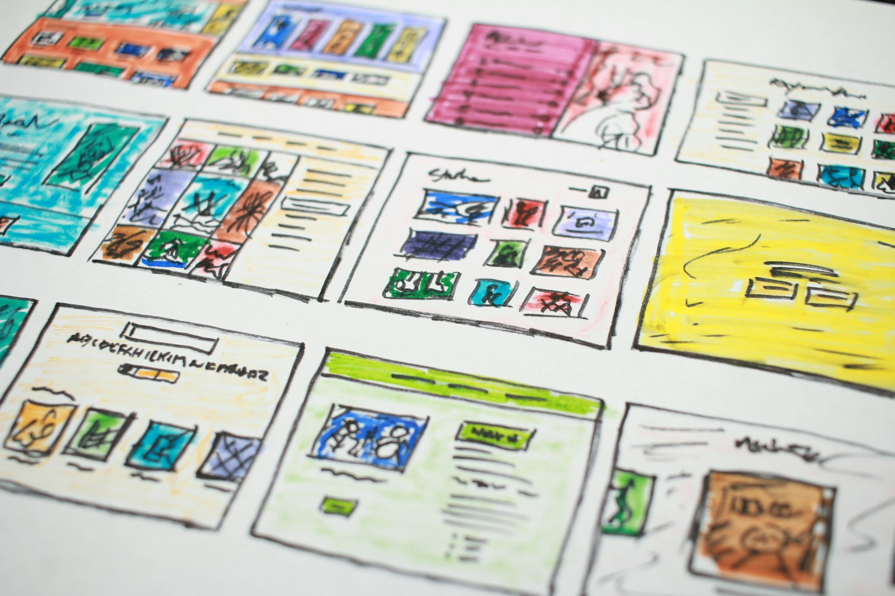

# The Book Beside the Modem

2026-07-30

## Waiting for the Page to Arrive

My first experiences of the internet in the late 1990s began with a sound. Before a webpage could appear, the computer had to connect through a modem attached to the telephone line. A sequence of electronic tones, pulses, and bursts of static announced that the machine was trying to establish contact with another machine somewhere beyond the house. Sometimes the connection succeeded. Sometimes it failed, and the entire ritual had to begin again.

Using the internet also meant occupying the telephone line. While the computer was connected, nobody else could make or receive an ordinary call. Going online was therefore a distinct activity rather than a condition that continued throughout the day. We entered the internet, spent some time there, and disconnected when we were finished.

Once connected, we still had to wait. Text usually appeared first, followed by images that revealed themselves from top to bottom. A photograph did not arrive as a complete object. It descended across the screen in horizontal bands, as if a shutter were moving slowly downward. For a while, the upper part of the picture remained visible while the lower part was still somewhere on the network.

I kept several small physical books beside the computer. When a page contained a large image or took too long to load, I opened one of them and read. The arrangement seems strange now: a printed book beside a machine connected to a global information network. Yet it felt entirely natural in the late 1990s. The computer needed time to bring the page to me, and the book was already there.

Dial-up access was inconvenient. Connections failed, downloads stopped, and a single photograph could test one’s patience. There is no reason to pretend that technical limitation was itself a virtue. The spread of broadband during the early 2000s was a genuine improvement, and few people would choose to return to the modem if faster access were available.

Still, those delays had a recognizable shape. We knew when we were waiting, and we could decide what to do with that interval. The internet had not yet expanded to occupy every unfilled moment. It arrived through a telephone line, entered one room of the house, and left space for a book to remain open beside it.

## A Homestead Called “Deep Breathing”

My first attempt to create a public place for my writing took shape on Yahoo! GeoCities around the turn of the century. GeoCities had begun in the United States in 1994 and was acquired by Yahoo! in 1999, when the service was already one of the most visited destinations on the web.

We did not commonly speak of personal brands, creator platforms, or content strategies. Even the word “blog,” although it had begun circulating by the late 1990s, had not yet become part of ordinary language. We made homepages.

The term was appropriate because a homepage felt like a place. GeoCities made the metaphor explicit by organizing websites into neighborhoods and describing their owners as homesteaders. A user received an address within this growing digital settlement and began constructing a small corner of the web.

I called my site “Deep Breathing.” I posted essays there in both English and Japanese, beginning a bilingual writing practice that continues today. I do not know how many people visited or whether anyone now remembers the site. At the time, reaching a large audience was not the only measure of whether publication was worthwhile. The ability to place one’s writing on the internet was already remarkable.

Building a homepage in the late 1990s required more direct involvement than opening an account on a modern publishing service. We worked with raw HTML tags, often learning by looking at the source code of other pages. CSS had emerged only a few years earlier and was still a new technology for many ordinary users. Numerous design choices were placed directly inside the HTML. A misplaced tag could distort an entire page. An incorrect file path could leave a broken image icon where a carefully selected picture was supposed to appear.

The results were rarely restrained. Many pages had backgrounds resembling outer space, textured paper, marble, or patterned wallpaper. Animated GIFs flashed, rotated, sparkled, or moved across the screen. There were burning torches, spinning globes, waving flags, and email icons that opened and closed forever. Some pages played MIDI music as soon as a visitor arrived.

“Under construction” signs appeared everywhere, often accompanied by an animated worker digging beside a barrier. The declaration was unintentionally permanent. A personal homepage was never fully complete because its owner could always add another section, alter the background, repair a link, or experiment with a new effect.

Page counters occupied a place of honor, especially on landing pages. A visitor might be informed that he or she was the 327th person to enter. Reaching one thousand visits felt significant enough to celebrate. The number was crude compared with today’s analytics, but it made the existence of unseen readers visible.

Contact was direct. Website owners often displayed their email addresses openly, sometimes behind an animated mailbox. If a reader enjoyed an essay, found an error, or wanted to continue a discussion, there was no need to follow an account or enter a platform’s comment system. The reader could write to the person who had made the page.

These sites often looked chaotic, but their irregularity carried evidence of human choice. Someone had selected every background, divider, color, button, and image. Technical inexperience was visible, yet so were humor, enthusiasm, and personality. Even a poorly designed homepage could feel more personal than a polished page produced from a standardized template.

“Deep Breathing” belonged to that world. Its design, address, and technology have disappeared, but the intention behind it has remained. It was the earliest recognizable form of what would later become Tom’s Blog: a public home where writing could accumulate across languages and years.

## Before Visibility Became an Industry

The personal web of the 1990s was filled with unknown writers. They published essays, jokes, diaries, amateur novels, theological arguments, family histories, fan pages, travel accounts, and technical instructions. Some pages contained only a few paragraphs. Others grew into extensive collections maintained over many years.

These writers were not necessarily trying to build careers. Many were sharing a subject because they cared about it and had discovered that the internet gave them somewhere to speak. A page devoted to a favorite novelist, an obscure historical event, or a personal interpretation of scripture could exist without a plan for monetization. Its reason for existence was the owner’s interest.

Finding such pages required a different process from the one we know today. During the 1990s, Yahoo functioned primarily as a human-organized directory. Websites were arranged into categories, and owners submitted their addresses for registration. After creating a homepage, one had to place it on the map so that other users could find it through the directory.

GeoCities followed a related spatial logic. Its neighborhoods grouped pages according to broad interests, while web rings connected independent sites devoted to similar subjects. One page led to another, and browsing could become a journey through a series of privately constructed rooms.

Corporate websites already existed, and commerce was never absent from the internet. People also wanted visitors and looked for ways to attract them. Yet online visibility had not developed into the large professional system that would emerge during the 2000s around search rankings, engagement, conversion, and audience growth. The personal web remained prominent enough that an ordinary user could encounter another ordinary person’s thoughts without passing through a major media organization.

The old page counter reflected the scale of that environment. It did not tell the owner how long each person stayed, where they clicked, which sentence caused them to leave, or whether they could be converted into a subscriber. It offered one number, visible to everyone. The information was limited, but the relationship between writer and reader could feel more human because it was not surrounded by continuous measurement.

A homepage was also more than a container for individual posts. Its links, colors, collections, and unfinished sections formed a portrait of its owner. Visitors did not encounter one piece detached from its surroundings. They entered a site and explored it. The structure encouraged curiosity about the person behind the page.

That web was neither pure nor innocent. There were advertisements, scams, unreliable claims, offensive material, and ugly design. Technical knowledge and internet access were unevenly distributed. Nostalgia should not erase those limitations.

Even so, the early web allowed forms of personal expression that later became harder to notice. People were constructing places before they learned to optimize content. Much of what they created was imperfect, but it belonged to them in a way that a post inside a standardized feed rarely does.

## The Empty Box That Found Everything

Google appeared in the late 1990s as one of many young internet companies, but its search page looked unlike the crowded portals of the period. Other sites attempted to become gateways containing news, weather, directories, email, shopping, and advertisements. Google presented an open page, a logo, and a search box.

The simplicity of the interface made the result more astonishing. A user could type an ordinary word or phrase and receive relevant pages from an enormous collection within seconds. What now feels routine seemed close to impossible around the beginning of the 2000s. The expanding web had become searchable without requiring the user to know which directory category contained the answer.

PageRank helped create that change by examining relationships among webpages. Links could function somewhat like citations, allowing the search engine to estimate which pages had acquired authority within the wider structure of the web. Discovery moved from a primarily curated directory toward automated ranking at a scale no group of human editors could maintain.

The first encounters with Google produced a form of disbelief that resembles the response to ChatGPT in November 2022. Google made millions of scattered pages feel immediately retrievable. More than two decades later, ChatGPT made large bodies of knowledge feel conversational and generative. In both cases, a sparse interface concealed a major shift in the relationship between people and information.

Google’s success also changed the environment it searched. Once appearing near the top of the results became commercially valuable, website owners began studying how rankings worked. During the early 2000s, search engine optimization developed from a specialized practice into a central concern of online publishing and marketing.

Corporate participation expanded as companies recognized that the internet was not only a place to provide information. It could attract customers, shape reputation, conduct transactions, and measure behavior. Websites became business infrastructure, and the contest for attention became increasingly systematic.

This development brought real benefits. Search freed users from the restrictions of manually maintained directories and made obscure information easier to find. Businesses could reach people without relying entirely on traditional media. Writers could be discovered by readers far beyond their existing circles.

At the same time, publication began adapting itself to the search engine. Titles, keywords, links, page structures, and writing styles were evaluated partly according to their ability to rank. The web did not stop supporting personal expression, but its incentives changed. A page could now be judged not only by what it said, but by how effectively it entered an automated system of visibility.

The expansion of broadband during the early 2000s accelerated the transformation. Images loaded without giving me time to finish a page of the book beside my computer. Audio became practical, followed by video. The web grew richer and more useful, while patience ceased to be imposed by the connection itself.

## From Websites to Accounts

Browsers changed along with the web. Netscape Navigator represented the 1990s, when browsing still felt like exploration. Internet Explorer became dominant around the beginning of the 2000s through Microsoft’s relationship with Windows, turning the browser into a standard feature of the personal computer. Chrome, introduced in 2008, eventually displaced it and has remained a major browser throughout the 2010s and well into the 2020s.

Publishing tools also became easier to use. Blogger emerged near the end of the 1990s and became part of Google in 2003. Services like it allowed people to post regularly without building every page by hand. Templates handled the layout, archives, dates, and navigation. The writer could concentrate more fully on writing, although part of the individual character of the handmade homepage was exchanged for consistency.

I used Blogger for a period after GeoCities. It provided a bridge between the homepage era and the more developed blogging practice that followed. Yet Blogger never felt like a place that Google regarded as central to its future. The service remained available, but it seemed to stand at the edge of a company increasingly defined by search, advertising, mobile software, and large-scale technical systems.

Social media introduced another model during the 2000s. Instead of creating a website and persuading people to visit it, users opened accounts inside a shared environment. The platform supplied the design, audience, comments, notifications, and methods of discovery. Publishing became easier, faster, and more social.

The unit of expression also changed. A homepage invited visitors to enter a place and explore its sections. A social platform delivered individual posts into a feed. Readers could respond to one fragment without seeing the larger body of work from which it came. The account remained attached to the person, but the platform controlled the surrounding space.

YouTube, launched in 2005, expanded what online expression could contain. Under dial-up conditions, streaming video had seemed remote. Broadband turned it into a central form of communication, education, and entertainment. Experiences once conveyed through text and a few compressed images could now be shown through moving pictures and sound.

The introduction of the iPhone in 2007 carried the internet away from the desk. Websites had been designed for monitors, keyboards, and a user who had chosen to sit in front of a computer. During the 2010s, smartphones placed the network in a pocket and made access continuous. Responsive and mobile-first design became essential because the screen, the setting, and the rhythm of use had changed.

The smartphone removed many boundaries that had once separated online and offline life. We no longer needed to connect, browse, and disconnect. Messages, searches, videos, maps, photographs, and news traveled with us. The internet became more useful, but it also acquired access to nearly every pause in the day.

Platforms such as Medium, established in 2012, and Substack, introduced in 2017, later offered polished environments for writers. Medium provided distribution through a recognizable publication system. Substack combined a website, email newsletter, subscriptions, and an internal social network. Both reduced technical work and helped writers reach readers.

I tried them during the 2020s because their advantages were real. Yet neither was fully compatible with what I wanted from writing. Their templates and distribution systems carried assumptions about how essays should be presented, circulated, and connected to an audience. I did not want my body of work to feel like a collection of entries housed inside someone else’s publication system.

The movement from websites to accounts gave millions of people the ability to participate without learning HTML. It also concentrated personal expression inside a limited number of corporate spaces. We gained convenience and reach, while becoming more dependent on environments whose designs, rules, and priorities could change without our consent.

## Losing a Home and Building Another

The closure of Yahoo! GeoCities Japan in 2019 felt personal to me. The main GeoCities service had already closed in 2009, but the Japanese service continued for another decade. I had published a number of essays on “Deep Breathing,” in English and Japanese. Learning that the service would end was not like hearing that an old software product would no longer receive updates. It was closer to learning that a place containing part of my history would be removed.

A homepage felt like one’s own property because its owner had designed and maintained it. GeoCities encouraged that feeling through the language of homesteads and addresses. Yet the closure exposed the limits of the metaphor. We had built the houses, but the land belonged to the company operating the service.

Digital writing can appear more durable than paper because it can be copied and distributed at almost no cost. It can also vanish with startling speed. A business decision, an expired domain, an inaccessible account, or an unsupported format can remove years of work from ordinary view.

My period with Blogger continued the practice, but WordPress eventually became the foundation of Tom’s Blog. I started the blog in 2019, the same year GeoCities Japan closed. For nearly seven years, it has provided a more lasting structure for my essays. It also relies on themes and software maintained by others, but it allows a different degree of authorship over the whole site.

A personal domain changes the relationship between the writer and the publishing system. Visitors arrive at Tom’s Blog, not at a profile whose identity is subordinate to the platform hosting it. The navigation, categories, typography, language structure, and archive can be arranged around the body of writing rather than around a service’s standard feed.

The recent redesign in 2026 strengthened that intention. The restrained background, serif typography, absence of sidebars, and emphasis on readable text do not reproduce the visual appearance of GeoCities. They continue another part of its inheritance: the belief that a person can create a place on the internet according to an individual understanding of what belongs there.

The site has grown to nearly a thousand posts, far beyond anything I could have imagined when I began placing essays on “Deep Breathing” decades earlier. The scale is different, and the tools have changed beyond recognition. Even so, I can see the earlier homepage inside the present one.

“Deep Breathing” was not a discarded experiment preceding the real work. It was the first room. Blogger offered another temporary structure, while WordPress allowed the house to expand. Medium and Substack were places I visited and tested, but they did not become home.

The continuity resides less in the technology than in the practice. Across these services, I have continued trying to create a public place for sustained thought in English and Japanese. The audience has changed, the archive has expanded, and artificial intelligence now assists parts of the writing and translation process. The original intention remains recognizable.

The name “Deep Breathing” also seems more meaningful from the perspective of the 2020s. It suggests patience, reflection, and enough space for a thought to develop before it is released. Those qualities have become harder to protect in an internet organized around alerts, feeds, reactions, and continuous publication. Tom’s Blog carries them forward even though the original name and homepage have disappeared.

## The Past That Remains Alive

Since the closure of GeoCities, its preserved pages have increasingly been presented as archaeological material. Their broken links, patterned backgrounds, animated images, page counters, and unfinished sections appear like remains from a buried settlement. Projects created during the 2010s and 2020s allow present-day visitors to wander through a civilization that once felt new.

The comparison with archaeology is more than a playful metaphor. These pages preserve forms of vernacular culture that formal histories often overlook. They show what ordinary people chose to write, collect, display, and share when the possibility of having a public website first became widely available during the 1990s.

Important institutions preserve official records, celebrated publications, and major technological achievements. GeoCities archives preserve fan pages, family stories, amateur scholarship, personal beliefs, local jokes, and private enthusiasms. Much of the material has little conventional authority, yet together it records how millions of people first learned to inhabit the web.

Calling these pages archaeological remains can create the impression that the culture that produced them is dead. The dominant internet has certainly changed since the 1990s. Corporate platforms now organize much of what people read, watch, and discuss. Search engines and recommendation systems influence which voices become visible. Professional design has replaced much of the irregularity of the handmade homepage.

Yet the personal web continues in the 2020s. Some people build sites on Neocities, consciously recovering the creative freedom and visual energy associated with GeoCities. Others participate in the IndieWeb, emphasizing personal domains, ownership of content, and publication outside centralized platforms. Text-centered blogs continue to use modest designs, RSS feeds, archives, and direct links.

These living descendants follow at least two paths. One revives the appearance of the old web through bright colors, custom graphics, experimental layouts, and hand-coded HTML. The other preserves its underlying principle through restrained, readable sites that give priority to the writer’s own structure and accumulated work.

Tom’s Blog belongs to the second path. It does not resemble a GeoCities homepage, and I would not want to restore every animated icon or starry background. Its connection with “Deep Breathing” lies in the decision to build a place rather than depend entirely on a feed.

Such websites can be difficult to notice because they do not control the busiest routes of the contemporary internet. They may not publish often enough to satisfy recommendation systems. Their owners may have little interest in optimizing every title for search or converting every visitor into a subscriber. They remain available to those who find them, much as an unfamiliar personal homepage once waited inside a Yahoo category or at the end of a web ring.

The internet of the 1990s should not be remembered as a lost paradise. It was slow, disorganized, technically demanding, and filled with unreliable information. Modern search, broadband, smartphones, and publishing tools solved real problems. They allowed far more people to communicate, learn, and create.

Nostalgia becomes useful when it identifies something worth carrying forward. The early personal web treated publication as a form of place-making. It allowed unknown people to construct public rooms for their interests and invite strangers inside. The rooms could be strange or unattractive, but they bore the marks of their inhabitants.

That possibility has not disappeared. A personal website can still provide a home for thought that does not have to become a product, performance, or continuous stream of content. Its audience may be modest. Its design may refuse current fashions. Its archive may matter more than its daily traffic.

I no longer need a physical book to occupy the time while a photograph descends across the screen. Pages now arrive before I have time to reach for one. The technical delay that defined the late 1990s has vanished, but the need for reflective space has not.

“Deep Breathing” began in an era when the internet itself forced us to pause. Tom’s Blog continues in an era when the pause must be chosen and protected. Between them lies more than a quarter century of search engines, browsers, broadband, platforms, smartphones, and artificial intelligence. Beneath those changes, the same desire remains: to write, to preserve thought, and to keep a door open for anyone who may wish to enter.

Photo by [Hal Gatewood](https://unsplash.com/@halacious?utm_source=unsplash&utm_medium=referral&utm_content=creditCopyText) on [Unsplash](https://unsplash.com/photos/a-drawing-of-a-bunch-of-different-web-pages-CcADlKdo94o?utm_source=unsplash&utm_medium=referral&utm_content=creditCopyText)