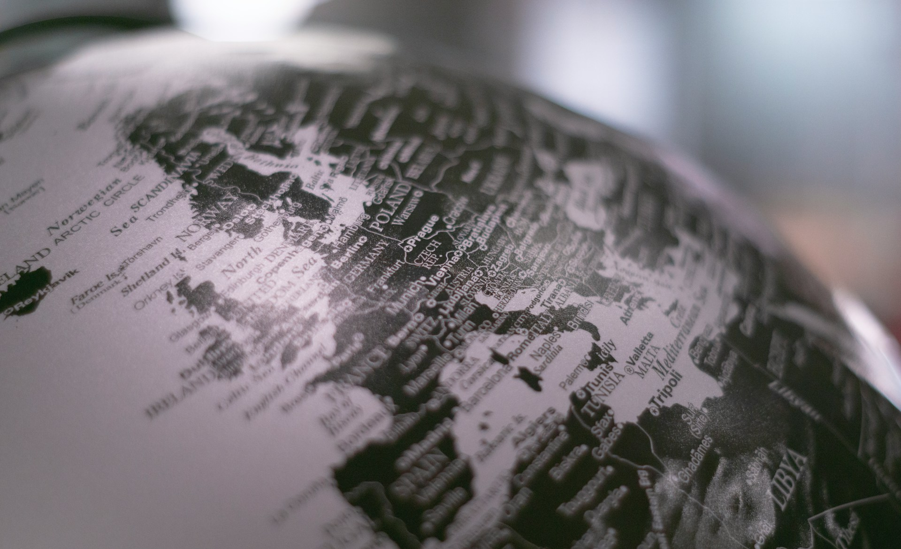

# The Unequal Freedom to Leave

2026-08-02

## The Inequality That Did Not Produce a Revolution

An economy can become more unequal without becoming proportionately more intolerable. That appears to be one of the defining contradictions of the present age. Wealth has accumulated at the top on a scale that is difficult to comprehend, yet most societies have not responded with the revolutionary movements that earlier generations might have expected.

According to the [World Inequality Report 2026](https://wir2026.wid.world/insight/global-economic-inequity/), the wealthiest 1% own approximately 37% of global wealth. The top 10% own three-quarters, while the bottom half of humanity collectively hold only 2%. In the United States, the top 1% owned 31.6% of household net worth in the first quarter of 2026, according to [Federal Reserve data](https://fred.stlouisfed.org/series/WFRBST01134). These figures describe a world in which ownership is concentrated among a small minority even as production, trade, and technological capacity continue to expand.

It is tempting to assume that such inequality must eventually cause a revolution. History presents a more complicated relationship. Severe inequality can provide the social material for rebellion, but it does not create the organization, shared identity, institutional crisis, or alternative political vision required to overturn an established order. Pre-revolutionary Russia, for example, was divided by formal class distinctions and political exclusion, but its income inequality was not necessarily greater than that of several large countries today. War, military defeat, food shortages, a collapsing state, and organized opposition transformed dissatisfaction into revolution.

Contemporary societies possess stronger administrative institutions, wider social insurance, electoral channels, and more effective systems of surveillance and control. Their populations are also divided among many identities and interests. Economic frustration may be expressed through nationalism, progressive politics, religious movements, regional resentment, anti-establishment campaigns, or hostility toward immigration. It does not gather automatically into a unified class movement.

The twentieth century also weakened the appeal of revolutionary communism as a credible alternative. Information about Stalinist repression, Mao’s Great Leap Forward and Cultural Revolution, and the Khmer Rouge is widely available. The historical record does not eliminate support for redistribution, public ownership, or democratic socialism, but it makes the violent imposition of equality much harder to present as liberation. Political anger is therefore more likely to seek higher taxes, stronger welfare systems, labor protections, or restrictions on corporate power than the abolition of private property.

The absence of revolution should not be mistaken for satisfaction. Many people believe the economic system is unfair. They may also believe that destroying it would endanger the employment, savings, pensions, homes, and public services on which their lives depend. Even people with limited wealth now possess something to lose.

Statistics about ownership reveal only one part of this social arrangement. People experience inequality through the conditions of daily life, not through a national balance sheet alone. A person may own little capital while enjoying medicine, communication, transportation, entertainment, and access to knowledge that would have been unavailable to most human beings a century ago. The contemporary order combines extreme concentration at the top with a broad, though incomplete, distribution of amenities below it.

That combination has allowed inequality to grow without making social life unbearable for everyone outside the wealthiest class. It has also changed the meaning of wealth itself.

## Cheap Abundance and Expensive Scarcity

A billionaire may own thousands of times more than an ordinary worker, but the billionaire’s smartphone is not thousands of times better. Both may use the same maps, read the same public research, watch the same films, communicate across continents, and access similar digital tools. Technology has created a form of equality in function even where ownership remains unequal.

The scale of this change is substantial. In 2025, approximately 74% of the world’s population was online. Internet use had reached 94% in high-income countries, although it remained only 23% in low-income countries, according to the [International Telecommunication Union](https://www.itu.int/itu-d/reports/statistics/2025/10/15/ff25-internet-use/). The digital divide has not disappeared, but six billion people now participate in an informational environment that did not exist within living memory.

This access extends beyond information in the narrow sense. Transportation networks, electronic payments, international education, video communication, translation tools, and global professional communities allow ordinary people to participate in activities that were once limited to political and commercial elites. Overseas travel remains inaccessible to many, but it is no longer reserved for aristocrats, diplomats, soldiers, and the very rich. A middle-class family can cross continents within a day. A student can attend an online lecture delivered from another country. A small business can communicate with foreign customers without maintaining an international office.

Access, however, is not the same as capability. Two people can open the same digital library without possessing the same time, education, language ability, mentors, confidence, credentials, or professional networks. One may use online information to make an investment or obtain a qualification. Another may understand the material but lack the capital and institutional recognition needed to act on it. Information has become abundant, while the ability to convert information into security and power remains unequally distributed.

The same division appears throughout the modern economy. Communication, entertainment, software, and many manufactured goods have become inexpensive. Housing, land, healthcare, childcare, elite education, privacy, and personal time remain costly. Some of the most visible symbols of modern life are widely available, while the foundations of a secure life have become difficult to obtain.

This creates a society of cheap abundance and expensive scarcity. A low-income worker can own a capable smartphone while being unable to afford an apartment near work. A family may stream thousands of films while worrying about medical expenses. A young professional may travel internationally but remain unable to purchase a home or imagine a secure retirement.

People can tolerate another person’s private aircraft more easily than they can tolerate the loss of their own housing, healthcare, or future. Inequality becomes politically dangerous when it reaches essential goods and blocks social mobility. The existence of inexpensive technology cannot compensate indefinitely for the disappearance of security.

Mobility occupies an uncertain position within this division. Information and transportation make the world appear reachable, but legal rights, money, and citizenship determine who can move with confidence. The physical distance between countries has diminished. Their political distance remains profound.

## The Private Foreign Ministries of Wealth

For the super-rich, international mobility is rarely spontaneous. It is professionally constructed by a growing network of lawyers, accountants, tax advisers, investment managers, fintech specialists, immigration consultants, cybersecurity experts, political-risk analysts, and family-office professionals.

These specialists do more than preserve a portfolio. They manage the relationship between a family and several sovereign states. A wealthy family may hold citizenship in one country, maintain tax residence in another, educate its children in a third, own property in several more, and place investments or intellectual property under legal entities established elsewhere. The arrangement may also include trusts, foundations, insurance structures, digital assets, succession plans, and emergency residence rights.

Managing such a system requires knowledge across disciplines that once operated more independently. Tax law now intersects with data reporting, crypto assets, artificial intelligence, sanctions, cybersecurity, inheritance, citizenship, regulatory change, and geopolitical risk. A shift in government policy can affect not only investment returns but also residency, banking access, property rights, and the legal position of future generations.

The modern family office can therefore resemble a private foreign ministry. It monitors political developments, negotiates with institutions, protects sensitive information, plans for hostile regulations, and distributes the family’s exposure across jurisdictions. The client does not become borderless. Instead, borders are reorganized into a portfolio of opportunities and risks.

This expertise has become highly valuable because wealth has grown more mobile while regulation has become more complex. A company can transfer intellectual property more easily than it can move a factory. Financial assets can cross jurisdictions electronically. Some individuals can change tax residence without abandoning their businesses or social networks. Citizenship and residence programs can provide additional options, while private aircraft and global property holdings make physical relocation less disruptive.

Yet the borderless quality of this life remains partly illusory. Wealth depends on legal systems capable of enforcing contracts, banks willing to hold assets, currencies trusted by markets, and governments able to protect property. Real estate cannot escape its physical jurisdiction. Families still need secure cities, functioning infrastructure, reliable energy, and political order.

Governments have also expanded international cooperation. The Common Reporting Standard allows tax authorities to exchange financial-account information, while the Crypto-Asset Reporting Framework is extending the same principle to digital assets. The contemporary contest is not between completely immobile states and completely free capital. It is between professionally mobile wealth and states learning to coordinate their oversight.

Even so, wealthy people encounter national boundaries from a position of extraordinary strength. They can study several jurisdictions before choosing one. They can obtain legal advice before relocating, restructure their assets before regulations take effect, and maintain alternatives if their preferred arrangement becomes unfavorable.

The poor encounter the same international system from the opposite direction. They often must move their bodies before receiving legal recognition. Instead of selecting among jurisdictions, they reach the border and ask whether any jurisdiction will accept them.

## When the Body Crosses the Border

The difference became visible in Ceuta in July 2026. Ceuta is not an island, but an autonomous Spanish city on the North African mainland. Together with Melilla, it forms the European Union’s only land border with Africa. Spain lies only a short distance away in geographical terms, while the political and economic distance is much greater.

During the crisis, reports estimated that approximately 50,000 to 60,000 people entered or attempted to enter Ceuta from Morocco in a mass movement by land and sea. Many swam around the coastal barrier or used inflatable devices. By August 1, at least 67 people had reportedly died through drowning or in the disorder surrounding the crossing. The number of people involved was [extraordinary](https://apnews.com/article/migration-spain-ceuta-morocco-d76c6dc9d2da828907a1c04e1d482bbe) for a city with a regular population of around 85,000. 

Information helped make the movement possible. Videos showed people reaching Spanish territory, while social-media posts circulated instructions and claims that the border had become easier to cross. A recent Spanish court ruling had prohibited immediate returns of people intercepted at sea without due process. Online accounts and smugglers converted that limited procedural protection into the stronger claim that those arriving by sea would be allowed to remain.

The distinction was decisive. The right to have one’s case considered is not a right to permanent residence. Spain’s Socialist government responded firmly, called the crossing a violation of sovereignty, and accelerated returns. Many of those who reached Ceuta soon discovered that they could not proceed to mainland Europe. They faced detention, removal, or an extended period of legal uncertainty.

Their decision was not driven by legal theory alone. Young Moroccans could see European wages, public services, consumer life, and professional opportunity through the same networks that carried misleading information about the border. Some had studied for years without finding work that offered a sustainable future. Others felt responsible for supporting parents, children, or extended families. Europe appeared close enough to reach and prosperous enough to justify the danger.

The scene revealed a harsher side of informational equality. The internet gives people a clearer view of opportunities they cannot legally access. It shows them how people live elsewhere, provides maps and routes, and connects them with those who have already left. Greater knowledge can reduce isolation, but it can also intensify the pain of exclusion.

Migration then divides the host society. Progressive parties emphasize human dignity, asylum obligations, family unity, and the contributions immigrants can make. Conservative parties emphasize public order, security, cultural continuity, and the government’s responsibility toward existing citizens. These concerns cannot be separated into compassion on one side and cruelty on the other. A functioning migration system must protect human beings while retaining the capacity to decide who may enter and under what conditions.

The benefits and costs are also distributed unevenly. National employers may benefit from additional workers, while particular neighborhoods experience immediate pressure on housing, schools, healthcare, transportation, and local administration. Economic gains may be broad and delayed. Social disruption is often local and visible.

Migration itself is not the failure. It can protect people from violence, reunite families, supply needed labor, and create lives that would otherwise have remained impossible. Disorder emerges when vast economic differences coexist with narrow legal pathways, misleading information, and inadequate institutions. Transportation has made the destination reachable, but political membership remains guarded.

## A Nation Sustained from Elsewhere

The Philippines presents a different form of the same movement. Migration is not an exceptional response to a sudden border opening. It has developed into an established social and economic institution supported by employment contracts, recruitment agencies, government departments, professional training, family networks, and decades of accumulated experience.

In 2025, overseas Filipinos sent approximately $35.6 billion through formal banking channels, according to the [Bangko Sentral ng Pilipinas](https://www.bsp.gov.ph/statistics/external/ofw2.aspx). The broader measure of personal remittances was equivalent to around 8.5% of Philippine GDP, based on [World Bank data](https://data.worldbank.org/country/philippines). That percentage describes the scale of remittances relative to the domestic economy, not their direct contribution to GDP. The productive work generally takes place abroad.

Their economic influence is nonetheless substantial. Remittances support household consumption, education, medical care, housing, small businesses, and retirement. They supply foreign currency, strengthen the balance of payments, reduce pressure on the peso, and provide income that is often more dependable than international investment flows. When an economic or natural disaster affects one part of the Philippines, family members abroad can send assistance directly to those in need.

This network forms a kind of human infrastructure. A single family may have a nurse in Canada, a seafarer working internationally, a domestic worker in the Middle East, and relatives permanently settled in the United States. Their combined income connects the household to several economies and distributes its risks across countries.

The visible professional class forms only part of this system. The [Philippine Statistics Authority](https://psa.gov.ph/statistics/survey/labor-and-employment/survey-overseas-filipinos) estimated that 2.19 million OFWs worked abroad in 2024, separate from the larger population of permanent emigrants. Women accounted for 57.2% of these workers, and 43.6% worked in elementary occupations. Behind the familiar image of the Filipino nurse, engineer, IT specialist, or seafarer stands a much larger population of domestic workers, cleaners, service workers, machine operators, and manual laborers.

Their contribution is often described through the language of heroism. The description reflects real sacrifice. Many OFWs accept difficult employment, limited rights, loneliness, and long periods away from their children so that their families can live more securely. At the same time, heroic language can conceal the institutional failure that made the sacrifice necessary.

A family that cannot obtain adequate education, healthcare, housing, or employment domestically may solve these problems by sending one member abroad. The household receives a private answer to needs that would otherwise become public demands. Migration transforms institutional weakness into a family strategy.

The social costs are absorbed within intimate relationships. Children grow up with a parent appearing through video calls. Grandparents or extended relatives assume childcare responsibilities. Marriages endure long separations. Professionals may accept work below their qualifications because the overseas salary still exceeds what they could earn at home. The country receives foreign exchange while families carry the emotional cost.

Skilled migration can also produce both brain drain and brain gain. International demand for Filipino nurses, for example, has encouraged people to enter nursing programs and expanded the country’s supply of trained workers. Some return with advanced knowledge, savings, and international experience. Others remain abroad, leaving Philippine hospitals and communities without enough experienced staff. The final balance depends on whether domestic institutions can retain, employ, and reward the capabilities that migration helped create.

The Philippines is not alone in depending on remittances. Mexico, Nepal, Bangladesh, Pakistan, El Salvador, and several Caribbean countries follow related patterns. The Philippine case stands out because overseas employment has become deeply institutionalized and socially expected. The country has developed extensive systems for preparing citizens to leave.

That achievement is impressive, but it raises an uncomfortable question. What happens when a country becomes more effective at exporting its people than at creating conditions in which they would choose to remain?

## Exit, Voice, and the Memory of EDSA

Albert Hirschman described two responses available to dissatisfied members of an organization or society. They can use voice to demand change, or they can exit. Migration adds a geographical form to that choice.

The OFW system gives Filipino families a practical exit from domestic economic limitations without requiring the entire household to leave. One member enters a stronger labor market and sends part of its income home. The family remains socially rooted in the Philippines while becoming economically connected to another jurisdiction.

This arrangement can weaken pressure for reform. The person most capable of organizing a business, professional association, union, or civic movement may build a career abroad instead. A household supported by foreign income becomes less dependent on domestic job creation and public services. The government receives foreign currency and reduced unemployment pressure without resolving the institutional conditions that encouraged departure.

The pattern can sustain itself across generations. Once one relative has migrated, that person provides information, contacts, temporary housing, financial assistance, and emotional reassurance to the next. Migration becomes easier for each succeeding family member. Limited domestic opportunity produces departure, departure produces remittances, remittances create stability, and stability reduces the immediate political cost of limited opportunity.

Yet exit does not always eliminate voice. Remittance-supported families may become less dependent on local political patrons, temporary assistance, or vote buying. Migrants can transmit different expectations about bureaucracy, labor rights, public transportation, healthcare, and corruption. They can finance education, civic organizations, candidates, and local businesses.

Research from the Philippines has found evidence for this more hopeful effect. One study reported that migration and remittances were positively associated with government effectiveness and human development at the provincial level. Families with independent resources could become [less vulnerable](https://journals.sagepub.com/doi/10.1177/2057891118757694) to clientelistic politics and more capable of demanding public accountability.

The political effect also depends on the destination. A migrant who participates in a functioning democracy may absorb different expectations from one working under a restrictive labor regime. Some return with stronger confidence in public institutions. Others return after experiencing discrimination, exploitation, or legal insecurity. Migration carries political ideas in several directions.

The memory of EDSA gives this relationship between exit and voice a distinctive Philippine history. The People Power Revolution of February 1986 demonstrated the extraordinary ability of Filipinos to mobilize against a regime that had lost moral and political legitimacy. Electoral fraud, economic crisis, Church leadership, organized opposition, military defection, and international pressure converged within a short period. Millions of people standing along EDSA protected defecting officials and confronted the possibility of military violence without turning the movement into armed conflict.

EDSA restored constitutional democracy and removed an authoritarian ruler. It did not fully transform the ownership of land, the dominance of political families, local patronage, state capacity, or economic concentration. Many institutions and political practices survived the change in leadership. Historical reassessments of the post-EDSA period have therefore [distinguished](https://ari.nus.edu.sg/wp-content/uploads/2018/10/201002-WPS-134.pdf) the restoration of democratic government from a deeper social and economic transformation. 

EDSA II in 2001 showed again that mass mobilization, political opposition, and the withdrawal of military support could remove a president. It also reinforced a pattern in which a governing coalition could be replaced without restructuring the system that produced recurring crises.

The Philippines therefore developed two forms of release. During acute political emergencies, people power could provide a collective reset. During ordinary economic difficulty, overseas employment could provide a private family escape. Both responses solve an immediate crisis. Neither completes the slower work of building professional political parties, reducing dynastic power, reforming campaign finance, strengthening local administration, and creating enough productive employment at home.

Japan offers a useful contrast, though not because Japanese citizens lack the ability to leave. Japanese passports, education, and financial resources make international movement relatively accessible. Emigration, however, has not become a standard household survival strategy. A Japanese family does not normally depend on one child working abroad to pay for everyone else’s education, healthcare, and daily needs. Domestic institutions have historically made staying viable.

The distinction is not between a mobile Philippines and an immobile Japan. It is between optional individual mobility and institutionalized family departure.

## The Country People Are Free to Stay In

Modern mobility does not divide humanity into people who move and people who remain. It contains a hierarchy of movement.

At the top, wealthy families purchase mobility through professional advice. They rearrange assets, residence, and citizenship before crossing a border. Skilled professionals obtain mobility through credentials valued by employers and governments. Contract workers receive conditional access tied to a particular job. Irregular migrants encounter the border through fences, patrols, detention, and the sea.

Each group responds to differences among jurisdictions. The wealthy seek favorable taxation, security, and investment conditions. Professionals seek career development. OFWs seek wages that can sustain families. Migrants approaching Ceuta seek a future that appears unavailable at home. Their motivations differ, but all reveal how strongly opportunity is organized by national location.

Globalization has not abolished sovereignty. It has changed who can manage it. For some, the nation-state becomes one option among several. For others, citizenship determines the limits of an entire life.

The broad distribution of information intensifies this inequality. People can now see opportunities beyond their legal reach. AI may extend access to analysis, translation, education, and professional assistance, but the ownership of computing infrastructure, data, platforms, and productive assets remains concentrated. Cognitive capability may spread faster than the economic power needed to use it.

Mobility can reduce hardship and prevent political violence. People who cannot find opportunity in one country may build successful lives in another. Their income can support relatives, transmit knowledge, and connect distant economies. Aging societies receive workers they need, while migrants gain possibilities their countries of origin could not provide.

The danger arises when exit becomes a substitute for development. A society can remain stable because its most dissatisfied citizens leave and its struggling families receive income from abroad. That stability may last for decades. It can also reduce the urgency of building the institutions that would make departure optional.

A fair society would not prevent people from leaving, nor would it treat migration as disloyalty. The freedom to seek a life elsewhere is part of human agency. But freedom has a different character when movement is chosen from curiosity, ambition, or love than when it is required for family survival.

The deepest measure of mobility is therefore not the number of people able to cross borders. It is the quality of the choices available before they cross. Can they remain without surrendering professional growth, economic security, or their children’s future? Can they leave without abandoning family life? Can they return without losing the value of what they learned?

The wealthy already possess this range of options. Their advisers protect the freedom to enter, leave, return, and distribute assets across jurisdictions. Extending a comparable sense of security to ordinary people does not require everyone to become rich or every border to disappear. It requires societies in which staying is no longer a form of resignation.

The freedom to leave remains valuable. The fuller freedom is to leave without necessity and to stay without fear.

Photo by [Krzysztof Hepner](https://unsplash.com/@nsx_2000?utm_source=unsplash&utm_medium=referral&utm_content=creditCopyText) on [Unsplash](https://unsplash.com/photos/grayscale-photo-of-desk-globe-TH7TW20de9s?utm_source=unsplash&utm_medium=referral&utm_content=creditCopyText)