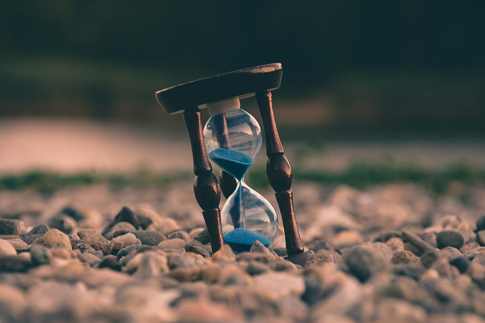

# The Voice of a Finite Life

2026-08-02

## A Stone, a Body, and a Conscious Life

A stone in front of us appears to possess a kind of permanence. We may see it today and imagine that it will remain in the same place for ten years, a hundred years, or far longer. Rain, heat, pressure, and human hands will alter it, but those changes may occur so slowly that they escape ordinary perception. The stone seems to endure without effort, awareness, or any need to preserve itself.

Much of our knowledge of the past depends on this material endurance. Ancient walls, broken pottery, inscriptions, bones, manuscripts, and tools remain after the people who made them have disappeared. Archaeology is possible because objects can outlive their makers, while history depends on traces that remain accessible when the events and lives behind them can no longer be observed directly. The past does not survive intact, but enough of it remains for later generations to recover fragments of what once existed.

Living beings exist differently. An animal cannot preserve itself by remaining unchanged. It must breathe, eat, sleep, repair its body, respond to danger, and adapt to its surroundings. Biological life continues through movement and exchange, so its apparent stability is produced by continuous activity rather than stillness.

Animals also experience the world. They feel pain, pleasure, fear, attachment, and loss. Many form strong bonds, care for their young, recognize companions, and respond to death. Human beings do not possess an exclusive right to feeling or relationship, and greater knowledge of animal life has made it harder to maintain a sharp division between an unfeeling natural world and a uniquely sensitive humanity.

Human existence, however, includes a particular form of self-awareness. We do not only live. We know that we are living, remember our earlier selves, imagine our future selves, and understand that one day there will be no future self to imagine. We can picture the world continuing without us, just as we can picture a future in which someone we love is no longer present.

This awareness gives human life a different shape because existence becomes not only a condition but also a question. We ask who we are, why we are here, how long we will remain, what will happen to the people we love, and what may survive after we leave. Such questions can be ignored for long periods, but they return through illness, aging, grief, retirement, memory, and the death of another person. They also arise during moments of beauty and gratitude, when we recognize that something precious will not remain forever.

The same consciousness that allows us to understand life exposes us to the knowledge of death. We value our existence partly because we know it is limited, and we miss the dead because our consciousness once encountered theirs. A person was present to us, shared part of the world with us, and then became absent in a way that cannot be reversed.

The word existence may apply to stones, animals, plants, buildings, documents, and human beings, but it does not describe a single mode of being. A stone persists through material endurance. An organism sustains itself through continuous activity. A human person lives while knowing that life will end, and that knowledge can become both a burden and the beginning of wisdom.

## The Hospital Where Time Divided

In August 2021, during the spread of the COVID-19 Delta variant, I developed severe pneumonia and was taken to a major hospital in Manila. The infection weakened my body to the point that breathing itself became a crisis. I spent two weeks in the hospital, and during my first days in the emergency room, I was unconscious for part of the time and [came close to death](https://tomyonashiro.com/2021/08/29/covid-19/).

What I remember from that period was not a dramatic struggle filled with panic. I was exhausted, and my body had little energy left for anything beyond survival. Yet there was also a strange calm. I remember thinking that this might be the end of my life and that I might be departing from the world. The thought did not arrive as a philosophical conclusion. It was direct and personal, an awareness that the life which had always continued from one day to the next could stop there.

It is difficult to know how much of that calm came from physical exhaustion. A body under extreme stress does not experience the world in the same way as a healthy body, and fear itself requires energy. Still, the experience felt like more than fatigue. When death became an immediate possibility, my mind seemed to release part of its effort to control what would happen.

From a distance, death can generate endless worry. We imagine pain, separation, unfinished responsibilities, and futures that will never occur. The mind creates possible scenarios and then reacts to each one, attempting to prepare for something it cannot fully understand. At the apparent edge of life, those possibilities may narrow. The future no longer feels like a field that must be managed because it may no longer belong to us.

I recovered, left the hospital, and returned to ordinary life. Survival did not remove my mortality. It returned me to the same finite condition that every person inhabits, but the experience divided time. There was the life before I believed I might die, and there was the life after I discovered that I had not. Daily routines resumed, yet they now existed alongside the knowledge that they might already have ended.

Five years later, the same hospital became connected to another story. In July 2026, my wife and I visited one of her cousins in the intensive care unit. He had developed severe pneumonia alongside kidney failure. The medical situation was serious, but when we saw him, he was awake, responsive, and looking better than we had feared.

An old action film was playing on the television in his room. He commented on how well the film had been digitally restored, and we joked about its improved picture quality. The atmosphere was not one of final farewell. We believed that he was recovering and might soon be transferred out of the ICU. A little over a week later, however, we learned that he had died around midnight.

His death changed the meaning of our visit. What had felt like an ordinary hospital conversation became our last conversation, and the joke about the movie became part of the final memory we would carry. Human beings do not always know the significance of a moment while they are living it. Meaning can arrive later, after an event has closed the possibility of repetition. A casual photograph becomes precious, a familiar voice becomes impossible to hear again, and a visit that appeared to belong to recovery becomes a farewell.

The hospital was the place where I returned from a near-death experience, but it was also the place from which this relative did not return. Medicine can describe the differences between two bodies, two illnesses, and two courses of treatment. It can identify causes, risks, complications, and probabilities, all of which are necessary for understanding what happened. Yet these explanations do not answer the personal question that grief asks: why did one person survive while another died?

There may be no answer that satisfies the person who remains. The question belongs less to medical science than to the mystery of existence itself, where causal explanations reach their limit and the unequal distribution of time continues to trouble us.

## When the Horizon Moves Closer

Young people know that death exists, but they often experience it as a distant fact. A person in their twenties may understand mortality clearly and still imagine decades of life waiting ahead. There appear to be many future stages, including work, marriage, family, achievement, travel, retirement, and old age. The future feels broad enough to contain delay.

Important conversations can happen later. Long-held desires can be pursued when circumstances improve. Relationships can be repaired after work becomes less demanding, while spiritual questions can wait until life becomes calmer. We know that time is limited, but we often live as though the supply available to us were large enough to make postponement harmless.

As we grow older, time changes its character. It does not move faster in any objective sense, but the proportion of life represented by each year becomes larger. Ten years to a twenty-year-old may feel like one part of an open future. Ten years to someone in their eighties may represent much of the time that can reasonably be expected to remain.

My mother is already in her eighties, and when I think about her life, I sometimes wonder what the future feels like from that age. Does a person plan five years ahead in the same way? Does each birthday carry a stronger awareness of survival? Does the body’s increasing vulnerability make time more valuable, or does long experience make mortality easier to accept? No single answer can represent everyone. Some older people become more anxious about death, while others become less afraid. Some continue making plans with energy and curiosity, whereas others turn inward and review their relationships and memories.

Aging does not create one universal emotional state, but it makes the limits of the body harder to ignore. The future may remain meaningful and active, yet its horizon becomes more visible. This visibility can produce fear, gratitude, urgency, resignation, or a combination of all four.

The approach of retirement creates a related shift. For decades, working life is organized by repeated cycles: another month, another quarter, another annual plan, another project, and another performance review. The structure of employment can give time an appearance of continuity, since even major changes remain contained within a professional calendar.

Retirement interrupts that rhythm. The question is no longer only what work comes next. It becomes what form life will take when the structure that governed so many years begins to recede. A career reveals itself as one chapter rather than the whole story, and the number of major chapters still available becomes easier to imagine.

This awareness can feel like a countdown, but a countdown does not need to reduce life to fear. Recognition of a limit exposes the cost of postponement. We may see more clearly which relationships need attention, which ambitions no longer deserve our energy, which conflicts should be released, and which forms of work should be completed while they remain possible.

Finitude does not automatically make a person wise. Some people become more fearful, possessive, or resentful as time narrows, while others discover a stronger capacity for gratitude and release. The difference may depend on whether the limit is experienced only as deprivation or also as an invitation to choose.

A life without limits would remove urgency. Every decision could be delayed because another opportunity would always remain. The fact that we cannot do everything gives weight to what we decide to do, and awareness of the countdown can become a more attentive way of inhabiting the time that remains.

## The Fear of a Life Taken Away

Natural death, illness, and aging confront us with the limits of the body. An imposed death introduces another kind of terror because the ending has been chosen and organized by other people. A person waiting for execution does not face only the knowledge that life will end. The time, place, and method have been decided by an institution, turning the person’s continued existence into a matter of procedure and schedule.

When the judgment is unjust, fear is joined by moral violation. History contains many people who were arrested, imprisoned, and executed because they opposed a ruler, belonged to the wrong group, held an unwanted belief, or became convenient targets for political power. Some died knowing that the official account of their lives was false and that the lie might survive them.

Their fear must have included more than fear of physical death. It may have involved loss of agency, separation from loved ones, anger at injustice, and the knowledge that the world would continue under a distorted account of what had happened. A natural death can feel cruel, but an unjust execution is also an act of domination because another authority claims the right to decide whether a person may remain alive.

Stories of people who faced execution with composure often inspire admiration. Philosophers, political prisoners, martyrs, and resistance figures are remembered for words or gestures that showed courage before death. Yet these accounts can become misleading when calmness is treated as the proper or superior way to die. Fear does not cancel courage. A person may tremble, cry, protest, or resist and still meet death with moral strength.

Terror is not evidence of failure. The body is built to protect itself, and fear of death belongs to life’s attachment to its own continuation. We should also be careful with the phrase dying well, since it can sound as though death were another performance to be managed successfully. Some people die in peace, surrounded by family and able to speak their final thoughts. Others die unconscious, confused, in pain, or without time to prepare. Their dignity does not depend on their emotional control.

To die well may have less to do with displaying calm than with being treated as a person. Truth, companionship, reconciliation, freedom from unnecessary suffering, and respect for human dignity all belong to a good death. Even when none of these conditions can be fully secured, the value of the dying person remains intact.

My own calm in the emergency room does not make me braver than someone who panics. The final hours of the relative we lost do not define the meaning of his life. The circumstances of death reveal vulnerability, injustice, love, and dependence, but they do not provide a complete measure of the person who dies.

## When Life Is Given for Another

Human beings are strongly attached to life. We protect our bodies, avoid danger, seek treatment, and make plans for the future. This attachment is not selfish by nature because life is the condition through which we love, work, remember, create, and remain connected to others.

Yet there are moments when people risk or surrender their lives for someone else. A parent enters a burning house to save a child. A person moves toward danger to protect a partner, friend, or stranger. A rescuer accepts a serious risk because another life depends on immediate action. Such courage does not arise because life has lost its value. It arises because the value of another person has become inseparable from the meaning of one’s own life.

Courage is often described as the absence of fear, but a person without fear may be unaware, reckless, or emotionally numb. Courage appears when danger is understood and action still occurs. The person sees the possible cost and decides that another obligation carries greater weight.

The distinction between sacrifice and despair is essential. A person who gives up life because it appears worthless is not in the same moral position as someone who accepts danger to save another. Both may appear to surrender life, but the inner direction is different. Despair rejects the value of existence, while courage affirms a value that the person refuses to abandon.

Human willingness to sacrifice can also be exploited. Political movements, states, extremist organizations, armies, and religious groups have often praised death in language designed to serve those who remain in power. Young people may be especially vulnerable because they want their lives to matter. They seek belonging, purpose, honor, and a cause larger than individual comfort.

These desires are not signs of weakness. They belong to some of the noblest capacities of human beings. The danger begins when an institution claims exclusive authority over them and teaches that doubt is cowardice, obedience is courage, and death is the highest proof of loyalty. Under those conditions, the person is reduced from a moral agent to an instrument, while leaders may glorify sacrifice without sharing the cost they demand of others.

Authentic courage must preserve judgment. A worthy cause can survive questions and does not need to destroy the dignity of those who refuse. It allows a person to understand the situation, consider alternatives, recognize uncertainty, and remain responsible for the decision. Sometimes courage requires entering danger. At other times it requires refusing an order, leaving a destructive community, questioning one’s own side, or rejecting the promise of glory through death.

The willingness to surrender life can be noble, but no institution should be trusted solely because it speaks convincingly about sacrifice. The courage to give oneself must remain connected to the courage to think, question, and refuse manipulation.

## What We Send Beyond Ourselves

The stone endures longer than the person who passes beside it. Buildings remain after their architects have died, books survive their authors, and photographs preserve faces after the living voice has disappeared. Human beings have always created things that can outlast them. We write, build, teach, paint, compose, raise children, establish rituals, maintain institutions, and tell stories.

These activities serve many purposes, but mortality gives them a particular depth. We know that we will leave, so creation allows something to be sent forward. This does not mean that every act of expression is a conscious attempt to defeat death. Much of what we make arises from work, curiosity, love, necessity, or pleasure. Still, the possibility of transmission is always present. A thought can enter another mind, a practice can be inherited, and a story can be repeated by someone who never met the person who first told it.

What remains is not the complete person. A book is not its author, a photograph is not the life it captures, and a building cannot restore the hands that constructed it. The dead do not continue biologically through their creations. Yet human existence can extend through influence. A way of speaking, a form of kindness, a moral conviction, a habit of attention, or a memory of laughter can enter the lives of others and become part of how they understand the world.

This continuation is not always public. Most people will not leave monuments, famous works, or historical records. Their lives may remain within a family, workplace, neighborhood, or small community. A parent’s advice may shape a child decades later. A teacher’s patience may influence students whose names the teacher no longer remembers. A friend’s compassion may become the model through which another person learns to care.

Inheritance is not limited to property or genetic descent. We inherit gestures, fears, prayers, recipes, phrases, loyalties, wounds, and hopes. Some inheritances support life, while others must be examined and transformed. Even so, they reveal that no person begins as an isolated self. Each of us receives a world already shaped by those who came before.

Grief makes this form of continuation more visible. When someone dies, the relationship does not disappear as though it never existed. It changes its mode. Conversation becomes memory, and presence becomes absence, but the absence remains connected to a person who once occupied a real place in our lives.

That final hospital visit illustrates this transformation. The old film, the restored images on the television, and the joke we shared were not planned as a legacy. No one in the room believed that the conversation required special words. Its value came from ordinary presence, but after his death, the memory became part of what he left with us.

We often imagine that a meaningful legacy must be intentionally produced. In reality, many of the things people remember were never designed to be remembered. A familiar greeting, an act of generosity, a shared meal, or a joke in a hospital room may carry more human truth than a formal statement prepared for posterity. We do not control what others will inherit from us, but we can shape the manner in which we live among them.

## The Voice Heard Through Finitude

Reflection on death does not provide a complete explanation of existence. It may lead us toward clearer questions, but it does not solve the mystery of why life exists, why one person receives many years, or why another dies young. A child may live only a few days, while another person may approach one hundred years. Genetics, illness, environment, social conditions, medical care, accidents, and chance influence the length of life, but these causes do not explain why the distribution of time feels so unequal.

Length matters. A death in the early fifties is painful in part because more years appeared possible. A child’s death is devastating because an entire future has been lost. We should not dismiss this loss by saying that duration is irrelevant, even though duration and meaning are not identical.

A person who lives for one hundred years does not necessarily live twice as deeply as someone who dies at fifty. Human life has a chronological dimension, but it also has relational and moral dimensions. Its meaning emerges through love, responsibility, presence, memory, and the ways in which one life enters another.

When we think seriously about life and death, familiar concerns begin to change scale. Status, competition, resentment, and productivity may lose part of their authority. Questions hidden beneath routine become harder to avoid: What have I loved? What have I neglected? What deserves the time that remains? What kind of person am I becoming, and what must I release?

In this state of attention, a person may sense a voice from within or from somewhere beyond the self. It may be understood as conscience, the deepest level of personal identity, the call of truth, or the presence of God. The language differs, but the experience shares a common structure. Life no longer feels like an object we own. It feels received, and because it is received, it carries a claim upon us.

The transcendent is not necessarily found by escaping the limits of life. It may become visible through those limits. Mortality breaks the illusion that we are self-sufficient and permanent. It reminds us that we entered a world already in progress, received language and care from others, and will leave the world to people who come after us.

The voice heard through finitude must still be tested. Fear can speak with authority, pride can imitate conviction, and ideology can present manipulation as destiny. A trustworthy voice does not demand that we abandon judgment or treat other people as instruments. It leads toward truthfulness, responsibility, compassion, and respect for human dignity.

For a person of faith, this discernment may occur through prayer, Scripture, tradition, community, and conscience. The voice from within and the voice from above do not need to be treated as opposites. The deepest interior part of the person may be where openness to God becomes possible, not because the self contains every answer, but because it becomes capable of receiving what exceeds it.

How well we live and how well we die remain questions without final formulas. Living well does not require constant achievement, and dying well does not require perfect serenity. Both may involve learning to receive life without pretending to possess it absolutely. We preserve life because it is valuable, while also recognizing that life gains meaning through what it serves. Love, truth, faith, responsibility, and care for others can call us beyond self-protection without making our own existence worthless.

The hospital room remains in my memory. An old film was playing, our relative was awake, and we spoke and laughed while expecting that another conversation would follow. None of us knew that the ordinary moment before us was already complete. Human beings rarely recognize the full weight of a moment while it is happening because we live forward and understand backward.

Awareness of death cannot teach us exactly when the final conversation will occur, but it can teach us to become more present in the conversations we are still able to have. A finite life does not become meaningful by escaping death. Its meaning takes form through the attention we give, the love we receive and return, the truth we are willing to face, and the traces entrusted to those who remain.

Photo by [Aron Visuals](https://unsplash.com/@aronvisuals?utm_source=unsplash&utm_medium=referral&utm_content=creditCopyText) on [Unsplash](https://unsplash.com/photos/selective-focus-photo-of-brown-and-blue-hourglass-on-stones-BXOXnQ26B7o?utm_source=unsplash&utm_medium=referral&utm_content=creditCopyText)