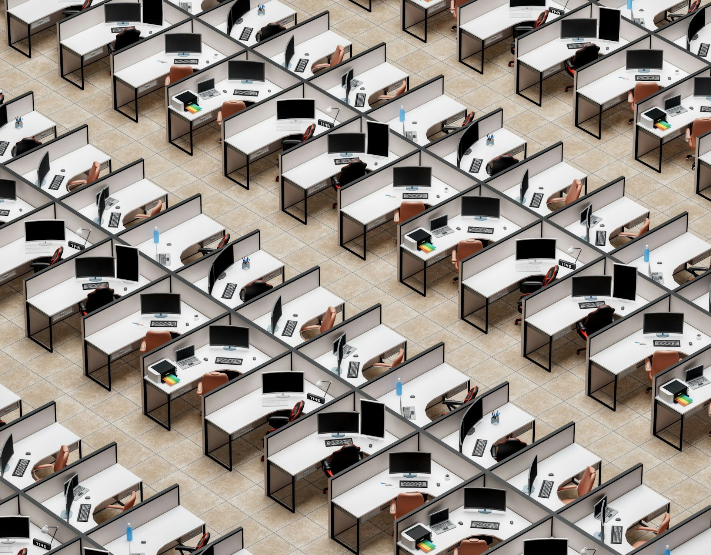

# When Knowledge No Longer Needs a Room

2026-08-10

## A Room Organized Like a Machine

The modern office began by borrowing the logic of the factory. In photographs from the early twentieth century, clerks sit in long rows at nearly identical desks. Paper moves through the room as material moves through a production line. Supervisors can see the entire floor, while senior managers occupy private offices around its edges. The arrangement tells us what the organization believed office work to be: a sequence of standardized actions performed under observation.

This was the age of scientific management. Frederick Winslow Taylor developed his methods around industrial labor, but the same impulse entered administrative life. A task could be divided, measured, assigned, and monitored. Typing, filing, bookkeeping, correspondence, and calculation were treated as separate operations. The office worker did not stand beside a machine on an assembly line, but the organization of time and attention followed a similar pattern.

Frank Lloyd Wright occupies an intriguing place in this history. His Larkin Administration Building in Buffalo, completed in 1906, placed employees within an immense central hall. More than three decades later, the Administration Building he designed for Johnson Wax opened in 1939 with its celebrated Great Workroom. These were open offices long before the term acquired its present meaning. The [Frank Lloyd Wright Foundation describes the Larkin and Johnson Wax buildings](https://franklloydwright.org/frank-lloyd-wrights-larkin-and-johnson-wax-workspaces/) as studies in the relation between the individual and the group, while [SC Johnson records the 1939 opening](https://scjohnson.com/en/news-stories/official-communications/sc-johnson-architecture) of its Administration Building.

Yet Wright's interiors were not early versions of a Silicon Valley campus. Their openness was monumental, ordered, and communal. The buildings gave administrative work architectural dignity, but they did not dissolve hierarchy or turn the office into a casual social landscape. Employees occupied a grand organizational machine. Wright showed that an open room could be beautiful, but beauty did not alter the underlying logic of collective discipline.

The comparison with factory work has never disappeared completely. Even in organizations that speak constantly about knowledge, creativity, and strategy, many employees still prepare recurring reports, transfer information between systems, process requests, update records, and guide documents through approval chains. Digital tools have replaced paper ledgers and filing cabinets, yet a substantial part of office life remains repetitive. The laptop can conceal the assembly line by placing every step behind the same screen.

Office design has always carried an interpretation of the worker. A floor of aligned desks presents the worker as a unit of production. A private room presents the worker as someone entrusted with judgment. A common table presents the worker as a collaborator. None of these descriptions is entirely false. Most office jobs contain all three forms of activity, but organizations repeatedly build as if only one of them mattered.

## The Partition as a Promise

After the Second World War, designers began to question both the rigid bullpen and the corridor lined with private rooms. In Germany, the office landscape known as *Bürolandschaft* appeared during the 1950s and 1960s. Desks were arranged in irregular groups rather than military rows, with plants, screens, and circulation paths shaping the space. The arrangement was meant to follow communication patterns and reduce the visible weight of hierarchy. An [Oxford Reference account](https://www.oxfordreference.com/view/10.1093/acref/9780198606789.001.0001/acref-9780198606789-e-744) traces the model to Eberhard and Wolfgang Schnelle in postwar Germany.

This development is a more direct ancestor of the collaborative office than Wright's great work halls. It treated communication itself as a design problem. People who needed frequent contact could be placed near one another, while the floor could change as the organization changed. Openness was no longer only a means of supervision. It was presented as a way to make information flow more naturally.

Robert Propst carried related ideas into his work for Herman Miller. He believed that office work had become mental work and that conventional desks did not support the movement, concentration, storage, and changing postures it required. The Action Office system, introduced in the 1960s, used modular components that could be assembled and rearranged. According to [Herman Miller's history of Action Office](https://www.hermanmiller.com/products/workspaces/workstations/action-office-system/design-story/), Propst wanted a workspace that could adapt as the work changed rather than imprisoning the employee in a fixed arrangement.

The cubicle grew out of this attempt. Its partitions were not originally conceived as walls of punishment. They provided visual enclosure, surfaces for information, storage within reach, and a degree of territorial control. For a person doing difficult individual work, partial separation could be a meaningful improvement over a desk exposed on every side.

Economic incentives changed the design. Modular partitions allowed companies to reconfigure a floor quickly and avoid the cost of permanent walls. They could also be placed closer together. The flexible workstation became the cubicle, and the cubicle became the cubicle farm. An idea intended to recognize the needs of knowledge workers was compressed into a method for accommodating more of them.

This reversal is one of the recurring patterns in office history. A humane concept enters the organization through the language of autonomy and flexibility. Management then discovers that the same concept can increase density, reduce fixed costs, or strengthen control. The original promise does not vanish, but it becomes subordinate to the balance sheet.

By the 1980s and 1990s, partitions defined the visual identity of the office. They gave workers some protection from constant observation, yet they rarely blocked intelligible speech. A person could disappear from view and still hear a private phone call, a managerial discussion, or a colleague's repeated conversation. The cubicle acknowledged the need for privacy without fully providing it.

## Collaboration Without Walls

Silicon Valley did not invent the open office. It supplied the open office with a new story.

The early bullpen placed people together so that their work could be standardized and supervised. The technology campus placed people together so that ideas could meet. Walls came to represent bureaucracy, secrecy, and rank. Shared tables, natural light, informal lounges, visible staircases, and recreational spaces suggested openness, equality, and invention. The office began to resemble a university campus, a studio, or a social club rather than an administrative plant.

The story was persuasive because it contained truth. Colleagues do learn through casual contact. A short conversation can reveal a problem before it grows. People from different disciplines can combine ideas that would remain separate in a formal reporting structure. Trust often develops through unplanned moments that have no meeting agenda. An organization made entirely of closed doors could limit these encounters.

Several distinct practices were nevertheless grouped beneath the attractive language of openness. An open-plan office removes most physical barriers. Hot desking removes assigned seats. Activity-based working provides different settings for different tasks, including collaborative tables, private booths, project rooms, and concentration areas. These designs are not equivalent. Activity-based working can give employees meaningful choice when every type of space exists in sufficient quantity. Hot desking on a crowded floor can remove personal control without adding any useful alternative.

Cost remained part of the attraction. Fewer enclosed rooms generally allow more people to occupy the same floor. Modular furniture is easier to change than constructed walls. Unassigned desks can reduce the total number of workstations when employees travel or work from home. These may be rational business decisions, but the language of spontaneous collaboration often makes them sound like cultural generosity.

Research has challenged the belief that visibility produces interaction. In a study of two corporate transitions to more open layouts, Ethan Bernstein and Stephen Turban found that face-to-face interaction fell by approximately 70 percent, while electronic communication increased. People placed in continuous view did not necessarily become more social. They often withdrew and used digital channels instead. The findings were published in the [Royal Society's *Philosophical Transactions B*](https://royalsocietypublishing.org/rstb/article/373/1753/20170239/30408/The-impact-of-the-open-workspace-on-human), with a summary also available through [Harvard Business School](https://www.hbs.edu/faculty/Pages/item.aspx?num=54899).

Other evidence identifies noise and lack of privacy as central sources of dissatisfaction. Jungsoo Kim and Richard de Dear found that enclosed private offices performed better than open layouts on acoustics, privacy, and related environmental measures. The positive effect of easy access to colleagues did not compensate for these losses. Their [study of the privacy-communication trade-off](https://www.sciencedirect.com/science/article/abs/pii/S0272494413000340) also found no greater satisfaction with ease of interaction among open-plan occupants than among people in private offices.

Introverts may experience the burden more strongly, but the issue is not limited to personality. Human attention responds automatically to understandable speech. A programmer tracing an error, an analyst comparing evidence, a translator weighing two phrases, or a writer constructing an argument cannot decide that the conversation at the next desk has ceased to exist. Headphones may cover the sound, but they add another layer of sensory management to work that already demands concentration.

Privacy is therefore not a luxury reserved for people who dislike social contact. It is a cognitive resource. Creativity also depends on it. Conversation supplies new material, disagreement, and correction. Solitude allows a person to absorb those encounters, connect them with prior knowledge, discard weak possibilities, and form a coherent idea. Creativity moves between contact and withdrawal. Continuous proximity protects only one side of that movement.

## The Day the Office Became Optional

The COVID-19 pandemic broke the spatial habit of office work through necessity. Organizations did not spend years designing a new philosophy and then adopt it with care. They sent people home because gathering had become dangerous. The change succeeded because much of the technical foundation already existed. Employees had laptops, broadband connections, cloud applications, virtual private networks, and platforms such as Zoom and Teams. A transition that would once have required a major technological program happened within weeks.

The early experience was difficult. Homes were not designed as universal workplaces. Some employees lacked a separate room, a reliable connection, or freedom from family responsibilities. Managers accustomed to visual supervision worried that work had disappeared because workers were no longer visible. Meetings multiplied as organizations tried to replace every informal exchange with a scheduled call.

Once the emergency phase passed, many knowledge workers recognized advantages that were hard to forget. Commuting time returned to personal life. Concentrated work became possible without the speech and movement of a shared floor. A person could shape light, temperature, sound, and breaks around the demands of the task. The office had not been exposed as useless, but it had been exposed as optional for a large portion of the working day.

Online meetings also revealed forms of participation that physical conference rooms often suppress. In a video call, each participant can occupy an equal-sized window. Chat creates a second channel for people who prefer to formulate a written response or do not want to interrupt. A document can be shared directly on every screen. Physical distance from the head of the table loses some of its meaning.

This does not guarantee democratic conversation. A manager can dominate a virtual meeting as easily as a physical one, and remote participants can be ignored when others gather in one room. Yet the medium offers more ways to enter the discussion. In a large conference room, the loudest and most confident speakers often set the rhythm. Online, a careful comment in chat can remain visible long enough to be considered.

Remote work also carries real losses. A study using communication data from 61,182 Microsoft employees found that firm-wide remote work made collaboration networks more static and siloed, with fewer connections bridging different groups. The [research published in *Nature Human Behaviour*](https://www.nature.com/articles/s41562-021-01196-4) warns against assuming that every form of organizational contact survives online without deliberate support. New employees may need closer mentoring. Complex conflict can be easier to resolve when people share a room. Friendships and weak ties often depend on encounters that no one would schedule.

Still, evidence does not support a universal return to five office days as the natural answer. A six-month randomized trial involving 1,612 Trip.com employees tested a hybrid schedule with two days at home. Job satisfaction improved, resignations fell by one-third, and researchers found no damage to performance ratings, promotions, innovation measures, or lines of code. Managers began with a negative estimate of hybrid productivity and revised it upward after the experiment. The results appeared in [*Nature* in 2024](https://www.nature.com/articles/s41586-024-07500-2).

Many companies now live inside a contradiction. They reduced office space during the pandemic and later ordered people back, only to discover too few desks, booths, and meeting rooms. Employees commute to the office and spend the day in online calls because colleagues are distributed across cities or countries. Some avoid the office on team-meeting days because joining separately produces a more equal and intelligible conversation than placing several people around one microphone in a crowded room.

The pandemic did not decide the future of work. It removed the belief that the office was the only place from which such a future could be imagined.

## A Tutor Waiting Inside the Work

Generative AI introduces another separation, one that became clear to me through an ordinary experience with a new content management system.

Our web development team had introduced the system through demonstration sessions. In an earlier period, I would have needed to follow every operation carefully, take detailed notes, and remember procedures that I had not yet used. Training occurred first, while the practical problem came later. If memory failed at that later moment, the available choices were to search a recording, consult incomplete documentation, or ask the web team to explain the same step again.

This time, I attended one demonstration and gained a general understanding of the system. When I later encountered a problem in the actual interface, I took a screenshot and showed it to an AI. The image provided the context that would have been cumbersome to describe in words. The AI could see the page, recognize the relevant controls, and guide me through the next action. I learned the system quickly without asking a specialist to leave their own work.

The experience felt revolutionary because it changed the timing of knowledge. I did not have to store every instruction in advance of an unknown need. Guidance appeared inside the work, at the moment when the explanation had an immediate object. The demonstration gave me a map. AI helped me travel through the territory.

Corporate training has often been front-loaded. Employees receive a concentrated body of information before they understand which parts will matter. They may hesitate to ask a basic question afterward, especially when the subject was already covered. The hesitation contains both embarrassment and consideration. No one wants to reveal that they forgot, and no one wants to interrupt a colleague with a question that may have an obvious answer.

AI changes that psychology. A person can ask the same question twice, request a simpler explanation, switch languages, or proceed one screen at a time. The machine does not become impatient and does not lose a period of concentration. Multimodal systems make the exchange more useful because a screenshot, error message, diagram, or document can establish a shared reference immediately.

The human demonstration still matters. It introduces the purpose of the system, the organization’s preferred process, and the vocabulary needed to ask better questions. Human specialists also remain responsible for exceptions, undocumented changes, permissions, and authoritative decisions. Their role moves away from repeating every procedural step and toward explaining the structure and resolving cases that require ownership.

For this arrangement to work, enterprise AI must have current and securely governed information. It must respect access rights, identify the documentation behind its answer, and indicate uncertainty when an interface or policy may have changed. A confident answer based on an obsolete screen can waste time or cause harm. Just-in-time learning becomes dependable only when the organization treats knowledge quality as part of the system rather than assuming that a general model knows every local fact.

Even with those limits, the change is substantial. Training no longer has to transfer a complete procedure from one person’s memory to another during a scheduled hour. It can provide orientation first and continue as an interactive layer throughout the work itself.

## From the Nearby Colleague to the Knowledge Layer

One of the most durable arguments for office presence is the value of asking people nearby. A colleague may know where the latest document is stored, who owns a process, why a decision was made, or how the organization handled a similar case. Physical proximity has functioned as an informal search engine. The answer is obtained by turning a chair or walking to another desk.

The convenience hides a transfer of cost. Every quick question for one employee is an interruption for another. The person who provides an answer may have been composing a difficult paragraph, checking a complex result, or holding several elements of a problem in working memory. The organization solves an information gap by creating an attention gap elsewhere.

An AI system connected to approved company documents, policies, project histories, meeting records, and operational tools can answer many routine questions without redirecting another person’s attention. It can locate a source, summarize earlier decisions, explain terminology, identify the team responsible, and compare a current case with previous ones. An agentic system may also prepare a form, draft a response, or carry out an authorized administrative step while leaving consequential decisions with the employee.

Early research gives this possibility empirical weight. A large study of customer-support agents found that access to a generative AI assistant increased issues resolved per hour by 15 percent on average, with larger gains among less experienced and lower-skilled workers. The researchers found evidence that the tool helped disseminate practices associated with stronger performers and supported learning over time. The peer-reviewed results appear in the [*Quarterly Journal of Economics*](https://academic.oup.com/qje/article/140/2/889/7990658).

A field experiment with 776 professionals at Procter & Gamble examined AI in product-development work. Individuals using AI performed at a level comparable to two-person teams without AI, while AI also helped participants cross some boundaries between technical and commercial expertise. The [NBER working paper, *The Cybernetic Teammate*](https://www.nber.org/papers/w33641), does not show that human teams have become unnecessary. It shows that some benefits once obtained by adding another person can now arise through interaction with a capable system.

Another six-month randomized field experiment involved 6,000 workers across multiple companies. Employees who actively used an AI tool spent three fewer hours per week on email and appeared to complete documents faster, but meeting time did not change significantly. The [study on shifting work patterns](https://www.nber.org/papers/w33795) draws an important boundary: individuals can change how they write or search on their own, while reducing meetings requires coordinated changes in organizational routines.

AI may therefore weaken the connection between access to knowledge and access to colleagues without eliminating human consultation. Information and judgment are different organizational goods. A system may retrieve the written policy, but a colleague may know why actual practice differs. It may summarize the last decision, but a manager must accept responsibility for the next one. It may identify stakeholders, but an experienced employee may understand who feels excluded, who will object, and which concern has not been written down.

Tacit knowledge, trust, moral judgment, and organizational politics do not become unimportant because a model can search documents. In some cases, AI will reveal how little the official record captures. The best arrangement may be to use AI as the first point of inquiry and people as the source of interpretation, disagreement, accountability, and care.

That order could improve human relationships at work. Specialists would receive fewer repetitive questions. New employees could gain basic orientation without waiting for someone to become available. Conversations between colleagues could begin at a higher level because the factual groundwork had already been assembled. Human attention would be reserved more often for questions worthy of it.

## The Office Must Earn Its Presence

AI does not lead naturally to the disappearance of the office. It changes what the office must provide.

An AI-enabled workplace may be acoustically incompatible with the large open floor. Employees will speak to assistants, inspect generated material, supervise several automated processes, and discuss confidential information with systems that respond in real time. A room filled with simultaneous human-to-human and human-to-AI conversations could be worse than the open office it replaces. Deep concentration will remain necessary because generated outputs require verification, comparison, and judgment.

The physical office may need more small rooms, sound-protected booths, project spaces, and secure areas. Hybrid meeting rooms should give remote participants equal access to sound, documents, and discussion. Social areas can support meals, informal contact, and encounters across teams. Large fields of identical desks will have less reason to dominate the building if much individual work can be done better elsewhere.

Home is not a universal answer. Some people lack adequate space, live with noise, or prefer a clearer boundary between employment and domestic life. Extroverted employees may gain energy from a shared environment, while others do their best thinking alone. The goal should not be to replace one compulsory layout with another. It should be to expand control over the conditions under which different kinds of work occur.

The office remains valuable for mentoring, trust-building, difficult conversations, shared rituals, and forms of discovery that benefit from physical presence. These are strong reasons to gather intentionally. They are weaker reasons for requiring everyone to sit in the same room for eight hours while performing individual tasks on a laptop. Presence gains value when it has a purpose.

There is also a darker path. Early factory-like offices made workers visible to supervisors. Remote work reduced that physical visibility, but AI can restore it through digital measurement. Software can record activity, rank output, analyze communication, and infer behavior at a scale that no manager walking across a floor could achieve. The worker may leave the office while Taylorism follows inside the laptop.

The history of Action Office offers a warning. A system designed to increase movement and autonomy became a tool for density and compression. AI developed as an assistant can also become an instrument of surveillance and control. Technology does not preserve the intention of its designers once it enters an organization with different incentives.

The longer history now forms a clear sequence. The factory office organized bodies through visibility. The cubicle organized individual work through partial enclosure. The open office promised creativity through proximity. Remote work separated productive activity from a single corporate place. AI is beginning to separate organizational knowledge from the nearby person.

This is more than another swing of the pendulum between open and closed rooms. The deeper movement concerns who controls the conditions of attention. Every universal office model has asked diverse workers to adapt themselves to one arrangement. Knowledge work resists that standardization because its tasks move between routine processing, focused thought, social interpretation, and collective decision.

The office will survive where it gives those movements a useful setting. It can become a place for encounters that deserve physical presence, supported by rooms that respect concentration and technology that connects those who are elsewhere. It loses its claim when it offers noise, crowding, and a long commute in exchange for a desk and a laptop connection already available at home.

Knowledge no longer needs a room in the way it once did. It can be reached through networks, shared through online meetings, and interpreted with the help of AI. Human beings still need one another, but that need should not be confused with permanent proximity. The future office will earn its place when it brings people together for what only people together can do.

Photo by [Igor Omilaev](https://unsplash.com/@omilaev?utm_source=unsplash&utm_medium=referral&utm_content=creditCopyText) on [Unsplash](https://unsplash.com/photos/a-room-filled-with-lots-of-desks-and-computers-_VOotpSw5nc?utm_source=unsplash&utm_medium=referral&utm_content=creditCopyText)
