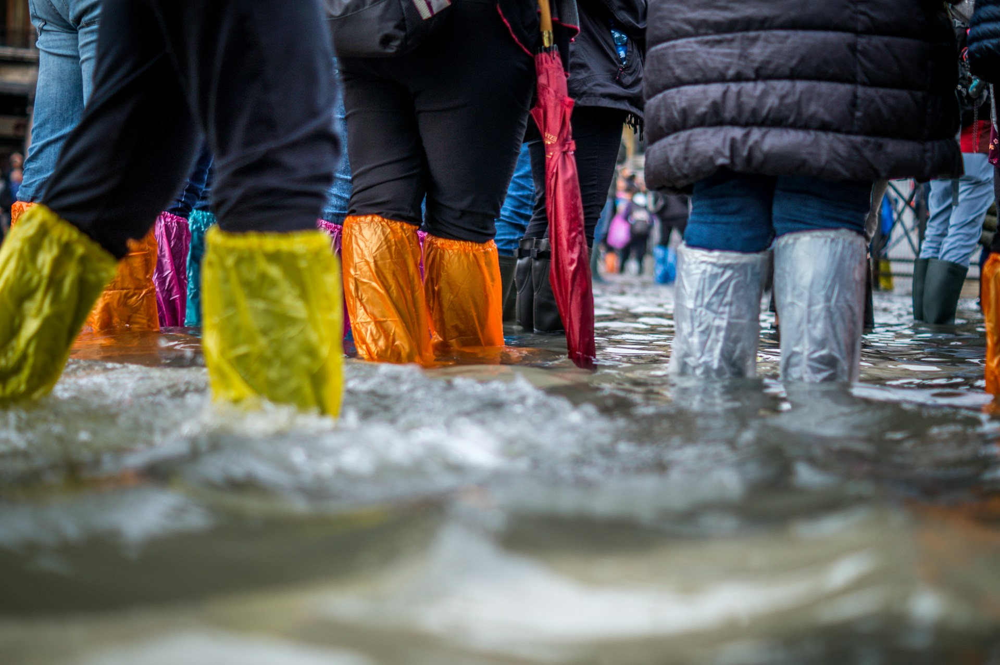

# Where the City Sends Its Water

2026-08-11

## When the Rain Reveals the City

For several days, my wife and I have stayed at home while heavy rain has continued across Metro Manila. From indoors, the scale of the disruption arrives through news reports and images: roads turned into channels, houses entered by brown water, families carrying bags and children toward public schools serving as evacuation centers. In some places, adults wade through water above their knees. Children are sometimes shown swimming in it, treating a flooded street as an unexpected playground.

There is an understandable human energy in such scenes. People adapt because they have to. Yet the water is more troubling than it appears. It may contain soil and rain, but it can also contain household wastewater, overflowing drainage, garbage, oil, animal urine, and material released from septic tanks. A street flood in a large city is not a temporary river made from rain alone.

The present flooding is extensive. [Reports from August 10, 2026](https://www.philstar.com/nation/2026/08/10/2548167/thousands-evacuated-monsoons-flood-metro) described evacuations in Quezon City, Marikina, Pasig, Muntinlupa, and other parts of the metropolis. Pasig opened evacuation centers for affected families, while hundreds of families left their homes in Marikina and Quezon City. For those of us able to remain indoors, staying home is a precaution. For people in low-lying communities, entering the water may be the only route to shelter, food, medicine, or work.

Flooding is usually discussed as a problem of rainfall and drainage. We ask whether canals were clogged, pumps were operating, rivers were dredged, or flood-control projects were completed. Those questions are necessary, but they do not reach the whole system. Another question begins beneath every house and building: where does the water go after we flush a toilet, wash dishes, take a shower, or do the laundry?

During dry weather, the answer remains out of sight. Wastewater leaves the room, and daily life continues. Heavy rain brings part of that hidden system back to the surface. Drains fill, rivers rise, septic tanks become overloaded, and the boundaries separating the home, the street, and the waterway weaken. The flood reveals not only how a city handles rain, but also how it handles what its residents send away every day.

## The Infrastructure Designed to Disappear

Sanitation is one of the achievements people notice least when it works. Clean water arrives from a tap, while used water departs through a pipe. The distance between those two events contains an enormous structure of tunnels, pumps, treatment tanks, laboratories, regulations, skilled workers, and public expenditure. Most of it is buried, enclosed, or located far from the neighborhoods it serves.

Cities did not always possess this separation. In nineteenth-century London, flush toilets sent increasing volumes of waste into cesspits and poorly organized drains. The River Thames became the city’s largest open sewer. During the Great Stink of 1858, the smell became so severe that Parliament could no longer treat sewage as a distant concern. The crisis led to Joseph Bazalgette’s intercepting sewer system, one of the century’s largest engineering projects. The [Science Museum’s history of London sanitation](https://www.sciencemuseum.org.uk/objects-and-stories/everyday-wonders/flushed-away-sewers-through-history) describes how a growing city had used its river to carry away waste until the consequences returned to its political center.

That history established a pattern repeated in many countries. Urban populations grow first. Water consumption rises, toilets become common, and paved surfaces spread. Sewerage follows later because it is expensive, disruptive, and easy to postpone. A water-supply pipe delivers an immediate and visible benefit. A sewer pipe removes something people prefer not to see. Governments therefore find it easier to expand water delivery than to build the equally important system that must receive the water after use.

Drainage and sewerage also perform different jobs. Storm drains are meant to move rainwater from streets and roofs. Sanitary sewers carry wastewater from toilets, kitchens, bathrooms, businesses, and institutions. A treatment plant receives that wastewater and reduces solids, organic pollution, pathogens, and other contaminants before the water is discharged or reused.

Some cities keep stormwater and sewage in separate networks. Others use combined systems in which rain and wastewater share part of the same infrastructure. Combined systems can work under normal conditions, but intense rain can exceed their capacity. Modern London still faces this inherited difficulty. A [2026 UK Parliament briefing](https://researchbriefings.files.parliament.uk/documents/CBP-10027/CBP-10027.pdf) explains that storm overflows release mixed rainwater and sewage to prevent the system from backing up into buildings. An engineering solution that transformed public health in one century can become inadequate as population, paved land, and rainfall conditions change.

Singapore shows another direction. Its Deep Tunnel Sewerage System collects used water through an extensive underground network and carries it by gravity toward centralized reclamation plants. The national water agency, PUB, describes the system as a [206-kilometer network for collection, treatment, reclamation, and discharge](https://www.pub.gov.sg/Professionals/Requirements/Used-Water/DTSS). It is an impressive regional comparison, but it reflects decades of coordinated land-use planning, centralized administration, and sustained investment. Metro Manila developed under different conditions, across many cities, authorities, subdivisions, private developments, and communities that expanded before metropolitan sewerage reached them.

The contrast is not evidence that one population understands cleanliness and another does not. It shows what becomes possible when sanitation is treated as a complete metropolitan service. Pipes, treatment plants, household connections, maintenance, and enforcement must operate as one chain. A missing link may remain invisible in dry weather, but polluted rivers and contaminated floods eventually reveal it.

## The River Japan Learned to Clean

Japan offers a comparison closer to the problem of domestic wastewater. Today, visitors often associate Japanese cities with clean rivers and dependable public infrastructure. That image can hide how recently some waterways were severely polluted.

The Yamato River, flowing through Nara and Osaka, is a useful example. From the 1950s onward, rapid residential development brought a large increase in population to its basin. Household water use rose faster than sewerage coverage. Kitchen water, bathwater, laundry water, and toilet waste placed a growing organic load on the river and its tributaries. Nara Prefecture has estimated that [about 70 percent of the river’s pollution burden came from household wastewater](https://www.city.kashiwara.lg.jp/docs/2021012900117/).

By 1970, the average biochemical oxygen demand, or BOD, measured at eight locations on the main river had reached 31.6 milligrams per liter. BOD indicates how much oxygen microorganisms need to break down organic matter in water. A high level means that organic pollution is consuming oxygen that fish and other aquatic life require. The Yamato had become a river in which urban growth could be measured biologically.

Its recovery took decades. Sewer networks expanded, households were encouraged to connect, regional treatment facilities were built and improved, business discharges were regulated, and combined-treatment johkasō systems were installed where public sewers were unsuitable. River facilities and community efforts also contributed, but the decisive work occurred before wastewater reached the river.

By 2015, the Yamato’s BOD had fallen to 2.6 milligrams per liter, roughly one ninth of the level recorded at the height of its pollution. Natural ayu were again observed in the river, and a river-crossing religious festival returned after a long interruption. The [Yamato River Office records this recovery](https://www.kkr.mlit.go.jp/yamato/river/suisitu/kaisenkeii.html) as the result of cooperation among national agencies, prefectures, municipalities, residents, and businesses.

The improvement corresponded with the spread of wastewater infrastructure. By fiscal year 2015, sewerage coverage in the basin had reached 86.9 percent. Authorities continued to promote household connections, properly managed johkasō, treatment-plant operation, and targeted work on tributaries where water quality remained poor. The [official account of sewerage and Yamato River water quality](https://www.kkr.mlit.go.jp/yamato/keikaku/approach/approach_03.html) makes clear that building a plant was never enough by itself. Wastewater had to be collected, carried, treated, and kept out of smaller waterways throughout the basin.

The Yamato story does not provide a ready-made design for Metro Manila. Japan had different institutions, financial resources, land arrangements, and patterns of urban government. It does establish something more fundamental. A heavily polluted urban river is not destined to remain polluted. Its condition can change when a society stops treating household wastewater as an individual matter and builds a reliable public system around it.

## The Tank Beneath the House

The word “septic tank” often creates confusion between Japan and the Philippines. Both countries use underground facilities where public sewerage is unavailable, but the modern Japanese johkasō and the conventional Philippine septic tank do not perform the same level of treatment.

A modern combined-treatment johkasō receives both toilet waste and greywater from kitchens, baths, and laundry. It uses biological processes, including aeration, to produce treated effluent. Japan’s Ministry of the Environment states that a combined johkasō can achieve [effluent with BOD of 20 milligrams per liter or less](https://www.env.go.jp/council/content/49wat-doj02/000289079.pdf), a performance intended to approach that of public sewerage for ordinary domestic wastewater.

A conventional septic tank is primarily a settling and partial digestion chamber. Solids sink, fats and lighter material rise, and bacteria break down part of the organic matter without oxygen. Liquid continues to leave the tank through an outlet, ideally toward a soil absorption field or another treatment device. The Philippine Code on Sanitation itself provides that [septic-tank effluent should enter a subsurface absorption field or receive further purification](https://lawphil.net/statutes/presdecs/pd1975/pd_856_1975.html). The tank is therefore one stage of treatment, not the entire process.

This flow pattern explains how a tank can operate for years without appearing to fill with liquid. It is not a sealed container holding every liter used by the household. Water flows through it. Sludge remains and accumulates. As the sludge layer grows, the space available for settling becomes smaller. Wastewater passes through more quickly, solids may escape with the effluent, and the tank provides less treatment.

The long service interval also explains why vacuum trucks are seen less often than the number of tanks would suggest. Proper desludging is measured in years, not weeks. Manila Water currently describes a cycle of five to seven years in unsewered areas and reports that it [desludged 133,435 septic tanks in 2024](https://reports.manilawater.com/2024/creating-shared-values/our-sustainability-approach/helping-communities-thrive/). Maynilad similarly offers residential customers outside its sewer network [cleaning at no additional charge every five to seven years](https://www.mayniladwater.com.ph/our-company/). Work is scheduled across particular barangays, and a truck may finish at a property within a short period. A resident can live among many septic tanks without often witnessing the service.

The more difficult explanation is that many tanks are not emptied according to any schedule. A [World Bank-supported study on sanitation for lower-income Philippine households](https://documents1.worldbank.org/curated/en/961481517392162731/pdf/123080-WP-PH-SanitationSummary-FINAL-Jan-2018-PUBLIC.pdf) noted that septic tanks are generally designed for desludging every three to five years, while also finding serious variation in construction. Some surveyed tanks had unsealed bottoms, inadequate walls, or no suitable outlet. [Another sector assessment](https://documents.worldbank.org/curated/en/511481468094767464/pdf/724180WSP0Box30sessment0Philippines.pdf) found that about half of respondents with their own tanks had not emptied them during the previous five years, if ever.

When such a tank does not overflow, the absence of a visible problem may indicate leakage rather than successful treatment. Liquid may be entering the soil, groundwater, a storm drain, or a nearby creek. Some owners call a private service only after toilets drain slowly, odors appear, or sewage backs up. Access can also be difficult when a tank has been built beneath a driveway, extended house, or structure without a proper opening.

Safe sanitation requires more than removing sludge from a house. The vacuum truck must carry it to a septage treatment facility. The facility must destroy pathogens and manage the remaining solids. Disposal must be monitored. If sludge is collected and then released into a canal or untreated dumping site, the pollution has only been moved.

The rare appearance of a vacuum truck therefore tells us little by itself. It may reflect a long but legitimate service interval, or a tank that has been neglected for many years. The essential questions are whether the tank is watertight, accessible, correctly sized, regularly emptied, and connected to a safe destination for its effluent.

## One Metropolis, Several Sanitation Systems

Metro Manila is often described as if it were one city, but its wastewater passes through several different urban systems. The contrast can be seen between planned business districts, older subdivisions, dense ordinary neighborhoods, and informal settlements beside rivers and drainage channels.

Public sewer coverage remains far from universal. Manila Water reported that sewerage reached [33 percent of the East Zone in 2024](https://reports.manilawater.com/2024/creating-shared-values/our-sustainability-approach/protecting-the-environment/). Its plan seeks to raise this to 88 percent by 2047, with the remaining population served through sanitation services such as septic-tank desludging. Maynilad reports that West Zone sewerage coverage rose to [36.9 percent in the first quarter of 2026](https://www.mayniladwater.com.ph/annual-reports/).

These figures require careful reading. “Wastewater coverage” or “sewerage and sanitation coverage” may combine households connected to sewer pipes with households eligible for septic-tank cleaning. A high combined percentage does not mean that the same share of wastewater travels through a sewer to a treatment plant. In much of the metropolis, the operating model remains a private tank beneath the property, periodic removal of sludge, and liquid effluent that must still go somewhere.

Large condominiums cannot depend on an ordinary household tank. A residential tower may contain hundreds or thousands of units, each producing toilet, kitchen, shower, and laundry water. Such developments generally follow one of two arrangements. They connect to a district sewer leading to a centralized sewage treatment plant, or they operate an STP dedicated to the building or development.

BGC provides an example of the first arrangement. Environmental documents for new projects state that their sewage will enter sewer lines leading to the [centralized sewage treatment plant of BGC](https://ncr.emb.gov.ph/wp-content/uploads/2024/08/ProjEct-Description_Bench-City-Center.pdf). A condominium connected to that network may still need pumps, holding tanks, grease control, and internal maintenance, but the main biological treatment occurs beyond the property.

Other condominium projects include their own STP, often in a basement, podium, parking level, or service area. Wastewater passes through screening and equalization before biological treatment. Air is supplied to microorganisms that consume organic material. Solids settle or are filtered, treated water is disinfected, and part of it may be reused for toilet flushing, landscaping, or other nonpotable purposes. Excess sludge is removed and transported for further handling.

This is a compact treatment plant, not a large septic tank. It needs electricity, blowers, pumps, operators, laboratory tests, spare parts, and a budget supported by condominium dues. A beautifully maintained lobby offers no evidence about the condition of the STP several floors below. Proper performance depends on work that residents rarely see.

There is a legal framework for these systems. Section 8 of the [Philippine Clean Water Act of 2004](https://lawphil.net/statutes/repacts/ra2004/ra_9275_2004.html) requires condominiums, subdivisions, hotels, commercial centers, hospitals, public buildings, and households to connect their existing sewage lines to an available sewerage system unless they already use their own system. Facilities that discharge regulated effluent must obtain a discharge permit, and DENR standards govern parameters such as BOD, suspended solids, and fecal coliform.

Regulation on paper does not remove the need for inspection and enforcement. An STP can be undersized, overloaded, poorly operated, or temporarily shut down to reduce electricity costs. Pumps fail, aeration equipment wears out, and population may exceed the assumptions used when the building was approved. The presence of treatment equipment is different from continuous treatment at the required standard.

Beyond these highly managed properties, sanitation becomes more fragmented. Older subdivisions may depend on tanks built decades ago. Greywater may enter street drains. Dense low-income communities may have shared toilets or communal tanks, while some homes have no space for a standard installation. Narrow paths prevent vacuum trucks from reaching the property. In riverside settlements, high groundwater and recurrent flooding can make an ordinary soil absorption system ineffective.

These communities contribute to river pollution, especially where wastewater enters a creek directly. They should not be made to carry responsibility for the metropolis as a whole. Formal houses, apartments, restaurants, offices, and commercial buildings also discharge wastewater through incomplete systems. Historical DENR estimates cited in World Bank project documents attributed [around 60 percent of the Pasig River’s pollution load to domestic discharges](https://documents1.worldbank.org/curated/en/843551468295538943/pdf/multi0page.pdf). That category extends across social classes and municipal boundaries.

Pollution from a house beside the river is visible. Pollution from a distant subdivision travels through a pipe, a drain, an estero, and a tributary before reaching the same river. The Pasig is not receiving waste only from the people who live on its banks. It is receiving the metabolic output of a metropolis.

## When the Direction of Water Reverses

During sustained rain, every weakness in this mixed system becomes more dangerous. The soil becomes saturated, rivers rise, and drainage outlets fall below the receiving water level. Water can no longer leave by gravity. Pumps must carry more than their normal load, and a power failure can remove the remaining protection.

At street level, a full drain can push water through openings and manholes. A combined or interconnected drainage route may release a mixture of stormwater and wastewater. Inside a property, pressure from outside can slow toilets or force water back through floor drains. Where nonreturn valves, sealed connections, or working pumps are absent, the direction of flow can reverse.

Septic tanks face their own form of hydraulic overload. Floodwater and rising groundwater can enter through covers, cracks, or defective walls. Added water reduces settling time and may stir accumulated sludge. Effluent escapes into already flooded surroundings, while a saturated absorption field can no longer receive more liquid. A system that provided limited treatment in dry weather may provide little effective treatment during a severe flood.

No one can determine the contents of a particular flooded street by sight alone. The concentration varies from place to place and changes as water moves. Public-health guidance therefore treats floodwater as contaminated. The [United States Centers for Disease Control and Prevention](https://www.cdc.gov/floods/safety/floodwater-after-a-disaster-or-emergency-safety.html) warns that it may contain human and animal waste, infectious organisms, household and industrial chemicals, debris, displaced animals, and electrical hazards.

In the Philippines, leptospirosis receives special attention after floods. The disease does not come from sewage alone. It is caused by bacteria carried in the urine of infected animals, especially rodents, which can contaminate water and mud. Infection can occur through cuts, softened skin, or the eyes, nose, and mouth. Swimming increases contact and makes ingestion or exposure of mucous membranes more likely.

The Department of Health has responded to the August 2026 flooding by directing public hospitals to establish leptospirosis fast lanes and maintain supplies for medically supervised prophylaxis. Its warning also covers waterborne disease, respiratory illness in crowded shelters, and dengue after standing water creates mosquito breeding sites. [Current DOH guidance](https://tribune.net.ph/2026/08/06/doh-orders-leptospirosis-fast-lanes-in-public-hospitals) advises people to avoid wading or swimming, use rubber boots when exposure cannot be avoided, wash promptly with soap and clean water, and seek medical assessment after significant exposure. Preventive antibiotics should not be taken without a prescription.

The risk is not distributed evenly. A family on an upper floor in a modern condominium can remain inside while pumps and building staff manage the water below. A family in a single-level house beside a creek may need to leave before the water reaches the beds. Residents may cross a flooded road because the evacuation center, pharmacy, or place of work lies on the other side. Protective boots are useful only if people possess them, receive warning in time, and have a safer destination.

Images of children swimming in floodwater are sometimes presented as evidence of Filipino cheerfulness and resilience. They can also be read as evidence of unequal exposure. The children did not create the drainage network, decide the location of treatment plants, approve buildings, or determine the reach of sewer pipes. They inherit the water produced by all of those decisions.

Flooding therefore converts an environmental problem into immediate bodily contact. River pollution can remain distant from daily life, especially for people who live behind walls or travel in vehicles. Once contaminated water enters streets and homes, the river is no longer somewhere else. The city is standing in it.

## A River Is Cleaned Far from Its Banks

Metro Manila needs more sewage treatment capacity, but a treatment plant cannot clean water that never reaches it. Collection pipes must extend through neighborhoods. Buildings and households must connect. Pumps need backup power. Septic tanks outside sewered areas must be watertight, accessible, and emptied on a predictable schedule. The collected septage must arrive at a functioning treatment facility rather than another informal disposal point.

No single technology will fit the entire metropolis. Dense planned districts can support centralized sewer networks and large treatment plants. Condominium clusters can use district systems or properly regulated private STPs. Established communities beyond the immediate reach of sewer construction may need communal or decentralized treatment. Lower-density areas can continue using septic tanks, but only as part of a managed service chain rather than as forgotten chambers under private land.

Informal settlements require solutions designed for their actual physical and social conditions. A standard tank that needs space and truck access cannot be imposed where neither exists. Shared sanitation, small-footprint treatment, scheduled collection points, secure access, and community-based operation may offer workable stages while housing and land questions are addressed. Removing residents from one riverbank without providing safe sanitation at the relocation site transfers both hardship and pollution.

The distinction between drainage and sewage also needs greater protection. Where full separation is technically possible, rainwater should not consume the capacity needed for wastewater. Where Metro Manila continues to use combined or interceptor-based arrangements, facilities must be designed for local rainfall, maintained before the wet season, and monitored during overflow events. Flood control and sanitation cannot remain separate administrative conversations when the same water occupies the same channels.

Japan’s Yamato River shows what long-term source control can accomplish. Singapore shows the value of treating used water as a metropolitan resource that must be collected and reclaimed through a coordinated system. Neither case can be copied without regard for Metro Manila’s history, finances, density, governance, and inequality. Both reveal the length of commitment required. Rivers improve when infrastructure survives election cycles, maintenance receives the same attention as construction, and responsibility extends from the household connection to the final discharge.

The rain outside will eventually stop. Roads will dry, evacuees will return, and the ordinary invisibility of wastewater will be restored. That return to normal should not be confused with the disappearance of the problem. The drains will still lead somewhere. The tanks beneath houses will continue to receive waste. Treatment plants will keep operating, or failing to operate, beyond public view. The Pasig River will continue to collect the result.

A city declares whose health it values through the systems it builds beneath everyone’s feet. Safe sanitation is not a favor given to selected districts, and river recovery is not achieved by removing visible waste from the water’s edge. It begins when the path taken by every household’s wastewater becomes a shared public concern. The flood brings that path into view. What remains after the water recedes is the decision to change it.

Photo by [Jonathan Ford](https://unsplash.com/@jonfordphotos?utm_source=unsplash&utm_medium=referral&utm_content=creditCopyText) on [Unsplash](https://unsplash.com/photos/people-wearing-boots-6ZgTEtvD16I?utm_source=unsplash&utm_medium=referral&utm_content=creditCopyText)
