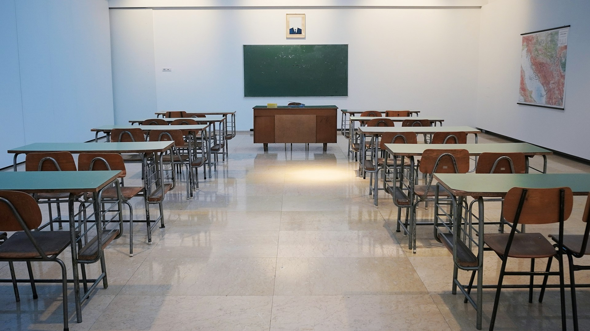

# Education After Information Scarcity

2026-08-12

## The Institution That Outlived Its World

Enter a classroom in almost any country and its basic structure will be immediately recognizable. Students of similar ages occupy the same room. A teacher stands before them. Lessons begin and end according to a fixed timetable. Attendance is recorded, movement is regulated, and progress is measured through assignments and examinations. Screens may have replaced blackboards, digital platforms may supplement textbooks, and students may submit their work online, but the institutional arrangement remains remarkably stable.

This structure belongs to a particular history. Modern mass schooling developed alongside the nation-state, industrialization, administrative bureaucracy, and the spread of public literacy. Governments needed populations capable of reading official documents, performing basic calculations, participating in national economies, and understanding themselves as members of a common political community. Schools also served religious, democratic, cultural, and social purposes that differed across countries and historical periods.

It would therefore be too narrow to say that public education was invented exclusively to create soldiers and factory workers. Historical research shows a more complicated formation. British and Danish policymakers, for example, developed education in response to different combinations of [nation-building, industrialization, and democratization](https://www.cambridge.org/core/books/education-for-all/culture-and-the-politics-of-comparative-education-policy/C95E177DA12D86F57431B3A62F745B6B). Other studies have connected the expansion of national schooling with state formation, territorial insecurity, linguistic unity, and the cultivation of citizenship.

Yet the familiar criticism of the factory school contains an important truth. Modern institutions faced the common challenge of organizing large numbers of people. Armies, factories, bureaucracies, prisons, and schools all developed methods for making human activity visible, measurable, synchronized, and manageable. Time was divided into units. People were classified into groups. Performance was recorded. Advancement depended on compliance with established requirements.

The school inherited this institutional grammar. Students were arranged by age, placed within standardized curricula, and moved through predetermined stages. Bells governed time. Examinations converted learning into scores. Certificates made achievement legible to employers and governments. The system enabled education to reach millions of people, but it also defined the educated person through the ability to succeed within a regulated sequence.

Michel Foucault helps us understand this arrangement without turning it into a moral accusation against individual teachers. A teacher is not personally equivalent to a prison guard. Most teachers enter their profession because they care about students and believe in the value of learning. Structurally, however, the institution assigns them disciplinary responsibilities. They record attendance, control movement, administer examinations, rank performance, and report deviations from expected behavior.

A compassionate teacher can create freedom within this arrangement, but cannot entirely escape its demands. The teacher must inspire students while keeping them on schedule. The teacher must respect individual differences while delivering a common curriculum. The teacher must encourage intellectual risk while assigning grades that determine future opportunities. Many of the frustrations experienced by teachers arise from these conflicting obligations rather than from a lack of commitment.

Schools have never been places of discipline alone. They have given children access to books unavailable at home, introduced them to people beyond their families, and allowed abilities to be recognized across differences of wealth and social position. Public education remains one of the great democratic achievements of modern society. The institution contains both regulation and emancipation, often within the same classroom.

The world surrounding that classroom has changed, however. Factory labor has declined as a proportion of employment in many economies, while clerical and knowledge work have expanded. Yet much of this work has preserved the logic of the factory. Employees process documents, transfer information between systems, prepare recurring reports, answer standardized requests, and follow workflows designed by others. The work is less physical, but it remains repetitive, scheduled, and closely supervised.

AI is beginning to perform precisely these forms of information processing. As routine knowledge work becomes automated, the educational system faces a contradiction it can no longer postpone. It continues to prepare people for disciplined information handling at the moment when machines are becoming highly capable information handlers.

## When the Product Stopped Proving the Process

For generations, education relied on a practical assumption: the visible product provided evidence of the invisible learning process. A student who submitted a coherent essay was presumed to have read, reflected, organized ideas, and expressed a conclusion. A thesis represented months or years of research because producing one required sustained intellectual labor.

The arrangement was never perfect. Students could receive excessive help, imitate existing work, or memorize material without understanding it. Still, the cost of producing a substantial academic work made it a reasonable indicator of effort and knowledge. The finished product could stand as a proxy for the intellectual process behind it.

Generative AI has broken that relationship. A student can now produce a grammatically polished essay, literature review, research proposal, or presentation within a short period. The output may contain persuasive arguments and extensive references even when the student has not developed a corresponding understanding of the subject.

The written product remains valuable, but it no longer proves who formulated the question, selected the evidence, recognized the contradictions, or made the final intellectual decisions. The quality of the artifact and the development of the person can now diverge sharply.

Schools and universities have responded by attempting to preserve the old relationship. Some prohibit AI. Others require students to declare its use, employ detection systems, return to supervised examinations, or examine document histories for evidence of human authorship. Teachers are asked to distinguish assisted work from independent work, while students are required to prove that their language is genuinely their own.

This response creates an atmosphere of mutual suspicion. A student who writes unusually well may become an object of investigation. A teacher may spend more time policing production than discussing ideas. Institutions may trust probabilistic detection systems more than the relationships between teachers and students. Research into AI text detectors has repeatedly raised concerns about false positives, false negatives, and poor performance when generated text has been revised or translated.

The deeper weakness lies in the assessment model itself. AI has not made achievement meaningless. It has made many inherited indicators of achievement unreliable. A completed essay can no longer carry the full burden of proving that learning occurred.

Higher education authorities have started recognizing this distinction. Australian experts contributing to [assessment reform resources published by TEQSA](https://www.teqsa.gov.au/sites/default/files/2025-09/enacting-assessment-reform-in-a-time-of-artificial-intelligence.pdf) have argued that institutions need to assure learning outcomes through redesigned assessment rather than depend on formulaic technical solutions. The challenge is not to recover a world in which students had no access to intelligent tools. It is to make learning visible under conditions in which those tools are already present.

A more meaningful question begins to appear. Instead of asking whether every sentence originated without assistance, we can ask whether the student can take intellectual responsibility for the work.

Can the student explain the central argument without reading from the paper? Can the student identify its weakest assumption, justify the selection of evidence, and respond to an objection that was not anticipated? Can the student distinguish an AI-generated suggestion from a judgment personally accepted? Can the argument be applied to a new situation? Can the student revise it when presented with stronger evidence?

Someone who can do these things has acquired a meaningful form of intellectual ownership, even if AI participated in the research and writing. Someone who cannot do them has not yet made the work their own, even if every word was typed manually.

Assessment would then move beyond inspecting products and begin examining relationships among the student, the subject, the evidence, the tools, and the intellectual community. The essay or thesis would remain important, but it would become one part of a larger process of inquiry, defense, criticism, and revision.

## What Knowledge Must Become Within Us

The abundance of external information does not eliminate the need for knowledge within the person. In some respects, internal knowledge becomes more valuable when machines can produce unlimited answers.

A person who knows little about a subject cannot reliably evaluate an AI response about it. The answer may contain invented sources, confused concepts, outdated assumptions, or subtle distortions. Without a developed intellectual foundation, fluency can easily be mistaken for accuracy. The user becomes dependent on the system that was meant to provide assistance.

This is where the difference between memorization and internalization becomes essential. Memorization often treats knowledge as material to be retained for an examination and discarded afterward. Internalization occurs when facts, concepts, relationships, and methods become part of a person’s capacity to perceive and think.

Internalized knowledge changes the questions a person can ask. It allows patterns to be recognized before they are explicitly identified. It provides a basis for noticing when an explanation does not fit the evidence. It makes sustained conversation possible because the participants are not consulting an external source for every concept they encounter.

Critical thinking also depends on subject knowledge. It cannot be taught entirely as a general skill detached from history, science, philosophy, medicine, engineering, or any other field. [Research summarized by cognitive psychologist Daniel Willingham](https://www.danielwillingham.com/uploads/5/0/0/7/5007325/willingham_2019_nsw_critical_thinking2.pdf) emphasizes that people think critically by drawing upon relevant knowledge and learning how forms of reasoning operate within particular domains.

Education after information scarcity cannot therefore abandon memory, reading, practice, or independent thought. Students will still need to learn vocabulary, historical relationships, mathematical principles, scientific concepts, and established methods. They will need periods in which they struggle with a problem before asking AI to solve it.

The purpose of that struggle is not to preserve difficulty for its own sake. Writing, calculation, recall, and problem-solving help form cognitive capacities. When every demanding step is transferred to a machine, the student may receive a superior product while losing the activity through which understanding would have developed.

The [OECD Digital Education Outlook 2026](https://www.oecd.org/en/publications/oecd-digital-education-outlook-2026_062a7394-en.html) makes this distinction directly. Generative AI can enrich learning, but it should not replace cognitive effort or weaken the human relationships at the center of education. Students need to learn without AI, with educational AI, and eventually with powerful general-purpose systems.

The sequence matters. A learner should not be permanently isolated from advanced tools, but neither should those tools arrive before the learner has developed any basis for judging them. AI should enter education as a partner whose contributions can be examined, challenged, and placed within a wider intellectual process.

Knowledge is no longer internalized primarily so that a student can reproduce the correct answer on demand. It becomes the ground from which a person interprets, judges, converses, creates, and assumes responsibility. Information may be obtained from anywhere, but intellectual agency must still be formed within someone.

## The Return of Dialogue

Once information becomes abundant, the most valuable educational event is no longer the delivery of content. It is the encounter between minds.

A student can already begin an investigation through books, recorded lectures, digital archives, databases, and AI systems. An AI tutor can explain an unfamiliar concept repeatedly without impatience. It can compare theories, propose counterarguments, recommend search terms, and help a learner articulate an initial position. These capabilities can make serious inquiry available to people who previously lacked access to specialized instruction.

Such preparation should lead toward human dialogue rather than replacing it. A conversation with a professor, mentor, or group of students introduces forms of responsibility that an automated exchange cannot fully reproduce. Another person does not only answer. That person listens, interprets hesitation, remembers previous conversations, recognizes changes in thought, and asks questions shaped by an ongoing relationship.

A professor’s value would no longer rest mainly on possessing information that students cannot find elsewhere. The professor would become an interlocutor, mentor, diagnostician, editor, and convener of an intellectual community. Experience would allow the professor to recognize when confidence conceals confusion, when a promising intuition needs stronger language, or when an apparently original claim has already been examined within a longer tradition.

The students would also educate one another. In a serious seminar, they encounter people who have read the same material and reached different conclusions. They learn that disagreement is not always evidence of ignorance or hostility. They must clarify ambiguous claims, separate objections from personal attacks, and revise positions without treating revision as humiliation.

This form of learning cannot be reduced to conversational performance. Dialogue requires preparation. Participants need enough internalized knowledge to follow the discussion, enough sincerity to admit uncertainty, and enough discipline to remain with a difficult question. The seminar cannot succeed if everyone arrives with generated talking points that nobody has examined.

Written work would continue to play a major role. Students, teachers, and professors could all use AI openly to conduct research, explore interpretations, organize sources, and improve expression. Instead of concealing this partnership, they could make it part of the intellectual record.

A student might present the original question, describe how it changed during research, identify which sources influenced the argument, disclose how AI was used, and explain which machine suggestions were rejected. The finished essay could then be followed by an oral defense, peer discussion, application to a new case, and revision.

Evaluation would become both more demanding and more humane. It would be harder to hide behind polished language because the student would need to inhabit the argument. At the same time, students would no longer be judged solely through one examination, one writing style, or one moment of performance. Their development could appear across conversation, practice, creation, response, and reflection.

The standard would shift from unaided production to answerability. Intellectual ownership would mean being able to explain how a judgment was reached, defend it provisionally, acknowledge assistance, and accept responsibility for its consequences.

## Mass Access Without Mass Standardization

A future centered on small seminars, individual mentorship, and open inquiry may sound like a return to education for a privileged minority. That danger must be taken seriously.

Mass education achieved something historically extraordinary. It extended literacy and formal learning beyond aristocratic, religious, and wealthy communities. It gave millions of children access to knowledge, public institutions, credentials, and possibilities that their families could not have provided alone.

Its standardization was partly a response to scale. Governments needed to educate large populations with limited resources. Common curricula, age-based groups, and standardized examinations offered administratively workable ways to distribute instruction and certify achievement.

The democratic achievement of universal education should be preserved. What can be rejected is the assumption that universal access requires identical educational experiences. Equal dignity does not demand that every learner receive the same explanation, proceed at the same speed, or demonstrate understanding through the same format.

The better goal is mass access without mass standardization.

AI could support this goal by providing individualized explanations, translation, practice, and feedback. A learner who needs additional time with a mathematical concept could receive it without delaying the entire class. Another who has already mastered the concept could move toward a more difficult application. Students could investigate interests that a single teacher responsible for a large class could never support individually.

Human attention could then be concentrated where it has the greatest value: mentorship, discussion, emotional support, collaborative work, ethical judgment, and the recognition of each learner as a person. AI would handle part of the informational abundance so that teachers could devote more of themselves to relationships and intellectual formation.

This possibility also contains a severe risk. Affluent students could receive excellent human mentors, intimate seminars, travel, laboratories, and cultural experiences, while disadvantaged students are given inexpensive automated instruction. A chatbot could be presented as democratization even as meaningful human education becomes more exclusive.

Equity therefore cannot be measured by access to software alone. Every student needs access to capable teachers, safe learning environments, books, technology, peers, physical activity, and opportunities to participate in a larger intellectual and civic community. AI should increase the reach of human education rather than justify its withdrawal from people with fewer resources.

The degree of transformation will also differ by age. Universities, graduate schools, professional programs, and adult education may move most rapidly toward self-directed research and dialogue. Younger children need stable routines, embodied activity, play, care, and sustained relationships with adults. They learn through imitation and participation as well as explanation.

Schools also provide functions that are easy to overlook when education is described as knowledge transfer. They offer meals, safety, friendship, social recognition, and encounters across differences of family and background. For many children, school is the first public world they enter. That world should be renewed, not dissolved into isolated online learning.

Vocational education deserves equal attention. A nurse, carpenter, mechanic, farmer, laboratory technician, or cybersecurity analyst learns through a combination of knowledge, observation, bodily practice, correction, and judgment. Apprenticeships, studios, clinics, and workshops already reveal how learning can be organized around participation rather than information delivery.

Practical education need not remain the traditional branch while intellectual education is transformed. The workshop and seminar belong to the same future. Both make understanding visible through action, dialogue, correction, and increasing responsibility.

## The Two Futures Hidden Inside AI

AI does not carry one predetermined educational future. The same technology can support liberation or expand control.

In one direction, AI could make the disciplinary school more powerful. Cameras and behavioral systems could monitor attention. Platforms could record every response, calculate predicted performance, identify deviations, and assign interventions automatically. Students could be measured more continuously than any teacher could manage alone.

Such systems might improve administrative efficiency while narrowing the meaning of education. A student would become a stream of behavioral data. Curiosity that falls outside the curriculum might be classified as distraction. Unusual development could be treated as deviation from a predicted path.

Teachers would also be transformed. They might receive dashboards containing extensive information about students while spending less time speaking with them. Professional judgment could be displaced by automated recommendations. The institution would know more data about the learner while knowing less about the person.

This would fulfill the disciplinary possibilities identified by Foucault on a scale that earlier institutions could not achieve. Surveillance would no longer require a guard watching every room. It could be embedded in the educational environment, operating continuously and presenting itself as personalization.

Another direction remains possible. AI could reduce administrative burdens, expand access to intellectual resources, support students with different needs, and release teachers from repetitive tasks. It could help individuals investigate questions that no standardized curriculum anticipated. It could connect learners across languages and geographic boundaries.

The difference will not be determined by technical capability. It will depend on political decisions, educational values, institutional design, and public commitment. Societies must decide whether efficiency serves human formation or whether students and teachers are reorganized to serve efficient systems.

Commercial power adds another concern. When a small number of technology companies mediate access to knowledge, student data, writing, research, and assessment, educational dependence can deepen even while information becomes easier to obtain. The apparent democratization of knowledge may coexist with a new concentration of authority.

A responsible system will require privacy protections, transparent policies, plural sources of knowledge, public accountability, and meaningful alternatives. [UNESCO’s guidance on generative AI in education](https://www.unesco.org/en/articles/guidance-generative-ai-education-and-research) emphasizes human-centered and age-appropriate use, together with attention to privacy, inclusion, cultural diversity, and human agency. These are not secondary safeguards. They determine the kind of educational world AI will help create.

Technological change creates an opening, but an opening is not a destination. The transformation toward a humane educational system will require deliberate choices, public investment, capable teachers, smaller intellectual communities, and a willingness to reconsider the social meaning of examinations and credentials.

## The Civilization Formed in the Classroom

Education is never confined to the transfer of subject matter. Through its daily organization, a school teaches students what knowledge is, who may speak, how authority operates, what disagreement means, and how achievement is recognized.

A classroom organized around obedience, repetition, competition, and correct performance prepares people for one kind of society. A classroom organized around inquiry, dialogue, intellectual courage, and responsibility prepares them for another.

The effects extend into politics and democracy. Citizens do not need extensive expertise in every public issue. They do need the capacity to recognize the limits of their knowledge, examine the credibility of sources, distinguish evidence from assertion, listen to serious objections, and revise their views when necessary.

These habits can be described through two connected virtues: intellectual sincerity and epistemic responsibility.

Intellectual sincerity is the honest desire to understand. It resists the temptation to perform intelligence for grades, credentials, status, or public approval. A sincere learner does not ask only which answer will be rewarded, but which account is most faithful to the evidence and experience under consideration.

Epistemic responsibility gives that desire a public and ethical form. It requires people to examine sources, disclose relevant assistance, acknowledge uncertainty, represent opposing views fairly, and accept accountability for the claims they communicate. It also requires a willingness to change one’s mind when the reasons for doing so become stronger than the reasons for remaining unchanged.

Sincerity without responsibility can become confident error. Responsibility without sincerity can become procedural compliance. Together, they allow knowledge to become a shared human practice rather than a possession displayed for advantage.

A society formed by these habits would not be free from disagreement. Its disagreements might remain profound because people begin from different experiences, traditions, values, and interpretations. The difference would lie in how disagreement is conducted.

People would be expected to explain why they believe something, indicate the evidence supporting it, recognize uncertainty, and describe what could lead them to reconsider. Political discussion would become less dependent on identity, repetition, rhetorical aggression, and displays of certainty. Democratic participation would involve responsibility for knowing, not only freedom of expression.

Contemporary political disorder cannot be explained by a shortage of information. Humanity already possesses an unprecedented abundance of facts, commentary, images, arguments, and interpretations. The deeper difficulty lies in judging, organizing, and taking responsibility for them.

AI will intensify this condition. It can generate persuasive language, synthetic images, personalized propaganda, false evidence, and unlimited commentary at negligible cost. The ability to retrieve information will offer little protection if citizens lack the intellectual formation needed to evaluate it.

Education therefore belongs at the center of the civilizational response to AI. Its role is not limited to preparing people for new jobs or teaching them how to operate advanced systems. It must help form people capable of remaining intellectually free while working with tools more knowledgeable and rhetorically capable than any previous technology.

The school of the future should be less like a factory and more like a network of seminars, studios, laboratories, workshops, libraries, and intellectual communities. Students would acquire foundational knowledge, pursue questions with AI and other research tools, create substantial work, defend their judgments, and revise their thinking through encounters with others.

Teachers would remain essential, but their authority would rest less on controlling information. They would cultivate attention, judgment, discipline, courage, and conversation. They would help students become answerable for what they know and for what they do with knowledge.

Education after information scarcity should no longer be organized primarily around controlling access to information and inspecting how much of it students can reproduce. Its deeper task is to cultivate responsibility for knowledge.

AI does not make education unnecessary. It forces education to become what it has always claimed to be: the formation of persons capable of knowledge, judgment, dialogue, and responsible participation in a shared world.

Photo by [Ivan Aleksic](https://unsplash.com/@ivalex?utm_source=unsplash&utm_medium=referral&utm_content=creditCopyText) on [Unsplash](https://unsplash.com/photos/empty-classroom-with-desks-and-chalkboard-PDRFeeDniCk?utm_source=unsplash&utm_medium=referral&utm_content=creditCopyText)