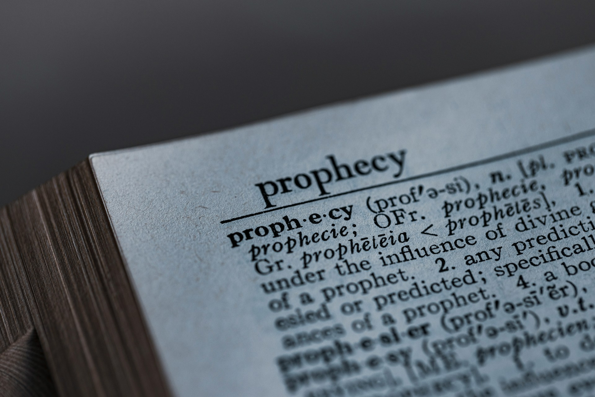

# The World That Continued

2026-08-13

## The Book on My Father’s Shelf

When I was young, I found a book on my father’s shelf that frightened me more than any work of fiction. It was Ben Goto’s *The Prophecies of Nostradamus*. The book claimed that humanity would face destruction in July 1999, when a “great king of terror” would descend from the sky.

I was still a child or young teenager. Adults seemed to know much more about the world than I did, and a book owned by my father carried the authority of that adult world. I did not yet understand how prophecies were interpreted, how publishers selected dramatic subjects, or how ambiguous language could be given a meaning far more definite than the original text supported. I saw a date and a prediction. I believed that my future might stop there.

The fear was deeply personal. If the world ended in 1999, I might never grow old. I might not have a career, marry, establish a home, or discover what kind of person I could become. Childhood usually looks toward an open future, but this prophecy placed a wall across mine. The years ahead appeared to have a fixed limit determined by someone who had lived centuries before my birth.

My experience was shared by many Japanese people of my generation. Goto’s book was not a marginal publication circulating within a small religious community. Released in 1973, it sold more than 2.5 million copies and became one of Japan’s defining postwar bestsellers. It led to sequels, television programs, magazine features, comics, and a 1974 disaster film. According to the [interview republished after Goto’s death](https://bunshun.jp/articles/-/39135?page=1), the book helped make the prophecy part of everyday Japanese culture.

Nostradamus was already known outside Japan. Michel de Nostredame, a sixteenth-century French physician and astrologer, had published hundreds of obscure four-line verses that later readers connected to wars, revolutions, assassinations, and natural disasters. His fame became global because the language of the verses was broad enough to invite new interpretations after each major event. Yet the Japanese reception was unusually intense. Goto gave one verse a specific historical setting and presented 1999 as the possible end of humanity.

For a child, there was little difference between what Nostradamus had written and what a modern author said he meant. The interpretation became the prophecy itself. Repetition then transformed the interpretation into common knowledge. When the same prediction appeared in books, magazines, television programs, and adult conversations, familiarity began to resemble confirmation.

Looking back, I do not think Goto created the fear by himself. He found a society already prepared to receive it. His book gathered the anxieties of the period, placed them inside a single story, and gave them a date. If Nostradamus had not occupied that role, another figure or theory might have done so. The success of the book tells us as much about the final decades of the twentieth century as it does about a French astrologer who died in 1566.

## A Date for an Age of Anxiety

The world in which Goto’s book became a bestseller had strong reasons to worry about the future. The Second World War remained within living memory, and the atomic bomb had shown that human beings could create destruction on a previously unimaginable scale. The Cold War then turned that possibility into a permanent condition of international life.

The United States and the Soviet Union accumulated enough nuclear weapons to destroy cities, governments, economies, and ecosystems across the planet. The fear was not based on ancient symbolism alone. Nuclear war could begin through political escalation, technological failure, human error, or a misunderstanding between leaders. Children learned that a decision made far away could end their lives before they understood the conflict that produced it.

The Cold War gave apocalyptic imagination a material foundation. Religious stories had long described fire descending from the sky, but intercontinental missiles could now carry nuclear warheads across oceans. The ancient image and the modern weapon reinforced each other. A verse written in the sixteenth century could appear to describe a twentieth-century danger because the period itself had acquired an apocalyptic character.

Environmental anxiety developed beside the nuclear threat. Japan had experienced the human cost of rapid industrialization through severe air and water pollution. Minamata disease, Yokkaichi asthma, Itai-itai disease, and other public health disasters showed that economic growth could damage bodies, communities, and landscapes. Industrial progress no longer appeared innocent.

The oil shocks of the 1970s also revealed the vulnerability of economies built upon abundant energy. Population growth raised concerns about food, housing, and social stability. Expanding consumption made finite resources appear increasingly fragile. The modern promise of continuous growth began to encounter the physical limits of the planet.

The Club of Rome’s 1972 report, [*The Limits to Growth*](https://www.clubofrome.org/publication/the-limits-to-growth/), became one of the most influential expressions of this concern. Researchers used a computer model to study the interaction of population, agricultural production, industrial output, nonrenewable resources, and pollution. They explored possible futures under different assumptions and warned that exponential growth could not continue indefinitely within a finite system.

The report was not a prophecy that civilization would disappear on a specified date. Its scenarios depended on assumptions, relationships among variables, and the choices societies made. Yet its public reception often removed those qualifications. A model about long-term systemic risk could be retold as a countdown to collapse.

Concern about climate also entered popular culture. Some newspapers and magazines discussed the possibility of global cooling or a new ice age. There was a scientific basis for examining the cooling effects of industrial aerosols, but the idea that climate scientists had reached a consensus about an imminent ice age is inaccurate. A later [review of research published between 1965 and 1979](https://journals.ametsoc.org/view/journals/bams/89/9/2008bams2370_1.xml) found that papers anticipating warming considerably outnumbered those predicting cooling.

Public memory preserved the dramatic image of a frozen future more readily than the balance of scientific research. That difference between scientific literature and popular recollection reveals how collective fear is formed. Most people cannot personally examine every model, dataset, or technical dispute. We encounter difficult subjects through newspapers, television, books, schools, religious communities, political movements, and conversations with people we trust. Even before the internet, human beings lived within an environment of interpreted information.

Nuclear war, pollution, resource depletion, population growth, global cooling, and global warming were not parts of one unified theory. They involved different evidence, timescales, and possible responses. Popular imagination brought them together as signs that civilization had entered its final period.

Nostradamus offered an old name for a modern fear. His prophecy did not need to cause the anxiety. It gave scattered anxieties a recognizable form. The year 1999 allowed people to picture uncertainty as a single approaching event rather than a collection of risks that required patient study and sustained action.

## Warnings That Fail and Warnings That Work

The failure of the 1999 prediction might encourage us to dismiss every catastrophic warning. That would be as careless as believing every prophecy. Predictions about the future do not all have the same intellectual character.

A prophecy attributed to Nostradamus is difficult to test because its language can be reinterpreted without limit. A city, ruler, war, celestial event, or natural disaster can be connected to a verse after the event occurs. If the expected disaster does not happen, the translation can be revised, the date can be moved, or the fulfillment can be described as spiritual rather than physical. The claim survives because no possible outcome is allowed to disprove it.

A responsible scientific warning operates differently. It identifies evidence, explains a mechanism, states assumptions, and accepts uncertainty. Its conclusions can change when new observations appear. The willingness to be corrected is not a weakness. It is part of the discipline that separates inquiry from prophecy.

The Year 2000 computer problem offers a useful example. Many computer systems represented a year with two digits rather than four. When the date moved from 99 to 00, some programs could interpret 2000 as 1900, producing errors in calculations, records, billing systems, and equipment. The technical weakness was real.

The most catastrophic Y2K scenarios did not occur. From a distance, this can make the entire concern look like collective hysteria. Yet governments, companies, and programmers spent years examining code, replacing systems, testing equipment, and preparing contingency plans. The [Smithsonian’s account of Y2K](https://americanhistory.si.edu/collections/object-groups/y2k) records how extensive that work became. The lack of disaster was partly the result of successful prevention.

A failed prophecy and a prevented disaster can look similar after the date has passed. In both cases, the predicted catastrophe does not occur. Their internal logic, however, is entirely different. Nostradamus offered no testable mechanism that engineers could repair. Y2K identified a technical flaw, and people changed the systems that contained it.

Climate change requires the same intellectual care. The physical warming of the planet and the human contribution to it are supported by extensive evidence. That scientific foundation does not make every headline, deadline, political proposal, or activist statement equally reliable. One can accept the seriousness of climate change while examining particular claims and policies critically.

The alternative to hysteria is not indifference. Proportionate concern asks how strong the evidence is, which outcomes are probable, which remain possible, what uncertainty persists, and what actions can reduce the danger. It also asks who benefits from presenting one interpretation as the only acceptable view.

Artificial intelligence now occupies a similar position in public imagination. Some accounts promise the near arrival of unlimited intelligence, abundance, and freedom from human labor. Others describe inevitable unemployment, political control, or human extinction. These stories differ in plausibility, but they share the power to turn uncertainty into destiny.

Predictions about artificial general intelligence often include dates. A date attracts attention because it converts a complex process into a countdown. It can motivate investment, strengthen organizations, influence policy, and make believers feel that they stand at the center of history. Yet technical development does not follow a prophetic calendar. Capabilities, costs, institutions, regulation, human adaptation, and unforeseen limitations interact in ways that no single forecast can fully capture.

The internet has intensified these dynamics, but it did not create them. Goto’s bestseller proves that a society without social media could still experience information overload, sensationalism, and collective fear. Digital networks have increased the speed and scale of circulation. A dramatic claim can now reach millions of people before specialists have time to assess it.

Mindful judgment therefore cannot consist of believing or rejecting “the news” as a single category. We must ask where a claim originated, what evidence supports it, whether uncertainty has been acknowledged, how predictions have changed, and whether disagreement remains possible. A narrative becomes dangerous when every objection is converted into proof that the conspiracy is deeper than anyone imagined.

## Sacred Endings and Secular Destinies

Apocalyptic thinking is older than modern publishing. Religious traditions have long considered the relationship between the present world, human wrongdoing, divine judgment, and the fulfillment of history.

The Book of Revelation contains visions of beasts, plagues, conflict, judgment, a new heaven, and a new earth. Its original Greek title refers to a revelation or unveiling. It discloses the spiritual meaning of history through symbolic language. Christians have interpreted those symbols in many ways, especially during periods of persecution, war, disease, and social instability.

Revelation can be read as a message of endurance to communities living under imperial power. Evil may dominate the visible world for a time, but it does not possess final authority. Read in this way, the book is not an invitation to calculate dates. It is a call to remain faithful when political power presents itself as absolute.

Still, later groups have repeatedly treated its images as a coded schedule of future events. Current wars are assigned to particular verses. Political leaders are identified as the Antichrist. New technologies become the mark of the beast. Each generation discovers itself in the text and imagines that it may be the last.

Christian belief in Judgment Day is often described as belief in the end of the world. In common language, that description is understandable. Theologically, however, judgment is not identical to the meaningless destruction of everything that exists. Christianity speaks of resurrection, justice, reconciliation, and the renewal of creation. It is the end of the present order, not a celebration of annihilation.

The distinction matters because an expected judgment should deepen moral responsibility rather than cancel it. The Christian cannot claim that an approaching end makes ordinary human life disposable. Christ’s warning that no one knows the day or hour directly challenges the impulse to construct timetables and gather followers around privileged knowledge.

Buddhism developed different accounts of historical decline. The Japanese idea of 末法, or mappō, describes an age in which the Dharma remains known but human beings have lost much of their ability to understand and practice it. It concerns spiritual deterioration, social disorder, and the weakening of religious discipline. It does not necessarily predict the physical destruction of the planet.

In times of famine, warfare, epidemic disease, and political collapse, the experience of decline can acquire cosmic meaning. Suffering appears too extensive to be an isolated event, so people interpret it as evidence that an entire age is ending. Religious language gives social disorientation a place within a larger account of time.

The famous terror supposedly surrounding the year 1000 should be approached cautiously. Later histories often portrayed medieval Europeans as expecting the world to end when the calendar reached the millennium. Modern scholars have questioned whether such fear was ever as widespread as the story suggests. Many people would not have organized daily life around a standardized Christian calendar, and the surviving evidence does not support an image of an entire continent waiting for destruction. The historical debate itself is described in this [Smithsonian discussion of the year 1000](https://www.smithsonianmag.com/history/terror-in-ad-1000-55965537/).

The legend remains revealing even if the panic was overstated. Modern people projected their own millennial anxiety backward and imagined that earlier societies must have felt the same way. We create stories about the future, but we also reorganize the past according to the fears of the present.

Political ideologies can reproduce the form of religious apocalypse without referring to God. Some revolutionary movements present history as moving through necessary stages toward a final condition of justice. The faithful understand the direction of history, while opponents belong to a dying order. Sacrifice, coercion, and violence can then be defended as necessary costs of the future.

Communism has sometimes taken this form, especially when a theory of economic development became an unquestionable doctrine enforced by the state. Nationalism, racial supremacy, and other political movements have made comparable claims. Each offers its followers a place inside a grand historical struggle and promises that present conflict will be justified by a future victory.

Grand accounts of history are not dangerous by definition. Religious hope can sustain people through persecution. Political ideals can inspire resistance to injustice. Environmental movements can awaken responsibility for generations not yet born. A shared story can enlarge moral concern beyond the immediate interests of the individual.

The danger appears when the story becomes immune to evidence and places its mission above human life. Once a group believes it alone possesses the meaning of history, those outside it become obstacles, enemies, or raw material for the future. The promised world begins to consume the people who are alive now.

## When Believers Create the Catastrophe

Aum Shinrikyo remains one of the most painful demonstrations of this danger. The group assembled teachings from Buddhism, Hinduism, Christianity, yoga, science fiction, nuclear anxiety, and conspiracy theory. Its leader, Shoko Asahara, claimed spiritual authority and predicted an approaching apocalypse.

Aum attracted educated young people as well as those searching for religious meaning. Intelligence did not protect them from manipulation. In some cases, technical knowledge made the organization more capable of turning its beliefs into weapons. Education can develop reasoning, but it does not guarantee the moral courage required to resist an enclosed community.

Inside such a system, every event confirms the doctrine. Criticism proves that society is persecuting the chosen group. Failed predictions become tests of faith. Doubt becomes evidence of spiritual corruption. Obedience is presented as liberation from an ignorant world.

The organization no longer needed to persuade its followers through evidence because it controlled the framework through which evidence was interpreted. Members were given an explanation for every contradiction and an enemy responsible for every failure. Their dependence on the group deepened as their ability to judge it weakened.

On March 20, 1995, Aum members released sarin on trains in the Tokyo subway system. People traveling to work encountered a nerve agent in one of the most ordinary spaces of urban life. Victims died, thousands were injured, and many survivors carried lasting physical and psychological damage. The [historical analysis published by the US Centers for Disease Control and Prevention](https://wwwnc.cdc.gov/eid/article/5/4/99-0409_article) places the attack within Aum’s broader campaign of violence.

The tragedy contained a terrible reversal. Aum claimed that catastrophe was approaching, then created a catastrophe for innocent people. Its leaders spoke of transcending ordinary morality while committing crimes against commuters who had no part in its imagined cosmic conflict.

Apocalyptic belief had strengthened organizational control. Members received privileged knowledge, a heroic identity, a common enemy, and a mission that made personal sacrifice appear meaningful. When conscience conflicted with the organization, the organization claimed the higher authority.

Aum was an extreme case, but its pattern is not confined to cults. A movement becomes threatening when doubt is treated as betrayal, contrary evidence as propaganda, and harm as a necessary step toward salvation. Religious vocabulary may be absent. The promised future may be technological, national, racial, revolutionary, or environmental. The moral failure begins when living people become expendable pieces within the story.

## The End That Needs No Prediction

July 1999 arrived, and the world continued. No king of terror descended from the sky. Humanity did not perish. The date that had frightened me as a child became another month in an unfinished history.

I was able to experience the adulthood that the prophecy had placed in doubt. I worked, married, developed my faith, built relationships, moved between countries, and continued learning. I witnessed technological and social changes that my younger self could not have imagined. The future that once seemed blocked opened year after year.

Yet the continuation of the world did not remove death from my life. It brought death closer in another form.

My father died. My grandparents died. Relatives, teachers, professors, seniors, and pastors from whom I had learned also passed away. Each death changed a particular human world. A familiar voice could no longer answer. A person who had carried memories unavailable to anyone else was no longer present to tell them.

These losses were different from the destruction I had imagined as a child. They did not end history. Other people went to work, traffic moved through the streets, news continued to arrive, and younger generations entered lives of their own. The world’s continuation made each personal absence more visible.

Aging also changes one’s relationship with the future. As a child, decades appeared vast. Now I can recognize the physical signs that time is moving through my own body. Strength changes. Recovery takes longer. People of my generation begin to experience illness, retirement, and death. The remaining years may still contain much life, but they no longer look limitless.

No prophecy is required to tell me that my own life will end. I do not know the date, and I have no need to calculate it. Mortality is certain even when its timing remains hidden.

In one respect, the collective apocalypse is easier to imagine than personal death. If the entire world ends together, no one is left behind. There is no future from which we are absent. No one continues our work, misunderstands us, remembers us, or forgets us. Universal destruction conceals the more intimate difficulty of accepting that the world can continue without us.

Personal mortality removes that protection. The places we knew will remain. Younger people will assume responsibilities that once belonged to us. Institutions will change their language and priorities. Our possessions will pass into other hands, and much of what seemed urgent to us will lose its urgency.

This recognition can produce fear, but it can also correct our sense of proportion. Many ambitions become less convincing when measured against a finite life. Resentments that consumed years may appear unworthy of more time. Relationships acquire greater weight because opportunities for presence are not endless.

The deaths of those who taught us also reveal how a life continues without defeating death. Their physical presence is gone, yet their words, habits, decisions, and forms of care remain active within us. We carry parts of their lives into situations they never saw. Their influence survives through transmission rather than permanence.

Writing belongs to this work of transmission. A writer cannot control how long a text will remain available or how later readers will interpret it. Writing still allows thought to travel beyond the conditions in which it was formed. It leaves something that another person may encounter, just as I once encountered a frightening book on my father’s shelf.

The moral difference lies in what we leave there. A book can imprison a child’s imagination within fear, or it can help a reader face reality with courage. Words can manufacture urgency for commercial gain, or they can make the limited time of a human life more intelligible.

## Living While the World Continues

The failure of a prophecy does not free us from collective responsibility. Nuclear weapons still exist. Climate change is altering the conditions under which societies live. Pandemics can expose weaknesses in health systems and political cooperation. Artificial intelligence may reorganize work, knowledge, security, and power. None of these concerns should be dismissed because earlier generations feared other disasters.

They should be approached without surrendering judgment. Evidence must remain open to examination. Predictions should state their assumptions. Institutions should permit correction. Proposed solutions must be judged not only by the future they promise, but also by the harm they may cause in the present.

A serious warning helps people act. An apocalyptic narrative often leaves them frightened, dependent, or morally disoriented. The difference does not rest on emotional intensity alone. It rests on whether the claim increases our capacity for responsible action or demands obedience to a total explanation.

Collective action is necessary because the world will continue. Children who are alive now may inhabit the consequences of decisions made before they could participate in them. Our responsibility extends beyond our own lifespan precisely because human history does not end with us.

Personal mortality places another responsibility beside it. A person is more than a participant in a global crisis. Family, friendship, worship, work, care, teaching, forgiveness, and memory do not lose their value because the age has declared another emergency. A life consumed by fear of the future can neglect the people already present within it.

As a young reader, I feared that the world would end before I had the chance to live. Decades later, I face a different truth. My life will end, while the world will probably continue.

That truth is less dramatic than the descent of a king of terror. It does not arrive through an obscure verse or require an expert interpreter. It is present in the body, in the death of each person we have loved, and in the arrival of generations younger than our own.

Its demand is also more personal. What should I do with the years that remain? Whom should I love more faithfully? What should I teach, write, repair, or pass forward? Which injuries should I forgive, and for which injuries should I seek forgiveness? What form of courage will allow me to remain responsible without becoming captive to fear?

Nostradamus appeared to offer knowledge of the future. The prophecy’s emotional power came from its claim that the final date had already been written. Mortality offers no such timetable. It gives us certainty without a schedule and responsibility without complete knowledge.

The world continued beyond 1999. It continued after the people who formed me had died, and it will continue after my own departure. Its continuation no longer feels like the failure of a prophecy. It is the condition that allows love to become inheritance, teaching to become memory, and one finite life to contribute to lives it will never see.

We do not need to know when the world will end in order to understand the value of time. We need to recognize that our presence within it is temporary. From that recognition comes an urgency more truthful than panic: to live responsibly, to resist stories that make other people expendable, and to leave something worthy on the shelf for those who come after us.

Photo by [Mick Haupt](https://unsplash.com/@rocinante_11?utm_source=unsplash&utm_medium=referral&utm_content=creditCopyText) on [Unsplash](https://unsplash.com/photos/a-close-up-of-a-text-on-a-book-IAQQNSFRiH4?utm_source=unsplash&utm_medium=referral&utm_content=creditCopyText)