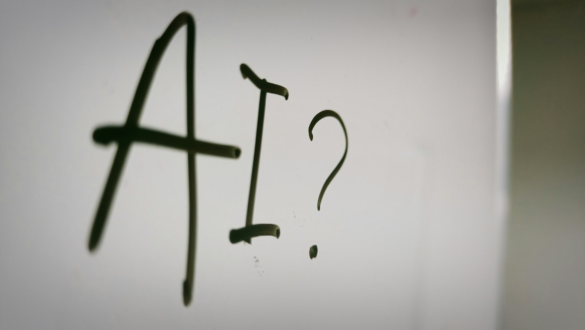

# The Real Fault Line

When Anthropic announced Claude Code Security and disclosed that Claude Opus 4.6 had uncovered more than 500 previously unknown vulnerabilities in production open-source codebases, the number was striking enough on its own. But what made it more striking was the kind of bugs they were. Not surface-level oversights. Not the bugs that get caught in the first hour of a code review. These were defects that had survived years, sometimes decades, of expert scrutiny in widely used systems.

For anyone watching the publishing and journalism industries over the past three years, the news landed with an oddly familiar weight. The same kind of headline, in a different vocabulary, has been arriving again and again. AI now drafts long-form articles, edits manuscripts, translates technical documents, and writes code that runs in production. Two professions that look almost nothing alike on the surface, vulnerability research and writing, are facing the same reckoning at roughly the same time. That coincidence is worth taking seriously, because the lessons from one side can sharpen our understanding of the other.

## The Pride of Difficulty

The Zero Day Initiative and the broader bug bounty culture that grew alongside it are built on a specific kind of pride. Researchers who hunt vulnerabilities in operating systems, browsers, and enterprise software are proud of doing something that very few people in the world can do. The work demands an unusual mix of patience, creativity, and the ability to think against the grain of how a system was designed. ZDI's competitions, the high-profile Pwn2Own events, the public leaderboards, all of it celebrates the rarity of that skill.

Writers and journalists carry a similar pride, though they rarely call it that. The craft of clear, original prose, the discipline of reporting, the instinct for what a story should be: these are not commodity skills, and the people who practice them well know it. There is a private satisfaction in writing a sentence that does what it needs to do, and an even deeper one in cutting three sentences that do not.

What both groups share, beyond the surface differences, is an identity built around mastering something hard. That foundation served them well for decades. It also created a particular kind of vulnerability, in the non-technical sense. When the difficulty barrier moves, an identity built on top of that barrier starts to wobble. And the barrier has moved.

## The Slop Defense

The most common response I hear from professionals in both fields, when AI comes up, runs along these lines. AI writes generic, shallow content. AI misses the nuance. The output is bland, predictable, and obviously machine-made. Therefore, AI is not a real threat to skilled work, and we can carry on as before.

There is something true in this observation. A great deal of AI output is in fact generic. Anyone who has spent time prompting a model with a one-line request has seen the result: a competent, structurally sound, and deeply forgettable piece of writing. The same pattern shows up in code generation. Ask a model for "a Python script that does X" and you will usually get something that runs and is also slightly off in ways an experienced engineer would never accept.

But the conclusion drawn from this observation is, I think, where the real misunderstanding lives. The fact that a tool produces mediocre output when used carelessly does not tell you much about what the tool can do in skilled hands. It tells you that the user has not yet learned the tool. A first-time user of a digital audio workstation will produce a generic-sounding track. That does not mean the software is incapable of professional music production. It means the user is at the beginning of a learning curve.

The "AI generates slop" argument, when it comes from a working professional, often functions less as a description of AI and more as a way of avoiding the harder question. The harder question is: what would my work look like if I actually learned to use this tool well? Most people do not want to ask that question, because answering it requires effort, humility, and a willingness to reorganize how they work. Dismissing the output as slop is faster.

## Yes, Slop Exists

It would be unfair, and frankly inaccurate, to wave away the concern entirely. The volume of low-quality content on the internet has clearly increased. AI-generated articles, summaries, and posts now flood platforms that were already struggling with information quality. Search results have degraded. Newsletters arrive that read like they were written by no one in particular, because in a sense they were.

This is a real problem, and the people who complain about it are not wrong to notice. What gets missed in the complaint, though, is that low-quality content did not begin with AI. The internet has been full of junk for as long as the internet has been a mass medium. Content farms, SEO spam, ghostwritten thought leadership, formulaic listicles: all of it predates large language models by many years. The change is not the existence of low-quality content. The change is the scale at which it can now be produced.

Scale is the actual issue. And scale, depending on the context, is either a curse or a blessing.

## Scale as a Gift

For information environments that depend on attention and trust, the scaling of low-effort content is genuinely harmful. There is no upside to having more SEO-optimized junk in search results. But for vulnerability management, the same property of AI looks completely different.

Defenders have always operated at a structural disadvantage relative to attackers. There are more codebases than researchers can audit, more dependencies than security teams can track, more attack surface than the existing community of human experts can ever cover. The asymmetry is not subtle. A team of three security engineers cannot keep up with a million lines of code spread across a hundred microservices, no matter how skilled they are. AI that can scan, reason about, and surface vulnerabilities at scale is, for defenders, exactly the kind of leverage the field has needed for years.

The same logic applies, in a softer form, to writing and publishing. If AI helps a small newsroom produce more thorough coverage, if it helps a researcher translate their work into five languages instead of one, if it helps a working writer produce two thoughtful essays in the time that used to yield one, the result is more good work reaching more readers. That is not a degradation of the field. That is an expansion of what the field can do.

The mistake is to assume that AI only produces junk and therefore only adds to the noise. The honest picture is more interesting. AI can produce slop, and it can produce serious work. Which one it produces depends almost entirely on who is at the keyboard and what they are asking it to do.

## The Real Divide

Here is where the parallel between the two industries becomes useful. The fight is not vulnerability researcher versus AI. It is not writer versus AI. The fight, if we have to call it that, is between people who learn to work with AI and people who refuse to.

I notice this every time I see another announcement about AI detection tools, another university policy banning AI use, another corporate memo treating AI as a compliance risk first and a capability second. The reflex to police, detect, and forbid is everywhere. Some of it is reasonable. Plagiarism rules still matter. Disclosure norms in journalism still matter. Authenticated work in security research still matters. But a great deal of the policing is not about any of these legitimate concerns. It is about a deeper discomfort with the idea that the skills people built their careers on can now be augmented, accelerated, or in some cases replicated by software.

That mindset, the rejection mindset, is the one we should have moved past years ago. It is dying hard. And the longer it persists, the more it harms the people who hold it, because the world is moving on regardless. The vulnerability researcher who learns to use AI to triage, validate, and chain findings will be doing more interesting work next year than the one who refuses on principle. The writer who learns to use AI as a thinking partner, a research assistant, and an editor will be producing work that the AI-rejecting writer simply cannot match in scope or speed. This is not a prediction. It is already happening, in both fields, often without much fanfare.

The professionals who are doing well right now are the ones who stopped framing AI as a threat to their identity and started framing it as a question. What can I now do that I could not do before? What kinds of work, previously out of reach because of time or scale, are suddenly within reach? What does my craft look like when the parts that used to be hard are no longer the bottleneck?

## What Changes, and What Doesn't

The craft does not disappear. Both vulnerability research and good writing still require judgment, taste, and the ability to know what matters. AI can find a bug, but understanding whether that bug is exploitable in a real system, what it means for users, and how to disclose it responsibly is still human work. AI can draft an article, but knowing what the article should say, what to leave out, and how to land the argument is still human work. The center of gravity moves upstream. The grunt work of finding and drafting becomes cheap. The judgment work of validating and shaping becomes more valuable, not less.

This is the shape of the transition that the writers and journalists I know are already living through, with mixed results. Some have made the shift well. Others are still arguing about whether the shift is real. The vulnerability research community is about to face the same fork in the road, and it has the advantage of seeing what happened to the field that went first.

The honest answer to "is AI replacing us" is that it is replacing a particular tier of the work, the tier that was always the hardest to defend on its own terms. What remains, and what becomes more valuable, is the part of the work that was never really about producing output in the first place. It was about knowing what was worth producing, and why.

That part is still ours.

Photo by [Nahrizul Kadri](https://unsplash.com/@nahrizuladib?utm_source=unsplash&utm_medium=referral&utm_content=creditCopyText) on [Unsplash](https://unsplash.com/photos/a-sign-with-a-question-mark-and-a-question-mark-drawn-on-it-OAsF0QMRWlA?utm_source=unsplash&utm_medium=referral&utm_content=creditCopyText)
