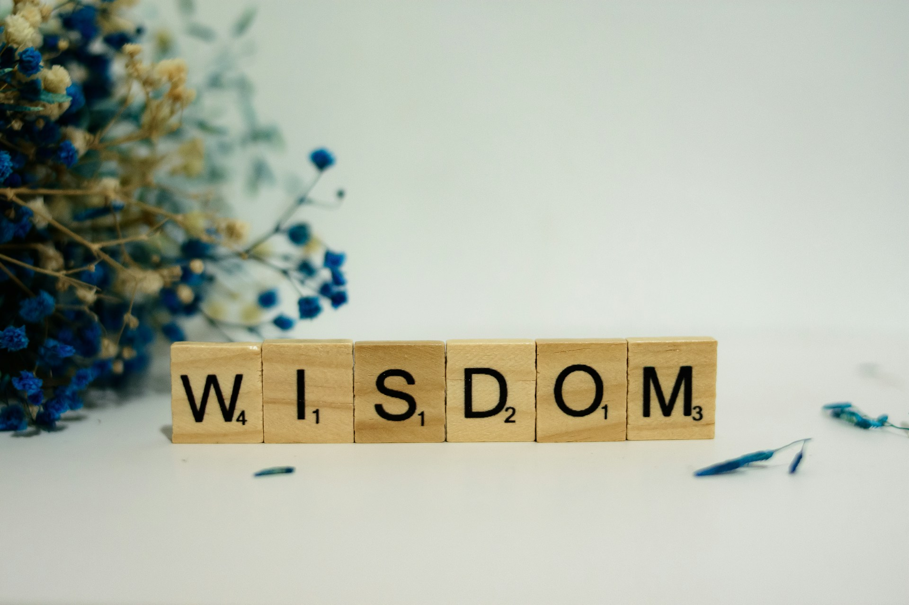

# The Wisdom Gap

## The Sunset of the Lone Architect

We have entered a period where the traditional archetypes of authority are showing their age. For decades, the public has looked toward figures like Yann LeCun and Geoffrey Hinton as the singular architects of our digital future, often crowning them with titles like the "Godfather of AI". This framing suggests a world where a few special individuals possess a prophetic clarity that the rest of the scientific community lacks. However, as we move through 2026, it is becoming increasingly obvious that this "lone genius" narrative is a relic of a previous century. The reality of modern research is far more collective and anonymous. The breakthrough moments, such as the development of the Transformer architecture, were not the result of a single godfather's vision but the collaborative effort of large, integrated teams.

This shift has created a fascinating tension in how we value achievement. The Nobel Prize committee and other prestigious bodies continue to struggle with a model that limits recognition to three individuals, even as the most significant discoveries in physics and medicine now involve thousands of co-authors. When we insist on centering our respect on a few "heroes," we miss the true nature of how knowledge actually grows today. It is no longer a top-down transmission of secrets from a guru to the masses. Instead, it is a horizontal synthesis where the AI itself acts as a massive, collective mirror, reflecting back the integrated intelligence of millions of researchers and practitioners.

The divergence between the so-called godfathers also highlights the limits of individual authority. While Hinton expresses deep concern about existential risks, LeCun dismisses these fears as a misunderstanding of biological evolution. LeCun argues that the desire to dominate is a trait of living organisms, born from survival instincts, not a necessary byproduct of high intelligence. When two pioneers of the same field reach such fundamentally different conclusions, it suggests that the "authority" we grant them is often more about their historical status than any hidden truth they possess. We are learning that a brilliant scientist can be a master of neural networks while still being a novice in fields like labor economics or social psychology. This realization is the first step in closing the wisdom gap.

## The Cat and the Category Error

The debate over whether AI is "dumber than a cat" has become a staple of 2026 tech discourse, but it frequently relies on a significant category error. LeCun uses the cat analogy to highlight the massive deficiency in what he calls sensorimotor intelligence. A cat can navigate a cluttered room, understand gravity, and catch a moving object with an effortless physical intuition that our most advanced digital models still cannot replicate. In the physical domain, AI is indeed clumsy and disconnected. It lacks a "world model" that understands cause and effect in three-dimensional space.

However, describing AI as "dumb" because it lacks a cat's physical grace is like calling a calculator "dumb" because it cannot dance. We are comparing two entirely different planes of existence. While the cat is a master of the "real," the AI has already achieved a level of cognitive complexity in the digital domain that far surpasses any biological equivalent. It can synthesize legal precedents, translate obscure dialects, and generate code in seconds. This is not "dumb" behavior; it is a specialized, non-biological form of intelligence that is fundamentally different from the instincts of a predator.

The push toward "Physical AI" and robotics is an attempt to bridge this gap. As researchers at Meta and other labs work to give AI "sensory organs" through smart glasses and environmental sensors, they are trying to teach the machine the rules of the physical world that every child learns by simply being alive. This represents a move away from the text-centric models that have dominated the last few years. We are realizing that intelligence is not a single ladder where humans sit at the top and cats sit somewhere in the middle. It is a sprawling landscape of capabilities, and the next necessity is simply finding a way to integrate the digital brilliance of the model with the physical intuition of the organism.

## The Unmasking of the Scholar

Perhaps the most disruptive effect of AI in 2026 is how it has unmasked the scholar. For centuries, we used the accumulation of knowledge as a proxy for virtue. We assumed that someone who had spent decades in a library, earning the title of professor, must also possess a high degree of wisdom and character. This was a social habit born from the rarity of information. Because obtaining the "What" and the "How" was so difficult, we granted a high level of respect to anyone who managed to do it.

AI has effectively decoupled these traits. Now that a machine can provide an answer that is often more balanced, insightful, and comprehensive than a human expert, we can see the category error clearly. Being knowledgeable is no longer a rare feat. A professor might possess a vast internal library, but if they lack everyday experience or the humility to admit when they are wrong, their knowledge feels empty. We are finding that many experts are actually less insightful than the collective intelligence of an AI, precisely because their individual egos and academic rivalries cloud their judgment.

This unmasking has led to a new kind of prestige. We are starting to value the experts who use their capability to serve others over the authorities who use their titles to demand respect. When the facts are a commodity, the only thing that remains scarce is the human touch. We admire the person who can maintain a sense of selfless harmony and experienced grace, even when they are not the smartest person in the room. In a world where AI can pass the bar exam, the real special individual is the one who knows how to be a good human being.

## The Friction of the Way

As the modern education system faces the reality of 2026, it is confronting its own origins as a product of industrial modernization. Our schools were designed to produce efficient workers who could handle information and apply logic to solve technical problems. This focus on the "What" and the "How" was perfect for the 20th century, but it neglected the "Way"—the development of wisdom through lived experience. Many institutional systems are now struggling because they have built their entire value proposition on measuring things that AI can now do better and faster.

Wisdom cannot be downloaded or taught through a standardized curriculum. It is the residue of friction. It comes from making mistakes, facing the consequences of those mistakes, and slowly metabolizing those experiences into a grounded worldview. This is why many global education reports are seeing a massive shift toward experiential learning. The goal is no longer to just know things, but to develop the agency to act in the real world. If a student can use AI to write a perfect essay without actually engaging with the text, they have gained Information but lost the Way. They have skipped the friction that was supposed to change who they are.

This realization is forcing a soft landing for the educational system, where the focus moves from abstract theory to practiced habits. We are seeing a return to older models of mentorship where a guide helps a student navigate a world of infinite information without losing their soul. The new curriculum is not about subjects; it is about character. It is about learning to be persistent, empathetic, and curious in a world that offers every possible intellectual shortcut. We are finally learning that being smart was only ever a temporary substitute for being wise.

## The Unseen Technology of the Self

In this post-modern AI era, the most vital technology we can master is not an external model, but the internal one that allows us to manage our own consciousness. We often think of technology as something hard and visible—chips, cables, or large-scale algorithms—but the most powerful tools are often unseen. These are the mental habits and narrative structures we use to clarify our own existence. When the external world is flooded with automated insights, the challenge is to maintain a personal center that is not simply a reflection of the latest data stream. This requires a shift from viewing the self as a consumer of information to viewing the self as a site of active, intentional construction.

For me, this practice centers on the steady reclamation of the personal narrative through the thickness of writing and life-logging. It is not about productivity in the industrial sense, nor is it about finding a more efficient way to get things done. Instead, it is about creating a space where the ego is forced to encounter the reality of its own experience. By consistently recording our thoughts, moods, and energy levels, we build a private archive that serves as a necessary friction against the speed of the digital world. This is a form of cognitive grounding. It ensures that our sense of who we are is built on the steady accumulation of our own lived moments rather than the fleeting impressions offered by a screen.

This process functions as a laboratory for the self. When we track the subtle shifts in our inner state—noting which interactions leave us drained and which environments foster a sense of harmony—we are engaging in a form of self-directed research. This is where we move past the category error of information and begin the work of wisdom. We are not just collecting data points; we are learning the specific gravity of our own lives. It is the difference between reading a map and actually walking the terrain. By making our internal patterns visible to ourselves, we gain a level of agency that no external intelligence can provide. We learn how to inhabit our own thoughts rather than simply reacting to the thoughts generated for us.

The act of turning a chaotic day into a linear story is perhaps the most fundamental unseen technology we possess. When I sit down to write, I am not just recording facts. I am engaging in a process of cognitive clarification. The page acts as a filter, separating the noise of the day from the signal of what actually matters. This requires a deliberate slow-down, a refusal to take the shortcut of a summary or a bulleted list. The narrative itself is the tool. It forces a certain depth of engagement that resists the shallow pull of the modern world. In this way, the practice of writing becomes a way of preserving the human within the machine-driven landscape—a way of ensuring that while our knowledge may be assisted by AI, our wisdom remains entirely our own.

## Reclaiming the Staff

We are reaching a point where the fear of being replaced by AI is giving way to a more profound question: what are we going to do with our newfound freedom? If AI handles the Doing—the utility, the efficiency, the technical labor—we are left with the Being. This is not a loss of human relevance; it is a reclamation of our true role as stewards of meaning. We are no longer required to be biological computers, which means we can finally afford to be fully human.

The godfathers and the experts will continue to argue over the technical details of the future, but their words are just more information. The true path forward involves taking up the staff of our own agency. This means choosing to engage with the world physically, ethically, and narratively. It means respecting the Way of a mentor not because they have a title, but because they embody a sense of peace and purpose that we wish to cultivate in ourselves.

The wisdom gap is not something AI can close for us. In fact, AI only makes the gap more visible. The machine can provide the most insightful and balanced perspective in the world, but it cannot live your life for you. It cannot feel the weight of a difficult choice or the satisfaction of a hard-won harmony. As we move further into this era, the most prestigious title won't be one granted by an academy or a tech firm. It will be the simple recognition of being a person who has turned their intelligence into wisdom and their knowledge into a way of life.

Photo by [Alex Shute](https://unsplash.com/@faithgiant?utm_source=unsplash&utm_medium=referral&utm_content=creditCopyText) on [Unsplash](https://unsplash.com/photos/a-wooden-block-spelling-the-word-wisdom-next-to-a-bouquet-of-flowers-r9azGhUu9sY?utm_source=unsplash&utm_medium=referral&utm_content=creditCopyText)