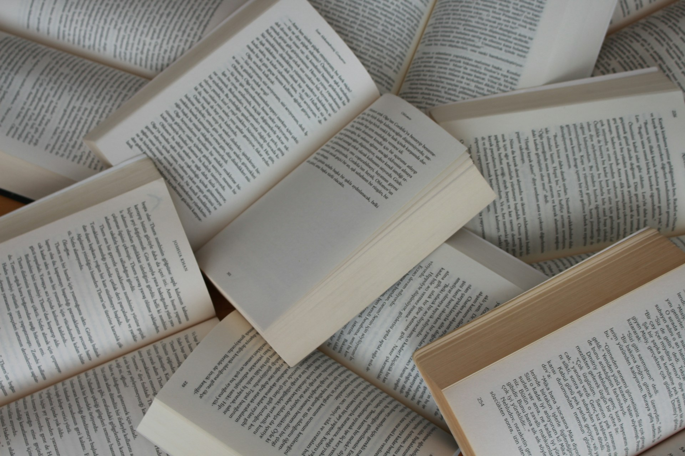

# Information Nutrition

## The Invisible Shift in the Digital Atmosphere

The digital landscape is currently undergoing a massive structural shift that few people are noticing as they scroll through their daily feeds. According to a study titled "[The Impact of AI-Generated Text on the Internet](https://ai-on-the-internet.github.io)" by researchers from Imperial College London, the Internet Archive, and Stanford University, approximately 35% of the websites published between August 2022 and May 2025 were either entirely generated or heavily assisted by artificial intelligence. This figure is not just a statistic regarding automation. It represents a fundamental change in the chemistry of the information we consume every day. When we open a browser today, we are stepping into a world where more than one out of every three new pages has been smoothed over by a machine.

This change is most visible in what researchers call the positivity shift. AI-generated content has been found to score 107% higher in positive emotional sentiment compared to text written solely by humans. It is a strange, neon glow that seems to emanate from the screen. If we search for advice on moving through a difficult professional transition or managing a complex project, we are no longer met with the gritty, sometimes frustrated reality of human experience. Instead, we find a world of silver linings and unlimited potential. The machine is trained to be polite, helpful, and inoffensive, which results in a digital environment that feels unnaturally cheerful and artificially wholesome.

We are seeing the rise of a new kind of safe prose that avoids the rough edges of human conviction. In the study, researchers used a detection tool to analyze these shifts across different languages and models. They found that as AI content proliferates, the actual meaning of what we read is becoming more uniform. We are trading the messy, vibrant diversity of individual voices for a polished, synthetic average. It is as if the weather of the internet has shifted to a perpetual, cloudless noon, where nothing is allowed to remain in shadow.

## The Encroachment of the Synthetic Neighborhood

The sheer volume of this content is creating a new kind of digital neighborhood. It is one where every house is painted the same shade of off-white and every lawn is perfectly manicured. This uniformity is a direct result of what the study calls semantic homogenization. Researchers found that AI-generated websites showed a 33% higher similarity in content and meaning compared to sites written by humans. Because these models are designed to predict the most likely next word based on a massive average of human data, they naturally drift toward the middle. They avoid the edges of human thought. They steer clear of the eccentric, the grumpy, and the truly radical.

We see this most clearly in the way content is being manufactured for search engines. Imagine a massive archive of text files where every document is a variation of a popular search query. Before 2022, a marketing firm would have had to hire dozens of writers to produce those files. Now, a single script can generate them in an afternoon. These files are not meant to be good in a traditional sense. They are meant to be enough. They occupy space. They provide the appearance of an answer while offering no new insight.

This is the fast food of the information age. Just as a chain restaurant prioritizes a consistent, predictable flavor over nutritional depth or culinary risk, fast content prioritizes the appearance of authority. It uses the same logical structures and the same transition phrases. It feels safe. It is reliable. But it is also fundamentally empty. The danger is not that this content is evil or wrong, but that it is so abundant that it begins to drown out the messy, complicated voices that make the human experience worth reading about.

We often assume that a wider variety of sources leads to a wider variety of ideas. However, the data suggests the opposite is happening. As more websites are generated by the same few underlying models, the internet is becoming a massive echo chamber of the most probable opinions. The specific, idiosyncratic views that once lived in small corners of the web are being pushed aside by the sheer gravitational pull of the average.

## Identifying the Marketing Sugar in Human Writing

There is a common defense that human-made content is inherently superior to anything a machine can produce. This is a comforting thought, but it is often a lie. For decades, the publishing industry and the thought leader economy have been producing their own version of fast food. We have all seen the business book that takes a single three-page idea and stretches it across three hundred pages of anecdotes and repetitive motivational filler. These works are human-made, yet they are just as formulaic as any AI output.

I call this "Marketing Sugar." It is the use of emotional manipulation, high-energy storytelling, and celebrity persona to hide a lack of actual information. These authors are not providing nutrition. They are providing a dopamine hit. They use dramatic narratives to create a false sense of intimacy. They tell stories about their morning routines or their meetings with other famous people to convince you that their thin ideas are actually special. It is a deceptive form of uniqueness that relies on the author's face rather than the quality of their thought.

In many ways, the rise of AI is finally unmasking this industry. When a large language model can produce a success manual that sounds exactly like a famous influencer, it proves that the influencer was never actually being creative. They were just following a social script. They were human bots. We are realizing that a significant portion of what we labeled as human creativity was actually just a different kind of predictable pattern. If a machine can replicate a career's worth of writing in a few seconds, it is an invitation to ask if that writer was ever truly saying anything unique.

The demand for this sugar is high. Public surveys mentioned in the study show that while people worry about misinformation, they still gravitate toward content that feels familiar and easy to digest. The bestseller lists are often filled with this intellectual junk food because it requires very little of the reader. It is comfortable. But comfort is not the same as growth, and a personality is not the same as a perspective.

## The Meditative Clarity of the Digital Textbook

If human junk content is sugar-coated, then high-quality AI synthesis is a form of information nutrition. This is where we must stop looking down at the tool and start appreciating its potential as a specialized textbook. Think about the way a Wikipedia entry is structured. It is dry. It is neutral. It lacks personality. For most readers, that makes it boring. But for someone who wants to learn, that lack of ego is its greatest strength.

When using an AI as a thinking partner, the goal is often to find that textbook synthesis. We do not necessarily want the machine to mimic human warmth. We want it to look at twenty different research papers and identify the three points where they all agree. We want it to take a complex topic like the impact of synthetic text on digital archives and break it down into its core components without the fluff. This is incredibly efficient. It allows us to bypass the marketing sugar of human experts and get straight to the facts.

This is why AI content is currently underrated. We are judging it by the standards of entertainment, when we should be judging it by the standards of scholarship. An AI does not need to sell you a subscription or a coaching program. It does not need you to like its brand. This allows it to be more honest about information than many human writers who are constantly worried about their reputation. When the goal is pure knowledge, the blandness of AI becomes a feature. It is a clean lens through which we can view the world's data.

The researchers found that while people feared a decline in factual accuracy, the data did not show a catastrophic drop in the quality of facts on a broad scale. Instead, the real change was the tone and the loss of stylistic flair. For an information hunter, this is an acceptable trade. If the choice is between a factual but dry synthesis and a colorful but empty human narrative, the synthesis provides far more long-term value. It provides the nutrients needed to form one's own opinions.

## Constructing the Creative Peak on a Synthetic Floor

The future of writing is not a battle between humans and machines. It is a partnership that defines a new standard of quality. We are moving toward a world where AI synthesis is the floor. It is the baseline. If a writer is only providing information that a well-prompted AI could have synthesized, that writer is no longer adding value. They are just repeating the floor. To be truly creative today, one must build something on top of that floor that the machine cannot see.

I treat this as a workflow of ingredients and cooking. The AI prepares the ingredients. It gathers the facts, summarizes the history, and outlines the existing arguments. This is the synthetic floor. It is perfectly accurate and logically sound. But it has no soul. It has no "why." That is where the human comes in. The human provides the creative peak (the idiosyncratic interpretation, the moral judgment, and the lived experience that connects those facts to a real person's life).

True uniqueness is the small percentage of insight that sits on top of the vast percentage of synthesis. By letting the AI handle the mechanical work of gathering facts, the human is finally free to focus entirely on the perspective that actually matters. This requires a shift in how we value our own labor. We must stop priding ourselves on our ability to summarize and start priding ourselves on our ability to interpret.

The partnership also demands a new kind of internal discipline. It requires us to be honest about where the machine's work ends and our own begins. There is a profound difference between a text that is AI-generated and one that is AI-synthesized and human-interpreted. The former is a dead end. The latter is a new form of high-density scholarship that allows for a depth of thought previously reserved for those with teams of research assistants.

## Embracing the Era of Slow Information

This shift will eventually lead to a slow information movement. As the internet becomes flooded with fast content (the 35% of AI-assisted filler and the marketing sugar of human influencers), readers will become more exhausted. They will stop looking for content and start looking for truth. This creates a clear stratification in the digital world. At the bottom, there will be the automated slop. In the middle, the pseudo five-star human junk. At the top, there will be the information nutrition born from the AI-Human partnership.

We need to raise our expectations for what it means to be a writer or a thinker. When we produce a document, we should ask if it offers anything that a textbook synthesis does not. Does it have a point of view? Does it take a risk? Does it offer a practical recommendation that actually works in the real world? If it does not, then it is just more noise in an already loud world.

The unmasking of pseudo-creativity is a gift. It is forcing us to stop being lazy with our creativity. It is stripping away the illusion that knowing things is the same as being brilliant. We have entered an era where knowledge is a commodity, provided cheaply and efficiently by machines. This is not a tragedy. It is a liberation. It means that the only thing left for us to do is to be authentically, messily, and radically human. The machine has taken over the task of being average. That leaves us with the much harder, and much more exciting, task of being ourselves.

The study concludes that the internet is changing in ways we are only beginning to measure. While the loss of diversity in the broad content domain is a legitimate concern, it also creates an opportunity for those who value depth. By choosing nutrition over sugar, and synthesis over filler, we can find a new way to interact with the world's knowledge. We are not losing our voices; we are simply being asked to find better things to say.

Photo by [Gülfer ERGİN](https://unsplash.com/@gulfergin_01?utm_source=unsplash&utm_medium=referral&utm_content=creditCopyText) on [Unsplash](https://unsplash.com/photos/white-and-brown-book-on-brown-woven-surface-LUGuCtvlk1Q?utm_source=unsplash&utm_medium=referral&utm_content=creditCopyText)