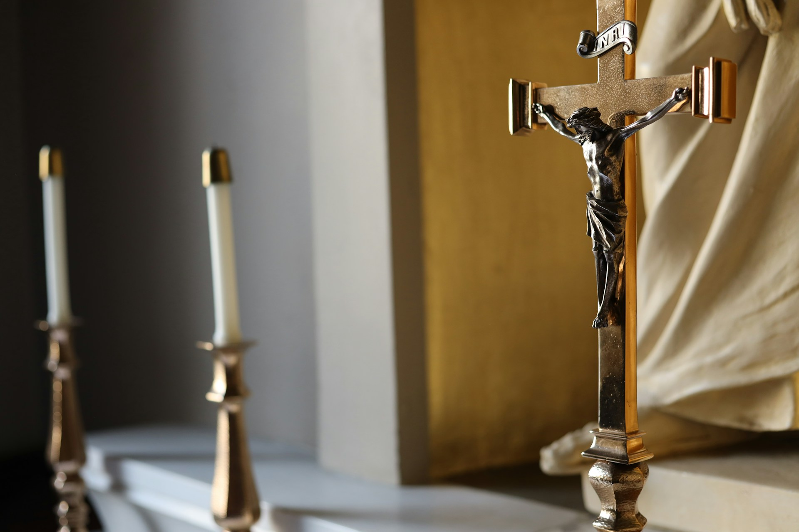

# The View from Trinity Sunday
2026-06-03

## The Sunday That Changes the View

This year's Trinity Sunday felt different to me.

Every year, the Church celebrates the great events of salvation history. Christmas recalls the birth of Christ. Holy Week leads us through his suffering and crucifixion. Easter proclaims the Resurrection. Ascension remembers Christ's return to the Father. Pentecost celebrates the coming of the Holy Spirit. Each feast is connected to something that happened. Each season invites believers to revisit a particular moment within the Gospel story. Yet Trinity Sunday does not seem to fit neatly into that pattern. There is no manger, no cross, no empty tomb, and no dramatic descent of tongues of fire. Instead, the Church pauses and turns its attention toward something deeper.

As I listened to the readings, especially the familiar words of John 3:16, I found myself noticing a subtle shift in perspective. For months the liturgical year had been guiding us through the events surrounding Jesus Christ. We had been walking alongside him through birth, ministry, suffering, resurrection, and the sending of the Spirit. Then, almost unexpectedly, the Church seemed to invite us to step back from the narrative itself. Rather than asking what happened next, it asked a different question. What do all these events reveal about God?

That realization reminded me of how we often experience stories in everyday life. While reading a novel, watching a film, or even reflecting on our own lives, we tend to focus on individual events as they unfold. Only later do we gain enough distance to recognize larger patterns and meanings. The significance of earlier moments becomes clearer when viewed from a wider perspective. Trinity Sunday feels very much like that moment of widening perspective. After accompanying Christ through the great movements of the Gospel, believers are invited to contemplate the reality that stands behind them all.

Perhaps this is why Trinity Sunday has always occupied a special place within the liturgical calendar. It serves as a reminder that Christianity is not merely a collection of sacred events. It is also a revelation of who God is. The story remains essential, but the story points beyond itself. The Church spends much of the year helping believers experience the unfolding drama of salvation. Trinity Sunday encourages us to see the source from which that drama emerges and the love toward which it ultimately points.

## Walking the Road One Season at a Time

The liturgical year begins with waiting. During Advent, Christians enter a season of expectation. The world has not yet changed. The Messiah has not yet arrived. The readings are filled with hope, longing, and anticipation. In a culture accustomed to instant gratification, Advent teaches patience. It reminds believers that some of the most important realities in life cannot be rushed. They must be awaited with openness and trust.

Christmas then arrives as an answer to that waiting. The celebration of Christ's birth is so familiar that its strangeness can easily be overlooked. Christians proclaim that God entered human history not as a conquering ruler but as a vulnerable child. The season invites wonder, gratitude, and humility. It asks believers to see greatness hidden within ordinary circumstances. What began as expectation becomes presence. The God who seemed distant is revealed as near.

The journey continues through Epiphany and into Lent. During Epiphany, the revelation of Christ extends beyond a single people or nation. The visit of the Magi symbolizes a faith intended for the whole world. Lent then introduces a different atmosphere. Reflection replaces celebration. The Church slows down and creates space for self examination. Through prayer, fasting, and repentance, believers confront both their limitations and their need for grace. The movement of the liturgical year mirrors the movement of the spiritual life itself, which requires not only joy but also honesty.

Holy Week and Easter form the emotional center of the Christian story. The triumphal entry into Jerusalem quickly gives way to betrayal, suffering, and death. The Gospel does not avoid the realities of pain and loss. Instead, it passes directly through them. Easter then transforms the entire narrative. The Resurrection is not simply the reversal of tragedy. It reveals that death does not have the final word. Hope emerges with greater depth because it has already encountered despair.

The story continues through Ascension and Pentecost. Christ returns to the Father, and the disciples must learn to live in a new way. Then the Holy Spirit descends, empowering them to carry the Gospel into the world. When viewed separately, these celebrations may appear to be distinct religious observances. When viewed together, they form a coherent journey. The liturgical calendar is not simply teaching information about Christianity. It is shaping the imagination of believers through participation in a recurring story. Year after year, Christians are invited not merely to remember these events but to live through them once again.

## Why Human Beings Need Rhythms

The wisdom of the liturgical calendar becomes even clearer when considered within the broader context of human life. Human beings naturally organize their existence through rhythms and cycles. We wake and sleep. We work and rest. We celebrate birthdays and anniversaries. Communities observe holidays. Nations commemorate important events. These recurring patterns help create a sense of continuity amid the constant changes of life.

Modern society often emphasizes novelty. New technologies, new ideas, and new experiences attract attention because they promise progress and excitement. Yet the deepest forms of growth rarely occur through novelty alone. Character is shaped through repetition. Skills are developed through practice. Relationships are strengthened through regular acts of care and presence. What transforms us most profoundly is often not the extraordinary moment but the faithful return to meaningful patterns over time.

Older cultures generally understood this principle well. Time was not viewed merely as a sequence of dates moving toward the future. It carried symbolic and communal significance. Seasons were associated with particular activities, celebrations, and forms of reflection. Religious observances helped communities remember who they were and what they valued. The passing of time itself became a vehicle for transmitting wisdom from one generation to the next.

Many people today experience time differently. Days are often fragmented by schedules, notifications, and competing demands. Weeks pass quickly, and months seem to disappear almost unnoticed. Despite being more connected than ever, many individuals struggle to locate themselves within a larger narrative. Life can feel busy without necessarily feeling meaningful. The challenge is not simply a lack of information. It is the absence of structures that help transform information into understanding.

The liturgical calendar addresses this challenge in a remarkably simple way. Rather than treating time as empty space to be filled with activity, it fills time with meaning. Each season offers a different lens through which believers can view their lives. Waiting, repentance, hope, gratitude, renewal, and contemplation become recurring themes rather than occasional experiences. Faith gradually becomes woven into the rhythm of everyday life, shaping not only what people believe but also how they experience the passage of time itself.

## The Forgotten Wisdom of Tradition

In contemporary culture, tradition is often viewed with suspicion. Many people associate traditions with rigidity, outdated customs, or institutional control. Such concerns are understandable. History provides many examples of traditions becoming detached from their original purpose. Rituals can become mechanical. Institutions can lose sight of the values they were intended to preserve. Any honest discussion of tradition must acknowledge these realities.

Yet there is another side to the story. Human beings do not flourish in a vacuum. Even when older traditions are rejected, new patterns quickly emerge to take their place. Every society develops rituals, symbols, and recurring practices that shape collective identity. The question is not whether traditions will exist, but which traditions will guide our lives and what values they will carry.

Modern culture possesses many rituals of its own. Annual shopping seasons, major sporting events, product launches, and social media cycles all create shared rhythms of anticipation and participation. These practices help organize attention and behavior, often more powerfully than we realize. The disappearance of religious traditions does not necessarily create freedom from structure. More often, it creates space for other structures to assume their place.

Seen in this light, the liturgical calendar appears less as an outdated institution and more as a form of cultural memory. It preserves a story that has shaped generations of believers and continually reintroduces that story to new participants. The calendar returns each year not because people have forgotten Christmas or Easter, but because remembering is itself an essential human activity. What matters most must be revisited regularly if it is to remain alive.

This may be one reason religious traditions have endured for centuries despite social and technological change. At their best, they provide more than doctrines or moral teachings. They offer practices that help individuals inhabit those teachings. They create a shared rhythm through which wisdom can be carried across generations. Far from being obstacles to spiritual life, traditions can become vessels that sustain and nourish it.

## Trinity Sunday and the Meaning Behind the Story

Against this backdrop, Trinity Sunday takes on a distinctive significance. After guiding believers through the major events of salvation history, the Church invites them to reflect on the meaning that unites them all. The focus shifts from the narrative itself to the reality revealed through the narrative. What kind of God is disclosed through the life, death, and resurrection of Jesus Christ?

The Gospel reading offers a profound answer. "For God so loved the world that he gave his only Son." These words are among the most familiar in Christianity, yet their depth can easily be overlooked. They do not simply describe an event. They reveal a relationship. The Father gives. The Son is given. The Spirit draws humanity into the life of God. What appears on the surface as a sequence of historical events is revealed as an expression of divine love.

For many people, the doctrine of the Trinity can seem abstract or difficult. Theological language about three persons and one God has generated centuries of reflection and debate. Yet the purpose of the doctrine is not merely intellectual. It seeks to express something fundamental about the nature of God. At the heart of reality is not isolation but communion. God is not portrayed as a solitary being existing apart from relationship. God is understood as eternal love shared between Father, Son, and Holy Spirit.

This perspective transforms how the Gospel story is understood. The Incarnation is no longer simply the birth of a remarkable teacher. The Cross is more than a tragic execution. The Resurrection is more than an extraordinary miracle. Each event becomes part of a larger movement of self giving love. The events remain important in themselves, but their deepest meaning emerges when viewed together.

Trinity Sunday therefore serves as a theological summit within the liturgical year. From this vantage point, believers can look back across the seasons and see how the various events connect to one another. What previously appeared as separate episodes becomes part of a unified whole. The Church steps back from the story not to abandon it but to understand it more fully. The answer it discovers is both simple and profound. The story begins and ends in love.

## Living Inside Sacred Time

One of the remarkable achievements of the liturgical calendar is that it transforms theology into lived experience. Most believers spend far more time engaged in ordinary responsibilities than in explicitly religious activities. They work, care for family members, navigate challenges, celebrate joys, and make countless decisions that shape their lives. The calendar does not remove them from these realities. Instead, it accompanies them through them.

As the seasons return each year, familiar themes reappear in new contexts. Advent may feel different to a young parent than to a retired grandparent. Lent may carry one meaning during a season of personal struggle and another during a season of stability. Easter may resonate differently after experiences of loss, illness, or renewal. The liturgical year remains constant, but the individuals moving through it continue to change.

This interaction creates a unique form of spiritual formation. The same readings, prayers, and celebrations are encountered repeatedly, yet they are never experienced in exactly the same way. Life itself becomes the lens through which the Gospel is continually rediscovered. What once seemed distant gradually becomes personal. What once appeared abstract begins to illuminate concrete experiences.

The significance of sacred time extends beyond individual spirituality. It also creates a sense of belonging. Believers around the world move through the same seasons together, hearing many of the same readings and reflecting on many of the same themes. The liturgical calendar links individuals not only to their local communities but also to generations of Christians who have traveled the same path before them. Faith becomes something shared across both time and space.

Perhaps this is one of the calendar's greatest gifts. It helps people inhabit a story larger than themselves. Rather than viewing life as a disconnected series of events, believers are invited to see their experiences within the broader horizon of God's relationship with humanity. Sacred time does not eliminate uncertainty or suffering, but it provides orientation. It reminds people where they stand within the larger story and offers a framework through which meaning can emerge.

## Living Through the Story

There is a difference between studying a story and living within one. A reader observes events from a distance. A participant experiences them from the inside. The liturgical calendar encourages this second mode of engagement. It does not ask believers merely to learn about the Gospel. It invites them to inhabit it, season after season, year after year.

This is why Trinity Sunday struck me so strongly this year. Until Pentecost, the Church had guided us through the events surrounding Jesus Christ. We waited in Advent, rejoiced at Christmas, reflected during Lent, grieved during Holy Week, celebrated Easter, contemplated Ascension, and welcomed the Spirit at Pentecost. Then suddenly the perspective widened. The Church invited us to step back and see the larger picture.

From that vantage point, the purpose of the journey became clearer. The events were never isolated episodes. They were expressions of a deeper reality. The Father sends the Son. The Son reveals the Father. The Spirit draws humanity into divine life. What unfolds across the liturgical year is ultimately a revelation of love.

This insight also sheds light on the enduring value of the liturgical calendar itself. What may appear to outsiders as a collection of traditions and observances is, in fact, a carefully structured way of inhabiting the Christian story. The calendar ensures that faith remains connected to the rhythms of everyday life rather than confined to abstract beliefs or occasional moments of inspiration.

When Trinity Sunday arrives, believers are given an opportunity to see this structure as a whole. The Church steps back from the unfolding narrative and contemplates its meaning. The familiar words of John 3:16 suddenly resonate with renewed depth. "For God so loved the world that he gave his only Son." Everything that came before points toward this reality.

Faith, then, is not merely a matter of remembering what happened long ago. It is a way of living within a story that continues to shape the present. Through the rhythms of sacred time, Christians are invited again and again into the mystery of divine love. The liturgical calendar does not simply help believers recall the Gospel. It teaches them how to live inside it.

Photo by [Saint John's Seminary](https://unsplash.com/@sjsboston?utm_source=unsplash&utm_medium=referral&utm_content=creditCopyText) on [Unsplash](https://unsplash.com/photos/silver-trophy-on-white-table-5PIuKC3cwSs?utm_source=unsplash&utm_medium=referral&utm_content=creditCopyText)