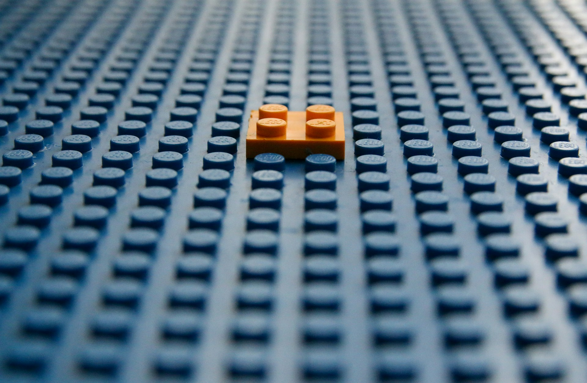

# The Visible Machine

2026-06-05

## The Philosophy Hidden in an Operating System

It is surprising how often meaningful ideas appear in unexpected places. We expect philosophy to emerge from religion, literature, science, or the work of great thinkers. We do not usually expect it to appear in conversations about operating systems. Yet the Unix philosophy has a strange ability to awaken a sense of intellectual excitement, even among people who are not primarily programmers. What begins as a technical discussion about software design gradually becomes a reflection on how knowledge, work, and creativity can be organized.

Unix is, of course, an operating system tradition. It belongs to the world of files, commands, processes, streams, and programming environments. But the reason people remain fascinated by it is not merely technical. Many systems are technically important but do not become philosophical symbols. Unix became one because its design principles express a way of thinking. It suggests that complexity should not be handled by creating one enormous structure that does everything. Instead, complexity can emerge through the interaction of small, clear, reliable components.

The famous summary of the Unix philosophy is simple: write programs that do one thing well, write programs that work together, and make them communicate through a common interface such as text. These principles may sound modest, but they contain a powerful view of the world. A system does not need to be built as a single grand machine. It can be formed through many smaller tools, each with its own responsibility, each limited in scope, yet capable of joining with others to produce larger results.

This is why Unix feels larger than the field of operating systems. It reflects a broader intellectual pattern. A sentence is made from words. A book is made from sentences. A city is made from roads, buildings, institutions, and routines. A civilization is made from countless customs, memories, techniques, and shared meanings. In each case, the whole is not created by one single force acting from above. It emerges from the relationship among many smaller elements.

The attraction of Unix lies in this trust in composition. It does not deny complexity. It simply refuses to hide all complexity inside a single opaque object. It asks that each part be understandable, that each part be useful, and that the relationships among parts remain open to creative recombination. This gives Unix its intellectual beauty. It feels like a system that respects the mind of the user, especially the user who wants to understand how things are put together.

That is also why the Unix philosophy can be inspiring even for writers, researchers, and people interested in knowledge management. It offers an image of thought itself. A note can be small and independent. A folder can create relationship. A project can gather fragments into temporary order. A body of work can emerge from many separate acts of writing. The Unix philosophy reminds us that coherence does not always need to be imposed at the beginning. Sometimes it appears gradually, as pieces find their proper relationships.

## When Simplicity Becomes Difficult

There is, however, an immediate paradox. Unix is often praised for simplicity, yet many nontechnical users experience it as difficult. This is not a superficial misunderstanding. It points to a deeper distinction between different meanings of simplicity. What is simple for a system may not be simple for a person encountering that system for the first time.

A command line can be structurally simple. A user types a command, the system executes it, and the output appears. There are no elaborate visual layers, no animated menus, no guided panels, and no decorative interface. From the perspective of system design, this is remarkably direct. Yet from the perspective of a beginner, the same blank screen can feel hostile. Nothing tells the user what to do. The possibilities are present, but they are invisible.

Modern graphical interfaces solve this problem by making possibilities visible. Buttons, menus, icons, toolbars, and dialog boxes guide the user. They reduce the need for memory and invite action through recognition rather than recall. This is why Windows and macOS became so powerful in the everyday world. They did not merely run software. They created environments where ordinary users could feel oriented.

The difference is not simply between old and new technology. It is between two ideals of design. Unix values legibility at the level of the system. Consumer software values ease at the level of immediate experience. Unix says, “Here are the parts. You can understand them and combine them.” A polished application says, “Do not worry about the parts. The task is already prepared for you.” Both approaches are valid, but they serve different kinds of attention.

This distinction helps explain why something can be beautiful in theory but difficult in practice. A system built from simple parts may require the user to understand those parts. A system designed for convenience may hide its internal complexity, even if the hidden structure is messy. The user may experience the second system as easier, even though the first system is more elegant from an architectural point of view.

The danger arises when we confuse these two forms of simplicity. We may assume that a simple internal structure automatically produces an easy user experience. It does not. We may also assume that a friendly interface means the system itself is simple. That is often untrue. Many friendly systems are friendly precisely because enormous complexity has been hidden behind the surface.

This is why Unix can be misinterpreted. Its simplicity is not the simplicity of a household appliance. It is the simplicity of a workshop. A household appliance asks for trust. A workshop asks for skill. A washing machine is successful when the user does not need to know how it works. A workshop is valuable because the tools are visible and available for creative use. Unix belongs more to the workshop than to the appliance.

## Lego Bricks and the Shape of Wholeness

The common comparison between Unix and Lego blocks is helpful because it captures both the beauty and the limitation of modular thinking. Lego pieces are simple, standardized, and reusable. The same pieces can become a castle, a spaceship, a bridge, or a classic car. The magic lies not only in the finished object but in the freedom of recombination. A child can take apart one world and build another from the same pieces.

This is very close to the Unix imagination. A small command does one thing. Another command does another thing. Through a pipeline or script, they can be joined together. The result may be more powerful than any single tool. The system gains flexibility because the pieces are not locked into one predetermined form. They remain available for new combinations.

For people who enjoy systems, this is deeply satisfying. They see the elegance of the pieces. They admire how much can be done with a limited set of components. They experience a kind of intellectual pleasure in recognizing that a large result is not mysterious. It is assembled. It can be understood. It can be modified. It can be rebuilt.

Yet the Lego analogy also reveals a limitation. A Lego castle is still visibly made of Lego. No matter how impressive the model becomes, the seams remain. The pieces do not disappear into the whole. This is part of the charm for enthusiasts, but it can also make the result feel slightly artificial. The viewer may admire the construction without fully inhabiting the illusion.

This is similar to the experience of Unix. For those who love it, the visible machinery is part of the beauty. The commands, files, streams, and connections are not distractions. They are the very source of pleasure. But for others, the machinery prevents immersion. They do not want to see the blocks. They want to experience the castle. They do not want to compose tools. They want to complete a task.

Human beings need both experiences. Sometimes we want to understand how something is made. Sometimes we want to forget the construction and live inside the result. We may admire the engineering of a musical instrument, but when listening to a song, we do not necessarily want to think about wood, strings, vibration, and acoustics. The technical reality supports the experience, but it does not exhaust it.

This is why the Unix philosophy should not be treated as the only model for all human activity. It is powerful because it teaches composition. It shows how wholes can emerge from parts. But the whole has its own dignity. A castle is not less meaningful because it is made of bricks. A poem is not less beautiful because it is made of words. A life is not less sacred because it is made of days. The pieces matter, but meaning often appears in the arrangement.

## The Forest and the Particle

The same tension appears when we think about nature. Standing before a forest, a vast ocean, or a mountain range, we are usually not thinking about particles. We are struck by the totality. The trees, wind, light, clouds, waves, and distant horizon arrive together as one experience. Nature does not first present itself as a list of components. It appears as a presence.

And yet there is another form of wonder that comes from scientific understanding. The ocean is not only an ocean. It is also water molecules, gravity, lunar influence, atmospheric pressure, heat, and motion. A mountain is not only a mountain. It is also mineral, pressure, time, uplift, erosion, and structure. The sky is not only blue space above us. It is also light scattering, atmosphere, particles, and distance.

This does not reduce beauty. For many people, it deepens beauty. To imagine that the matter before our eyes belongs to the same universe as stars billions of light years away is astonishing. The particle here and the particle in another galaxy are not utterly foreign to one another. Reality has a hidden unity beneath its visible variety. The small and the vast are connected.

This is where the comparison with quantum physics becomes suggestive. Unix and modern physics are obviously different fields, but they share a certain intellectual movement. Both look beneath ordinary appearances and ask what fundamental units and relationships make larger realities possible. In Unix, we encounter files, processes, streams, and commands. In physics, we encounter particles, fields, energy, and forces. Both approaches invite us to see the visible world as the expression of deeper structures.

There is genuine poetry in that vision. Empty space is not merely emptiness. It is a field of possibility. Solid objects are not as solid as they appear. They are dynamic arrangements of matter and energy. What looks continuous may be structured. What looks separate may be connected. The world becomes more mysterious, not less, when its hidden composition is revealed.

But we cannot live by quantum physics alone. We do not love a person as an arrangement of particles. We do not mourn by calculating molecular change. We do not experience a forest merely as a distribution of matter. The scientific description may be true, but it is not the whole truth of experience. Human life unfolds at higher levels of meaning.

This is also the limitation of a purely Unix like imagination. To know the components is important. To understand how they combine is powerful. But life is not only construction. It is dwelling. We live not only among particles, but under skies. We live not only among files, but within projects, memories, responsibilities, and relationships. The deepest understanding may come from moving between levels, from the particle to the forest and back again, without allowing one perspective to erase the other.

## Plain Text and the Desire for Legibility

The discussion becomes especially concrete when we turn to writing tools. Many people use Microsoft Word because it is familiar, powerful, and widely accepted. It offers a visual interface, formatting controls, templates, comments, track changes, and countless features meant to make document creation easier. In many professional contexts, it is unavoidable. Yet for some writers and knowledge workers, Word can feel strangely uncomfortable.

Part of the discomfort comes from opacity. A Word document appears as a finished surface. The user sees pages, fonts, margins, headings, and formatting. But the underlying structure is hidden inside a complex file format. The document behaves as an object managed by an application. One can use it, but one does not always feel that one understands it.

Plain text offers a different experience. A plain text file is almost radically humble. It does not pretend to be a finished page. It does not hide much. What you see is close to what the file is. When Markdown is added, structure becomes visible through simple marks. A heading is marked as a heading. Emphasis is marked as emphasis. A link is visible as a link. The document is not merely displayed. It is legible.

This legibility matters for intellectual work. Writing is not only the production of polished output. It is also a process of thinking, arranging, revising, connecting, and returning. When the tool hides too much, the writer may feel separated from the structure of thought. The document becomes something managed through menus rather than something shaped directly.

This does not mean that plain text is always better. A legal contract, corporate report, or highly formatted proposal may require a complex word processor. Collaboration across organizations often depends on standard tools. But the continued appeal of plain text shows that user friendliness cannot be reduced to visual convenience. For some users, friendliness means transparency. A friendly system is one that allows the user to see, move, transform, and preserve the work without unnecessary dependence on a single application.

This is why plain text has become almost philosophical for many writers, programmers, and researchers. It is portable. It is durable. It can be searched, copied, versioned, transformed, and opened across many systems. A file written decades ago may still be readable today. There is a quiet dignity in that durability. It suggests that thought should not be trapped too deeply inside a proprietary surface.

The connection with knowledge management is clear. A note is useful when it can travel. A folder is useful when it creates relationship without imprisoning meaning. A system is useful when it supports thought rather than constantly demanding loyalty to its own interface. The best tools for intellectual life may not be the most visually polished ones. They may be the ones that allow us to move between surface and structure, between writing and organizing, between seeing the whole and inspecting the parts.

## Folders, Context, and the Need for Orientation

The folder is a useful symbol because it corrects a possible misunderstanding of modular thinking. If we focus only on files, we may imagine that knowledge is best handled as a field of independent fragments. Each note stands alone. Each idea remains portable. Each piece can be recombined freely. This has great value, especially in the early stages of thought, when premature structure can limit discovery.

But files alone can become scattered. A field of fragments may be free, but it can also become disorienting. Human beings do not only need freedom of movement. We need places. We need orientation. We need to know not only what a thing is, but where it belongs, how it relates, and why it matters in a particular moment.

A folder is not merely a storage container. At its best, it is a unit of thought. It says that certain things belong together for a reason. That reason may be temporary, project based, thematic, historical, or personal. A folder can represent a research question, a chapter, a season of life, a field of attention, or a developing argument. It creates a frame in which individual files begin to speak to one another.

This helps refine the earlier folderless instinct. The problem was never the existence of folders. The problem was rigid categorization too early in the process. When a folder becomes a prison, it limits thought. When it becomes a lens, it clarifies thought. The same structure can either restrict or reveal, depending on how it is used.

Unix itself contains this same balance. It is not merely a pile of files. It has directories, paths, permissions, conventions, and structures. The parts are modular, but they are not floating in emptiness. They live within an organized environment. The system becomes usable because there is both freedom and form.

This is true of intellectual life as well. Notes need independence, but they also need relationship. Ideas need mobility, but they also need context. A writer gathers fragments, but eventually the fragments must enter an argument, an essay, a book, or a life of thought. Structure should not suffocate emergence, but neither should emergence remain forever unformed.

The folder, understood properly, becomes a bridge between Unix and human meaning. It respects the individuality of files while acknowledging that meaning often appears through grouping. It is not the opposite of modularity. It is one of the ways modular things become intelligible to human beings.

## Living Between the Machine and the World

The larger question, then, is not whether Unix is superior to Windows, macOS, Word, or graphical applications. That would be too narrow. The more interesting question is what each approach reveals about human needs. We need tools that expose structure, and we need tools that protect us from unnecessary complexity. We need workshops, and we need appliances. We need Lego blocks, and we need castles.

macOS is especially interesting because it shows that these worlds do not have to be entirely separate. Beneath the polished interface is a Unix based foundation. Most users never need to see it, but it is there. For ordinary use, the system offers icons, windows, applications, and visual comfort. For those who want deeper control, the terminal remains available. This layered design recognizes that different users, and even the same user at different moments, need different levels of visibility.

Windows historically developed with a stronger emphasis on applications as complete environments. The user enters Word, Excel, PowerPoint, or another application and works inside that world. This model is powerful because it gives people task oriented spaces. It also reflects how many organizations think. Work is divided into departments, documents, workflows, and standardized outputs. The application becomes a room designed for a particular kind of activity.

Unix thinks differently. It does not begin with the room. It begins with the tool. The user constructs the room as needed. This is powerful for those who enjoy control and composition, but it can be burdensome for those who simply want to get work done. The philosophy of freedom can become a demand for expertise.

This is why neither model should be romanticized. A fully transparent system can become exhausting. A fully opaque system can become infantilizing. The first may ask too much of the user. The second may trust the user too little. Good tools must negotiate between these extremes.

For intellectual workers, the desire for visibility often becomes stronger because thinking itself involves structure. We do not merely produce outputs. We examine relationships. We revise categories. We move between fragments and wholes. We ask how one idea connects to another. In such work, the hidden machinery is not always a distraction. Sometimes it is part of the thought itself.

This may be why Unix, plain text, Markdown, folders, knowledge graphs, and personal websites continue to attract reflective users. They are not only tools. They are environments in which the user can participate in the making of structure. They allow thought to remain close to its own materials.

## The Beauty of Understanding

The lasting value of the Unix philosophy is not that everyone should use Unix or imitate it in every domain. Its deeper value is that it reminds us of the beauty of understanding. It tells us that systems do not need to remain mysterious. They can be opened, examined, recombined, and extended. It gives dignity to the small part without denying the power of the whole.

This is why the philosophy can inspire people far beyond programming. It speaks to a desire that belongs to intellectual life itself. We do not only want to consume the finished surface of things. We want to know how they are made. We want to see the relations beneath appearances. We want to understand how a poem emerges from words, how a forest emerges from living systems, how a civilization emerges from human practices, and how a body of work emerges from small acts of attention.

At the same time, understanding must remain humble. The visible machine is not the whole of reality. To expose the mechanism is not to exhaust the meaning. A cathedral is made of stone, but it is not only stone. A song is made of sound, but it is not only sound. A person is made of matter, but a person is not merely matter. The parts are real, but the whole is also real.

Perhaps the most mature position is not to choose between the technical and the humanistic, the modular and the holistic, the plain text file and the polished document, the particle and the forest. The mature position is to move between them. We can admire the inner structure without losing the experience of the whole. We can appreciate the whole without becoming blind to the structure that sustains it.

This is also true in knowledge management. Files matter. Folders matter. Notes matter. Essays matter. Fragments matter. Narratives matter. A living system of thought requires both freedom and form. If everything is fixed too early, thought cannot breathe. If everything remains fragmentary forever, thought cannot gather itself into meaning.

The Visible Machine, then, is not only the computer. It is the hidden order beneath many things. It is the structure beneath writing, the relationship beneath knowledge, the components beneath systems, and the energy beneath visible reality. To see the machine is not to reduce the world into cold mechanism. It is to recognize that beauty often becomes deeper when we understand how it is formed.

This may be why the Unix philosophy still feels strangely alive. It gives us an image of intelligence as participation rather than mere consumption. It invites us to handle the pieces, study the structure, and build with awareness. Yet it also reminds us, indirectly, that pieces are not enough. We build because we seek worlds. We study the machinery because we wish to understand the beauty that appears through it.

Photo by [Glen Carrie](https://unsplash.com/@glencarrie?utm_source=unsplash&utm_medium=referral&utm_content=creditCopyText) on [Unsplash](https://unsplash.com/photos/blue-and-yellow-plastic-blocks-HpMihL323k0?utm_source=unsplash&utm_medium=referral&utm_content=creditCopyText)